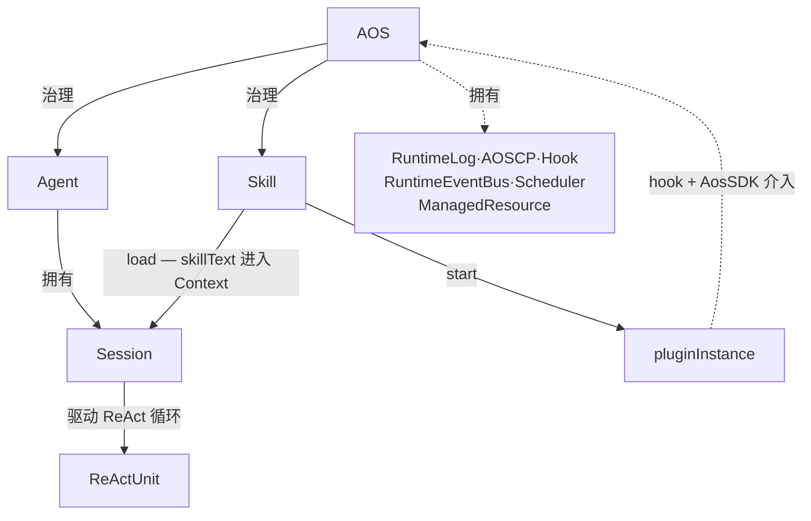
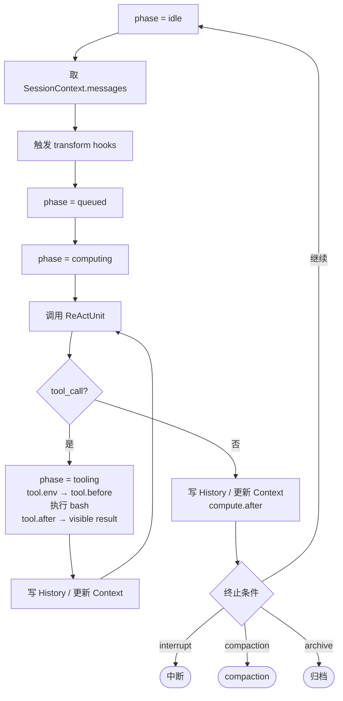
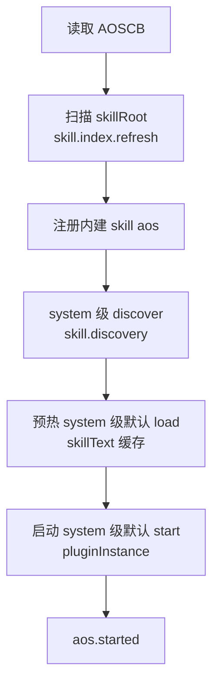
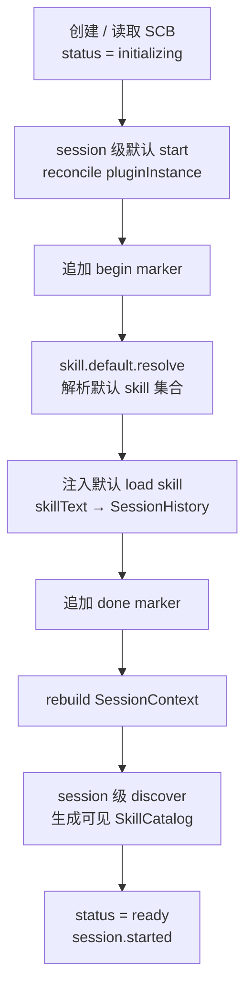

# Agent OS Charter v0.81

---

## 第一章 总述

### 1.1 核心命题

Agent OS（以下简称 AOS）是面向认知推进的认知控制内核。认知本体由外部的 ReActUnit 提供——正如传统操作系统治理 CPU、内存与 I/O 而非亲自执行电路级运算，AOS 治理认知过程的组织、持续化、注入、恢复与控制。

它关心的核心问题有三：认知主体如何长期存在，会话如何被组织，以及 skill 如何进入模型上下文、或以插件实体的形式持续生效。

AOS 的边界：shell、数据库、文件系统、cron、容器编排、通用进程管理，以及 HTTP、stdio、消息总线等 transport，都可以与 AOS 协作，但不属于 AOS 的本体。AOS 的职责范围，只限于把与认知推进直接相关的事实收束进统一的控制面与统一的运行结构里。

### 1.2 系统架构

AOS 由若干核心模块构成。三个正式表面定义了整个系统的可编程性：

**AOSCP（AOS Control Plane）** 是正式控制面，为所有模块提供内核函数。一切对系统状态的改写，都经由 AOSCP 完成。

**Hook** 是正式扩展面，为 plugin 暴露稳定的介入点。每个 hook 绑定在系统执行路径的确定位置上，串行、同步、可改写 output。

**Skill** 通过插件面把能力挂接到这些 hook 上，从而合法介入内核生命周期与执行流程。skill 的上下文面则把知识直接注入 ReActUnit 的工作内存。

这三个表面构成 AOS 的核心可编程模型：AOSCP 决定"系统能做什么"，Hook 决定"plugin 能在哪里插手"，Skill 决定"能力如何进入系统"。

### 1.3 全局原则

**AOS 是唯一的治理主体。** 凡系统控制，皆经 AOSCP 完成；持久化真相的唯一写入者是控制面。

**Skill 是唯一能力抽象。** 一切可被 Agent 借来推进事务的能力，都以 skill 的形式存在。

**SessionHistory 是会话可见事实的持久化依据；RuntimeLog 是系统执行事实的全局审计记录。** 二者记录不同层面的事实。

**Bash 是 ReActUnit 的唯一正式世界接口。** AOS 不为 ReActUnit 提供其他 native tool。

**Plugin 之间不直接通信。** 能力的组合发生在 ReActUnit 的 bash 编排里，以及 AOSCP 的正式操作里。

**控制面响应 JSON-only。** 控制面是机器契约。

### 1.4 系统总览

| 层             | 内容                                                              | 数量 |
| -------------- | ----------------------------------------------------------------- | ---- |
| 本体对象       | AOS、Agent、Session、Skill、ReActUnit                             | 5    |
| 数据层         | SessionHistory、SessionContext、RuntimeLog                        | 3    |
| 持久化结构     | AOSCB、ACB、SCB、SessionHistoryMessage、RuntimeLogEntry           | 5    |
| Hook family    | `aos`、`skill`、`agent`、`session`、`compute`、`tool`、`resource` | 7    |
| Hook 点        | 完整清单见实现手册第六章                                          | 39   |
| AOSCP 操作     | 完整清单见实现手册第七章                                          | 35   |
| 可替换策略接口 | SkillCatalogProvider、SkillDiscoveryStrategy                      | 2    |

### 1.5 版本边界

v0.81 在 v0.80 基础上完成以下演进：Compute Unit 更名为 ReActUnit；LiteLLM 取代 LangChain 成为 provider 层核心依赖；Skill 引入三层生命周期与可替换发现算法接口；Hook 体系从四类扩展到七个 family、39 个正式 hook 点；AOSCP 操作表补全至 35 个。

以下领域已识别、已推迟：

- 权限 DSL 与强制执行点的完整规范
- Hook 的超时、沙箱与资源配额机制
- Session loop 中途宕机的完整 in-flight 恢复协议
- SessionContext 的自动调度策略（内核只提供原语）
- RuntimeLog 的离线分析与结构化查询接口

---

## 第二章 世界模型

### 2.1 五个本体对象

**AOS** 是系统级治理内核，是整个体系的主权者。

**Agent** 是长期存在的认知主体，承载身份、责任、权限与默认配置。

**Session** 是具体事务单元，是认知推进的直接承载者。

**Skill** 是统一能力抽象。任何可以被 Agent 借来推进事务的东西，在 AOS 中都表达为 skill。

**ReActUnit** 是推理-行动单元。它执行单次 LLM 推理，返回文本或工具调用请求。完整的 ReAct 循环由 Session 执行引擎驱动。

### 2.2 对象关系

- AOS 拥有 AOSCB、RuntimeLog、AOSCP、Hook 插槽、RuntimeEventBus、Scheduler 与 ManagedResource 注册表。
- Agent 由 AOS 创建与归档，拥有 ACB 与 agent-owned pluginInstance。
- Session 由 Agent 拥有，拥有 SCB、SessionHistory、SessionContext 与 session-owned pluginInstance。Session 执行引擎驱动完整的 ReAct 循环。
- Skill 由 AOS discover，可被 load 进入 Session 的上下文，可被 start 产生 pluginInstance。
- ReActUnit 由 Session 驱动，消费 SessionContext，通过 bash 与外界交互。

### 2.3 三类状态

**会话可见状态（SessionHistory）：** 这次事务中"人和模型共同看到并承认发生过的事实"。Append-only，持久化，服务于人类回看和上下文重建。

**运行时工作状态（SessionContext）：** 下一次发送给 ReActUnit 的消息集合，从 SessionHistory 物化出的运行时 cache。关机即消失，随时可从 SessionHistory 重建。

**系统执行状态（RuntimeLog）：** AOS 内核做了什么的操作记录，全局 append-only 系统审计日志。

### 2.4 生命周期总览

AOS 中有六类具备正式生命周期的对象：

```mermaid
stateDiagram-v2
    direction LR

    state "AOS" as G_AOS {
        [*] --> AOS_starting
        AOS_starting --> AOS_running
        AOS_running --> AOS_stopping
        AOS_stopping --> AOS_stopped
        AOS_stopped --> [*]
    }

    state "Agent" as G_Agent {
        [*] --> Agent_active
        Agent_active --> Agent_archived
        Agent_archived --> [*]
    }

    state "Session" as G_Session {
        [*] --> Session_initializing
        Session_initializing --> Session_ready
        Session_ready --> Session_archived
        Session_archived --> [*]
    }

    state "Skill（三层）" as G_Skill {
        [*] --> Skill_installed
        Skill_installed --> Skill_indexed
        Skill_indexed --> Skill_discovered
        Skill_discovered --> Skill_loaded
        Skill_discovered --> Skill_started
    }

    state "PluginInstance" as G_PI {
        [*] --> PI_starting
        PI_starting --> PI_running
        PI_running --> PI_stopping
        PI_stopping --> PI_stopped
        PI_starting --> PI_error
        PI_running --> PI_error
        PI_stopped --> [*]
        PI_error --> [*]
    }

    state "ManagedResource" as G_MR {
        [*] --> MR_starting
        MR_starting --> MR_running
        MR_running --> MR_stopping
        MR_stopping --> MR_stopped
        MR_starting --> MR_error
        MR_running --> MR_error
        MR_stopped --> [*]
        MR_error --> [*]
    }
```

Session 还有一个与生命周期状态正交的运行阶段（phase）维度：`bootstrapping / idle / queued / computing / tooling / compacting / interrupted`。同一个 Session 可以同时处于 `ready` 状态并正在 `computing`。

---

## 第三章 AOS

### 3.1 定义与职责

AOS 是认知控制内核，是体系中唯一具有最终治理权的对象。核心职责：

- 为认知主体（Agent）提供身份注册、配置存储与生命周期管理
- 为事务进程（Session）提供历史存储、上下文调度、bootstrap 与 recovery 支持
- 为能力扩展（Skill）提供发现、加载与插件生命周期的统一治理

### 3.2 AOSCB

AOSCB 是 AOS 的静态控制块，保存系统级默认配置与治理边界：AOS 实例的身份与 schema 版本、skillRoot 位置、system 级默认 skill 配置、system 级权限策略。精确字段结构见实现手册第三章。

### 3.3 AOS Control Plane

AOSCP 是 AOS 的正式控制接口。所有对系统状态的改写，都经由 AOSCP 完成。

三种访问方式：

- **CLI：** 适用于 ReActUnit 通过 bash 调用，以及人类在终端操作
- **SDK：** 适用于 pluginInstance、前端 UI 与服务集成
- **HTTP/API：** 与 SDK 同构，适用于远程面板与自动化管道

三者操作的是同一套 AOSCP 语义。响应 JSON-only。宿主至少注入 `AOS_AGENT_ID` 与 `AOS_SESSION_ID` 两个环境变量，供 CLI 在缺省参数时读取默认目标。

v0.81 的 AOSCP 提供 35 个正式内核函数，覆盖 skill、agent、session、session.history、session.context、plugin、resource 七组操作域。完整操作表见实现手册第七章。

### 3.4 Hook 体系

Hook 是 AOS 在既定执行路径上暴露的控制流插槽，允许 pluginInstance 在受控范围内介入系统主流程。

#### 四种执行语义

| 语义           | 含义                                 | 典型示例                     |
| -------------- | ------------------------------------ | ---------------------------- |
| 前置 hook      | 动作发生前介入，可检查、拦截、改参数 | `tool.before`                |
| 后置 hook      | 动作完成后介入，可修正结果或触发联动 | `tool.after`                 |
| transform hook | 改写送给下一步的内容                 | `session.messages.transform` |
| 生命周期 hook  | 状态变化通知与治理联动               | `session.started`            |

#### 七个 Hook Family

| family       | 关注对象                                        | 典型示例                   |
| ------------ | ----------------------------------------------- | -------------------------- |
| `aos.*`      | AOS 启停、全局治理                              | `aos.started`              |
| `skill.*`    | skill 索引、发现、默认解析、load/start/stop     | `skill.discovery.after`    |
| `agent.*`    | Agent 创建、归档                                | `agent.started`            |
| `session.*`  | bootstrap、reinject、message 写入、context 调度 | `session.bootstrap.before` |
| `compute.*`  | 单次 ReActUnit 计算                             | `compute.before`           |
| `tool.*`     | bash 执行                                       | `tool.before`              |
| `resource.*` | ManagedResource 生命周期                        | `resource.started`         |

执行语义回答"什么时候插手"；hook family 回答"围绕谁插手"。后续新增 hook 点，应优先落在既有 family 中。

Hook 串行执行，共享可变 output，错误可中断主流程。这与 RuntimeEvent 的异步、只读语义形成清楚对比。完整 hook 清单见实现手册第六章。

### 3.5 RuntimeLog

RuntimeLog 是 AOS 的全局 append-only 系统日志。它记录 AOS 内核实际执行了哪些操作：控制面操作、hook 执行、context 变更、计算调用起止、bash 执行原始细节、Resource 生命周期、权限判定。

RuntimeLog 由 AOS 统一拥有和治理。每条记录支持按 ownerType、ownerId、agentId、sessionId 归属与过滤。RuntimeLog 服务于安全审计与问题诊断，不参与 SessionContext 的重建，不面向 ReActUnit。

写入责任由 AOSCP 统一承担。plugin 通过受限 AosSDK 请求控制面操作，由控制面在执行操作时写入对应日志条目。

### 3.6 RuntimeEvent 与 RuntimeEventBus

RuntimeEvent 是运行时事实。RuntimeEventBus 负责分发事件，语义是非阻塞的 fire-and-forget。事件订阅是纯观察路径，不修改主流程、不阻塞主流程。

事件可见性：session 级事件可被该 session、所属 agent 与 system 的 pluginInstance 接收；agent 级事件可被该 agent 与 system 接收；system 级事件仅 system 接收。

### 3.7 ManagedResource

ManagedResource 是由 pluginInstance 通过 AOSCP 申请创建、并由 AOS 托管生命周期的运行资源。它受控制面登记、启动、停止与状态追踪，生命周期随 owner 归档而终止。

### 3.8 调度、限流与权限

AOS 负责执行能力的调度与限流。LLM 请求受 TPM / RPM 约束，Scheduler 负责协调执行资源的分配。同一 Session 在同一时刻最多只应有一条主执行链。

权限字段在 AOSCB、ACB、SCB 中均有位置，参与 system → agent → session 的继承解析。权限判断由 AOSCP 负责。v0.81 不固定权限内部 DSL，字段位置已预留。

---

## 第四章 ReActUnit

### 4.1 定义

ReActUnit 是推理-行动单元，执行单次 LLM 推理。它接收当前 SessionContext，调用 LLM，返回推理结果（文本）或工具调用请求（tool_call）。

"ReAct" 指的是它参与的协议——Reasoning + Acting。ReActUnit 只负责协议中的每一步计算；完整的 ReAct 循环由 Session 执行引擎驱动。类比：CPU 参与指令执行协议，但进程调度由操作系统负责。

### 4.2 LiteLLM 作为核心依赖

v0.81 的参考实现使用 LiteLLM 作为 ReActUnit 模块的核心依赖，统一多 provider 的消息发送、流式响应与 tool-calling 返回格式。这使 AOS 可以在 OpenAI、Anthropic、Google 等 provider 之间切换，而不改变 ReActUnit 的接口契约。

ReActUnit 的职责边界：

| 负责                  | 说明                                                     |
| --------------------- | -------------------------------------------------------- |
| 接收 ContextMessage[] | 读取 SessionContext 当前窗口                             |
| 调用 LiteLLM          | 统一多 provider 的消息发送、流式响应与 tool-calling 返回 |
| 处理流式 chunk        | 拼接 token、识别 tool_call 边界、产出本轮模型结果        |

SessionHistory 持久化、SessionContext 调度、bash 执行、RuntimeLog、权限判断，分别由 AOSCP、Session 执行引擎与对应模块承担。

### 4.3 Bash 唯一正式工具

AOS 不为 ReActUnit 提供除 bash 以外的其他 native tool。现实世界已经拥有极其丰富的 CLI 生态；把 bash 作为唯一正式工具，可以把世界的复杂性留给现有 CLI 生态，把系统控制的复杂性收回到 AOSCP 本身。

### 4.4 String-in / String-out 与 JSON-only

ReActUnit 与宿主之间的信息交换统一收束为字符串；结构化数据以 JSON 字符串的形式进入或离开 ReActUnit。AOSCP 响应 JSON-only，使 ReActUnit 可以用 jq 提取字段、用管道传给下一个命令、用条件分支做自动化决策。

### 4.5 与 SessionContext 的关系

ReActUnit 直接消费 SessionContext。SessionContext 中的每条 ContextMessage 由两部分组成：`wire`（LiteLLM 兼容的 chat message）和 `aos`（provenance sidecar）。ReActUnit 模块消费 `wire` 部分，在发给 LiteLLM 之前剥离 `aos` 元数据。

---

## 第五章 Agent

### 5.1 定义

Agent 是长期存在的认知主体。它持有的是这个主体在多次事务之间保持稳定的东西：身份、责任边界、默认配置与权限。

同一个 Agent 可以拥有多个 Session。Agent 回答"是谁在行动、默认如何行动"；Session 回答"这一次具体发生了什么"。

在 AOS 的类比里，Agent 对标有身份、有权限、有长期责任的行为主体——类似于 OS 中"用户"的角色：权限与责任的归属单位。

### 5.2 ACB

ACB 是 Agent 的静态控制块，保存标识、状态、显示名、默认 skill 配置、权限策略、创建与归档时间。ACB 不维护 sessions[] 反向列表；Agent 与 Session 的归属关系由 SCB.agentId 单向确定。精确字段结构见实现手册第三章。

### 5.3 主体边界

Agent 持有身份、责任边界与默认配置；具体会话的正文历史属于 Session，保存在各自的 SessionHistory 中。跨 Session 的连续性，依靠主体级配置和长期记忆类 skill 实现。

### 5.4 默认 Skill 与权限继承

Agent 持有 agent 级默认 skill 配置（SkillDefaultRule 数组），作为 system 层与 session 层之间的中间承接层。解析规则按 system → agent → session 三层顺序覆盖。权限继承采用同样的三层模型。

### 5.5 激活与归档

Agent 从 `active` 状态被归档为 `archived` 时，其所有 pluginInstance 与 ManagedResource 随之停止。归档的 Agent 不再参与运行推进，但 ACB 与历史 SessionHistory 继续保留。

---

## 第六章 Session

### 6.1 定义

Session 是具体事务单元。一次任务、一条工作线程、一笔业务处理，都属于一个 Session。Session 是 AOS 中真正推进业务的单元：用户输入、模型输出、工具调用、skill 注入、compaction 与中断，都属于 Session 的责任域。

同一 Agent 下可以并发存在多个 Session。它们共享同一主体的身份、边界与默认配置，但拥有各自独立的运行历史、运行相位与恢复边界。

### 6.2 SCB

SCB 是 Session 的控制元数据块，保存 sessionId、agentId、生命周期状态、标题、修订号、默认 skill 配置与权限策略。

Session 的生命周期状态：`initializing → ready → archived`。运行阶段（phase）：`bootstrapping / idle / queued / computing / tooling / compacting / interrupted`，与生命周期状态正交。

### 6.3 SessionHistory

SessionHistory 是 session 的持久化历史。它保存这次事务中需要长期保留的会话事实：用户输入、模型输出、bash 工具调用与会话可见结果、skill 注入事实、compaction pair、中断事实、bootstrap marker。

SessionHistory 按 AI SDK UIMessage[] 标准实现并扩展，可直接对接前端 UI 展示。SessionHistory 是 append-only 的，也是 SessionContext 重建的持久化依据。

### 6.4 SessionContext

SessionContext 是从 SessionHistory 物化出的运行时上下文，是下一次发送给 ReActUnit 的消息集合。

SessionContext 不持久化。关机即消失，重启时从 SessionHistory 重建。运行时可以增量更新：每次新消息写入 SessionHistory 后，将其投影追加到 SessionContext。SessionContext 可以随时被全量 rebuild，rebuild 的结果由 SessionHistory 完全决定。

AOS 通过 AOSCP 暴露一套 History / Context 接口，内核只提供调度原语；具体何时触发、以何种策略决定哪些内容进入 context，由 skill / plugin 实现。

### 6.5 上下文调度原语

AOS 通过 AOSCP 暴露 session 侧的上下文调度接口。v0.81 中，核心原语有三类：

**可见性原语（fold / unfold）：** 调整 SessionHistory 中某条消息或某个 part 在 SessionContext 中的可见性。fold 只影响运行时投影，SessionHistory 中的原始消息始终存在。宕机恢复后 fold 状态不恢复：fold 是运行时临时决策。

**边界原语（compact）：** 在 SessionHistory 中追加 compaction pair（marker + summary），形成摘要边界。此后的 rebuild 从这个边界开始物化。compact 还包含 reinject 步骤：追加 compaction pair 后，重新将默认 load skill 的 skillText 注入 SessionHistory，确保新 SessionContext 起始窗口包含必要的工作指令。

**重建原语（rebuild）：** 按物化规则重新从 SessionHistory 计算出完整 SessionContext。宕机恢复的本质就是执行一次 rebuild。

AOS 也允许在不破坏 append-only SessionHistory 的前提下扩展更多运行时上下文接口，例如插入临时上下文片段或覆盖会话可见投影。这些扩展接口只作用于 SessionContext，由 AOSCP 治理。

### 6.6 ReAct 循环

Session 执行引擎驱动完整的 ReAct 循环。每轮循环的核心步骤：

1. 从 SessionContext 取当前消息窗口
2. 触发 transform hooks（调整 system 注入、消息数组、LLM 参数）
3. 调用 ReActUnit（LiteLLM 单次推理）
4. 检查返回：如果是 tool_call，进入 bash 执行流程；如果是 final answer，写入 History 后进入 idle
5. bash 执行完成后，写入 History / 更新 Context，继续下一轮循环
6. 检查终止条件：继续 / 中断 / compaction / 归档

### 6.7 中断与恢复

**中断（interrupt）：** 中断事实首先写入 SessionHistory，然后系统在下一个检查点终止当前推进。中断首先是被记录下来的事实，其次才是运行时动作。

**bootstrap：** Session 首次激活或从崩溃中恢复时，需要完成默认 skill 注入、pluginInstance 启动等准备工作。bootstrap 在 SessionHistory 中留下 begin 和 done 两个 marker，使崩溃后可以幂等恢复。

**recovery：** 恢复只依赖三种静态真相：AOSCB、ACB / SCB、SessionHistory。所有运行时结构从这三者重新构建。

---

## 第七章 Skill

### 7.1 定义

Skill 是统一能力抽象。领域知识说明是 skill，工作指南是 skill，可被按需读入的长说明书是 skill，带有运行入口、能够注册 hook 的运行扩展也是 skill。AOS 只需要维护一套发现、加载与生命周期机制。

### 7.2 上下文面与插件面

Skill 具有两个面：**上下文面**与**插件面**。

**上下文面**是 SKILL.md 的正文（skillText），是写给 ReActUnit 看的说明书。通过 load 动作，skillText 进入 SessionContext。上下文面的定义与开源 skill 标准一致，保持与社区生态的兼容性。

**插件面**是在 SKILL.md 的 frontmatter 中以 `metadata.aos-plugin` 声明的运行入口（plugin）。通过 start 动作，系统加载该入口，形成一个 pluginInstance。插件面是 AOS 在开源 skill 标准之上的扩展，为 skill 提供持续性运行能力。

两个面相互独立：load 与 start 互不依赖，可以单独使用，也可以同时使用。

### 7.3 三层生命周期

skill 在 AOS 中有三层彼此衔接的生命周期：

**包生命周期。** skill 先被安装在 skillRoot 或其他来源，再被解析为 SkillManifest，进入索引层。这个阶段回答"系统里有什么 skill"。索引是 system 级的，由 AOS 启动时统一扫描。

**发现生命周期。** discover 从已索引的 skill 元数据中选出当前对某个 owner 可见的 SkillCatalog。这个阶段回答"当前应该暴露哪些 skill 给 ReActUnit"。当系统里存在上万 skill 时，discover 通常只暴露其中一个子集。发现可以在 system / agent / session 任何一级执行。

**消费生命周期。** 可见 skill 进入两条消费路径：一条是 load，把上下文面写入 SessionHistory 并投影到 SessionContext；另一条是 start，把插件面启动为 pluginInstance。这个阶段回答"当前实际使用了哪些 skill"。

先索引，再发现，再消费。默认 skill 解析属于治理配置消费；discover 决定动态可见集合；load 与 start 负责实际使用。

### 7.4 SkillManifest、SkillCatalog 与 SkillDefaultRule

**SkillManifest** 是 AOS 对某个 skill 静态语义的归一化结果，从 SKILL.md frontmatter 中解析得到：name、description 与 plugin 入口路径。

**SkillCatalog** 是 discover 阶段产生的发现结果，由所有 SkillManifest 去掉 plugin 字段投影而来。ReActUnit 只需要知道有哪些 skill、各自能做什么，以便决定是否 load。

**SkillDefaultRule** 是 ControlBlock 中保存的默认 skill 条目，声明某个 skill 是否应在 owner 启动时默认 load 和/或 start。

### 7.5 discover / load / start

**discover：** AOS 通过可替换的 SkillDiscoveryStrategy 产生 SkillCatalog。discover 在 AOS 启动时执行（system 级），也可以在 Session 创建时再执行一次（session 级），结果缓存为 discovery cache。

**load：** 把 skill 的 skillText 带入 SessionContext。默认 load 在 bootstrap 或 compaction 后自动发生；显式 load 由 ReActUnit 通过 bash 调用 `aos skill load <name>` 触发。无论哪种方式，注入事实都记录在 SessionHistory 中。

**start：** 启动 skill 的插件面，产生一个 pluginInstance。pluginInstance 可以注册 hook、订阅 RuntimeEvent，并通过受限 AosSDK 请求 AOSCP 执行操作或创建 ManagedResource。

`aos` 是宿主内建 skill，必须始终存在。每个 session 的 bootstrap 与每次 compaction 后的 reinject，都必须包含 `aos` skill 的 skillText。

### 7.6 SkillDiscoveryStrategy

discover 的核心由 SkillDiscoveryStrategy 决定。AOS 为这个策略保留可替换接口：

最简单的策略是扫描 skillRoot、解析所有 SKILL.md frontmatter 并全量暴露。更复杂的策略可以从更大的 skill 总量中只挑出当前可见的子集，例如通过标签过滤、相似性检索、小模型筛选或强化学习策略。

v0.81 的默认策略是文件系统扫描。后续实现可以替换策略算法，同时保持 discover / load / start 三个正式原语不变。

### 7.7 热重载

AOS 对 skillRoot 建立文件监听。当检测到 SKILL.md 变化时：

1. 触发 `skill.index.refresh`，重新解析受影响的 SkillManifest
2. 更新全局索引，失效相关 skillText 缓存
3. 发出对应 RuntimeEvent，运行中的 session 收到事件后可按策略决定是否重新 discover
4. 已启动的 pluginInstance 继续使用启动时装入的模块，直到 owner 生命周期结束或显式重启
5. 新的显式 load、未来的 bootstrap reinjection 以及未来的 plugin 启动，使用新版本

### 7.8 Plugin、PluginInstance 与 Owner

**plugin** 是 skill 的插件面入口，以异步工厂函数实现，接收 PluginContext 作为初始化入参，返回该实例注册的全部 hook。plugin 必须从属于 skill。

**pluginInstance** 是 plugin 启动后的运行实体，是持续存在于系统中的主动参与者。它通过 hook 介入控制流，在确定条件下观察、修改或扩展系统行为；并在必要时通过 AOSCP 请求状态变更。

ReActUnit + CLI 是基于概率的意图驱动行动；plugin 是基于规则的条件触发与约束执行。两者在决策性质上根本不同。

**owner** 决定 pluginInstance 的生命周期。owner 可以是 system、某个 agent 或某个 session。owner 存在，pluginInstance 就可以持续运行；owner 被归档，其所有 pluginInstance 必须停止。

### 7.9 Skill 相关 Hook

围绕 skill 三层生命周期，AOS 预留一组正式 hook 点：

| hook                                     | 时机                  |
| ---------------------------------------- | --------------------- |
| `skill.index.refresh.before` / `after`   | 重新扫描 skill 元数据 |
| `skill.discovery.before` / `after`       | discover 策略执行     |
| `skill.default.resolve.before` / `after` | 解析默认 skill 集合   |
| `skill.load.before` / `after`            | load skillText        |
| `skill.start.before` / `after`           | start plugin          |
| `skill.stop.before` / `after`            | 停止 pluginInstance   |

discover 的核心由 SkillDiscoveryStrategy 决定；hook 负责调整参数、补充过滤、记录状态与触发后续联动。

### 7.10 Skill 如何介入 AOS

pluginInstance 介入 AOS 的方式有三条：

**通过 hook：** pluginInstance 在 start 时向 AOS 注册 hook。hook 串行执行，pluginInstance 可以修改 hook 的 output 对象，影响当前轮次的控制流。

**通过 RuntimeEventBus：** pluginInstance 可以订阅 RuntimeEvent，以 fire-and-forget 方式接收运行时通知。

**通过受限 AosSDK：** pluginInstance 通过 PluginContext.aos 访问 AOSCP 的受限子集，请求状态变更、创建 ManagedResource 或追加 SessionHistory 条目。Control Plane 负责权限判断、修订号更新与真相落盘；plugin 提出请求，AOSCP 决定是否生效。

---

## 第八章 执行流程

本章按时间顺序叙述 AOS 如何运作。精确的步骤顺序、hook 触发点与恢复算法，由实现手册第九、十章承担。

### 8.1 AOS 启动

system 级默认 load 在启动时只预热缓存——此时系统还没有 session，SessionHistory 无从谈起。真正的消费点是未来 session 的 bootstrap 或 compaction 后的 reinject。

### 8.2 Agent 激活

读取或创建 ACB，预热 agent 级默认 load skill 的 skillText 缓存，对 agent 级默认 start 条目做 reconcile，产生 agent-owned pluginInstance，建立 agent 级事件订阅，发出 `agent.started` 事件。

### 8.3 Session Bootstrap

默认 load 解析规则：取 AOSCB、ACB、SCB 三层的 SkillDefaultRule，按 system → agent → session 顺序覆盖解析同名冲突，最终仅保留被判定为启用的 skill，并将 `aos` skill 强制追加到注入集里。

### 8.4 Session Loop

Session loop 是 AOS 推进事务的核心循环。每轮从 SessionContext 取消息，经 transform hook 调整后调用 ReActUnit；ReActUnit 返回后，根据是否产生 tool_call 决定继续 tooling 还是写入 assistant 消息。

每轮推进前，依次触发三个 transform hook：

- `session.system.transform`：构造或覆盖本轮 system 注入
- `session.messages.transform`：对消息数组做最终改写
- `compute.params.transform`：调整 LLM 调用参数

transform 的结果只影响本次调用，不写入 SessionHistory，不修改 SessionContext 持久状态。

当 Session 的 discover 输入发生变化时，AOS 可以在进入本轮计算前刷新当前 Session 的 SkillCatalog。

### 8.5 工具调用与会话可见结果

bash 执行后产生 raw result（原始 subprocess 输出）。系统触发 `tool.after` hook，plugin 可以基于 raw result 生成 visible result：

- visible result 写入 SessionHistory（成为会话可见事实）
- visible result 增量投影到 SessionContext
- raw result 由 AOS 记入 RuntimeLog

默认情况下，visible result 等于 raw result。

### 8.6 Compaction 与 Reinject

当 SessionContext 接近容量上限，或收到手动 compact 命令时：

1. 向 LLM 请求对指定区间历史生成摘要文本（plugin 可通过 `session.compaction.transform` hook 追加上下文或改写 prompt）
2. 在 SessionHistory 追加 CompactionMarkerMessage + CompactionSummaryMessage
3. 执行 reinject：将默认 load skill 的 skillText 重新写入 SessionHistory
4. 执行 rebuild，从最新的已完成 compaction pair 处开始物化新的 SessionContext

compact 只在历史里追加"摘要边界"，不删除、不修改既有历史。

### 8.7 归档与恢复

**归档：** Session 归档时，其所有 pluginInstance 与 ManagedResource 随之停止，SCB.status 置为 `archived`。Agent 归档时同理。归档的对象不再参与运行推进，但历史数据保留。

**恢复：** 恢复只依赖 AOSCB、ACB / SCB、SessionHistory。SessionContext 恢复的本质是执行一次 rebuild。bootstrap 恢复依赖 begin / done marker 实现幂等。

---

## 第九章 系统边界

### 9.1 审计边界

SessionHistory 记录会话层面的可见事实；RuntimeLog 记录系统层面的执行事实。SessionContext 是从 SessionHistory 物化出的运行时 cache。

审计时，SessionHistory 回答"会话层面发生了什么"，RuntimeLog 回答"系统层面做了什么"。

### 9.2 能力边界

plugin 拥有很强的系统能力，但唯一合法路径是：PluginContext.aos（受限 AosSDK）→ AOSCP。Control Plane 负责权限判断、真相落盘与日志记录。

### 9.3 组合边界

AOS 不提供 plugin 之间的直接调用式通信。能力的组合发生在两个地方：ReActUnit 在 bash 中的管道与逻辑编排；AOSCP 提供的统一操作。

### 9.4 原型边界

v0.81 是一个可运行的体系原型，以下限制有意推迟：

- transform hook 对 SessionContext 投影的改写，不做完整审计追踪
- Session loop 中途宕机的 in-flight 任务恢复没有完整协议
- 权限 DSL 与 enforcement point 未细化
- hook 执行没有超时、沙箱与资源配额机制
- compaction prompt 中 plugin 追加的 contextParts 不进入 SessionHistory
- SessionContext 的自动上下文调度策略交给 skill / plugin 实现

v0.81 优先保证：核心流程可运行、SessionHistory 可恢复、SessionContext 可重建、AOSCP 契约可信赖。

---

_Agent OS Charter v0.81_

_AOS 是一个管理认知主体、会话运行历史、skill 上下文注入与 plugin 运行实例的认知控制内核。本体层由 AOS、Agent、Session、Skill、ReActUnit 五类对象构成。会话状态分三层：SessionHistory 是会话可见事实的持久化历史；SessionContext 是从 SessionHistory 物化出的运行时 cache；RuntimeLog 是 AOS 的全局 append-only 系统审计日志。AOSCP 作为正式控制面，为所有模块提供 35 个内核函数；Hook 作为正式扩展面，暴露 39 个稳定介入点；Skill 通过插件面把能力挂接到 hook 上，合法介入内核生命周期与执行流程。_
