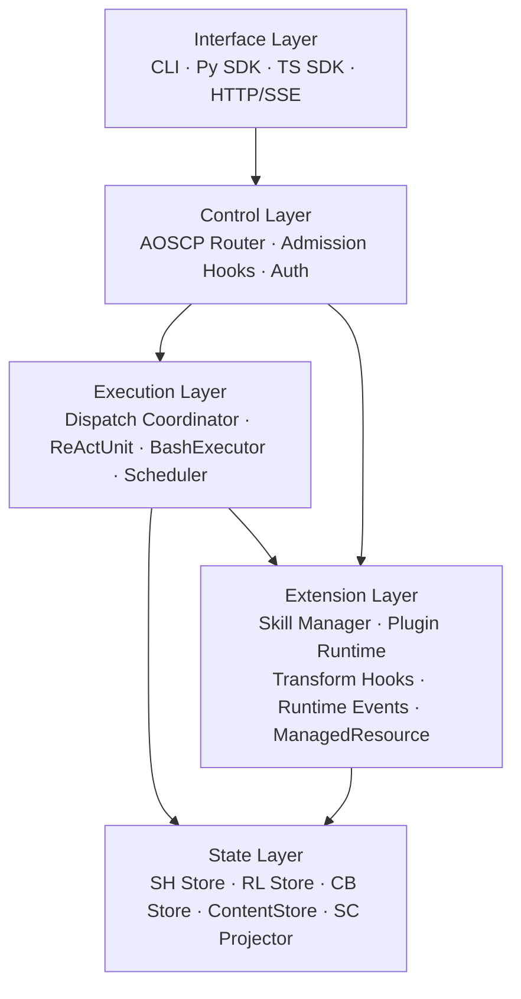
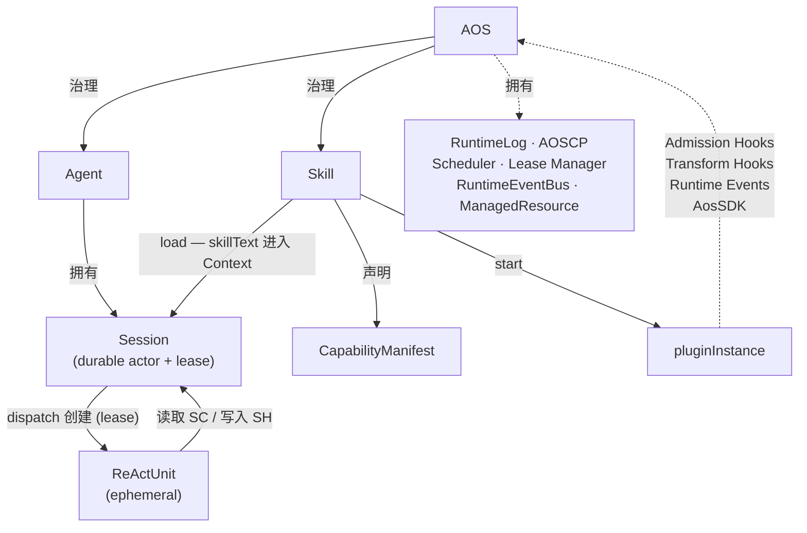
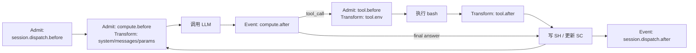
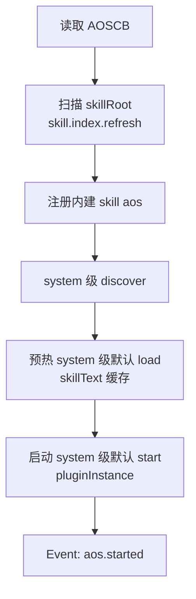
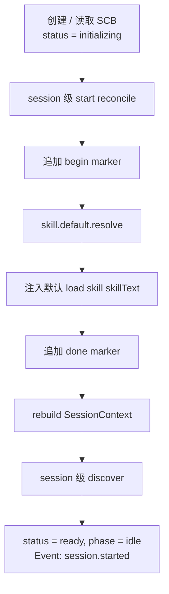
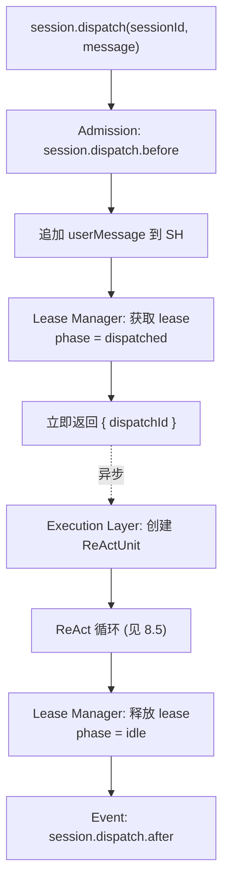
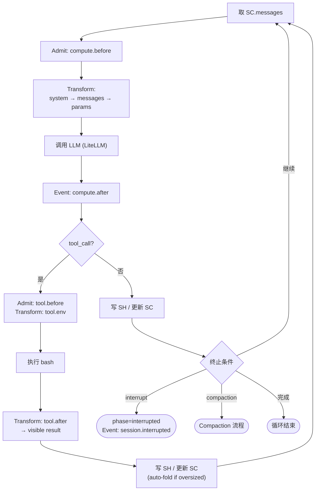

```mermaid
stateDiagram-v2
    direction LR

    state "AOS" as G_AOS {
        [*] --> AOS_starting
        AOS_starting --> AOS_running
        AOS_running --> AOS_stopping
        AOS_stopping --> AOS_stopped
        AOS_stopped --> [*]
    }

    state "Agent" as G_Agent {
        [*] --> Agent_active
        Agent_active --> Agent_archived
        Agent_archived --> [*]
    }

    state "Session" as G_Session {
        [*] --> Session_initializing
        Session_initializing --> Session_ready
        Session_ready --> Session_archived
        Session_archived --> [*]
    }

    state "Skill（三层）" as G_Skill {
        [*] --> Skill_installed
        Skill_installed --> Skill_indexed
        Skill_indexed --> Skill_discovered
        Skill_discovered --> Skill_loaded
        Skill_discovered --> Skill_started
    }

    state "PluginInstance" as G_PI {
        [*] --> PI_starting
        PI_starting --> PI_running
        PI_running --> PI_stopping
        PI_stopping --> PI_stopped
        PI_starting --> PI_error
        PI_running --> PI_error
        PI_stopped --> [*]
        PI_error --> [*]
    }

    state "ManagedResource" as G_MR {
        [*] --> MR_starting
        MR_starting --> MR_running
        MR_running --> MR_stopping
        MR_stopping --> MR_stopped
        MR_starting --> MR_error
        MR_running --> MR_error
        MR_stopped --> [*]
        MR_error --> [*]
    }
```

# Agent OS Charter v0.9

_实施本宪章的架构决策记录于 `docs/decisions/0001-v09-arch-redesign.md`。_

---

## 第一章 总述

### 1.1 核心命题

一个语言模型能推理，但不能行动。给它一个 bash，它可以执行命令；给它一个循环，它可以反复推理、行动直到任务完成。这就是 ReActUnit——AOS 世界中最基本的认知单元。

ReActUnit 有能力但没有记忆。它不知道自己做过什么、说过什么。给它一个 Session，它的历史就有了持久化的依据——正如程序有了磁盘；它的上下文就有了可重建的工作内存——正如进程有了内存。

Session 有记忆但没有身份。给它一个 Agent，它就有了名字、权限与责任边界——如同操作系统中的用户。Agent 是权责承担的基本单位，跨 Session 持续存在。

系统需要可扩展的能力。Skill 是统一能力抽象：一份说明书可以被读入上下文（上下文面），一个插件可以被启动并介入系统生命周期（插件面）。每个 Skill 通过 Capability Manifest 声明它需要哪些内核权限——Skill 是打包与分发的单位，Capability 是安全边界的单位。

治理以上一切的，是 Agent OS（以下简称 AOS）——面向认知推进的认知控制内核。AOS 不做推理，不执行命令，不直接参与认知。它治理认知过程的组织、持续化、注入、恢复与控制。正如传统操作系统治理 CPU、内存与 I/O 而非亲自执行电路级运算，AOS 治理 ReActUnit、Session、Agent 与 Skill。

AOS 的边界：shell、数据库、文件系统、cron、容器编排、通用进程管理，以及 HTTP、stdio、消息总线等 transport，都可以与 AOS 协作，但不属于 AOS 的本体。

### 1.2 五层架构

AOS 内部由五个层次构成，每层只依赖下层：



| 层        | 职责                                | 关键组件                                                                        |
| --------- | ----------------------------------- | ------------------------------------------------------------------------------- |
| Interface | 协议适配，序列化/反序列化           | CLI、Python SDK、TypeScript SDK、HTTP/SSE                                       |
| Control   | 命令/查询路由、准入控制、权限判断   | AOSCP Router、Admission Hooks、Auth                                             |
| Execution | ReAct 循环、工具执行、dispatch 协调 | Dispatch Coordinator、ReActUnit、BashExecutor、Scheduler、Lease Manager         |
| State     | 持久化、投影、内容管理              | SH Store、RL Store、CB Store、ContentStore、SC Projector                        |
| Extension | 能力交付、生命周期反应              | Skill Manager、Plugin Runtime、Transform Hooks、Runtime Events、ManagedResource |

**约束：** Interface Layer 永远不绕过 Control Layer 直接触碰 State Layer。

### 1.3 三种扩展机制

AOS 用三种形式化机制取代原先统一的「hook」概念：

**Admission Hooks** 是同步准入拦截器，运行在命令路径上。可以检查、拦截或改写即将发生的操作。若拦截器拒绝，操作立即失败。类比：Kubernetes admission controllers。

**Transform Hooks** 是同步数据改写器，运行在执行管线的特定位置。对流经的数据做纯改写，不能拒绝操作。

**Runtime Events** 是异步只读通知。一切生命周期变化以事件形式投递，plugin 通过订阅事件响应系统变化，不阻塞主流程、不改写主流程数据。类比：Kubernetes informer events。

| 维度       | Admission Hooks | Transform Hooks  | Runtime Events        |
| ---------- | --------------- | ---------------- | --------------------- |
| 执行方式   | 同步，串行      | 同步，串行       | 异步，fire-and-forget |
| 可否拒绝   | 可以            | 不可以           | 不可以                |
| 可否改写   | 可改写 input    | 可改写 output    | 只读                  |
| 阻塞主流程 | 是              | 是               | 否                    |
| 适用路径   | 命令（写操作）  | 执行管线特定位置 | 一切生命周期通知      |

### 1.4 全局原则

**AOS 是唯一的治理主体。** 凡系统控制，皆经 AOSCP 完成；持久化真相的唯一写入者是控制面。

**AOSCP 是内核态与用户态的唯一合法边界。** ReActUnit（bash CLI）、pluginInstance（受限 AosSDK）、前端 UI（SDK / HTTP）访问内核功能的唯一合法路径是 AOSCP。内核模块之间可以直接调用。

**AOSCP 区分命令与查询。** 命令改变系统状态，经过 Admission Hooks，产生 RuntimeLog 条目。查询读取系统状态，不经过 Admission Hooks，轻量可缓存。

**Skill 是唯一能力抽象。** 一切可被 Agent 借来推进事务的能力，都以 Skill 的形式存在。

**Capability 是安全边界。** Skill 是打包分发的单位；Capability Manifest 是权限声明的单位。二者分离，使安全审计独立于 Skill 身份。

**SessionHistory 是会话可见事实的持久化依据；RuntimeLog 是系统执行事实的全局审计记录。** RuntimeLog 只记录命令路径执行，查询不产生审计条目。

**Bash 是 ReActUnit 的唯一正式世界接口。** AOS 不为 ReActUnit 提供其他 native tool。

**Session 是纯粹的数据与上下文管理单元。** Session 不驱动执行；执行由 AOSCP 的 `session.dispatch` 命令触发，由 Execution Layer 完成。

**Session 是单写者 durable actor。** 任一时刻最多有一个 dispatch 持有其 lease。

**Session 之间零共享可变状态。** 跨 Session 的协调通过 Agent 配置与 AOSCP 操作完成。

**Plugin 之间不直接通信。** 能力的组合发生在 ReActUnit 的 bash 编排里，以及 AOSCP 的正式操作里。

**控制面响应 JSON-only。** 控制面是机器契约。

**所有持久化存储可插拔。** SH 存储、RL 存储与大内容存储均为接口；默认实现基于 SQLite，可替换为 PostgreSQL、S3 或其他后端。

### 1.5 系统总览

| 层                       | 内容                                                                        | 数量 |
| ------------------------ | --------------------------------------------------------------------------- | ---- |
| 本体对象                 | AOS、Agent、Session、Skill、ReActUnit                                       | 5    |
| 数据层                   | SessionHistory、SessionContext、RuntimeLog                                  | 3    |
| 持久化结构               | AOSCB、ACB、SCB、SessionHistoryMessage、RuntimeLogEntry、CapabilityManifest | 6    |
| 扩展点 — Admission Hooks | 完整清单见实现手册第六章                                                    | 13   |
| 扩展点 — Transform Hooks | 完整清单见实现手册第六章                                                    | 6    |
| 扩展点 — Runtime Events  | 完整清单见实现手册第六章                                                    | 22   |
| AOSCP 操作 — 命令        | 完整清单见实现手册第五章                                                    | 20   |
| AOSCP 操作 — 查询        | 完整清单见实现手册第五章                                                    | 16   |
| 可替换策略接口           | SkillDiscoveryStrategy                                                      | 1    |

### 1.6 版本边界

v0.9 在 v0.81 基础上完成以下演进（架构决策见 `docs/decisions/0001-v09-arch-redesign.md`）：

- **D1** 统一「hook」概念分化为三种扩展机制：Admission Hooks（13）、Transform Hooks（6）、Runtime Events（22）
- **D2** `session.dispatch` 定义为异步内核命令；客户端可选阻塞等待、流式订阅或 fire-and-forget
- **D3** AOSCP 操作正式区分命令（20）与查询（16），查询不经过 Admission Hooks
- **D4** Session 引入 lease 机制，SCB 新增 leaseId / leaseHolder / leaseExpiresAt 字段
- **D5** 引入五层架构（Interface / Control / Execution / State / Extension）
- **D6** 引入 Capability Manifest，将安全边界从 Skill 身份中分离

以下已识别、已推迟：权限 DSL 与 enforcement point、Admission Hook 超时/沙箱/资源配额、Session loop in-flight 恢复、Capability 强制校验（v0.9 仅为 warning）、SC 自动调度策略、Fold 部分展开、RuntimeLog 离线分析。

---

## 第二章 世界模型

### 2.1 五个本体对象

**AOS** 是系统级治理内核，是整个体系的主权者。

**Agent** 是长期存在的认知主体，承载身份、责任、权限与默认配置。对标操作系统中的用户。

**Session** 是具体事务单元，是认知推进的数据承载者。负责消息持久化与上下文调度，不负责执行。Session 是单写者 durable actor：通过 lease 保证任一时刻最多有一个活跃的 dispatch。

**Skill** 是统一能力抽象。任何可以被 Agent 借来推进事务的东西，在 AOS 中都表达为 Skill。每个 Skill 通过 Capability Manifest 声明所需内核权限。

**ReActUnit** 是推理-行动单元——完整的 ReAct agent。接收 SessionContext，执行推理-行动完整循环，将结果写回 SessionHistory。由 `session.dispatch` 创建，循环结束后销毁。

### 2.2 对象关系



### 2.3 三类状态

**会话可见状态（SessionHistory）：** 这次事务中「人和模型共同看到并承认发生过的事实」。Append-only，持久化。大内容按引用存储，运行时物化为文件供 AI 按需读取。

**运行时工作状态（SessionContext）：** 下一次发送给 ReActUnit 的消息集合，从 SessionHistory 物化出的运行时 cache。关机即消失，随时可从 SessionHistory 重建。被折叠的内容以占位符而非空白的形式出现。

**系统执行状态（RuntimeLog）：** AOS 内核做了什么的操作记录，全局 append-only 系统审计日志。仅命令路径产生条目。

### 2.4 生命周期总览



Session 还有一个与生命周期状态正交的运行阶段（phase）：`bootstrapping / idle / dispatched / compacting / interrupted`。`dispatched` 表示有活跃 lease，ReActUnit 正在运行。

---

## 第三章 ReActUnit

### 3.1 定义

ReActUnit 是完整的 ReAct agent。给 LLM 一个 bash，用 ReAct 循环武装起来，就是 ReActUnit。

它由 `session.dispatch` 创建，接收 SessionContext，执行推理-行动完整循环，直到终止条件满足后销毁。不是持久对象，不跨 Session 共享，不拥有独立生命周期状态。类比：进程是对一次程序执行的封装，执行结束即销毁。

### 3.2 Bash 唯一正式工具

AOS 不为 ReActUnit 提供除 bash 以外的其他 native tool。这把世界的复杂性留给现有 CLI 生态，把系统控制的复杂性收回到 AOSCP 本身。

ReActUnit 通过 bash 调用 AOSCP CLI 访问内核功能，使交互完全经由正式的内核态/用户态边界。

### 3.3 内建钩子触发点

ReActUnit 在循环的每个关键步骤触发 Admission Hooks 和 Transform Hooks，使内核和 plugin 得以介入控制流：



| 触发点                       | 机制           | 时机                 |
| ---------------------------- | -------------- | -------------------- |
| `session.dispatch.before`    | Admission Hook | dispatch 准入        |
| `compute.before`             | Admission Hook | 每次 LLM 调用准入    |
| `session.system.transform`   | Transform Hook | 构造 system 注入     |
| `session.messages.transform` | Transform Hook | 消息数组最终改写     |
| `compute.params.transform`   | Transform Hook | LLM 参数调整         |
| `tool.before`                | Admission Hook | bash 执行准入        |
| `tool.env`                   | Transform Hook | 合并环境变量         |
| `tool.after`                 | Transform Hook | 改写 visible result  |
| `compute.after`              | Runtime Event  | LLM 调用结束（异步） |
| `session.dispatch.after`     | Runtime Event  | 循环结束后（异步）   |

### 3.4 LiteLLM 作为 Provider 层

v0.9 的参考实现使用 LiteLLM 作为 ReActUnit 的核心依赖，统一多 provider 的消息发送、流式响应与 tool-calling 返回格式，使 AOS 可以在 OpenAI、Anthropic、Google 等 provider 之间切换而不改变 ReActUnit 的接口契约。

### 3.5 与 SessionContext 的关系

ReActUnit 直接消费 SessionContext。每条 ContextMessage 由 `wire`（LiteLLM 兼容的 chat message）和 `aos`（provenance sidecar）两部分组成。ReActUnit 消费 `wire`，发给 LiteLLM 之前剥离 `aos`。

AOSCP 响应 JSON-only，使 ReActUnit 可以用 jq 提取字段、用管道传给下一个命令、用条件分支做自动化决策。

---

## 第四章 Session

### 4.1 定义

Session 是具体事务单元。一次任务、一条工作线程、一笔业务处理，都属于一个 Session。Session 是 AOS 中事务的数据承载者：消息持久化、上下文投影、fold / unfold、compaction 与中断恢复，都属于 Session 的责任域。

**Session 不驱动执行。** 执行由 `session.dispatch` 触发，由临时创建的 ReActUnit 完成。Session 是磁盘和内存，不是 CPU。

**Session 是单写者 durable actor。** 通过 lease 机制保证任一时刻最多有一个 dispatch 持有 session 的写权限。lease 有 TTL（默认 30 分钟），到期自动释放。不同节点可以竞争 session 的 lease，但同一时刻只有一个节点可以写入。

同一 Agent 下可以并发存在多个 Session，各自独立的 SH / SC 与运行时结构。

### 4.2 SCB

SCB 是 Session 的控制元数据块，保存 sessionId、agentId、生命周期状态、运行阶段、lease 信息、标题、修订号、默认 skill 配置与权限策略。

运行阶段（phase）：`bootstrapping / idle / dispatched / compacting / interrupted`。

Lease 字段：`leaseId`、`leaseHolder`、`leaseExpiresAt`。phase=`dispatched` 时 lease 字段非空。精确字段结构见实现手册。

### 4.3 SessionHistory

SessionHistory 是 Session 的持久化历史——append-only，服务于人类回看和上下文重建。

按 AI SDK UIMessage[] 标准实现并扩展，可直接对接前端 UI 展示。

**大内容按引用存储。** 当 bash 输出超过阈值时，完整内容存入 ContentStore，SessionHistory 中只保留 contentId 与元信息（大小、行数、预览文本）。内容一经写入不可修改，天然适合并发读取和分布式缓存。

### 4.4 SessionContext

SessionContext 是从 SessionHistory 物化出的运行时上下文。不持久化，关机即消失，随时可从 SessionHistory 重建。

SessionContext 之于 SessionHistory，正如内存之于磁盘：磁盘保存全量数据，内存保存当前工作集，fold / unfold 控制哪些页面在内存中，compact 回收已用空间。

### 4.5 SH → SC 物化规则

**起始边界：** 从 SH 末尾向前扫描，寻找最新已完成 compaction pair。找到则从 marker 位置开始，否则从第一条消息开始。

**消息收集：** 按 seq 升序收集。

**Fold 投影：** 匹配 foldedRefs 的消息或 part 不被跳过，而是投影为占位符，携带元信息与物化文件路径。

**标准投影：** 未被 fold 的消息按类型投影为 ContextMessage。精确规则见实现手册。

### 4.6 Fold / Unfold

Fold 是 AOS 的上下文换入换出机制。核心语义：**折叠不是跳过，而是降级为占位符**。

AI 从占位符中获得：存在性、规模感（字符数、行数）、预览文本、物化文件路径、unfold 命令。类比：操作系统的页表项（page table entry）——标记「已分配但不在内存」，而非删除。

**三种触发机制：**

- **Auto-fold：** bash 输出超过阈值（默认 16,384 字符）时自动触发。阈值在 AOSCB / ACB / SCB 中配置，三层继承。
- **AI 主动 fold：** `aos session context fold --ref <ref>` — AI 主动释放不再需要的工作内存。
- **AI 主动 unfold：** `aos session context unfold --ref <ref>` — AI 按需恢复完整内容。

**文件物化：** 被折叠的大内容由 AOS 内核物化为本地文件（`$AOS_RUNTIME_DIR/blobs/<contentId>`）。AI 通过标准 bash 工具按需读取：

```bash
head -20 /path/to/blob       # 看前 20 行
grep "error" /path/to/blob   # 搜索关键词
wc -l /path/to/blob          # 看总行数
```

这与「bash 是唯一工具」的设计哲学完全一致——不需要在 AOSCP 里重新发明 head / tail / grep。

**Fold vs Compact：**

| 维度     | Fold            | Compact       |
| -------- | --------------- | ------------- |
| 操作对象 | 单条消息或 part | 一段历史区间  |
| 可逆性   | 完全可逆        | 不可逆        |
| 类比     | 换页到 swap     | 内存压缩 / GC |

### 4.7 上下文调度原语

- **fold / unfold：** 调整某条消息/part 在 SC 中的投影方式（完整 ↔ 占位符）
- **compact：** 在 SH 追加 compaction pair，形成摘要边界，之后 rebuild 从此处开始
- **rebuild：** 按物化规则重新从 SH 计算完整 SC（宕机恢复的本质）
- **dispatch：** 追加用户消息、获取 lease、创建 ReActUnit——唯一触发执行的 AOSCP 命令

### 4.8 Compaction 与 Reinject

触发时：① 向 LLM 请求历史区间的摘要（`session.compaction.transform` hook 可改写 prompt）→ ② SH 追加 CompactionMarkerMessage + CompactionSummaryMessage → ③ reinject（重新注入默认 skill 的 skillText）→ ④ rebuild。compact 只追加「摘要边界」，不删除既有历史。

### 4.9 中断与恢复

**中断：** 中断事实首先写入 SH，然后在下一个检查点终止推进。首先是事实，其次才是运行时动作。

**bootstrap：** 首次激活或崩溃恢复时，在 SH 留下 begin / done 两个 marker，使崩溃后可以幂等恢复。

**recovery：** 恢复只依赖三种静态真相：AOSCB、ACB / SCB、SessionHistory。Lease 在恢复时清空：若 lease 未过期（节点崩溃），等待 TTL 自然到期；若 lease 已过期，session 自动回到 idle。

---

## 第五章 Agent

### 5.1 定义

Agent 是长期存在的认知主体。持有身份、责任边界、默认配置与权限，在多次事务之间保持稳定。同一 Agent 可以拥有多个 Session。

### 5.2 ACB

ACB 是 Agent 的静态控制块，保存标识、状态、显示名、默认 skill 配置、权限策略、创建与归档时间。精确字段结构见实现手册。

### 5.3 主体边界与权限继承

Agent 持有身份、责任边界与默认配置。跨 Session 的连续性依靠主体级配置和长期记忆类 skill 实现。Skill 默认配置与权限继承按 system → agent → session 三层顺序覆盖。

### 5.4 激活与归档

Agent 归档时，其所有 pluginInstance 与 ManagedResource 随之停止。ACB 与历史 SessionHistory 继续保留。

---

## 第六章 Skill

### 6.1 定义

Skill 是统一能力抽象。领域知识、工作指南、可按需读入的说明书、带有运行入口的插件扩展——在 AOS 中都以 Skill 的形式存在。

### 6.2 两个面

**上下文面（skillText）：** SKILL.md 的正文，写给 ReActUnit 看的说明书。通过 load 进入 SessionContext。与开源 skill 标准兼容。

**插件面（plugin）：** SKILL.md frontmatter 中以 `metadata.aos-plugin` 声明的运行入口。通过 start 产生 pluginInstance，可以注册 Admission Hooks、Transform Hooks，订阅 Runtime Events，通过 AosSDK 请求 AOSCP 操作。

两个面相互独立，load 与 start 互不依赖。

### 6.3 Capability Manifest

每个 Skill 可在 SKILL.md frontmatter 中声明 CapabilityManifest——该 skill 需要的内核权限集合。

```yaml
metadata:
  aos-plugin: ./plugin.py
  aos-capabilities:
    - session.read
    - session.write
    - tool.execute
    - resource.manage
```

Capability 是安全审计的依据。AOS 在 `skill.start` 时校验 plugin 请求的 AosSDK 子集是否被 CapabilityManifest 覆盖。v0.9 中未声明 CapabilityManifest 的 skill 获得默认全量权限（向后兼容），但触发 warning。强制校验为推迟事项。

标准 capability 标识：`session.read`、`session.write`、`tool.execute`、`resource.manage`、`agent.read`、`filesystem.read`、`network.egress`。

### 6.4 三层生命周期

**包生命周期：** 安装 → 解析为 SkillManifest → 进入索引。回答「系统里有什么 skill」。

**发现生命周期：** discover 从已索引的 skill 中选出当前可见的 SkillCatalog。回答「当前应该暴露哪些 skill」。

**消费生命周期：** load 把 skillText 写入 SH 并投影到 SC；start 把插件面启动为 pluginInstance。回答「当前实际使用了哪些 skill」。

### 6.5 discover / load / start

**discover：** 通过可替换的 SkillDiscoveryStrategy 产生 SkillCatalog。v0.9 默认文件系统扫描。

**load：** bootstrap / compaction 后自动发生（被动加载）；ReActUnit 通过 bash 调用 `aos skill load <name>` 显式触发（主动加载）。

**start：** 启动插件面产生 pluginInstance。pluginInstance 可以注册 Admission Hooks、Transform Hooks、订阅 Runtime Events，通过 PluginContext.aos（受 CapabilityManifest 约束的受限 AosSDK）请求 AOSCP 操作或创建 ManagedResource。

`aos` 是宿主内建 skill，必须始终存在。每个 Session 的 bootstrap 与每次 compaction 后的 reinject，都必须包含 `aos` skill 的 skillText。

### 6.6 Plugin 工厂、PluginInstance 与 Owner

**plugin** 是 skill 的插件面入口，以异步工厂函数实现。**pluginInstance** 是 plugin 启动后的持续运行实体。

ReActUnit + CLI 是基于概率的意图驱动行动；plugin 是基于规则的条件触发与约束执行。两者在决策性质上根本不同。

**owner** 决定 pluginInstance 的生命周期：system / agent / session。owner 归档时，其所有 pluginInstance 必须停止。

---

## 第七章 AOS 内核

### 7.1 定义与职责

AOS 是认知控制内核，是体系中唯一具有最终治理权的对象。核心职责：

- 为认知主体（Agent）提供身份注册、配置存储与生命周期管理
- 为事务进程（Session）提供历史存储、上下文调度、bootstrap 与 recovery 支持
- 为能力扩展（Skill）提供发现、加载与插件生命周期的统一治理
- 为执行推进提供 `session.dispatch` 命令，协调 lease、创建 ReActUnit

### 7.2 AOSCB

AOSCB 是 AOS 的静态控制块，保存系统级默认配置与治理边界。精确字段结构见实现手册。

### 7.3 AOSCP — 命令与查询

AOSCP 是 AOS 的正式控制接口，内核态/用户态的唯一合法边界。

三种访问方式：CLI / SDK / HTTP/API，操作同一套语义。响应 JSON-only。宿主至少注入 `AOS_AGENT_ID` 与 `AOS_SESSION_ID` 两个环境变量。

v0.9 共 36 个内核函数，分为命令（20）与查询（16）：

| 操作域          | 命令   | 查询   | 合计   |
| --------------- | ------ | ------ | ------ |
| Skill           | 6      | 4      | 10     |
| Agent           | 3      | 2      | 5      |
| Session         | 6      | 2      | 8      |
| Session History | 0      | 2      | 2      |
| Session Context | 3      | 2      | 5      |
| Plugin          | 0      | 2      | 2      |
| Resource        | 2      | 2      | 4      |
| **合计**        | **20** | **16** | **36** |

完整操作表见实现手册第五章。

**命令** 经过 Admission Hooks，产生 RuntimeLog 条目，返回 revision。**查询** 不经过 Admission Hooks，轻量可缓存，不产生 RuntimeLog 条目。

### 7.4 Admission Hooks（13 个）

同步准入拦截器，串行执行，可拒绝或改写操作，只运行在命令路径上。

注册权限遵循 owner 层级：system 可注册全部；agent 可注册 agent 及以下；session 只能注册 session 相关。完整清单见实现手册第六章。

### 7.5 Transform Hooks（6 个）

同步数据改写器，在执行管线的特定位置改写流经数据，不可拒绝操作。完整清单见实现手册第六章。

### 7.6 Runtime Events（22 个）

异步只读通知，fire-and-forget，不阻塞主流程。一切生命周期变化（started、archived、after、error）以事件形式投递。

事件可见性：session 级事件可被该 session、所属 agent 与 system 的 pluginInstance 接收；agent 级事件可被 agent 与 system 接收；system 级事件仅 system 接收。

默认实现为单进程内存 bus；接口允许替换为跨节点消息队列。完整清单见实现手册第六章。

### 7.7 RuntimeLog

RuntimeLog 是 AOS 的全局 append-only 系统日志。**只记录命令路径的执行**（查询不产生条目）：AOSCP 命令执行、Admission Hook 执行、context 变更、计算调用、bash 执行原始细节、Resource 生命周期、权限判定。

### 7.8 ManagedResource

由 pluginInstance 通过 AOSCP 申请、由 AOS 托管生命周期的运行资源。受控制面登记、启动、停止与状态追踪，生命周期随 owner 归档而终止。

### 7.9 调度、限流与权限

同一 Session 同时最多有一个活跃的 dispatch lease。尝试对已持有 lease 的 Session 再次 dispatch 返回 `session.busy`。不同 Session 的 dispatch 可以完全并发。

权限字段在 AOSCB、ACB、SCB 中均有位置，参与 system → agent → session 的继承解析。权限判断由 AOSCP 负责。v0.9 不固定权限内部 DSL，字段位置已预留。

---

## 第八章 执行流程

### 8.1 AOS 启动



### 8.2 Agent 激活

读取/创建 ACB → 预热 agent 级默认 load skillText 缓存 → agent 级 start reconcile → 建立 agent 级 event 订阅 → Event: `agent.started`。

### 8.3 Session Bootstrap



默认 load 解析：AOSCB / ACB / SCB 三层 SkillDefaultRule 按 system → agent → session 顺序覆盖，最终保留启用 skill，强制追加 `aos`。

### 8.4 session.dispatch — 异步执行触发

`session.dispatch` 是触发 ReAct 循环的唯一正式入口。**内核语义是异步的**：Control Layer 完成准入、消息追加和 lease 获取后立即返回 `{ dispatchId }`；ReAct 循环在 Execution Layer 异步进行。



**客户端交互模式：**

| 模式            | 行为                                | 典型使用者   |
| --------------- | ----------------------------------- | ------------ |
| fire-and-forget | 拿到 dispatchId 即返回              | 自动化管道   |
| blocking        | 等待循环结束，返回 DispatchResult   | CLI 默认行为 |
| streaming       | 实时接收中间结果（SSE / WebSocket） | 前端 UI      |

这是 Interface Layer 的适配，不是内核语义。CLI 默认以 blocking + streaming 方式呈现。

### 8.5 ReAct 循环



Transform Hooks 的结果只影响本次 LLM 调用，不写入 SH，不修改 SC 持久状态。

### 8.6 工具调用与大内容物化

bash 执行完毕后：raw result → `tool.after` Transform Hook → visible result。

当 `len(visible result) > autoFoldThreshold`：

```
完整内容 → ContentStore.put() → contentId
SessionHistory 写入: { contentId, sizeChars, lineCount, preview }
ContentStore.materialize(contentId) → $AOS_RUNTIME_DIR/blobs/<contentId>
SC 中投影为 fold 占位符
```

否则：`visibleResult` 直接内联写入 SH。raw result 记入 RuntimeLog。

### 8.7 Compaction

phase = `compacting` → Admission: `session.compaction.before` → Transform: `session.compaction.transform`（改写摘要 prompt）→ 调用 LLM → SH 追加 compaction pair → reinject → rebuild → phase = `idle` → Event: `session.compaction.after`。

### 8.8 归档与恢复

**归档：** pluginInstance 与 ManagedResource 停止，lease 释放，SCB.status = `archived`。数据保留。

**恢复：** 依赖 AOSCB、ACB / SCB、SessionHistory。SC 恢复 = 执行 rebuild。bootstrap 依赖 begin/done marker 幂等。lease 清空，物化文件从 ContentStore 重建。

---

## 第九章 系统边界

### 9.1 审计边界

SessionHistory 回答「会话层面发生了什么」，RuntimeLog 回答「系统层面做了什么（命令路径）」。

### 9.2 内核态/用户态边界

```
用户态: ReActUnit(bash CLI) / pluginInstance(AosSDK) / UI(SDK·HTTP)
        ──────────────────── AOSCP ────────────────────
内核态: Control → Execution → State ← Extension
```

内核模块之间可以直接调用，不经过 AOSCP 的 JSON 序列化开销。跨越边界的每次访问都经过 AOSCP，由 AOSCP 负责权限判断、修订号更新与真相落盘。

### 9.3 能力边界

plugin 的唯一合法路径：PluginContext.aos（受 CapabilityManifest 约束的受限 AosSDK）→ AOSCP。

### 9.4 组合边界

AOS 不提供 plugin 之间的直接通信。能力的组合发生在：ReActUnit 在 bash 中的编排；AOSCP 的统一操作。

### 9.5 分布式预留原则

v0.9 是单进程原型，但架构为分布式未来预留了五条约束：

1. **AOSCP 操作无隐含状态** — 每个请求携带完整上下文（agentId、sessionId），可路由到任意节点
2. **Session 之间零共享可变状态** — 不同 Session 可以在不同节点上执行
3. **所有持久化存储可插拔** — SH、RL、ContentStore 均为接口，可替换为分布式后端
4. **Session lease 保证跨节点单写者** — Lease Manager 将来可基于分布式锁（Redis、etcd）实现
5. **RuntimeEventBus 可扩展为跨节点** — 当前内存 bus，接口允许替换为消息队列

### 9.6 原型边界

| 项目                     | v0.9 状态                       |
| ------------------------ | ------------------------------- |
| 权限 DSL 与 enforcement  | 字段预留，语法未固定            |
| Admission Hook 超时/沙箱 | 未实现                          |
| Session in-flight 恢复   | bootstrap 幂等；dispatch 中途无 |
| Capability 强制校验      | 声明已定义，校验为 warning      |
| SC 自动调度策略          | 接口已定义，算法不内置          |
| Fold 部分展开            | 未实现；AI 通过 bash 读文件替代 |
| RL 离线分析              | 仅基础追加写                    |
| 分布式 EventBus          | 单进程内存 bus                  |
| 分布式 ContentStore      | SQLite 默认实现                 |
| Lease 分布式锁           | 单进程内存实现                  |

v0.9 优先保证：核心流程可运行、SessionHistory 可恢复、SessionContext 可重建、AOSCP 契约可信赖、Fold / Unfold 可用、大内容按引用存储并物化。

---

_Agent OS Charter v0.9 — AOS 是一个管理认知主体、会话运行历史、skill 上下文注入与 plugin 运行实例的认知控制内核。五层架构（Interface / Control / Execution / State / Extension）构成其内部秩序。三种扩展机制（13 个 Admission Hooks / 6 个 Transform Hooks / 22 个 Runtime Events，共 41 个扩展点）取代统一 hook 概念。AOSCP 作为内核态/用户态的唯一合法边界，提供 20 个命令与 16 个查询，共 36 个内核函数。session.dispatch 以异步内核语义触发 ReAct 循环，Session 通过 lease 保证单写者。Capability Manifest 将安全边界从 Skill 身份中分离。_
