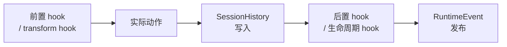
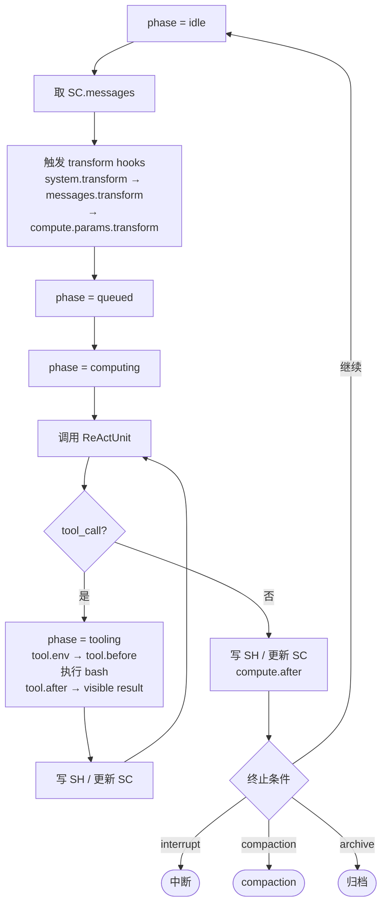

# Agent OS 实现手册 v0.81

---

## 第一章 范围、术语与规范约定

### 1.1 文档地位

本手册是规范性文档。凡使用"必须（MUST）""不得（MUST NOT）""应当（SHOULD）""可以（MAY）"等措辞，均按 RFC 2119 语义理解。世界观、对象定义与边界原则见配套宪章。

### 1.2 术语

| 术语            | 含义                                                      |
| --------------- | --------------------------------------------------------- |
| AOSCP           | AOS Control Plane                                         |
| CB              | ControlBlock，泛指 AOSCB / ACB / SCB                      |
| SH              | SessionHistory                                            |
| SC              | SessionContext                                            |
| RL              | RuntimeLog                                                |
| RU              | ReActUnit                                                 |
| HistoryRef      | 指向 SH 中某条消息或某个 part 的运行时引用                |
| ContextMessage  | SC 的内部消息单位，由 wire + aos 两部分构成               |
| pluginInstance  | plugin 启动后的运行实体                                   |
| ownerType       | `system` / `agent` / `session` 三者之一                   |
| compaction pair | CompactionMarkerMessage + CompactionSummaryMessage 的配对 |

### 1.3 版本标识

当前 schema 版本标识为 `aos/v0.81`。所有持久化结构的 `schemaVersion` 字段必须填写此值。

---

## 第二章 通用约定

### 2.1 标识符

所有 ID 字段（agentId、sessionId、messageId、partId 等）：不透明字符串，建议使用 UUID v4 或同等不可猜测唯一标识符。在同一命名空间内必须唯一。

### 2.2 时间格式

所有时间字段使用 RFC 3339 UTC 字符串，如 `2026-03-17T10:00:00Z`。

### 2.3 修订号（revision）

每次成功改写 ControlBlock，revision 必须严格单调递增（+1），从 1 开始。AOSCP 操作返回的 revision 是本次操作完成后的新值。

### 2.4 追加写原则

SessionHistory 是 append-only，已有消息不得修改或删除。RuntimeLog 是 append-only，已有条目不得修改或删除。ControlBlock 允许字段覆写，每次覆写伴随 revision 递增与 updatedAt 更新。

### 2.5 错误响应

所有 AOSCP 操作遵循统一 AosResponse 结构（见第七章 7.9）。错误情形下 `ok` 为 false，`error.code` 与 `error.message` 必须填写。

---

## 第三章 持久化结构

### 3.1 AOSCB

| 字段          | 类型               | 必填 | 可变 | 含义                                   |
| ------------- | ------------------ | ---- | ---- | -------------------------------------- |
| schemaVersion | string             | 是   | 否   | 固定为 `aos/v0.81`                     |
| name          | string             | 是   | 是   | AOS 实例名称                           |
| skillRoot     | string             | 是   | 是   | skill 根目录绝对路径                   |
| revision      | integer            | 是   | 是   | system 级修订号                        |
| createdAt     | RFC 3339 UTC       | 是   | 否   | 创建时间                               |
| updatedAt     | RFC 3339 UTC       | 是   | 是   | 最近更新时间                           |
| defaultSkills | SkillDefaultRule[] | 否   | 是   | system 级默认 skill 条目               |
| permissions   | object             | 否   | 是   | system 级权限策略（语法 v0.81 未固定） |

### 3.2 ACB

| 字段          | 类型                  | 必填 | 可变 | 含义                                  |
| ------------- | --------------------- | ---- | ---- | ------------------------------------- |
| agentId       | string                | 是   | 否   | Agent 唯一标识                        |
| status        | `active` / `archived` | 是   | 是   | 生命周期状态                          |
| displayName   | string                | 否   | 是   | 展示名                                |
| revision      | integer               | 是   | 是   | agent 级修订号                        |
| createdBy     | `human` / agentId     | 是   | 否   | 创建来源                              |
| createdAt     | RFC 3339 UTC          | 是   | 否   | 创建时间                              |
| updatedAt     | RFC 3339 UTC          | 是   | 是   | 最近更新时间                          |
| archivedAt    | RFC 3339 UTC          | 否   | 是   | 归档时间；仅 `status=archived` 时出现 |
| defaultSkills | SkillDefaultRule[]    | 否   | 是   | agent 级默认 skill 条目               |
| permissions   | object                | 否   | 是   | agent 级权限策略                      |

### 3.3 SCB

| 字段          | 类型                                  | 必填 | 可变 | 含义                                  |
| ------------- | ------------------------------------- | ---- | ---- | ------------------------------------- |
| sessionId     | string                                | 是   | 否   | Session 唯一标识                      |
| agentId       | string                                | 是   | 否   | 所属 Agent                            |
| status        | `initializing` / `ready` / `archived` | 是   | 是   | 生命周期状态                          |
| title         | string                                | 否   | 是   | Session 标题                          |
| revision      | integer                               | 是   | 是   | session 级修订号                      |
| createdBy     | `human` / agentId                     | 是   | 否   | 创建来源                              |
| createdAt     | RFC 3339 UTC                          | 是   | 否   | 创建时间                              |
| updatedAt     | RFC 3339 UTC                          | 是   | 是   | 最近更新时间                          |
| archivedAt    | RFC 3339 UTC                          | 否   | 是   | 归档时间；仅 `status=archived` 时出现 |
| defaultSkills | SkillDefaultRule[]                    | 否   | 是   | session 级默认 skill 条目             |
| permissions   | object                                | 否   | 是   | session 级权限策略                    |

### 3.4 SkillManifest

| 字段        | 类型   | 必填 | 含义                                                |
| ----------- | ------ | ---- | --------------------------------------------------- |
| name        | string | 是   | skill 名；在 AOS 实例内唯一                         |
| description | string | 是   | 给 ReActUnit 看的简短说明                           |
| plugin      | string | 否   | 由 `metadata.aos-plugin` 解析而来；运行入口模块路径 |

### 3.5 SkillCatalogItem

| 字段        | 类型   | 必填 | 含义                           |
| ----------- | ------ | ---- | ------------------------------ |
| name        | string | 是   | skill 名                       |
| description | string | 是   | 来自 SkillManifest.description |

plugin 字段不进入 SkillCatalogItem。

### 3.6 SkillDefaultRule

| 字段  | 类型                 | 必填 | 可变 | 含义                                     |
| ----- | -------------------- | ---- | ---- | ---------------------------------------- |
| name  | string               | 是   | 是   | skill 名                                 |
| load  | `enable` / `disable` | 否   | 是   | 是否参与默认上下文注入                   |
| start | `enable` / `disable` | 否   | 是   | plugin 是否在 owner 生命周期起点默认启动 |

load 与 start 相互独立，字段缺失表示当前层对该维度不作声明，同一 CB 内不得出现同名重复条目。

### 3.7 SkillDiscoveryStrategy 接口

AOS 为 skill 的 discover 原语保留可替换的发现算法接口。

```text
discover(input) -> SkillCatalogItem[]
```

推荐输入：

| 字段      | 类型      | 含义                              |
| --------- | --------- | --------------------------------- |
| skillRoot | string    | skill 根目录或上游来源            |
| ownerType | ownerType | 当前 discover 的归属层            |
| ownerId   | string    | 当前归属对象；可选                |
| query     | object    | 上下文、标签、过滤条件等；可选    |
| limit     | integer   | 暴露给 RU 的 skill 数量上限；可选 |
| params    | object    | 算法自定义参数                    |

v0.81 默认策略是文件系统扫描。后续可替换为标签过滤、相似性检索、小模型筛选或其他策略。

### 3.8 SessionHistoryMessage

SessionHistory 以消息为顶层单位，每条消息包含 parts 数组。结构遵循并扩展 AI SDK UIMessage[] 标准。

#### 顶层结构

| 字段     | 类型                            | 含义           |
| -------- | ------------------------------- | -------------- |
| id       | string                          | 消息唯一标识   |
| role     | `system` / `user` / `assistant` | 消息角色       |
| parts    | SessionHistoryPart[]            | 消息内容       |
| metadata | object                          | AOS 附加元数据 |

#### metadata 字段

| 字段      | 类型                          | 含义                                       |
| --------- | ----------------------------- | ------------------------------------------ |
| seq       | integer                       | session 内严格单调递增，从 1 开始          |
| createdAt | RFC 3339 UTC                  | 消息创建时间                               |
| origin    | `human` / `assistant` / `aos` | 真实来源                                   |
| parentId  | string                        | 可选；compaction summary 指向 marker 的 id |
| summary   | boolean                       | 可选；`true` 表示 compaction 摘要          |
| finish    | string                        | 可选；完成状态                             |
| error     | `{ code, message, details? }` | 可选                                       |

#### role 与 origin 对照表

| 消息类型                           | role        | origin      |
| ---------------------------------- | ----------- | ----------- |
| 用户输入                           | `user`      | `human`     |
| 模型输出与 bash 工具活动           | `assistant` | `assistant` |
| AOS 默认注入、skill load、reinject | `user`      | `aos`       |
| AOS compaction marker              | `user`      | `aos`       |
| AOS compaction summary             | `assistant` | `aos`       |
| AOS interrupt、bootstrap marker    | `user`      | `aos`       |

#### Part 类型

**TextPart**

| 字段 | 类型   | 含义      |
| ---- | ------ | --------- |
| id   | string | part 标识 |
| type | `text` | 类型标记  |
| text | string | 文本内容  |

**ToolBashPart**

| 字段       | 类型                                                                        | 含义                                          |
| ---------- | --------------------------------------------------------------------------- | --------------------------------------------- |
| id         | string                                                                      | part 标识                                     |
| type       | `tool-bash`                                                                 | 类型标记                                      |
| toolCallId | string                                                                      | 工具调用标识                                  |
| state      | `input-streaming` / `input-available` / `output-available` / `output-error` | AI SDK 标准四态                               |
| input      | `{ command, cwd?, timeoutMs? }`                                             | bash 调用参数                                 |
| output     | `{ visibleResult }`                                                         | 会话可见结果；state=`output-available` 时必填 |
| errorText  | string                                                                      | 错误信息；state=`output-error` 时必填         |

`output.visibleResult` 是经 `tool.after` hook 处理后的会话可见结果，默认等于 raw result。raw result 由 AOSCP 记入 RuntimeLog。

**SkillLoadPart**

| 字段           | 类型                                | 含义                  |
| -------------- | ----------------------------------- | --------------------- |
| id             | string                              | part 标识             |
| type           | `data-skill-load`                   | 类型标记              |
| data.cause     | `default` / `explicit` / `reinject` | 注入来源              |
| data.ownerType | ownerType                           | 来源 owner 类型       |
| data.ownerId   | string                              | owner 标识；可选      |
| data.name      | string                              | skill 名              |
| data.skillText | string                              | 注入的 skillText 全文 |

**CompactionMarkerPart**

| 字段          | 类型              | 含义                 |
| ------------- | ----------------- | -------------------- |
| id            | string            | part 标识            |
| type          | `data-compaction` | 类型标记             |
| data.auto     | boolean           | 自动触发             |
| data.overflow | boolean           | 可选；上下文溢出触发 |
| data.fromSeq  | integer           | 覆盖起始 seq（含）   |
| data.toSeq    | integer           | 覆盖终止 seq（含）   |

**InterruptPart**

| 字段         | 类型             | 含义           |
| ------------ | ---------------- | -------------- |
| id           | string           | part 标识      |
| type         | `data-interrupt` | 类型标记       |
| data.reason  | string           | 中断原因       |
| data.payload | object           | 附加信息；可选 |

**BootstrapPart**

| 字段              | 类型             | 含义                          |
| ----------------- | ---------------- | ----------------------------- |
| id                | string           | part 标识                     |
| type              | `data-bootstrap` | 类型标记                      |
| transient         | boolean          | 可选；仅用于流式 UI           |
| data.phase        | `begin` / `done` | 阶段标记                      |
| data.reason       | string           | 可选                          |
| data.plannedNames | string[]         | 可选；计划注入的 skill 名列表 |

#### Compaction Pair 语义

CompactionMarkerMessage（role=`user`, origin=`aos`, parts=[CompactionMarkerPart]）与 CompactionSummaryMessage（role=`assistant`, origin=`aos`, summary=`true`, finish=`completed`, parts=[TextPart]）配对。二者同时存在且 finish=`completed` 才算已完成。

### 3.9 RuntimeLogEntry

| 字段      | 类型                      | 必填 | 含义             |
| --------- | ------------------------- | ---- | ---------------- |
| id        | string                    | 是   | 日志条目唯一标识 |
| time      | RFC 3339 UTC              | 是   | 事件发生时间     |
| level     | `info` / `warn` / `error` | 是   | 日志级别         |
| op        | string                    | 是   | 操作名；点分形式 |
| ownerType | ownerType                 | 是   | 操作归属         |
| ownerId   | string                    | 否   | owner 标识       |
| agentId   | string                    | 否   | 所属 Agent       |
| sessionId | string                    | 否   | 所属 Session     |
| refs      | object                    | 否   | 关联引用         |
| data      | object                    | 否   | 操作相关数据     |

refs 字段：historyMessageId、historyPartId、contextRevision，均可选。

---

## 第四章 运行时结构

### 4.1 SessionContext

| 字段            | 类型              | 含义                                     |
| --------------- | ----------------- | ---------------------------------------- |
| sessionId       | string            | 所属 Session                             |
| contextRevision | integer           | 单调递增；每次 rebuild 或 compact 后递增 |
| messages        | ContextMessage[]  | 下一次调用 RU 时传入的完整消息列表       |
| foldedRefs      | Set\<HistoryRef\> | 当前被 fold 的历史引用集合               |

HistoryRef 两种形式：`{ historyMessageId }` 或 `{ historyMessageId, historyPartId }`。

### 4.2 ContextMessage

ContextMessage 是 SessionContext 的内部消息单位，由两部分组成：

```json
{
  "wire": {
    "role": "user",
    "content": "..."
  },
  "aos": {
    "sourceMessageId": "<SessionHistory message id>",
    "sourcePartId": "<part id>",
    "kind": "<投影类型>"
  }
}
```

- `wire`：LiteLLM 兼容的 chat message 对象，供 RU 模块直接发送给 LiteLLM
- `aos`：provenance sidecar，保存来源消息、来源 part 与投影类型

RU 模块消费 `wire` 部分，发给 LiteLLM 之前剥离 `aos`。

kind 取值：`user-input`、`assistant-output`、`tool-bash-call`、`tool-bash-result`、`skill-load`、`compaction-summary`、`interrupt`、`compaction-marker`。

### 4.3 运行时注册表

| 结构                    | 作用                             | 持久化 |
| ----------------------- | -------------------------------- | ------ |
| discovery cache         | 保存 SkillManifest 索引          | 否     |
| skillText cache         | 保存默认 load skill 的 skillText | 否     |
| plugin module cache     | 保存 plugin 运行入口模块引用     | 否     |
| pluginInstance registry | 保存所有运行中的 pluginInstance  | 否     |
| resource registry       | 保存 ManagedResource             | 否     |

### 4.4 PluginInstance 运行时视图

| 字段       | 类型                                                      | 含义                                    |
| ---------- | --------------------------------------------------------- | --------------------------------------- |
| instanceId | string                                                    | 由 ownerType + ownerId + skillName 组合 |
| skillName  | string                                                    | 所属 skill 名                           |
| ownerType  | ownerType                                                 | owner 类型                              |
| ownerId    | string                                                    | owner 标识                              |
| state      | `starting` / `running` / `stopping` / `stopped` / `error` | 实例状态                                |
| startedAt  | RFC 3339 UTC                                              | 启动时间                                |
| hooks      | array                                                     | 已注册的 hooks                          |
| lastError  | string                                                    | 最近错误；可选                          |

### 4.5 ManagedResource

| 字段            | 类型                                                      | 含义                           |
| --------------- | --------------------------------------------------------- | ------------------------------ |
| resourceId      | string                                                    | 资源标识                       |
| kind            | `app` / `service` / `worker`                              | 资源类型                       |
| ownerType       | ownerType                                                 | owner 类型                     |
| ownerId         | string                                                    | owner 标识                     |
| ownerInstanceId | string                                                    | 创建该资源的 pluginInstance id |
| state           | `starting` / `running` / `stopping` / `stopped` / `error` | 资源状态                       |
| startedAt       | RFC 3339 UTC                                              | 启动时间                       |
| endpoints       | string[]                                                  | 对外端点；可选                 |
| lastError       | string                                                    | 最近错误；可选                 |

### 4.6 ExecutionTicket

| 字段            | 类型                                              | 含义                  |
| --------------- | ------------------------------------------------- | --------------------- |
| ticketId        | string                                            | 调度票据标识          |
| kind            | `compute` / `tool` / `compaction` / `resource-op` | 执行类别              |
| ownerType       | ownerType                                         | 执行归属              |
| agentId         | string                                            | 所属 Agent；可选      |
| sessionId       | string                                            | 所属 Session；可选    |
| priority        | `high` / `normal` / `low`                         | 调度优先级            |
| estimatedTokens | integer                                           | 估计 token 消耗；可选 |

### 4.7 ReActUnit 模块边界

v0.81 参考实现以 LiteLLM 作为 RU 模块核心依赖。

| 负责                  | 说明                                                     |
| --------------------- | -------------------------------------------------------- |
| 接收 ContextMessage[] | 读取 SC 当前窗口                                         |
| 调用 LiteLLM          | 统一多 provider 的消息发送、流式响应与 tool-calling 返回 |
| 处理流式 chunk        | 拼接 token、识别 tool_call 边界、产出本轮模型结果        |

| 由其他模块承担 | 归属                            |
| -------------- | ------------------------------- |
| SH 持久化      | AOSCP + Session 执行引擎        |
| SC 调度        | History/Context 接口 + 调度原语 |
| bash 执行      | Session 执行引擎                |
| RuntimeLog     | AOSCP                           |
| 权限判断       | AOSCP                           |

RU 模块完成的是一次模型计算。完整 ReAct 循环由 Session 执行引擎驱动。

---

## 第五章 SessionHistory → SessionContext 物化规则

### 5.1 起始边界确定

从 SH 末尾向前扫描，寻找最新的已完成 compaction pair。找到则起始于 marker 消息位置（含），否则起始于 SH 第一条消息。

### 5.2 消息收集与 fold 过滤

从起始点到 SH 最新消息，按 seq 升序收集。跳过 foldedRefs 中匹配的整条消息或单个 part。

### 5.3 投影规则

| SH 消息特征                                                    | 投影结果                                                                                  |
| -------------------------------------------------------------- | ----------------------------------------------------------------------------------------- |
| role=`user`, origin=`human`, TextPart                          | `wire={role:"user", content:text}`                                                        |
| role=`assistant`, origin=`assistant`, TextPart（无 tool_call） | `wire={role:"assistant", content:text}`                                                   |
| role=`assistant`, 含 ToolBashPart（output-available/error）    | `wire={role:"assistant", tool_calls:[...]}` + `wire={role:"tool", content:visibleResult}` |
| role=`user`, origin=`aos`, SkillLoadPart                       | `wire={role:"system", content:"[[AOS-SKILL ...]]\n..."}`                                  |
| role=`user`, origin=`aos`, CompactionMarkerPart                | `wire={role:"user", content:"What did we do so far?"}`                                    |
| role=`assistant`, origin=`aos`, summary=true                   | `wire={role:"assistant", content:<summaryText>}`                                          |
| role=`user`, origin=`aos`, InterruptPart                       | `wire={role:"system", content:"[[AOS-INTERRUPT ...]]"}`                                   |
| BootstrapPart                                                  | 不投影                                                                                    |
| ToolBashPart state=input-streaming/input-available             | 不投影（调用未完成）                                                                      |

补充：

- 含 ToolBashPart 的 assistant 消息投影为两条 ContextMessage。
- SkillLoadPart 按 seq 顺序插入，不聚合到列表头部。
- CompactionMarkerMessage + SummaryMessage 投影为 user + assistant 两条。

### 5.4 物化完成

物化完成后，contextRevision 加一。

---

## 第六章 Hook、事件与注册语义

### 6.1 Hook 执行模型

- **串行：** 同一 hook 点上的所有注册实例，严格按注册顺序依次执行。
- **共享可变 output：** 宿主先构造初始 output，所有 hook 函数共享同一引用。
- **最后态生效：** 主流程使用全部 hook 执行完成后的最终 output。
- **阻塞主流程：** 宿主等待当前 hook 点全部实例执行完毕后才继续。
- **错误中断：** hook 抛出未捕获异常时，当前操作立即失败。

### 6.2 Hook Family

| family       | 关注对象                                        |
| ------------ | ----------------------------------------------- |
| `aos.*`      | AOS 启停、全局治理                              |
| `skill.*`    | skill 索引、发现、默认解析、load/start/stop     |
| `agent.*`    | Agent 创建、归档                                |
| `session.*`  | bootstrap、reinject、message 写入、context 调度 |
| `compute.*`  | 单次 RU 计算                                    |
| `tool.*`     | bash 执行                                       |
| `resource.*` | ManagedResource 生命周期                        |

### 6.3 注册权限

| ownerType | 可注册的 hook 前缀                                                     |
| --------- | ---------------------------------------------------------------------- |
| `system`  | 全部                                                                   |
| `agent`   | `agent.*`、`skill.*`、`session.*`、`compute.*`、`tool.*`、`resource.*` |
| `session` | `skill.*`、`session.*`、`compute.*`、`tool.*`、`resource.*`            |

越权注册必须在注册时立即失败。

### 6.4 分发顺序

| hook 类型                                  | 顺序                     |
| ------------------------------------------ | ------------------------ |
| `*.before`、`*.beforeWrite`、`*.transform` | system → agent → session |
| `*.after`、生命周期通知型 hook             | session → agent → system |
| `aos.*`                                    | 仅 system                |

### 6.5 完整 Hook 清单

本节列出全部 39 个正式 hook 点。input 为只读；output 为共享可变对象；— 表示该维度无特殊字段。

#### aos.\* family（2）

| hook           | 可注册 owner | 时机         | input                         | output |
| -------------- | ------------ | ------------ | ----------------------------- | ------ |
| `aos.started`  | system       | AOS 启动完成 | cause, timestamp, catalogSize | —      |
| `aos.stopping` | system       | AOS 即将停止 | reason, timestamp             | —      |

#### skill.\* family（12）

| hook                           | 可注册 owner             | 时机                    | input                             | output                  |
| ------------------------------ | ------------------------ | ----------------------- | --------------------------------- | ----------------------- |
| `skill.index.refresh.before`   | system                   | 重新扫描 skill 元数据前 | skillRoot                         | —                       |
| `skill.index.refresh.after`    | system                   | 扫描完成后              | indexedCount                      | —                       |
| `skill.discovery.before`       | session / agent / system | discover 策略执行前     | ownerType, ownerId, query         | query（可改写发现参数） |
| `skill.discovery.after`        | session / agent / system | discover 完成后         | ownerType, ownerId, catalog       | —                       |
| `skill.default.resolve.before` | session / agent / system | 解析默认 skill 集合前   | ownerType, ownerId, plannedNames  | —                       |
| `skill.default.resolve.after`  | session / agent / system | 解析完成后              | ownerType, ownerId, resolvedNames | —                       |
| `skill.load.before`            | session / agent / system | load skillText 前       | name, sessionId                   | —                       |
| `skill.load.after`             | session / agent / system | load 完成后             | name, sessionId, skillText        | —                       |
| `skill.start.before`           | session / agent / system | start plugin 前         | skillName, ownerType, ownerId     | —                       |
| `skill.start.after`            | session / agent / system | pluginInstance 启动后   | instanceId, skillName             | —                       |
| `skill.stop.before`            | session / agent / system | 停止 pluginInstance 前  | instanceId                        | —                       |
| `skill.stop.after`             | session / agent / system | 停止完成后              | instanceId                        | —                       |

#### agent.\* family（2）

| hook             | 可注册 owner   | 时机               | input                     | output |
| ---------------- | -------------- | ------------------ | ------------------------- | ------ |
| `agent.started`  | agent / system | Agent 创建或恢复后 | agentId, cause, timestamp | —      |
| `agent.archived` | agent / system | Agent 归档后       | agentId, timestamp        | —      |

#### session.\* family（14）

| hook                           | 可注册 owner             | 时机                      | input                                | output                     |
| ------------------------------ | ------------------------ | ------------------------- | ------------------------------------ | -------------------------- |
| `session.started`              | session / agent / system | bootstrap 完成后          | agentId, sessionId, cause, timestamp | —                          |
| `session.archived`             | session / agent / system | 归档后                    | agentId, sessionId, timestamp        | —                          |
| `session.bootstrap.before`     | session / agent / system | 默认注入前                | agentId, sessionId, plannedNames     | —                          |
| `session.bootstrap.after`      | session / agent / system | 默认注入后                | agentId, sessionId, injectedNames    | —                          |
| `session.reinject.before`      | session / agent / system | reinject 前               | agentId, sessionId, plannedNames     | —                          |
| `session.reinject.after`       | session / agent / system | reinject 后               | agentId, sessionId, injectedNames    | —                          |
| `session.message.beforeWrite`  | session / agent / system | 消息写入 SH 前            | agentId, sessionId, message          | message（可替换）          |
| `session.compaction.before`    | session / agent / system | compaction 前             | agentId, sessionId, fromSeq, toSeq   | —                          |
| `session.compaction.after`     | session / agent / system | compaction 后             | agentId, sessionId, compactionSeq    | —                          |
| `session.compaction.transform` | session / agent / system | 摘要 prompt 构造时        | agentId, sessionId, fromSeq, toSeq   | contextParts, summaryHint? |
| `session.system.transform`     | session / agent / system | RU 调用前构造 system 注入 | agentId, sessionId, userMessage?     | system（可覆盖）           |
| `session.messages.transform`   | session / agent / system | RU 调用前投影完成后       | agentId, sessionId, messages         | messages（可改写）         |
| `session.error`                | session / agent / system | 运行失败                  | source, recoverable, message         | —                          |
| `session.interrupted`          | session / agent / system | 中断                      | reason                               | —                          |

#### compute.\* family（3）

| hook                       | 可注册 owner             | 时机               | input                                    | output           |
| -------------------------- | ------------------------ | ------------------ | ---------------------------------------- | ---------------- |
| `compute.before`           | session / agent / system | 调用 RU 前         | agentId, sessionId, lastSeq              | —                |
| `compute.after`            | session / agent / system | 一轮计算结束       | agentId, sessionId, appendedMessageCount | —                |
| `compute.params.transform` | session / agent / system | LLM 参数构造完成后 | agentId, sessionId, params               | params（可改写） |

#### tool.\* family（3）

| hook          | 可注册 owner             | 时机        | input                 | output                          |
| ------------- | ------------------------ | ----------- | --------------------- | ------------------------------- |
| `tool.before` | session / agent / system | bash 执行前 | toolCallId, args      | args（可改写命令）              |
| `tool.after`  | session / agent / system | bash 执行后 | toolCallId, rawResult | result（可改写 visible result） |
| `tool.env`    | session / agent / system | bash 执行前 | toolCallId, args      | env（合并环境变量）             |

`tool.after` 读取 rawResult，返回的 result 成为 visible result，写入 SH。rawResult 由 AOS 记入 RL。

#### resource.\* family（3）

| hook                | 可注册 owner | 时机                   | input                        | output |
| ------------------- | ------------ | ---------------------- | ---------------------------- | ------ |
| `resource.started`  | owner 向上   | ManagedResource 启动后 | resourceId, kind, endpoints? | —      |
| `resource.stopping` | owner 向上   | 停止前                 | resourceId, kind             | —      |
| `resource.error`    | owner 向上   | 失败                   | resourceId, kind, message    | —      |

"owner 向上"：session-owned 可被 session/agent/system 接收；agent-owned 可被 agent/system 接收；system-owned 仅 system 接收。

### 6.6 Hook 执行顺序与 RuntimeEvent 的关系



hook 名与 RuntimeEvent.type 可以共享同名标签，但二者是不同机制：hook 是控制流插槽，RuntimeEvent 是运行时事实。

### 6.7 Plugin 工厂接口

```typescript
type Plugin = (ctx: PluginContext) => Promise<Hooks>;
```

AOS 执行 start 时，加载 SkillManifest.plugin 指向的模块，对每个满足 Plugin 签名的导出函数分别执行一次工厂调用。工厂函数只在 pluginInstance 启动时执行一次。

### 6.8 PluginContext

| 字段      | 类型        | 含义                                    |
| --------- | ----------- | --------------------------------------- |
| ownerType | ownerType   | 当前 pluginInstance 的 owner 类型       |
| ownerId   | string      | 当前 pluginInstance 的 owner 标识       |
| skillName | string      | 当前 skill 名                           |
| agentId   | string      | 当 ownerType 为 agent 或 session 时存在 |
| sessionId | string      | 当 ownerType 为 session 时存在          |
| aos       | AosSDK 子集 | 受 ownerType 约束的控制面客户端         |

### 6.9 RuntimeEvent 与 RuntimeEventBus

RuntimeEvent 结构：type, ownerType, timestamp, agentId?, sessionId?, payload。

事件可见性：

| 事件归属 ownerType | 可见给谁                           |
| ------------------ | ---------------------------------- |
| `system`           | system pluginInstances             |
| `agent`            | 对应 agent + system                |
| `session`          | 对应 session + 所属 agent + system |

非阻塞 fire-and-forget 语义。默认实现可以是单进程内存 bus。

### 6.10 热更新规则

- SKILL.md 变化：刷新 SkillManifest，失效 skillText 缓存，发出 `skill.index.refresh.after`。
- metadata.aos-plugin 解析结果变化：失效 plugin module cache。
- 既有 SH Message 不可被重写。
- 运行中 pluginInstance 继续使用启动时模块，直到 owner 生命周期结束或显式重启。
- 新的显式 load、未来 bootstrap reinjection 与未来 plugin 启动使用新版本。

---

## 第七章 Control Plane

### 7.1 客户端与入口

| 客户端   | 使用方式                             | 典型使用者                |
| -------- | ------------------------------------ | ------------------------- |
| CLI      | `aos skill load memory`              | RU（通过 bash）、人类终端 |
| SDK      | `aos.skill.load({ name: "memory" })` | pluginInstance、前端 UI   |
| HTTP/API | 与 SDK 同构                          | 远程面板、自动化管道      |

宿主至少注入 `AOS_AGENT_ID` 与 `AOS_SESSION_ID` 两个环境变量。

### 7.2 Skill 操作（10）

| 操作                    | 输入                                | 返回               | 改写 CB | 副作用                                |
| ----------------------- | ----------------------------------- | ------------------ | ------- | ------------------------------------- |
| `skill.list`            | —                                   | SkillCatalog       | 否      | 返回当前 discover 策略暴露的 catalog  |
| `skill.show`            | name                                | SkillManifest      | 否      | —                                     |
| `skill.load`            | name                                | SkillLoadResult    | 否      | 写 SH；若经 bash 调用额外写 tool-bash |
| `skill.start`           | PluginStartArgs                     | PluginInstance     | 否      | 启动 plugin                           |
| `skill.stop`            | instanceId                          | instanceId         | 否      | 停止 pluginInstance                   |
| `skill.default.list`    | ownerType, ownerId?                 | SkillDefaultRule[] | 否      | —                                     |
| `skill.default.set`     | ownerType, ownerId?, entry          | revision           | 是      | 可能触发缓存刷新或 reconcile          |
| `skill.default.unset`   | ownerType, ownerId?, name           | revision           | 是      | 同上                                  |
| `skill.catalog.refresh` | ownerType, ownerId?, query?         | SkillCatalog       | 否      | 刷新 discovery cache                  |
| `skill.catalog.preview` | ownerType, ownerId?, query?, limit? | SkillCatalog       | 否      | 预览发现策略结果                      |

### 7.3 Agent 操作（5）

| 操作            | 输入            | 返回     | 改写 CB | 副作用                     |
| --------------- | --------------- | -------- | ------- | -------------------------- |
| `agent.list`    | —               | ACB[]    | 否      | —                          |
| `agent.create`  | displayName?    | ACB      | 是      | 新建 Agent                 |
| `agent.get`     | agentId         | ACB      | 否      | —                          |
| `agent.update`  | agentId, fields | revision | 是      | 更新可变字段               |
| `agent.archive` | agentId         | revision | 是      | 停止 pluginInstance 与资源 |

### 7.4 Session 操作（7）

| 操作                | 输入                        | 返回              | 改写 CB | 副作用                          |
| ------------------- | --------------------------- | ----------------- | ------- | ------------------------------- |
| `session.list`      | SessionListArgs             | SessionListResult | 否      | —                               |
| `session.create`    | agentId, title?             | SCB               | 是      | 进入 bootstrap                  |
| `session.get`       | sessionId                   | SCB               | 否      | —                               |
| `session.append`    | sessionId, message          | revision          | 是      | 追加 SH Message                 |
| `session.interrupt` | sessionId, reason, payload? | revision          | 是      | 写入 interrupt 事实             |
| `session.compact`   | sessionId                   | revision          | 是      | compaction + reinject + rebuild |
| `session.archive`   | sessionId                   | revision          | 是      | 停止 pluginInstance 与资源      |

### 7.5 Session History 操作（2）

| 操作                   | 输入                       | 返回                      | 改写 CB | 副作用 |
| ---------------------- | -------------------------- | ------------------------- | ------- | ------ |
| `session.history.list` | sessionId, cursor?, limit? | SH Message[], nextCursor? | 否      | —      |
| `session.history.get`  | sessionId, messageId       | SH Message                | 否      | —      |

### 7.6 Session Context 操作（5）

| 操作                      | 输入             | 返回               | 写 SH | 写 RL | 副作用                           |
| ------------------------- | ---------------- | ------------------ | ----- | ----- | -------------------------------- |
| `session.context.get`     | sessionId        | SessionContextView | 否    | 是    | —                                |
| `session.context.fold`    | sessionId, ref   | contextRevision    | 否    | 是    | 将 ref 加入 foldedRefs           |
| `session.context.unfold`  | sessionId, ref   | contextRevision    | 否    | 是    | 移除 ref                         |
| `session.context.compact` | sessionId, auto? | revision           | 是    | 是    | 摘要 + pair + reinject + rebuild |
| `session.context.rebuild` | sessionId        | contextRevision    | 否    | 是    | 按第五章规则重新物化             |

SessionContextView：sessionId, contextRevision, messageCount, foldedRefCount。

### 7.7 Plugin 操作（2）

| 操作          | 输入                 | 返回             | 改写 CB | 副作用 |
| ------------- | -------------------- | ---------------- | ------- | ------ |
| `plugin.list` | ownerType?, ownerId? | PluginInstance[] | 否      | —      |
| `plugin.get`  | instanceId           | PluginInstance   | 否      | —      |

### 7.8 Resource 操作（4）

| 操作             | 输入                      | 返回              | 改写 CB | 副作用       |
| ---------------- | ------------------------- | ----------------- | ------- | ------------ |
| `resource.list`  | ownerType?, ownerId?      | ManagedResource[] | 否      | —            |
| `resource.start` | ownerType, ownerId?, spec | ManagedResource   | 否      | 启动受管资源 |
| `resource.get`   | resourceId                | ManagedResource   | 否      | —            |
| `resource.stop`  | resourceId                | resourceId        | 否      | 停止受管资源 |

### 7.9 共享数据结构

**AosResponse**

| 字段          | 类型    | 必填 | 含义         |
| ------------- | ------- | ---- | ------------ |
| ok            | boolean | 是   | 操作是否成功 |
| op            | string  | 是   | 操作名       |
| revision      | integer | 否   | 新修订号     |
| data          | object  | 否   | 成功结果     |
| error.code    | string  | 否   | 错误码       |
| error.message | string  | 否   | 错误信息     |
| error.details | object  | 否   | 额外上下文   |

**SkillLoadResult：** name, skillText。

**PluginStartArgs：** skillName, ownerType, ownerId?。

**SessionListArgs：** agentId?, cursor?, limit?。

**SessionListResult：** items (SCB[]), nextCursor?。

**RuntimeResourceSpec：** kind, entry?, cwd?, args?, env?。

### 7.10 JSON-only 约束

控制面响应必须 JSON-only。stdout 不得混入 prose，CLI 唯一输出就是 JSON。

### 7.11 运行中 owner 的默认 skill 生效规则

| 维度  | 修改命中运行中 owner 时 | 立即影响 | 未来消费             |
| ----- | ----------------------- | -------- | -------------------- |
| load  | 刷新 skillText 缓存     | 否       | bootstrap / reinject |
| start | 立即 reconcile          | 是       | 同一请求内生效       |

---

## 第八章 会话可见结果与系统执行结果

### 8.1 职责分界

SessionHistory 记录会话层面的可见事实。RuntimeLog 记录系统层面的执行事实。

### 8.2 工具执行的 visible result 与 raw result

bash → raw result → `tool.after` hook → visible result。

- **visible result** → SH（ToolBashPart.output.visibleResult）
- **raw result** → RL

默认 visible result = raw result。

### 8.3 会话可见事实边界

| 事实                       | 进入 SH                           |
| -------------------------- | --------------------------------- |
| 用户输入                   | 是                                |
| 模型输出                   | 是                                |
| bash 调用与 visible result | 是                                |
| 显式 `aos skill load`      | 是（tool-bash + data-skill-load） |
| 默认 skill 注入            | 是                                |
| compaction pair            | 是                                |
| reinject                   | 是                                |
| interrupt                  | 是                                |
| bootstrap marker           | 是                                |
| pluginInstance 私有日志    | 否（进入 RL）                     |
| fold / unfold              | 否（只进 RL）                     |
| plugin 内部 HTTP / shell   | 仅通过 AOSCP 影响 session 时      |
| 缓存命中 / 失效            | 否                                |
| bash raw result            | 否（进入 RL）                     |

### 8.4 控制面写入顺序

**规则一：** 影响 SH 的操作，先写 SH，再更新 SC。

**规则二：** 只影响 SC 的操作（fold / unfold），只改内存。

**规则三：** 所有控制面操作，完成时写 RL。

---

## 第九章 生命周期与执行时序

### 9.1 AOS 启动顺序

| 步骤 | 动作                                   | 结果                      | hook / event                       |
| ---- | -------------------------------------- | ------------------------- | ---------------------------------- |
| 1    | 读取 AOSCB                             | system 级配置就绪         | —                                  |
| 2    | skill.index.refresh                    | SkillManifest 索引就绪    | `skill.index.refresh.before/after` |
| 3    | 注册内建 skill `aos`                   | 控制说明书可用            | —                                  |
| 4    | system 级 discover                     | SkillCatalog 可投影       | `skill.discovery.before/after`     |
| 5    | 预热 system 级默认 load skillText 缓存 | 后续 bootstrap 可直接取文 | —                                  |
| 6    | 启动 system 级默认 start plugin        | system 级运行时就绪       | `skill.start.before/after`         |
| 7    | AOS ready                              | —                         | `aos.started`                      |

### 9.2 Agent 激活顺序

| 步骤 | 动作                                  | hook / event               |
| ---- | ------------------------------------- | -------------------------- |
| 1    | 读取或创建 ACB                        | —                          |
| 2    | 预热 agent 级默认 load skillText 缓存 | —                          |
| 3    | agent 级 start reconcile              | `skill.start.before/after` |
| 4    | 建立 agent 级事件订阅                 | —                          |
| 5    | Agent ready                           | `agent.started`            |

### 9.3 Session Bootstrap 顺序

| 步骤 | 动作                                    | 写入     | hook / event                         |
| ---- | --------------------------------------- | -------- | ------------------------------------ |
| 1    | 创建/读取 SCB, status=`initializing`    | SCB      | —                                    |
| 2    | 预热 session 级默认 load skillText 缓存 | —        | —                                    |
| 3    | session 级 start reconcile              | —        | `skill.start.before/after`           |
| 4    | phase = `bootstrapping`                 | —        | —                                    |
| 5    | 追加 begin marker                       | SH       | —                                    |
| 6    | skill.default.resolve                   | —        | `skill.default.resolve.before/after` |
| 7    | 开始默认注入                            | —        | `session.bootstrap.before`           |
| 8    | 注入默认 load skill skillText           | SH       | `skill.load.before/after` (each)     |
| 9    | 追加 done marker                        | SH       | —                                    |
| 10   | 结束默认注入                            | —        | `session.bootstrap.after`            |
| 11   | rebuild SC                              | — (内存) | —                                    |
| 12   | session 级 discover                     | —        | `skill.discovery.before/after`       |
| 13   | status=`ready`                          | SCB      | `session.started`                    |
| 14   | phase = `idle`                          | —        | —                                    |

#### 默认 load 解析规则

1. 取三层条目：AOSCB.defaultSkills、ACB.defaultSkills、SCB.defaultSkills
2. 只看 load 条目
3. system → agent → session 顺序覆盖同名冲突
4. 最终保留启用的 skill
5. 从 skillText 缓存取正文；缺失则先补齐
6. `aos` skill 强制追加
7. 按 system → agent → session 排序注入
8. 每个 skill 一条消息

#### 默认 start 消费规则

各 owner 生命周期起点独立消费各层 CB 中的 start 条目：system 级在 AOS 启动；agent 级在 Agent 创建/恢复；session 级在 bootstrap 前。

### 9.4 Session Loop 主形态



### 9.5 Compaction 顺序

| 步骤 | 动作                          | 写入 | hook / event                    |
| ---- | ----------------------------- | ---- | ------------------------------- |
| 1    | phase = `compacting`          | —    | —                               |
| 2    | 开始 compaction               | —    | `session.compaction.before`     |
| 3    | 计算区间 [fromSeq, toSeq]     | —    | —                               |
| 4    | compaction transform          | —    | `session.compaction.transform`  |
| 5    | 构造摘要 prompt, 调用 LLM     | —    | —                               |
| 6    | 追加 CompactionMarkerMessage  | SH   | —                               |
| 7    | 追加 CompactionSummaryMessage | SH   | —                               |
| 8    | 完成 compaction               | —    | `session.compaction.after`      |
| 9    | reinject                      | SH   | `session.reinject.before/after` |
| 10   | rebuild SC                    | —    | —                               |
| 11   | phase = `idle`                | —    | —                               |

### 9.6 归档顺序

| 作用域  | 动作                                                      | 最终状态                        |
| ------- | --------------------------------------------------------- | ------------------------------- |
| Session | 停止全部 pluginInstance 与 ManagedResource, 写 archivedAt | `archived` + `session.archived` |
| Agent   | 停止全部 pluginInstance 与 ManagedResource, 写 archivedAt | `archived` + `agent.archived`   |
| AOS     | 发出 `aos.stopping`, 停止 system 级资源, 释放注册表       | `stopped`                       |

---

## 第十章 恢复协议与一致性规则

### 10.1 恢复依据

恢复只依赖：AOSCB、ACB / SCB、SessionHistory。所有运行时结构可重建。

### 10.2 SessionContext 恢复

执行一次 rebuild：找到最新已完成 compaction pair，从 marker 开始物化，清空 foldedRefs，递增 contextRevision。

### 10.3 Bootstrap 恢复情形

| marker 状态       | 含义     | 恢复动作                        |
| ----------------- | -------- | ------------------------------- |
| 无 begin          | 尚未开始 | 完整 bootstrap                  |
| 有 begin, 无 done | 中途崩溃 | 补齐剩余注入, 写 done, 置 ready |
| 有 done           | 已完成   | 直接置 ready                    |

结构不一致或无法解析时，恢复必须失败：`session.error { source: "recovery", recoverable: false }`，保持 `initializing`。

### 10.4 Compaction 完整性判定

已完成条件：marker + summary 同时存在，且 summary.metadata.finish = `completed`。未满足则该 pair 不作为 rebuild 起始点。

### 10.5 写入顺序一致性

严格遵守第八章 8.4 的三条规则。

---

## 第十一章 权限与延后事项

### 11.1 权限字段位置

AOSCB、ACB、SCB 都保留 permissions 字段，参与 system → agent → session 继承解析。权限判断由 AOSCP 负责。

### 11.2 v0.81 延后项

| 项目                          | 状态                                 | 影响                         |
| ----------------------------- | ------------------------------------ | ---------------------------- |
| 权限 DSL 与 enforcement point | 字段预留, 语法未固定                 | 权限校验受限                 |
| Hook 超时机制                 | 未实现                               | plugin 超时阻塞主流程        |
| Hook 沙箱与资源配额           | 未实现                               | 依赖 plugin 自律             |
| Session loop in-flight 恢复   | bootstrap 有幂等协议; loop 中途无    | in-flight 任务视为丢失       |
| compaction contextParts 追踪  | 不进 SH                              | 该次 compaction 不可严格重放 |
| SC 自动调度策略               | 接口已定义, 默认算法不内置           | 由 skill / plugin 实现       |
| Skill 可替换发现算法          | 接口已定义, 默认文件系统扫描         | 可逐步接入更复杂策略         |
| RL 离线分析                   | 仅基础追加写                         | 高级分析需外部工具           |
| 热更新滚动升级                | 运行中 pluginInstance 使用启动时模块 | 需显式重启                   |

v0.81 优先保证：核心流程可运行、SH 可恢复、SC 可重建、AOSCP 契约可信赖。
