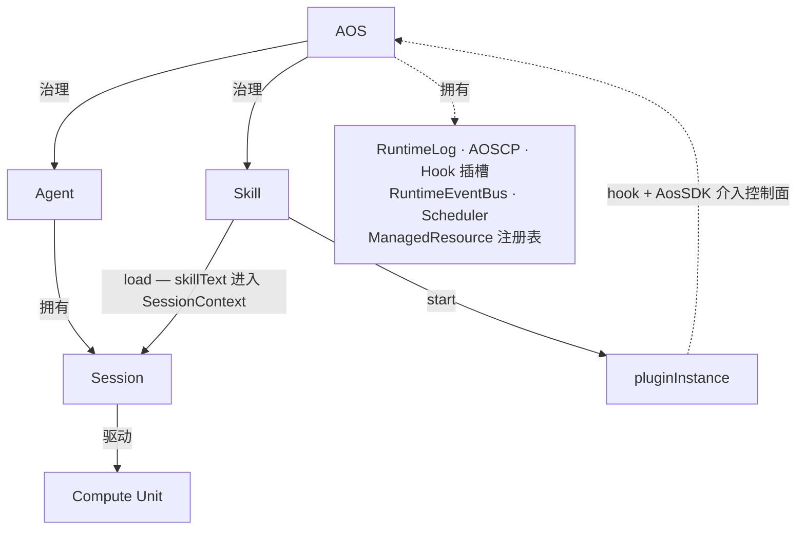

# Agent OS 宪章 v0.80

本文件是 Agent OS 的宪章。它回答：世界里有哪些对象，谁对谁负责，哪些边界不能越，哪些原则不能破。精确的字段结构、hook 清单、控制面操作表与恢复协议，由配套的实现手册承担。

---

## 第一章 总述

### 1.1 核心命题

Agent OS（以下简称 AOS）是面向认知推进的认知控制内核。认知本体由外部的 Compute Unit 提供——正如传统操作系统不亲自执行电路级运算，而是治理 CPU、内存与 I/O；AOS 也不亲自推理，而是治理认知过程的组织、持续化、注入、恢复与控制。

它关心的核心问题有三：认知主体如何长期存在，会话如何被组织，以及 skill 如何进入模型上下文、或以插件实体的形式持续生效。

AOS 的边界因此很清楚。shell、数据库、文件系统、cron、容器编排、通用进程管理，以及 HTTP、stdio、消息总线、浏览器 UI、移动端面板等 transport，都可以与 AOS 协作，但不属于 AOS 的本体。AOS 的职责范围，只限于把与认知推进直接相关的事实收束进统一的控制面与统一的运行结构里。

### 1.2 全局原则

以下原则是全文所有设计决策的前提，不由任何单章重新推导。

**AOS 是唯一的治理主体。** 凡系统控制，皆经 AOS Control Plane 完成；持久化真相的唯一写入者是控制面，不是任何 plugin 或外部进程。

**Skill 是唯一能力抽象。** 一切可被 Agent 借来推进事务的能力，都以 skill 的形式存在，不引入 daemon、service、provider 等平行概念。

**SessionHistory 是会话可见事实的持久化依据；RuntimeLog 是系统执行事实的全局审计记录。** 二者记录不同层面的事实，不互相替代。

**Bash 是 Compute Unit 的唯一正式世界接口。** AOS 不为 CU 提供其他 native tool，世界的复杂性由现有 CLI 生态承担。

**Plugin 之间不直接通信。** 能力的组合发生在 Compute Unit 在 bash 中的编排里，以及 AOS Control Plane 的正式操作里。

**控制面响应 JSON-only。** 控制面是机器契约，不是人类聊天窗口。

### 1.3 版本边界

v0.80 的目标是在 v0.75 的基础上完成体系重排，并澄清若干关键概念边界：AOS 升格为正式本体、会话状态三层分离、RuntimeLog 职责归位、宪章与实现手册分开维护。以下领域已识别、已推迟，不属于本版优化目标：

- 权限 DSL 与强制执行点的完整规范
- Hook 的超时、沙箱与资源配额机制
- Session loop 中途宕机的完整 in-flight 恢复协议
- SessionContext 的自动调度策略（内核只提供原语）
- RuntimeLog 的离线分析与结构化查询接口

这些将在后续版本中根据实际运行反馈逐步填补。

---

## 第二章 世界模型

### 2.1 五个本体对象

AOS 的世界由五类本体对象构成。

**AOS** 是系统级治理内核，是整个体系的主权者。它持有系统级默认配置、全局运行设施与正式控制接口。

**Compute Unit（CU）** 是算元。它读取当前上下文并计算下一步动作。CU 是概率性的意图计算引擎；AOS 不亲自推理，而是为 CU 创造推理条件。

**Agent** 是长期存在的认知主体，承载身份、责任、权限与默认配置。Agent 回答"是谁在行动、默认如何行动"。

**Session** 是具体事务单元，是认知推进的直接承载者。Session 回答"这次具体发生了什么"。

**Skill** 是统一能力抽象。任何可以被 Agent 借来推进事务的东西，在 AOS 中都统一表达为 skill。

五个对象之外，AOS 还引入若干核心机制与概念：Hook、RuntimeEvent、SessionHistory、SessionContext、RuntimeLog、ManagedResource、AOS Control Plane（AOSCP）。这些不是新增本体，而是五个对象发挥作用时所依赖的运行设施与协议接口。

### 2.2 对象关系

更精确地说：

- AOS 是最终治理者，拥有 AOSCB、RuntimeLog、AOSCP、Hook 插槽、RuntimeEventBus、Scheduler 与 ManagedResource 注册表。
- Agent 由 AOS 创建与归档，拥有 ACB 与 agent-owned pluginInstance。
- Session 由 Agent 拥有，拥有 SCB、SessionHistory、SessionContext 与 session-owned pluginInstance。
- Skill 由 AOS discover，可被 load 进入 Session 的上下文，可被 start 产生 pluginInstance。
- CU 由 Session 驱动，消费 SessionContext，通过 bash 与外界交互。

### 2.3 三类状态

对象的状态可以分为三类，理解这三类的边界是理解整个 AOS 的关键。

**会话可见状态（SessionHistory）** 是这次事务中"人和模型共同看到并承认发生过的事实"。它 append-only，持久化，服务于人类回看和上下文重建。

**运行时工作状态（SessionContext）** 是下一次发送给 CU 的消息集合，是从 SessionHistory 物化出的运行时 cache。它不持久化，关机即消失，随时可以从 SessionHistory 重建。

**系统执行状态（RuntimeLog）** 是 AOS 内核自己做了什么的操作记录，是全局 append-only 的系统审计日志。它不参与上下文重建，不面向 CU，是安全、诊断与可追溯性的依据。

这三类状态不互相替代。SessionHistory 里有的，不等于 RuntimeLog 里有；SessionContext 里有的，随时可能因为 fold 或 compact 而与 SessionHistory 全量产生差异。

---

## 第三章 AOS

### 3.1 定义与职责

AOS 是认知控制内核，是体系中唯一具有最终治理权的对象。

它的核心职责有三：

- 为认知主体（Agent）提供身份注册、配置存储与生命周期管理
- 为事务进程（Session）提供历史存储、上下文调度、bootstrap 与 recovery 支持
- 为能力扩展（Skill）提供发现、加载与插件生命周期的统一治理

AOS 本身不推理，不执行任务，不保存业务数据；它只治理认知推进所必需的结构与流程。

### 3.2 AOSCB

AOSCB 是 AOS 的静态控制块，保存系统级默认配置与治理边界。它是 system 级静态真相的唯一来源，包含：

- AOS 实例的身份与 schema 版本
- skill 根目录位置（skillRoot）
- system 级默认 skill 配置（SkillDefaultRule 数组）
- system 级权限策略（v0.80 中字段已预留，语法未固定）

精确字段结构见实现手册第三章。

### 3.3 AOS Control Plane

AOS Control Plane（AOSCP）是 AOS 的正式控制接口。所有对系统状态的改写，都必须经由 AOSCP 完成。

AOSCP 有三种访问方式：

- **CLI**：适用于 CU 通过 bash 调用，以及人类在终端操作（如 `aos skill load memory`）
- **SDK**：适用于 pluginInstance、前端 UI 与服务集成（如 `aos.skill.load({ name: "memory" })`）
- **HTTP/API**：与 SDK 同构，适用于远程面板与自动化管道

三者操作的是同一套 AOSCP 语义，入口可以不同，控制语义只有一套。宿主至少注入 `AOS_AGENT_ID` 与 `AOS_SESSION_ID` 两个环境变量，供 CLI 在缺省参数时读取默认目标。

AOSCP 响应 JSON-only。stdout 不混入解释性文本，错误也按统一结构返回。这使 CU 可以用 jq 提取字段、用管道传给下一个命令、用条件分支做自动化决策。

### 3.4 RuntimeLog

RuntimeLog 是 AOS 的全局 append-only 系统日志。它记录"AOS 内核做了什么操作"，而不是"会话里发生了什么"。

RuntimeLog 由 AOS 统一拥有和治理。每条记录支持按 ownerType、ownerId、agentId、sessionId 归属与过滤，使得与特定 Agent 或 Session 相关的系统操作都可以被关联查询。

RuntimeLog 的职责边界：

- 不面向 CU，不注入任何上下文
- 不直接展示给人类 UI（UI 展示的是 SessionHistory）
- 不参与 SessionContext 的重建
- 是安全审计与问题诊断的依据

写入责任由 AOSCP 统一承担。plugin 不直接写 RuntimeLog；plugin 通过受限 AosSDK 请求控制面操作，由控制面在执行操作时写入对应日志条目。

精确的 RuntimeLogEntry schema 见实现手册第三章。

### 3.5 Hook、RuntimeEvent 与 ManagedResource

**Hook** 是 AOS 在既定执行路径上暴露的控制流插槽，允许 pluginInstance 在受控范围内介入系统主流程。

Hook 分为四类：

| 类别                 | 含义                                   | 典型示例                                                 |
| -------------------- | -------------------------------------- | -------------------------------------------------------- |
| 前置 hook            | 动作发生前介入，检查、拦截、改参数     | `tool.before`、`compute.before`                          |
| 后置 hook            | 动作完成后介入，修正结果或触发后续逻辑 | `tool.after`、`compute.after`                            |
| transform hook       | 改写送给下一步的内容                   | `session.messages.transform`、`compute.params.transform` |
| 生命周期 / 资源 hook | 状态变化通知与治理联动                 | `session.started`、`resource.error`                      |

Hook 串行执行，共享可变 output，错误可中断主流程。这与 RuntimeEvent 的异步、只读语义形成清楚对比。

除了按执行语义分类，Hook 还按治理对象分成六个 family：

| family       | 关注对象                                        | 典型示例                   |
| ------------ | ----------------------------------------------- | -------------------------- |
| `aos.*`      | AOS 启停、全局治理                              | `aos.started`              |
| `skill.*`    | skill 索引、发现、默认解析、load/start/stop     | `skill.discovery.after`    |
| `session.*`  | bootstrap、reinject、message 写入、context 调度 | `session.bootstrap.before` |
| `compute.*`  | 单次模型计算                                    | `compute.before`           |
| `tool.*`     | bash 执行                                       | `tool.before`              |
| `resource.*` | ManagedResource 生命周期                        | `resource.started`         |

执行语义回答"什么时候插手"，hook family 回答"围绕谁插手"。后续新增 hook 点，应优先落在既有 family 中。

**RuntimeEvent** 是运行时事实。RuntimeEventBus 负责分发事件，语义是非阻塞的 fire-and-forget。事件订阅是纯观察路径，不能修改主流程、不阻塞主流程、不能让操作失败。

**ManagedResource** 是由 pluginInstance 通过 AOSCP 申请创建、并由 AOS 托管生命周期的运行资源。它不是 plugin 私自拉起的进程，而是受控制面登记、启动、停止与状态追踪的托管对象，生命周期随 owner 归档而终止。

### 3.6 调度、限流与权限

AOS 负责执行能力的调度与限流。LLM 请求受 TPM / RPM 约束，某些操作也会消耗有限并发；Scheduler 负责协调这些执行资源的分配。同一 Session 在同一时刻最多只应有一条主执行链。

权限字段在 AOSCB、ACB、SCB 中均有位置，参与 system → agent → session 的继承解析。权限判断由 AOSCP 负责，不由 plugin 自行决定。v0.80 不固定权限内部 DSL，但字段位置已预留，供后续版本细化。

---

## 第四章 Compute Unit

### 4.1 定义

Compute Unit（CU）是算元。它读取当前上下文投影，计算下一步动作。CU 可以是 LLM，也可以在未来替换为其他推理单元、规则系统或搜索器；AOS 对 CU 的具体实现保持开放。

v0.80 的参考实现使用 LiteLLM 作为 CU 模块的核心依赖，用来统一多 provider 的消息发送、流式响应与 tool-calling 返回格式。这个选择属于实现层，不改变 CU 在宪章中的抽象地位。

CU 不保存系统状态，不直接改写控制结构，不参与权限判断，也不负责持久化、审计或会话恢复。它的唯一职责是：读取 SessionContext，完成一次模型计算，并返回结果。完整的 ReAct 循环由 Session 执行引擎驱动，而不是由 CU 自己承担。

### 4.2 Bash 作为唯一正式世界接口

AOS 不为 CU 提供除 bash 以外的其他 native tool。这个选择不是为了极简而极简，而是为了治理收缩。现实世界已经拥有极其丰富的 CLI 生态——文件操作、网络请求、多媒体处理、服务管理，全都可以通过 CLI 完成。把 bash 作为唯一正式工具，可以把世界的复杂性留给现有 CLI 生态，把系统控制的复杂性收回到 AOSCP 本身。

bash 这个选择也使得 CU 的世界接口保持单一，让控制面治理边界不被原生工具持续侵蚀。这是架构原则，不是权宜之计。

### 4.3 String-in / String-out 与 JSON-only

CU 与宿主之间的信息交换统一收束为字符串；结构化数据以 JSON 字符串的形式进入或离开 CU。AOSCP 响应 JSON-only，这使 CU 可以用 jq 提取字段、用管道传给下一个命令、用条件分支做自动化决策。AOS 的内部结构可以强类型化，但面向 CU 的接口保持 string-in / string-out。

### 4.4 与上下文系统的关系

CU 直接消费 SessionContext，不直接读取 SessionHistory 或 RuntimeLog。SessionContext 是"下一次发送给 CU 的消息集合"，已经是 CU 可以直接消费的格式。CU 不需要知道历史如何压缩、哪些内容被 fold、上下文窗口如何调度；这些都是 AOS 和 plugin 在 SessionContext 层面已经处理好的事情。

---

## 第五章 Agent

### 5.1 定义

Agent 是长期存在的认知主体。它持有的不是某一次事务的正文，而是这个主体在多次事务之间保持稳定的东西：身份、责任边界、默认配置与权限。

同一个 Agent 可以拥有多个 Session，主体与事务由此被明确拆开。Agent 回答的是"是谁在行动、默认如何行动、拥有哪些长期能力"；Session 回答的则是"这一次具体发生了什么"。

在 AOS 的类比里，Agent 对标的是有身份、有权限、有长期责任的行为主体——类似于 OS 中"用户"的角色，它不是执行单元，而是权限与责任的归属单位。

### 5.2 ACB

ACB 是 Agent 的静态控制块，保存 Agent 自身的主体控制信息：标识、状态、显示名、默认 skill 配置、权限策略、创建与归档时间。

ACB 不维护 sessions[] 反向列表。Agent 与 Session 的一对多关系由 SCB.agentId 单向确定。精确字段结构见实现手册第三章。

### 5.3 主体边界

Agent 不保存任何具体会话的正文历史。具体事务中发生的用户输入、模型输出、工具调用与 skill 注入，都属于 Session 的责任域，进入该 Session 的 SessionHistory。

跨 Session 的连续性，依靠主体级配置和长期记忆类 skill 实现，不靠把旧会话全文塞回 Agent 本体。

### 5.4 默认 Skill 与权限继承

Agent 持有 agent 级默认 skill 配置（SkillDefaultRule 数组），作为 system 层与 session 层之间的中间承接层。解析规则按 system → agent → session 三层顺序覆盖：后层可以启用或禁用前层的默认项。权限继承采用同样的三层模型。

### 5.5 激活与归档

Agent 从 active 状态被归档为 archived 时，其所有 pluginInstance 与 ManagedResource 随之停止。归档的 Agent 不再参与运行推进，但其 ACB 与历史 SessionHistory 继续保留，供查询与审计使用。

---

## 第六章 Session

### 6.1 定义

Session 是具体事务单元。一次任务、一条工作线程、一笔业务处理，都属于一个 Session。

Session 是 AOS 中真正推进业务的单元。某次事务中实际发生的用户输入、模型输出、工具调用、skill 注入、compaction 与中断，都属于 Session 的责任域。

同一个 Agent 之下可以并发存在多个 Session。它们共享同一主体的身份、边界与默认配置，但拥有各自独立的运行历史、运行相位与恢复边界。

### 6.2 SCB

SCB 是 Session 的控制元数据块，保存 sessionId、agentId、生命周期状态、标题、修订号、默认 skill 配置与权限策略。

Session 的生命周期状态是 `initializing → ready → archived`。运行阶段（phase）是 `bootstrapping / idle / queued / computing / tooling / compacting / interrupted`，与生命周期状态正交：同一个 Session 可以同时处于 `ready` 状态并正在 `computing`。

SCB 只表达生命周期状态，不记录所有运行失败。运行失败分别体现在 pluginInstance 状态、SessionHistory 事实、`session.error` hook 与控制面错误返回中。精确字段结构见实现手册第三章。

### 6.3 SessionHistory

SessionHistory 是 session 的持久化历史。它保存这次事务中需要长期保留的会话事实：

- 用户输入
- 模型输出（文本、工具调用）
- bash 工具调用与会话可见结果
- skill 注入事实（默认注入、显式 load、reinject）
- compaction pair（marker message + summary message）
- 中断事实
- bootstrap marker

SessionHistory 的两个核心用途：

**供人类回看。** SessionHistory 按 AI SDK UIMessage[] 标准实现并扩展，可直接对接前端 UI 展示。

**作为 SessionContext 重建的持久化依据。** 只要 SessionHistory 存在，SessionContext 随时可以从中重新物化。

SessionHistory 是 append-only 的。历史条目不可改写，只能追加。

### 6.4 SessionContext

SessionContext 是从 SessionHistory 物化出的运行时上下文，是下一次发送给 Compute Unit 模块的消息集合。v0.80 的参考实现中，CU 模块接收这组上下文消息，剥离内部元数据后，通过 LiteLLM 转发给具体 provider。

SessionContext 不持久化。关机即消失，重启时从 SessionHistory 重建。运行时可以增量更新：每次新消息写入 SessionHistory 后，将其投影追加到 SessionContext，避免全量 rebuild 的开销。SessionContext 可以随时被全量 rebuild，rebuild 的结果由 SessionHistory 完全决定，是确定性的。

AOS 通过 AOSCP 暴露一套 History / Context 接口。AOS 内核不内置具体的上下文调度策略，只提供 fold / unfold / compact / rebuild 等调度原语；具体何时触发、以何种策略决定哪些内容进入 context，由 skill / plugin 实现。

### 6.5 上下文调度原语

AOS 通过 AOSCP 暴露 session 侧的上下文调度接口。v0.80 中，最核心的原语有三类：

**可见性原语（fold / unfold）：** 调整 SessionHistory 中某条消息或某个 part 在 SessionContext 中的可见性。fold 不改变 SessionHistory，只影响该引用在当前 SessionContext 中是否被投影出来。宕机恢复后 fold 状态不恢复，这是预期行为：fold 是运行时临时决策，不是持久化承诺。

**边界原语（compact）：** 在 SessionHistory 中追加 compaction pair（marker + summary），形成一个新的摘要边界。此后的 rebuild 从这个边界开始物化，而不是从更早的历史开始。compact 不删除、不修改既有历史。compact 还包含 reinject 步骤：在追加 compaction pair 后，重新将默认 load skill 的 skillText 注入 SessionHistory（cause: reinject），确保新 SessionContext 的起始窗口包含必要的工作指令。

**重建原语（rebuild）：** 按物化规则重新从 SessionHistory 计算出完整 SessionContext。宕机恢复的本质就是执行一次 rebuild。物化过程中若存在已完成的 compaction pair，则从该摘要边界开始，而不是从历史第一条消息开始。

除这些核心原语外，AOS 也允许在不破坏 append-only SessionHistory 的前提下扩展更多运行时上下文接口，例如插入临时上下文片段、覆盖会话可见投影或重排当前窗口。这些扩展接口只作用于 SessionContext，由 AOSCP 治理，并由实现手册定义其精确契约。

### 6.6 中断与恢复

**中断（interrupt）：** 中断是 AOS 对"请停止当前推进"这一请求的正式响应机制。中断事实首先写入 SessionHistory（作为会话可见事实落账），然后系统在下一个检查点终止当前推进。中断首先是被记录下来的事实，其次才是运行时动作。

**bootstrap：** Session 首次激活或从崩溃中恢复时，需要完成默认 skill 注入、pluginInstance 启动等准备工作，这个过程称为 bootstrap。bootstrap 在 SessionHistory 中留下 begin 和 done 两个 marker，使崩溃后可以幂等恢复：根据 marker 状态补齐剩余注入，而不会重复注入已完成的部分。

**recovery：** recovery 只依赖三种静态真相：AOSCB、ACB / SCB、SessionHistory。所有运行时结构（SessionContext、pluginInstance、缓存、事件订阅）从这三者重新构建。

---

## 第七章 Skill

### 7.1 定义

Skill 是统一能力抽象。任何可以被 Agent 借来推进事务的东西，在 AOS 中都统一表达为 skill。

领域知识说明是 skill，工作指南是 skill，可被按需读入的长说明书是 skill，带有运行入口、能够注册 hook 的运行扩展也是 skill。这个统一不只是命名习惯，而是治理原则：AOS 只需要维护一套发现、加载与生命周期机制。

### 7.2 上下文面与插件面

Skill 具有两个面：**上下文面**与**插件面**。

**上下文面**是 SKILL.md 的正文（skillText），是写给 Compute Unit 看的说明书。它可以包含知识、规则、工作流、操作指引与人格设定。通过 load 动作，skillText 进入 SessionContext，CU 即可看到并使用这段说明书。上下文面的定义与开源 skill 标准一致，保持与社区生态的兼容性。

**插件面**是在 SKILL.md 的 frontmatter 中以 `metadata.aos-plugin` 声明的运行入口（plugin）。通过 start 动作，系统加载该入口，形成一个 pluginInstance。插件面是 AOS 在开源 skill 标准之上的扩展，为 skill 提供持续性运行能力。

两个面相互独立：load 与 start 互不依赖，可以单独使用，也可以同时使用。

| skill 类型 | load | start | 含义                                                  |
| ---------- | ---- | ----- | ----------------------------------------------------- |
| profile    | 是   | 否    | 只注入 skillText，提供角色设定与偏好                  |
| memory     | 是   | 是    | 注入操作说明，同时通过 plugin 维护跨 session 记忆服务 |
| telemetry  | 否   | 是    | 默认不进 prompt，只作为 pluginInstance 持续监测       |

### 7.3 SkillManifest、SkillCatalog 与 SkillDefaultRule

**SkillManifest** 是 AOS 对某个 skill 静态语义的归一化结果，从 SKILL.md frontmatter 中解析得到：name、description 与 plugin 入口路径。

**SkillCatalog** 是 discover 阶段产生的发现结果，由所有 SkillManifest 去掉 plugin 字段投影而来。它是结构化数据对象，由宿主序列化后注入 CU 上下文，让 CU 知道可以使用哪些 skill。plugin 字段不进入 SkillCatalog，因为 CU 不需要知道插件入口——那是 AOS 内部的运行时细节。

discover 不要求等于全量遍历。AOS 为 discover 提供可替换的发现算法接口：它可以来自简单的文件系统扫描，也可以来自标签过滤、相似性检索、小模型筛选或其他策略。对外而言，discover 仍然只是 skill 的三个正式原语之一；算法如何选择、暴露多少 skill，属于实现层可替换的策略问题。

**SkillDefaultRule** 是 ControlBlock 中保存的默认 skill 条目，声明某个 skill 是否应在 owner 启动时默认 load 和/或 start。

精确字段结构见实现手册第三章。

### 7.4 discover / load / start

**discover：** AOS 通过可替换的 SkillDiscoveryStrategy 产生 SkillCatalog。最简单的策略是扫描 skillRoot、解析每个 skill 的 SKILL.md frontmatter，并汇总为 SkillCatalog；更复杂的策略则可以从更大的 skill 总量中只挑出当前可见的子集。discover 在 AOS 启动时执行，结果缓存为 discovery cache。

**load：** 把 skill 的 skillText 带入 SessionContext。默认 load 在 bootstrap 或 compaction 后自动发生；显式 load 由 CU 通过 bash 调用 `aos skill load <name>` 触发，系统返回 SkillLoadResult JSON 对象。无论哪种方式，注入事实都记录在 SessionHistory 中（cause 字段区分 default / explicit / reinject）。

**start：** 启动 skill 的插件面，产生一个 pluginInstance。pluginInstance 可以注册 hook、订阅 RuntimeEvent，并通过受限 AosSDK 请求 AOSCP 执行操作或创建 ManagedResource。

`aos` 是宿主内建 skill，不来自 skillRoot，也不由用户提供。它是 CU 的"控制面使用说明书"，必须始终存在。每个 session 的 bootstrap 与每次 compaction 后的 reinject，都必须包含 `aos` skill 的 skillText。

#### Skill 的分层生命周期

skill 在 AOS 中有三层彼此衔接的生命周期：

**包生命周期。** skill 先被安装在 skillRoot 或其他来源，再被解析为 SkillManifest，进入索引层。这个阶段回答"系统里有什么 skill"。

**发现生命周期。** discover 从已索引的 skill 元数据中选出当前对某个 owner 可见的 SkillCatalog。这个阶段回答"当前应该暴露哪些 skill 给 CU"。当系统里存在上万 skill 时，discover 通常只暴露其中一个子集。

**消费生命周期。** 可见 skill 进入两条消费路径：一条是 load，把上下文面写入 SessionHistory 并投影到 SessionContext；另一条是 start，把插件面启动为 pluginInstance。这个阶段回答"当前实际使用了哪些 skill"。

这三层共同构成 skill 的正式生命周期结构：先索引，再发现，再消费。默认 skill 解析属于治理配置消费；discover 负责决定动态可见集合；load 与 start 负责实际使用。

#### Skill 相关 Hook

围绕 skill 生命周期，AOS 预留一组正式 hook 点：

- `skill.catalog.refresh.before` / `skill.catalog.refresh.after`
- `skill.discovery.before` / `skill.discovery.after`
- `skill.default.resolve.before` / `skill.default.resolve.after`
- `skill.load.before` / `skill.load.after`
- `skill.start.before` / `skill.start.after`
- `skill.stop.before` / `skill.stop.after`

discover 的核心由 SkillDiscoveryStrategy 决定；hook 负责调整参数、补充过滤、记录状态与触发后续联动。

### 7.5 Plugin、PluginInstance 与 Owner

**plugin** 是 skill 的插件面入口，必须从属于 skill。它以异步工厂函数实现，接收 PluginContext 作为初始化入参，返回该实例注册的全部 hook。plugin 不能独立发现、独立安装、独立配置；它的存在方式永远依附于携带它的那个 skill。

**pluginInstance** 是 plugin 启动后的运行实体，是持续存在于系统中的主动参与者。它通过 hook 介入控制流，在不依赖 CU 显式调用的情况下，观察、修改或扩展系统行为；并在必要时通过 AOSCP 请求状态变更。

LLM + CLI 是基于概率的意图驱动行动；plugin 是基于规则的条件触发与约束执行。两者在决策性质上根本不同。

**owner** 决定 pluginInstance 的生命周期。owner 可以是 system（AOS 本身）、某个 agent 或某个 session。owner 存在，pluginInstance 就可以持续运行；owner 被归档，其所有 pluginInstance 必须停止。同一个 skill 可以在不同 owner 下分别 start，产生相互独立的 pluginInstance。

### 7.6 Skill 如何介入 AOS

pluginInstance 介入 AOS 的方式有三条，且三条都受约束：

**通过 hook：** pluginInstance 在 start 时向 AOS 注册 hook。hook 串行执行，pluginInstance 可以修改 hook 的 output 对象，影响当前轮次的控制流。hook 的修改只影响本次执行，不直接写入 SessionHistory，不修改 ControlBlock。

**通过 RuntimeEventBus：** pluginInstance 可以订阅 RuntimeEvent，以 fire-and-forget 方式接收运行时通知。这是纯观察路径，不影响主流程。

**通过受限 AosSDK：** pluginInstance 通过 PluginContext.aos 访问 AOSCP 的受限子集，请求状态变更、创建 ManagedResource 或追加 SessionHistory 条目。Control Plane 负责权限判断、修订号更新与真相落盘；plugin 只能提出请求，不能自行决定是否生效。

plugin 不能直接改写 AOSCB、ACB、SCB 或既有 SessionHistoryMessage。持久化真相的唯一写入者始终是 AOSCP。

---

## 第八章 执行流程

本章按时间顺序叙述 AOS 如何运作。前面各章定义了"是什么"；本章回答"先发生什么，后发生什么"。精确的步骤顺序、hook 触发点与恢复算法，由实现手册第九、十章承担。

### 8.1 AOS 启动

AOS 启动分为三个阶段：

**发现：** 读取 AOSCB，刷新 skill 元数据索引，注册内建 skill `aos`。

**初始化：** 预热 system 级默认 load skill 的 skillText 缓存，加载 system 级默认 start plugin 的模块。

**激活：** 启动 system 级默认 start 的 pluginInstance，建立 system 级事件订阅，发出 `aos.started` 事件。AOS 进入就绪状态。

system 级默认 load 在启动时只预热缓存，不立即注入 SessionHistory——此时系统还没有 session，SessionHistory 无从谈起。真正的消费点是未来 session 的 bootstrap 或 compaction 后的 reinject。

### 8.2 Agent 激活

读取或创建 ACB，预热 agent 级默认 load skill 的 skillText 缓存，对 agent 级默认 start 条目做 reconcile，产生 agent-owned pluginInstance，建立 agent 级事件订阅，发出 `agent.started` 事件。

### 8.3 Session Bootstrap

Session bootstrap 是"让一个事务进程准备好运行"的完整初始化过程。新建 Session 与从崩溃中恢复的 Session 都要经历 bootstrap。

关键的幂等保证由 SessionHistory 中的 bootstrap marker（begin + done）提供：若崩溃发生在 bootstrap 中途，恢复时可以根据 marker 状态补齐剩余注入，而不会重复注入已完成的部分。

bootstrap 的核心步骤：

1. 创建或读取 SCB，置状态为 `initializing`
2. 对 session 级默认 start 条目做 reconcile，产生 session-owned pluginInstance
3. 在 SessionHistory 追加 begin marker
4. 解析默认 skill 集合，并注入默认 load skill 的 skillText（必须包含 `aos` skill）
5. 在 SessionHistory 追加 done marker
6. 执行 SessionContext rebuild
7. 运行初始 discover，生成当前 Session 可见的 SkillCatalog
8. 置 SCB.status 为 `ready`，发出 `session.started` 事件

默认 load 解析规则：取 AOSCB、ACB、SCB 三层的 SkillDefaultRule，按 system → agent → session 顺序覆盖解析同名冲突，最终仅保留被判定为启用的 skill，并将 `aos` skill 强制追加到注入集里。

### 8.4 Session Loop

Session loop 是 AOS 推进事务的核心循环。每轮从 SessionContext 取消息，经 transform hook 调整后，调用 CU；CU 返回后，根据是否产生 bash 调用决定继续 tooling 还是写入 assistant 消息；最后检查是否需要中断或 compaction。

每轮推进前，依次触发三个 transform hook：

- `session.system.transform`：构造或覆盖本轮 system 注入
- `session.messages.transform`：对消息数组做最终改写
- `compute.params.transform`：调整 LLM 调用参数

这三个 transform 的结果只影响本次调用，不写入 SessionHistory，不修改 SessionContext 的持久状态。

当 Session 的 discover 输入发生变化时，AOS 可以在进入本轮计算前刷新当前 Session 的 SkillCatalog。这个刷新动作属于 skill 生命周期的一部分，由 SkillDiscoveryStrategy 计算候选子集，并由 skill hooks 暴露治理插槽。

### 8.5 工具调用与会话可见结果

bash 执行后产生 raw result（原始 subprocess 输出）。系统触发 `tool.after` hook，plugin 可以基于 raw result 生成 visible result。visible result 是"会话层面认可的工具结果"：

- visible result 写入 SessionHistory（成为会话可见事实）
- visible result 增量投影到 SessionContext
- raw result 由 AOS 记入 RuntimeLog

默认情况下，若没有 plugin 改写，visible result 等于 raw result。

这个设计使 SessionHistory 始终只保存会话可见事实，SessionContext 可以从 SessionHistory 可靠重建，RuntimeLog 保留完整的执行追踪，三者互不混淆。

### 8.6 Compaction 与 Reinject

当 SessionContext 接近容量上限，或收到手动 compact 命令时，进入 compaction 流程：

1. 向 LLM 请求对指定区间历史生成摘要文本（plugin 可通过 `session.compaction.transform` hook 追加上下文或改写 prompt）
2. 在 SessionHistory 追加 CompactionMarkerMessage（标记覆盖区间 fromSeq → toSeq）
3. 在 SessionHistory 追加 CompactionSummaryMessage（摘要正文）
4. 执行 reinject：将默认 load skill 的 skillText 重新写入 SessionHistory（cause: reinject）
5. 执行 rebuild，从最新的已完成 compaction pair 处开始物化新的 SessionContext

compact 不删除、不修改既有历史；它只是在历史里追加了一个"摘要边界"，使后续 rebuild 有了新的起始点。

### 8.7 归档与恢复

**归档：** Session 归档时，其所有 pluginInstance 与 ManagedResource 随之停止，SCB.status 置为 `archived`，发出 `session.archived` 事件。Agent 归档时同理。归档的对象不再参与运行推进，但历史数据保留。

**恢复：** 恢复只依赖三种静态真相：AOSCB、ACB / SCB、SessionHistory。所有运行时结构从这三者重新构建。

SessionContext 的恢复本质是执行一次 rebuild：找到最新的已完成 compaction pair，从该点到最新历史重新物化。已完成的条件：CompactionMarkerMessage 与 CompactionSummaryMessage 同时存在，且 summary 的 finish 字段为 completed。

---

## 第九章 系统边界

### 9.1 审计边界

SessionHistory、SessionContext、RuntimeLog 三者记录不同层面的事实，职责清晰分离。

**SessionHistory 只记录以下四类会话事实：**

- 被模型看见的内容
- 由模型产生的内容
- 会改变未来 SessionContext 物化结果的系统行为
- 为恢复或解释上述事实所必需的系统标记

**SessionContext** 是从 SessionHistory 物化出的运行时 cache，不是事实的独立来源。

**RuntimeLog 记录所有控制面操作与宿主内部操作事实：** hook 执行、context 变更、计算调用起止、bash 执行原始细节、Resource 生命周期、权限判定。RuntimeLog 不参与 SessionContext 重建。

审计时，SessionHistory 回答"会话层面发生了什么"，RuntimeLog 回答"系统层面做了什么"。

### 9.2 能力边界

plugin 拥有很强的系统能力，但这些能力只有一条合法路径：PluginContext.aos（受限 AosSDK）→ AOSCP。plugin 负责提出请求，Control Plane 负责权限判断、真相落盘与日志记录。

plugin 不能绕过 AOSCP 直接改写 AOSCB、ACB、SCB 或既有 SessionHistoryMessage。这条边界在任何运行场景下都不例外。

### 9.3 组合边界

AOS 不提供 plugin 之间的直接调用式通信。每个 skill 是完备、独立的能力包；plugin 之间不互相调用方法、不共享内部状态。

能力的组合发生在两个地方：

CU 在 bash 中的管道与逻辑编排。正如 Unix 里 grep 和 awk 互相不知道对方的存在，是 shell 脚本把它们组合起来——在 AOS 里，CU 就是那个编排者。

AOSCP 提供的统一操作。plugin 可以通过受限 AosSDK 请求控制面执行操作，但这走的是正式治理路径，不是 plugin 间的私有调用。

### 9.4 原型边界

v0.80 是一个可运行的体系原型，以下限制是有意推迟的：

- transform hook 对 SessionContext 投影的改写，不做完整审计追踪
- Session loop 中途宕机的 in-flight 任务恢复没有完整协议
- 权限 DSL 与 enforcement point 未细化
- hook 执行没有超时、沙箱与资源配额机制
- compaction prompt 中 plugin 追加的 contextParts 不进入 SessionHistory，该次 compaction 不可严格重放
- SessionContext 的自动上下文调度策略交给 skill / plugin 实现，内核不内置

这些将在后续版本中根据实际运行反馈逐步填补。在此之前，v0.80 优先保证：核心流程可运行、SessionHistory 可恢复、SessionContext 可重建、AOSCP 契约可信赖。

---

_Agent OS 宪章 v0.80_

_AOS 是一个管理认知主体、会话运行历史、skill 上下文注入与 plugin 运行实例的认知控制内核。它的本体层由 AOS、Compute Unit、Agent、Session、Skill 五类对象构成。会话状态分三层：SessionHistory 是会话可见事实的持久化历史；SessionContext 是从 SessionHistory 物化出的运行时 cache；RuntimeLog 是 AOS 的全局 append-only 系统审计日志。Skill 的两个面——上下文面对应 load，插件面对应 start——由 owner 生命周期驱动；hook 是 pluginInstance 介入系统控制流的正式机制；AOSCP 是唯一的正式治理面。_
