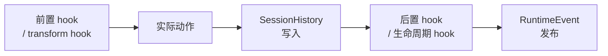
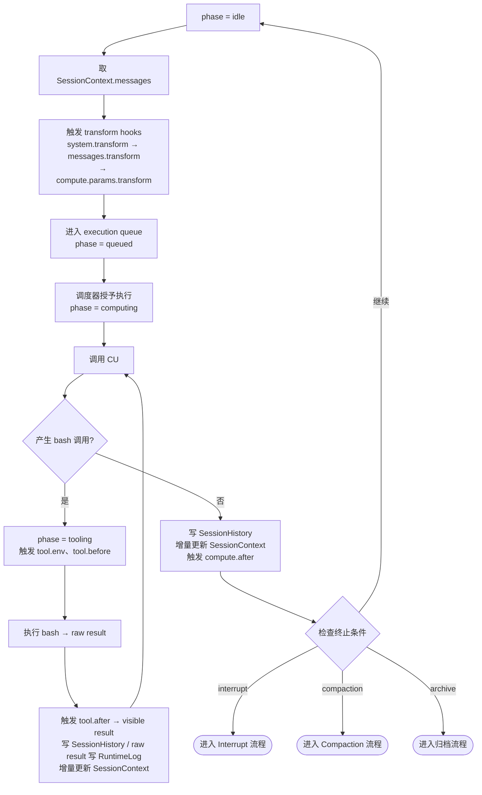

# Agent OS 实现手册 v0.80

本文件是 Agent OS 的实现手册。它负责精确定义字段结构、hook 语义、控制面操作表、物化算法与恢复协议。世界观、对象定义与边界原则见配套的宪章文件。

---

## 第一章 范围、术语与规范约定

### 1.1 文档地位

本手册是规范性文档。凡本手册中使用"必须（MUST）""不得（MUST NOT）""应当（SHOULD）""不应（SHOULD NOT）""可以（MAY）"等措辞，均按 RFC 2119 语义理解。

### 1.2 术语

| 术语            | 含义                                                      |
| --------------- | --------------------------------------------------------- |
| AOSCP           | AOS Control Plane，AOS 的正式控制接口                     |
| CB              | ControlBlock，泛指 AOSCB / ACB / SCB                      |
| SH              | SessionHistory                                            |
| SC              | SessionContext                                            |
| RL              | RuntimeLog                                                |
| HistoryRef      | 指向 SessionHistory 中某条消息或某个 part 的运行时引用    |
| pluginInstance  | plugin 启动后的运行实体                                   |
| ownerType       | `system` / `agent` / `session` 三者之一                   |
| compaction pair | CompactionMarkerMessage + CompactionSummaryMessage 的配对 |

### 1.3 版本标识

当前 schema 版本标识为 `aos/v0.80`。所有持久化结构的 `schemaVersion` 字段必须填写此值。

---

## 第二章 通用约定

### 2.1 标识符

- 所有 ID 字段（agentId、sessionId、messageId、partId 等）：不透明字符串，建议使用 UUID v4 或同等不可猜测唯一标识符。
- 系统不规定 ID 生成算法，但在同一命名空间内必须唯一。

### 2.2 时间格式

所有时间字段使用 RFC 3339 UTC 字符串，如 `2026-03-17T10:00:00Z`。

### 2.3 修订号（revision）

- 每次成功改写 ControlBlock，revision 必须严格单调递增（+1）。
- revision 从 1 开始。
- AOSCP 操作返回的 revision 是本次操作完成后的新值。

### 2.4 追加写原则

- SessionHistory 是 append-only。已有消息不得修改或删除。
- RuntimeLog 是 append-only。已有条目不得修改或删除。
- ControlBlock 允许字段覆写，但每次覆写必须伴随 revision 递增与 updatedAt 更新。

### 2.5 错误响应

所有 AOSCP 操作遵循统一 AosResponse 结构（见第七章 7.3）。错误情形下 `ok` 为 false，`error.code` 与 `error.message` 必须填写。

---

## 第三章 持久化结构

### 3.1 AOSCB

| 字段          | 类型               | 必填 | 可变 | 含义                                   |
| ------------- | ------------------ | ---- | ---- | -------------------------------------- |
| schemaVersion | string             | 是   | 否   | 固定为 `aos/v0.80`                     |
| name          | string             | 是   | 是   | AOS 实例名称                           |
| skillRoot     | string             | 是   | 是   | skill 根目录绝对路径                   |
| revision      | integer            | 是   | 是   | system 级修订号                        |
| createdAt     | RFC 3339 UTC       | 是   | 否   | 创建时间                               |
| updatedAt     | RFC 3339 UTC       | 是   | 是   | 最近更新时间                           |
| defaultSkills | SkillDefaultRule[] | 否   | 是   | system 级默认 skill 条目               |
| permissions   | object             | 否   | 是   | system 级权限策略（语法 v0.80 未固定） |

**最小示例**

```json
{
  "schemaVersion": "aos/v0.80",
  "name": "my-agent-os",
  "skillRoot": "/path/to/skills",
  "revision": 1,
  "createdAt": "2026-03-17T10:00:00Z",
  "updatedAt": "2026-03-17T10:00:00Z"
}
```

### 3.2 ACB

| 字段          | 类型                  | 必填 | 可变 | 含义                                  |
| ------------- | --------------------- | ---- | ---- | ------------------------------------- |
| agentId       | string                | 是   | 否   | Agent 唯一标识                        |
| status        | `active` / `archived` | 是   | 是   | 生命周期状态                          |
| displayName   | string                | 否   | 是   | 展示名                                |
| revision      | integer               | 是   | 是   | agent 级修订号                        |
| createdBy     | `human` / agentId     | 是   | 否   | 创建来源                              |
| createdAt     | RFC 3339 UTC          | 是   | 否   | 创建时间                              |
| updatedAt     | RFC 3339 UTC          | 是   | 是   | 最近更新时间                          |
| archivedAt    | RFC 3339 UTC          | 否   | 是   | 归档时间；仅 `status=archived` 时出现 |
| defaultSkills | SkillDefaultRule[]    | 否   | 是   | agent 级默认 skill 条目               |
| permissions   | object                | 否   | 是   | agent 级权限策略                      |

ACB 不维护 sessions[] 列表。Agent 与 Session 的归属关系由 SCB.agentId 单向确定。

### 3.3 SCB

| 字段          | 类型                                  | 必填 | 可变 | 含义                                  |
| ------------- | ------------------------------------- | ---- | ---- | ------------------------------------- |
| sessionId     | string                                | 是   | 否   | Session 唯一标识                      |
| agentId       | string                                | 是   | 否   | 所属 Agent                            |
| status        | `initializing` / `ready` / `archived` | 是   | 是   | 生命周期状态                          |
| title         | string                                | 否   | 是   | Session 标题                          |
| revision      | integer                               | 是   | 是   | session 级修订号                      |
| createdBy     | `human` / agentId                     | 是   | 否   | 创建来源                              |
| createdAt     | RFC 3339 UTC                          | 是   | 否   | 创建时间                              |
| updatedAt     | RFC 3339 UTC                          | 是   | 是   | 最近更新时间                          |
| archivedAt    | RFC 3339 UTC                          | 否   | 是   | 归档时间；仅 `status=archived` 时出现 |
| defaultSkills | SkillDefaultRule[]                    | 否   | 是   | session 级默认 skill 条目             |
| permissions   | object                                | 否   | 是   | session 级权限策略                    |

**最小示例**

```json
{
  "sessionId": "s_123",
  "agentId": "a_42",
  "status": "ready",
  "revision": 1,
  "createdBy": "human",
  "createdAt": "2026-03-17T10:10:00Z",
  "updatedAt": "2026-03-17T10:10:00Z"
}
```

### 3.4 SkillManifest

AOS 从 SKILL.md frontmatter 中解析得到，不由用户直接持久化。

| 字段        | 类型   | 必填 | 含义                                                |
| ----------- | ------ | ---- | --------------------------------------------------- |
| name        | string | 是   | skill 名；在 AOS 实例内唯一                         |
| description | string | 是   | 给 CU 看的简短说明                                  |
| plugin      | string | 否   | 由 `metadata.aos-plugin` 解析而来；运行入口模块路径 |

SKILL.md frontmatter 示例：

```yaml
name: memory
description: >-
  为当前 agent 提供长期记忆能力。
  WHEN 需要跨 session 回忆事实、偏好或状态时 USE 本 skill。
metadata:
  aos-plugin: runtime.ts
```

### 3.5 SkillCatalogItem

| 字段        | 类型   | 必填 | 含义                           |
| ----------- | ------ | ---- | ------------------------------ |
| name        | string | 是   | skill 名                       |
| description | string | 是   | 来自 SkillManifest.description |

plugin 字段不进入 SkillCatalogItem。

### 3.6 SkillDefaultRule

| 字段  | 类型                 | 必填 | 可变 | 含义                                     |
| ----- | -------------------- | ---- | ---- | ---------------------------------------- |
| name  | string               | 是   | 是   | skill 名                                 |
| load  | `enable` / `disable` | 否   | 是   | 是否参与默认上下文注入                   |
| start | `enable` / `disable` | 否   | 是   | plugin 是否在 owner 生命周期起点默认启动 |

- load 与 start 相互独立，无隐式联动。
- 字段缺失表示当前层对该维度不作声明。
- 同一 ControlBlock 内不得出现同名重复条目。

#### SkillDiscoveryStrategy 接口

AOS 为 skill 的 discover 原语保留可替换的发现算法接口。这个接口决定当前 SkillCatalog 如何生成，以及在更大的 skill 总量中暴露多少可见项给运行中的 owner。

```text
discover(input) -> SkillCatalogItem[]
```

推荐输入：

| 字段      | 类型                           | 含义                                      |
| --------- | ------------------------------ | ----------------------------------------- |
| skillRoot | string                         | skill 根目录或上游来源                    |
| ownerType | `system` / `agent` / `session` | 当前 discover 的归属层                    |
| ownerId   | string                         | 当前归属对象；可选                        |
| query     | object                         | 当前上下文、标签、过滤条件等；可选        |
| limit     | integer                        | 当前希望暴露给 CU 的 skill 数量上限；可选 |
| params    | object                         | 算法自定义参数                            |

v0.80 的默认策略是文件系统扫描。后续实现可以替换为标签过滤、相似性检索、小模型筛选或其他策略，而不改变 discover / load / start 这三个正式原语。

### 3.7 SessionHistoryMessage

SessionHistory 以消息为顶层单位，每条消息包含一个 parts 数组。结构遵循并扩展 AI SDK UIMessage[] 标准。

#### 顶层结构

| 字段     | 类型                            | 含义                                    |
| -------- | ------------------------------- | --------------------------------------- |
| id       | string                          | 消息唯一标识；SessionHistory 中不可重复 |
| role     | `system` / `user` / `assistant` | 消息角色；服务于模型投影                |
| parts    | SessionHistoryPart[]            | 消息内容，每个 part 承载一类语义        |
| metadata | object                          | AOS 附加元数据（见下）                  |

#### metadata 字段

| 字段      | 类型                          | 含义                                             |
| --------- | ----------------------------- | ------------------------------------------------ |
| seq       | integer                       | session 内严格单调递增，从 1 开始                |
| createdAt | RFC 3339 UTC                  | 消息创建时间                                     |
| origin    | `human` / `assistant` / `aos` | 真实来源，不等于 role                            |
| parentId  | string                        | 可选；compaction summary 指向其 marker 消息的 id |
| summary   | boolean                       | 可选；`true` 表示这是一条 compaction 摘要消息    |
| finish    | string                        | 可选；该轮动作的完成状态                         |
| error     | `{ code, message, details? }` | 可选；结构化错误信息                             |

#### role 与 origin 对照表

| 消息类型                           | role        | origin      |
| ---------------------------------- | ----------- | ----------- |
| 用户输入                           | `user`      | `human`     |
| 模型输出与 bash 工具活动           | `assistant` | `assistant` |
| AOS 默认注入、skill load、reinject | `user`      | `aos`       |
| AOS compaction marker              | `user`      | `aos`       |
| AOS compaction summary             | `assistant` | `aos`       |
| AOS interrupt、bootstrap marker    | `user`      | `aos`       |

role 服务于模型投影，origin 标记消息的真实来源。

#### Part 类型

所有 part 都有 `id`（string）与 `type`（string）两个基础字段。

**TextPart**

| 字段 | 类型   | 含义      |
| ---- | ------ | --------- |
| id   | string | part 标识 |
| type | `text` | 类型标记  |
| text | string | 文本内容  |

**ToolBashPart**

| 字段       | 类型                                                                        | 含义                                          |
| ---------- | --------------------------------------------------------------------------- | --------------------------------------------- |
| id         | string                                                                      | part 标识                                     |
| type       | `tool-bash`                                                                 | 类型标记                                      |
| toolCallId | string                                                                      | 工具调用标识                                  |
| state      | `input-streaming` / `input-available` / `output-available` / `output-error` | AI SDK 标准四态                               |
| input      | `{ command, cwd?, timeoutMs? }`                                             | bash 调用参数                                 |
| output     | `{ visibleResult }`                                                         | 会话可见结果；state=`output-available` 时必填 |
| errorText  | string                                                                      | 错误信息；state=`output-error` 时必填         |

`output.visibleResult` 是经 `tool.after` hook 处理后的会话可见结果，默认等于 raw result。raw result（原始 subprocess 输出）由 AOSCP 记入 RuntimeLog，不存入 SessionHistory。

**SkillLoadPart**

| 字段 | 类型              | 含义      |
| ---- | ----------------- | --------- |
| id   | string            | part 标识 |
| type | `data-skill-load` | 类型标记  |
| data | object            | 见下      |

data 字段：

| 字段      | 类型                                | 含义                  |
| --------- | ----------------------------------- | --------------------- |
| cause     | `default` / `explicit` / `reinject` | 注入来源              |
| ownerType | `system` / `agent` / `session`      | 注入来源的 owner 类型 |
| ownerId   | string                              | owner 标识；可选      |
| name      | string                              | skill 名              |
| skillText | string                              | 注入的 skillText 全文 |

**CompactionMarkerPart**

| 字段 | 类型              | 含义      |
| ---- | ----------------- | --------- |
| id   | string            | part 标识 |
| type | `data-compaction` | 类型标记  |
| data | object            | 见下      |

data 字段：

| 字段     | 类型    | 含义                                 |
| -------- | ------- | ------------------------------------ |
| auto     | boolean | `true` 表示自动触发                  |
| overflow | boolean | 可选；`true` 表示由上下文溢出触发    |
| fromSeq  | integer | 本次 compaction 覆盖的起始 seq（含） |
| toSeq    | integer | 本次 compaction 覆盖的终止 seq（含） |

**InterruptPart**

| 字段 | 类型                                   | 含义               |
| ---- | -------------------------------------- | ------------------ |
| id   | string                                 | part 标识          |
| type | `data-interrupt`                       | 类型标记           |
| data | `{ reason: string, payload?: object }` | 中断原因与附加信息 |

**BootstrapPart**

| 字段      | 类型             | 含义                                           |
| --------- | ---------------- | ---------------------------------------------- |
| id        | string           | part 标识                                      |
| type      | `data-bootstrap` | 类型标记                                       |
| transient | boolean          | 可选；`true` 表示仅用于流式 UI，不参与恢复协议 |
| data      | object           | 见下                                           |

data 字段：

| 字段         | 类型             | 含义                          |
| ------------ | ---------------- | ----------------------------- |
| phase        | `begin` / `done` | bootstrap 阶段标记            |
| reason       | string           | 可选；附加说明                |
| plannedNames | string[]         | 可选；计划注入的 skill 名列表 |

#### Compaction Pair 语义

compaction 在 SessionHistory 中以一对消息的形式存在：

**CompactionMarkerMessage（第一条）**

- role = `user`
- metadata.origin = `aos`
- parts = [ CompactionMarkerPart ]

**CompactionSummaryMessage（第二条）**

- role = `assistant`
- metadata.origin = `aos`
- metadata.parentId = `<marker message id>`
- metadata.summary = `true`
- metadata.finish = `completed`
- parts = [ TextPart ]（摘要正文）

判断已完成 compaction pair 的条件：二者同时存在，且 summary 的 metadata.finish = `completed`。marker 存在但 summary 缺失或 finish 不为 `completed`，视为未完成，不作为 rebuild 起始点。

### 3.8 RuntimeLogEntry

| 字段      | 类型                           | 必填 | 含义                                                  |
| --------- | ------------------------------ | ---- | ----------------------------------------------------- |
| id        | string                         | 是   | 日志条目唯一标识                                      |
| time      | RFC 3339 UTC                   | 是   | 事件发生时间                                          |
| level     | `info` / `warn` / `error`      | 是   | 日志级别                                              |
| op        | string                         | 是   | 操作名；点分形式，如 `session.append`、`context.fold` |
| ownerType | `system` / `agent` / `session` | 是   | 操作归属 owner 类型                                   |
| ownerId   | string                         | 否   | owner 标识；ownerType 为 agent 或 session 时填写      |
| agentId   | string                         | 否   | 操作所属 Agent                                        |
| sessionId | string                         | 否   | 操作所属 Session                                      |
| refs      | object                         | 否   | 关联引用（见下）                                      |
| data      | object                         | 否   | 操作相关结构化数据                                    |

refs 字段：

| 字段             | 类型    | 含义                                |
| ---------------- | ------- | ----------------------------------- |
| historyMessageId | string  | 可选；关联的 SessionHistory 消息 id |
| historyPartId    | string  | 可选；关联的 SessionHistory part id |
| contextRevision  | integer | 可选；操作发生时的 contextRevision  |

---

## 第四章 运行时结构

运行时结构不持久化。关机消失，重启重建。

### 4.1 SessionContext

| 字段            | 类型              | 含义                                     |
| --------------- | ----------------- | ---------------------------------------- |
| sessionId       | string            | 所属 Session                             |
| contextRevision | integer           | 单调递增；每次 rebuild 或 compact 后递增 |
| messages        | ContextMessage[]  | 下一次调用 CU 模块时传入的完整消息列表   |
| foldedRefs      | Set\<HistoryRef\> | 当前被 fold 的历史引用集合               |

**HistoryRef** 的两种形式：

- `{ historyMessageId }` — 折叠整条 SessionHistory 消息
- `{ historyMessageId, historyPartId }` — 折叠单个 part

contextRevision 变化后，messages 数组中的 context message id 可以整体换新；跨重建的稳定引用必须使用 HistoryRef，而不是 context message id。

**ContextMessage** 是 SessionContext 的内部消息单位，由两部分组成：

- `wire`：LiteLLM 兼容的 chat message 对象，供 CU 模块直接发送给 LiteLLM
- `aos`：AOS 运行时的 provenance sidecar，保存来源消息、来源 part 与投影类型

CU 模块负责消费 `messages[].wire`，并在发给 LiteLLM 之前剥离 `aos` 元数据。

### 4.2 运行时注册表

| 结构                    | 作用                                    | 是否持久化 |
| ----------------------- | --------------------------------------- | ---------- |
| discovery cache         | 保存从 skillRoot 解析出的 SkillManifest | 否         |
| skillText cache         | 保存默认 load skill 的 skillText        | 否         |
| plugin module cache     | 保存 plugin 运行入口模块引用            | 否         |
| pluginInstance registry | 保存所有运行中的 pluginInstance         | 否         |
| resource registry       | 保存 ManagedResource                    | 否         |

### 4.3 PluginInstance 运行时视图

| 字段       | 类型                                                      | 含义                                        |
| ---------- | --------------------------------------------------------- | ------------------------------------------- |
| instanceId | string                                                    | 由 ownerType + ownerId + skillName 组合而成 |
| skillName  | string                                                    | 所属 skill 名                               |
| ownerType  | `system` / `agent` / `session`                            | owner 类型                                  |
| ownerId    | string                                                    | owner 标识                                  |
| state      | `starting` / `running` / `stopping` / `stopped` / `error` | 实例状态                                    |
| startedAt  | RFC 3339 UTC                                              | 启动时间                                    |
| hooks      | array                                                     | 已注册的控制流 hooks                        |
| lastError  | string                                                    | 最近错误；可选                              |

### 4.4 ManagedResource

| 字段            | 类型                                                      | 含义                           |
| --------------- | --------------------------------------------------------- | ------------------------------ |
| resourceId      | string                                                    | 资源标识                       |
| kind            | `app` / `service` / `worker`                              | 资源类型                       |
| ownerType       | `system` / `agent` / `session`                            | owner 类型                     |
| ownerId         | string                                                    | owner 标识                     |
| ownerInstanceId | string                                                    | 创建该资源的 pluginInstance id |
| state           | `starting` / `running` / `stopping` / `stopped` / `error` | 资源状态                       |
| startedAt       | RFC 3339 UTC                                              | 启动时间                       |
| endpoints       | string[]                                                  | 对外端点；可选                 |
| lastError       | string                                                    | 最近错误；可选                 |

### 4.5 ExecutionTicket

| 字段            | 类型                                              | 含义                  |
| --------------- | ------------------------------------------------- | --------------------- |
| ticketId        | string                                            | 调度票据标识          |
| kind            | `compute` / `tool` / `compaction` / `resource-op` | 执行类别              |
| ownerType       | `system` / `agent` / `session`                    | 执行归属 owner 类型   |
| agentId         | string                                            | 所属 Agent；可选      |
| sessionId       | string                                            | 所属 Session；可选    |
| priority        | `high` / `normal` / `low`                         | 调度优先级            |
| estimatedTokens | integer                                           | 估计 token 消耗；可选 |

### 4.6 CU 模块边界

v0.80 的参考实现以 LiteLLM 作为 CU 模块的核心依赖。CU 模块的职责边界如下：

| 负责                    | 说明                                                         |
| ----------------------- | ------------------------------------------------------------ |
| 接收 `ContextMessage[]` | 读取 SessionContext 当前窗口                                 |
| 调用 LiteLLM            | 统一多 provider 的消息发送、流式响应与 tool-calling 返回格式 |
| 处理流式 chunk          | 拼接 token、识别 tool call 边界、产出本轮模型结果            |

| 不负责                | 说明                                    |
| --------------------- | --------------------------------------- |
| SessionHistory 持久化 | 由 AOSCP 与 Session 执行引擎负责        |
| SessionContext 调度   | 由 History / Context 接口与调度原语负责 |
| bash 执行             | 由 Session 执行引擎负责                 |
| RuntimeLog            | 由 AOSCP 负责                           |
| 权限判断              | 由 AOSCP 负责                           |

CU 模块完成的是一次模型计算。完整的 ReAct 循环由 Session 执行引擎驱动。

---

## 第五章 SessionHistory 到 SessionContext 的物化规则

### 5.1 起始边界确定

从 SessionHistory 末尾向前扫描，寻找最新的已完成 compaction pair。

判断已完成的条件：

1. 找到一条 metadata.origin = `aos`、parts 中包含 CompactionMarkerPart 的 user 消息（marker）
2. 找到对应的 assistant 消息：metadata.parentId = marker.id、metadata.summary = `true`、metadata.finish = `completed`（summary）
3. 二者同时满足，且 summary 在 marker 之后

若找到已完成 compaction pair，起始点为 **marker 消息的位置**（含 marker 本身）。
若未找到，起始点为 **SessionHistory 的第一条消息**。

### 5.2 消息收集与 fold 过滤

从起始点到 SessionHistory 最新消息，按 metadata.seq 升序收集全部 SessionHistoryMessage。

遍历收集到的消息，跳过所有在 foldedRefs 集合中的引用所对应的消息或 part：

- 若一整条消息的 `{ historyMessageId }` 在 foldedRefs 中，跳过该条消息的全部 parts。
- 若某个 `{ historyMessageId, historyPartId }` 在 foldedRefs 中，投影时跳过该 part。

### 5.3 投影规则

每条投影出的 ContextMessage 在 `aos` sidecar 中携带最小 provenance：

```json
{
  "wire": {
    "role": "user",
    "content": "..."
  },
  "aos": {
    "sourceMessageId": "<SessionHistory message id>",
    "sourcePartId": "<part id>",
    "kind": "<投影类型>"
  }
}
```

kind 取值：`user-input`、`assistant-output`、`tool-bash-call`、`tool-bash-result`、`skill-load`、`compaction-summary`、`interrupt`、`compaction-marker`。

#### 映射规则表

| SessionHistory 消息特征                                                                             | 投影结果                                                                                                                                                                                                        |
| --------------------------------------------------------------------------------------------------- | --------------------------------------------------------------------------------------------------------------------------------------------------------------------------------------------------------------- |
| role=`user`、origin=`human`、TextPart                                                               | `ContextMessage(wire={role:"user", content:text})`                                                                                                                                                              |
| role=`assistant`、origin=`assistant`、TextPart（无工具调用）                                        | `ContextMessage(wire={role:"assistant", content:text})`                                                                                                                                                         |
| role=`assistant`、origin=`assistant`，含 ToolBashPart（state=`output-available` 或 `output-error`） | `ContextMessage(wire={role:"assistant", content:"", tool_calls:[{id, type:"function", function:{name:"bash", arguments:...}}]})` + `ContextMessage(wire={role:"tool", content:visibleResult, tool_call_id:id})` |
| role=`user`、origin=`aos`、SkillLoadPart                                                            | `ContextMessage(wire={role:"system", content:"[[AOS-SKILL ...]]\n..."})`                                                                                                                                        |
| role=`user`、origin=`aos`、CompactionMarkerPart                                                     | `ContextMessage(wire={role:"user", content:"What did we do so far?"})`                                                                                                                                          |
| role=`assistant`、origin=`aos`、summary=`true`、TextPart                                            | `ContextMessage(wire={role:"assistant", content:<summaryText>})`                                                                                                                                                |
| role=`user`、origin=`aos`、InterruptPart                                                            | `ContextMessage(wire={role:"system", content:"[[AOS-INTERRUPT ...]]"})`                                                                                                                                         |
| BootstrapPart（任意消息）                                                                           | 不投影                                                                                                                                                                                                          |
| state=`input-streaming` 或 `input-available` 的 ToolBashPart                                        | 不投影（调用未完成）                                                                                                                                                                                            |

**补充说明：**

- 一条含有 ToolBashPart 的 assistant 消息投影为**两条** ContextMessage：一条 assistant 消息携带 tool_call，一条 tool 消息携带 visibleResult。sourcePartId 两条都指向同一 ToolBashPart 的 id，以 kind 区分。
- 若一条 assistant 消息同时有 TextPart 和 ToolBashPart，TextPart 内容进入 `wire.content`，ToolBashPart 进入 `wire.tool_calls`。
- SkillLoadPart 投影为 system role 的 ContextMessage，按其 seq 顺序插入，不聚合到列表头部。
- CompactionMarkerMessage 与 CompactionSummaryMessage 合在一起投影为 user role + assistant role 的两条 ContextMessage。

### 5.4 物化完成

物化完成后，contextRevision 加一。

---

## 第六章 Hook、事件与注册语义

### 6.1 Hook 执行模型

- **串行：** 同一 hook 点上的所有注册实例，严格按注册顺序依次执行。
- **共享可变 output：** 宿主先构造初始 output，所有 hook 函数共享同一引用，并可就地修改其字段。
- **最后态生效：** 主流程使用所有 hook 执行完成后的最终 output；前序 hook 的修改可以被后续 hook 覆盖。
- **阻塞主流程：** 宿主等待当前 hook 点全部实例执行完毕后才继续推进。
- **错误中断：** hook 抛出未捕获异常时，当前操作立即失败；同一 hook 点上的后续实例不再执行。

Hook 还按 family 组织。family 用于约束 hook 点应当围绕哪类对象展开。

| family       | 关注对象                                        | 典型 hook                  |
| ------------ | ----------------------------------------------- | -------------------------- |
| `aos.*`      | AOS 启停、全局治理                              | `aos.started`              |
| `skill.*`    | skill 索引、发现、默认解析、load/start/stop     | `skill.discovery.after`    |
| `session.*`  | bootstrap、reinject、message 写入、context 调度 | `session.bootstrap.before` |
| `compute.*`  | 单次模型计算                                    | `compute.before`           |
| `tool.*`     | bash 执行                                       | `tool.before`              |
| `resource.*` | ManagedResource 生命周期                        | `resource.started`         |

### 6.2 注册权限

| ownerType | 可注册的 hook 前缀                                                     |
| --------- | ---------------------------------------------------------------------- |
| `system`  | 全部                                                                   |
| `agent`   | `agent.*`、`skill.*`、`session.*`、`compute.*`、`tool.*`、`resource.*` |
| `session` | `skill.*`、`session.*`、`compute.*`、`tool.*`、`resource.*`            |

越权注册必须在注册时立即失败，不得静默忽略。

### 6.3 分发顺序

| hook 类型                                  | 顺序                     |
| ------------------------------------------ | ------------------------ |
| `*.before`、`*.beforeWrite`、`*.transform` | system → agent → session |
| `*.after`、生命周期通知型 hook             | session → agent → system |
| `aos.*`                                    | 仅 system                |

### 6.4 Hook 清单

本节列出所有正式 hook 点。input 为只读；output 为同一 hook 点各实例共享的可变对象；— 表示该维度无特殊字段。

#### 生命周期 hooks

| hook               | 可注册 owner             | 时机                     | input                                | output |
| ------------------ | ------------------------ | ------------------------ | ------------------------------------ | ------ |
| `aos.started`      | system                   | AOS 启动完成后           | cause, timestamp, catalogSize        | —      |
| `aos.stopping`     | system                   | AOS 停止前               | reason, timestamp                    | —      |
| `agent.started`    | agent / system           | Agent 创建或恢复后       | agentId, cause, timestamp            | —      |
| `agent.archived`   | agent / system           | Agent 归档后             | agentId, timestamp                   | —      |
| `session.started`  | session / agent / system | Session bootstrap 完成后 | agentId, sessionId, cause, timestamp | —      |
| `session.archived` | session / agent / system | Session 归档后           | agentId, sessionId, timestamp        | —      |

#### Session 维护 hooks

| hook                        | 可注册 owner             | 时机          | input                                             | output |
| --------------------------- | ------------------------ | ------------- | ------------------------------------------------- | ------ |
| `session.bootstrap.before`  | session / agent / system | 默认注入前    | agentId, sessionId, plannedNames                  | —      |
| `session.bootstrap.after`   | session / agent / system | 默认注入后    | agentId, sessionId, injectedNames                 | —      |
| `session.reinject.before`   | session / agent / system | reinject 前   | agentId, sessionId, plannedNames                  | —      |
| `session.reinject.after`    | session / agent / system | reinject 后   | agentId, sessionId, injectedNames                 | —      |
| `session.compaction.before` | session / agent / system | compaction 前 | agentId, sessionId, fromSeq, toSeq                | —      |
| `session.compaction.after`  | session / agent / system | compaction 后 | agentId, sessionId, fromSeq, toSeq, compactionSeq | —      |
| `session.error`             | session / agent / system | 运行失败时    | source, recoverable, message                      | —      |
| `session.interrupted`       | session / agent / system | 中断时        | reason                                            | —      |

#### Compute 与 Tool hooks

| hook                          | 可注册 owner             | 时机           | input                                    | output                        |
| ----------------------------- | ------------------------ | -------------- | ---------------------------------------- | ----------------------------- |
| `session.message.beforeWrite` | session / agent / system | 消息写入前     | agentId, sessionId, message              | message（可替换消息内容）     |
| `compute.before`              | session / agent / system | 调用 CU 前     | agentId, sessionId, lastSeq              | —                             |
| `compute.after`               | session / agent / system | 一轮计算结束后 | agentId, sessionId, appendedMessageCount | —                             |
| `tool.before`                 | session / agent / system | bash 执行前    | toolCallId, args                         | args（可改写命令参数）        |
| `tool.after`                  | session / agent / system | bash 执行后    | toolCallId, rawResult                    | result（可改写会话可见结果）  |
| `tool.env`                    | session / agent / system | bash 执行前    | toolCallId, args                         | env（与进程环境合并的键值对） |

`tool.after` 读取 rawResult（原始 subprocess 输出），返回的 result 成为 visible result，写入 SessionHistory。rawResult 由 AOS 记入 RuntimeLog。

#### Transform hooks

| hook                           | 可注册 owner             | 触发时机                          | input                              | output                                                            |
| ------------------------------ | ------------------------ | --------------------------------- | ---------------------------------- | ----------------------------------------------------------------- |
| `session.system.transform`     | session / agent / system | CU 调用前，构造 system 注入时     | agentId, sessionId, userMessage?   | system（覆盖默认 system 注入文本）                                |
| `session.messages.transform`   | session / agent / system | CU 调用前，投影完成后             | agentId, sessionId, messages       | messages（最终送给 CU 的消息数组）                                |
| `session.compaction.transform` | session / agent / system | compaction 开始后，摘要 prompt 前 | agentId, sessionId, fromSeq, toSeq | contextParts（追加到 compaction prompt 的文本片段），summaryHint? |
| `compute.params.transform`     | session / agent / system | CU 调用前，参数构造完成后         | agentId, sessionId, params         | params（最终传给 LLM 的参数对象）                                 |

**Transform hook 约束：**

- output 只影响本次 CU 调用或本次 compaction，不写入 SessionHistory，不修改 ControlBlock。
- `session.messages.transform` 的 messages 输入是 compaction 截断和 fold 过滤之后的结果；plugin 无法通过它取回已被截断或折叠的历史。
- `session.compaction.transform` 追加的 contextParts 仅参与 compaction prompt 构造，不进入 SessionHistory 正文。
- `compute.params.transform` 修改 provider 参数，不修改消息内容。

#### Resource hooks

| hook                | 可注册 owner | 时机                   | input                        | output |
| ------------------- | ------------ | ---------------------- | ---------------------------- | ------ |
| `resource.started`  | owner 向上   | ManagedResource 启动后 | resourceId, kind, endpoints? | —      |
| `resource.stopping` | owner 向上   | ManagedResource 停止前 | resourceId, kind             | —      |
| `resource.error`    | owner 向上   | ManagedResource 失败时 | resourceId, kind, message    | —      |

"owner 向上"：session-owned 资源可被 session / agent / system 注册的 hooks 接收；agent-owned 资源可被 agent / system 接收；system-owned 资源仅 system 接收。

### 6.5 Hook 执行顺序与 RuntimeEvent 的关系

默认顺序固定为：



hook 名与 RuntimeEvent.type 可以共享同名标签（如 `session.started`），但二者是不同机制：hook 是控制流插槽，RuntimeEvent 是运行时事实。

### 6.6 Plugin 工厂接口

```typescript
type Plugin = (ctx: PluginContext) => Promise<Hooks>;
```

AOS 执行 start 时，加载 SkillManifest.plugin 指向的模块，对每个满足 Plugin 签名的导出函数分别执行一次工厂调用；普通 helper 导出不参与初始化。一个模块可以导出多个 plugin 工厂函数，每个函数返回的 hooks 分别进入 hook 链，但它们仍属于同一个 pluginInstance。

工厂函数只在 pluginInstance 启动时执行一次。

### 6.7 PluginContext

| 字段      | 类型                           | 含义                                    |
| --------- | ------------------------------ | --------------------------------------- |
| ownerType | `system` / `agent` / `session` | 当前 pluginInstance 的 owner 类型       |
| ownerId   | string                         | 当前 pluginInstance 的 owner 标识       |
| skillName | string                         | 当前 skill 名                           |
| agentId   | string                         | 当 ownerType 为 agent 或 session 时存在 |
| sessionId | string                         | 当 ownerType 为 session 时存在          |
| aos       | AosSDK 子集                    | 受 ownerType 约束的控制面客户端         |

### 6.8 RuntimeEvent 与 RuntimeEventBus

#### RuntimeEvent 结构

| 字段      | 类型                           | 含义                                   |
| --------- | ------------------------------ | -------------------------------------- |
| type      | string                         | 事件名，点分形式，如 `session.started` |
| ownerType | `system` / `agent` / `session` | 事件归属 owner 类型                    |
| timestamp | RFC 3339 UTC                   | 事件发生时间                           |
| agentId   | string                         | 事件所属 Agent；可选                   |
| sessionId | string                         | 事件所属 Session；可选                 |
| payload   | object                         | 事件载荷                               |

#### 事件可见性规则

| 事件归属 ownerType | 可见给谁                                                                               |
| ------------------ | -------------------------------------------------------------------------------------- |
| `system`           | system pluginInstances                                                                 |
| `agent`            | 对应 agent 的 pluginInstances、system pluginInstances                                  |
| `session`          | 对应 session 的 pluginInstances、所属 agent 的 pluginInstances、system pluginInstances |

事件订阅是非阻塞的 fire-and-forget 语义：pluginInstance 收到事件后的处理不阻塞主流程，异常也不影响主流程推进。

RuntimeEventBus 的默认实现可以是单进程内存 bus；系统演进到多进程时，底层 transport 可以替换，但逻辑语义固定。

### 6.9 热更新规则

- SKILL.md 变化：刷新对应 SkillManifest，失效相关 owner 下的 skillText 缓存条目。
- metadata.aos-plugin 解析结果变化：失效对应 plugin module cache 条目。
- 既有 SessionHistoryMessage 不可被重写。
- 已经运行中的 pluginInstance 继续使用启动时装入的 plugin 模块，直到 owner 生命周期结束或显式停止。
- 新的显式 load、未来的 bootstrap reinjection 以及未来的 plugin 启动，才会使用新版本。

---

## 第七章 Control Plane

### 7.1 客户端与入口

| 客户端   | 使用方式                             | 典型使用者                |
| -------- | ------------------------------------ | ------------------------- |
| CLI      | `aos skill load memory`              | CU（通过 bash）、人类终端 |
| SDK      | `aos.skill.load({ name: "memory" })` | pluginInstance、前端 UI   |
| HTTP/API | 与 SDK 同构                          | 远程面板、自动化管道      |

宿主至少注入 `AOS_AGENT_ID` 与 `AOS_SESSION_ID` 两个环境变量，供 CLI 在缺省参数时读取默认目标。SDK 调用必须显式传入。

`skill.list` 返回的是当前 discover 策略暴露给运行对象的 SkillCatalog，不要求等于系统中可安装 skill 的全量集合。

### 7.2 Skill 操作

| 操作                    | 输入                                | 返回               | 改写 CB | 副作用                                                                          |
| ----------------------- | ----------------------------------- | ------------------ | ------- | ------------------------------------------------------------------------------- |
| `skill.list`            | 无                                  | SkillCatalog       | 否      | 返回当前 discover 策略暴露给 CU 的 SkillCatalog                                 |
| `skill.show`            | name                                | SkillManifest      | 否      | 无                                                                              |
| `skill.catalog.refresh` | ownerType, ownerId?, query?         | SkillCatalog       | 否      | 刷新 discovery cache，并重新计算当前可见 SkillCatalog                           |
| `skill.catalog.preview` | ownerType, ownerId?, query?, limit? | SkillCatalog       | 否      | 预览指定发现策略在当前上下文下会暴露的 skill 子集                               |
| `skill.load`            | name                                | SkillLoadResult    | 否      | 写 SessionHistory（data-skill-load）；若经 bash 调用，额外写 tool-bash 审计事实 |
| `skill.start`           | PluginStartArgs                     | PluginInstance     | 否      | 启动 plugin，触发相关 hooks / events                                            |
| `skill.stop`            | instanceId                          | instanceId         | 否      | 停止 pluginInstance，触发相关 hooks / events                                    |
| `skill.default.list`    | ownerType, ownerId?                 | SkillDefaultRule[] | 否      | 无                                                                              |
| `skill.default.set`     | ownerType, ownerId?, entry          | revision           | 是      | 运行中 owner 可能触发缓存刷新或 reconcile                                       |
| `skill.default.unset`   | ownerType, ownerId?, name           | revision           | 是      | 同上                                                                            |

### 7.3 Agent 操作

| 操作            | 输入         | 返回     | 改写 CB | 副作用                                |
| --------------- | ------------ | -------- | ------- | ------------------------------------- |
| `agent.list`    | 无           | ACB[]    | 否      | 无                                    |
| `agent.create`  | displayName? | ACB      | 是      | 新建 Agent，进入 agent 激活顺序       |
| `agent.get`     | agentId      | ACB      | 否      | 无                                    |
| `agent.archive` | agentId      | revision | 是      | 停止该 Agent 的 pluginInstance 与资源 |

### 7.4 Session 操作

| 操作                | 输入                        | 返回              | 改写 CB | 副作用                                               |
| ------------------- | --------------------------- | ----------------- | ------- | ---------------------------------------------------- |
| `session.list`      | SessionListArgs             | SessionListResult | 否      | 无                                                   |
| `session.create`    | agentId, title?             | SCB               | 是      | 新建 Session，进入 bootstrap                         |
| `session.get`       | sessionId                   | SCB               | 否      | 无                                                   |
| `session.append`    | sessionId, message          | revision          | 是      | 追加 SessionHistoryMessage                           |
| `session.interrupt` | sessionId, reason, payload? | revision          | 是      | 写入 interrupt 事实到 SessionHistory                 |
| `session.compact`   | sessionId                   | revision          | 是      | 触发 compaction，写入 pair，执行 reinject 与 rebuild |
| `session.archive`   | sessionId                   | revision          | 是      | 停止该 Session 的 pluginInstance 与资源              |

### 7.5 SessionContext 操作

这组操作管理 SessionContext 运行时内存，全部写入 RuntimeLog。

| 操作                      | 输入             | 返回               | 写 SH | 写 RL | 副作用                                     |
| ------------------------- | ---------------- | ------------------ | ----- | ----- | ------------------------------------------ |
| `session.context.get`     | sessionId        | SessionContextView | 否    | 是    | 返回当前 contextRevision 与 messages       |
| `session.context.fold`    | sessionId, ref   | contextRevision    | 否    | 是    | 将 ref 加入 foldedRefs                     |
| `session.context.unfold`  | sessionId, ref   | contextRevision    | 否    | 是    | 将 ref 从 foldedRefs 中移除                |
| `session.context.compact` | sessionId, auto? | revision           | 是    | 是    | 生成摘要，追加 pair，reinject，rebuild     |
| `session.context.rebuild` | sessionId        | contextRevision    | 否    | 是    | 按第五章规则重新物化，递增 contextRevision |

SessionContextView 字段：

| 字段            | 类型    | 含义                       |
| --------------- | ------- | -------------------------- |
| sessionId       | string  | 所属 Session               |
| contextRevision | integer | 当前修订号                 |
| messageCount    | integer | 当前 messages 中的消息条数 |
| foldedRefCount  | integer | 当前 foldedRefs 集合的大小 |

### 7.6 Plugin 操作

| 操作          | 输入                 | 返回             | 改写 CB | 副作用 |
| ------------- | -------------------- | ---------------- | ------- | ------ |
| `plugin.list` | ownerType?, ownerId? | PluginInstance[] | 否      | 无     |
| `plugin.get`  | instanceId           | PluginInstance   | 否      | 无     |

### 7.7 Resource 操作

| 操作             | 输入                      | 返回              | 改写 CB | 副作用                                     |
| ---------------- | ------------------------- | ----------------- | ------- | ------------------------------------------ |
| `resource.list`  | ownerType?, ownerId?      | ManagedResource[] | 否      | 无                                         |
| `resource.start` | ownerType, ownerId?, spec | ManagedResource   | 否      | 启动受管资源，触发 resource hooks / events |
| `resource.get`   | resourceId                | ManagedResource   | 否      | 无                                         |
| `resource.stop`  | resourceId                | resourceId        | 否      | 停止受管资源，触发 resource hooks / events |

### 7.8 共享数据结构

**SkillLoadResult**

| 字段      | 类型   | 必填 | 含义              |
| --------- | ------ | ---- | ----------------- |
| name      | string | 是   | skill 名          |
| skillText | string | 是   | SKILL.md 完整正文 |

**PluginStartArgs**

| 字段      | 类型                           | 必填 | 含义                                    |
| --------- | ------------------------------ | ---- | --------------------------------------- |
| skillName | string                         | 是   | 要启动的 skill 名                       |
| ownerType | `system` / `agent` / `session` | 是   | 产生的 pluginInstance 归属的 owner 类型 |
| ownerId   | string                         | 否   | ownerType 为 agent 或 session 时必填    |

**SessionListArgs**

| 字段    | 类型    | 必填 | 含义           |
| ------- | ------- | ---- | -------------- |
| agentId | string  | 否   | 按 Agent 过滤  |
| cursor  | string  | 否   | 不透明分页游标 |
| limit   | integer | 否   | 单页返回条数   |

**SessionListResult**

| 字段       | 类型   | 必填 | 含义           |
| ---------- | ------ | ---- | -------------- |
| items      | SCB[]  | 是   | 当前页 Session |
| nextCursor | string | 否   | 下一页游标     |

**RuntimeResourceSpec**

| 字段  | 类型                         | 必填 | 含义     |
| ----- | ---------------------------- | ---- | -------- |
| kind  | `app` / `service` / `worker` | 是   | 资源类型 |
| entry | string                       | 否   | 启动入口 |
| cwd   | string                       | 否   | 工作目录 |
| args  | string[]                     | 否   | 启动参数 |
| env   | object                       | 否   | 环境变量 |

**AosResponse**

| 字段          | 类型    | 必填 | 含义                   |
| ------------- | ------- | ---- | ---------------------- |
| ok            | boolean | 是   | 操作是否成功           |
| op            | string  | 是   | 操作名                 |
| revision      | integer | 否   | 本次操作返回的新修订号 |
| data          | object  | 否   | 成功结果               |
| error.code    | string  | 否   | 错误码                 |
| error.message | string  | 否   | 错误信息               |
| error.details | object  | 否   | 额外错误上下文         |

**示例**

```json
{
  "ok": true,
  "op": "skill.load",
  "data": {
    "name": "memory",
    "skillText": "..."
  }
}
```

### 7.9 JSON-only 约束

控制面响应必须 JSON-only。stdout 不得混入解释性 prose，错误也必须按统一 AosResponse 结构返回。CLI 没有额外的 pretty view 或 prose mode；它的唯一输出就是 JSON。

### 7.10 运行中 owner 的默认 skill 生效规则

| 维度  | 修改命中运行中 owner 时            | 是否立即影响当前实例 / 上下文 | 未来何时消费                            |
| ----- | ---------------------------------- | ----------------------------- | --------------------------------------- |
| load  | 刷新该 owner 的默认 skillText 缓存 | 否                            | bootstrap / post-compaction reinjection |
| start | 立即触发 reconcile                 | 是                            | 同一请求处理流程内生效                  |

对于非运行中 owner，只写 ControlBlock，不做 reconcile。

---

## 第八章 会话可见结果与系统执行结果

### 8.1 SessionHistory 与 RuntimeLog 的职责分界

**SessionHistory 的职责：** 记录会话层面的可见事实。它回答"这次对话里，人和模型看到了什么、说了什么、做了什么"。

**RuntimeLog 的职责：** 记录系统层面的执行事实。它回答"AOS 内核实际执行了哪些操作、以何种顺序、产生了什么原始结果"。

两者的边界一句话：SessionHistory 记录"会话可见事实"，RuntimeLog 记录"系统执行事实"。

### 8.2 工具执行的 visible result 与 raw result

bash 执行产生 raw result（原始 subprocess stdout / stderr / exitCode）。`tool.after` hook 可以基于 raw result 生成 visible result。

写入规则：

- **visible result** → SessionHistory（ToolBashPart.output.visibleResult）
- **raw result** → RuntimeLog（作为系统执行事实，与执行时间、env、hook 链执行情况一并记录）

默认行为：若无 plugin 改写 `tool.after` 的 output，visible result = raw result（stdout + stderr + exitCode 的标准格式化）。

这个分离使 SessionHistory 始终保存会话可见事实，SessionContext 可以从 SessionHistory 可靠重建，而不依赖 RuntimeLog 的内容。

### 8.3 会话可见事实边界

以下是 SessionHistory 收录的完整边界：

| 事实                                          | 是否进入 SessionHistory                                        |
| --------------------------------------------- | -------------------------------------------------------------- |
| 用户输入                                      | 进入                                                           |
| 模型输出                                      | 进入                                                           |
| bash 工具调用与 visible result                | 进入（tool-bash part，记录 visibleResult）                     |
| 成功的显式 `aos skill load`                   | 进入两次：审计事实进入 tool-bash，语义事实进入 data-skill-load |
| 默认 skill 注入                               | 进入（data-skill-load）                                        |
| compaction pair                               | 进入（CompactionMarkerMessage + CompactionSummaryMessage）     |
| reinject 的 skill 注入                        | 进入（data-skill-load { cause: "reinject" }）                  |
| interrupt                                     | 进入（data-interrupt）                                         |
| bootstrap marker                              | 进入（data-bootstrap）                                         |
| pluginInstance 的私有日志                     | 不进入 SessionHistory（进入 RuntimeLog）                       |
| 运行时 fold / unfold 操作                     | 不进入 SessionHistory（只进入 RuntimeLog）                     |
| plugin 内部的 HTTP / shell 调用               | 仅当它们通过控制面影响 session 时才进入 SessionHistory         |
| 宿主层面的缓存命中 / 失效                     | 不进入                                                         |
| bash raw result（未经 tool.after 改写的部分） | 不进入 SessionHistory（进入 RuntimeLog）                       |

### 8.4 控制面操作的写入顺序

AOSCP 对三层结构的写入顺序有明确约定，以防止状态不一致。

**规则一：影响 SessionHistory 的操作，先写 SessionHistory，再更新 SessionContext。**

session.append、session.compact、skill.load、session.interrupt 等操作必须先将新条目追加到 SessionHistory，确认持久化成功后，再更新 SessionContext。不允许先更新 SessionContext 再尝试写 SessionHistory。

**规则二：只影响 SessionContext 的操作，不写 SessionHistory，只改内存。**

session.context.fold、session.context.unfold 直接修改 SessionContext.foldedRefs，不触及 SessionHistory。宕机恢复后 fold 状态不恢复，这是预期行为。

**规则三：所有控制面操作，在完成时都写 RuntimeLog。**

无论操作属于上述哪类，控制面在操作成功或失败时都必须向 RuntimeLog 追加一条 RuntimeLogEntry。

顺序示意：

```
session.append:
  1. 写 SessionHistory（先落盘）
  2. 增量更新 SessionContext
  3. 写 RuntimeLog

session.context.fold:
  1. 更新 SessionContext.foldedRefs
  2. 写 RuntimeLog

session.context.compact:
  1. 生成摘要文本
  2. 写 SessionHistory（追加 pair + reinject 消息）
  3. 执行 SessionContext rebuild
  4. 写 RuntimeLog
```

---

## 第九章 生命周期与执行时序

### 9.1 AOS 启动顺序

| 步骤 | 动作                                                                  | 结果                      |
| ---- | --------------------------------------------------------------------- | ------------------------- |
| 1    | 读取 AOSCB                                                            | system 级静态配置就绪     |
| 2    | 调用 SkillDiscoveryStrategy 生成 SkillCatalog，并建立 discovery cache | SkillCatalog 可投影       |
| 3    | 注册内建 skill `aos`                                                  | 控制说明书可用            |
| 4    | 预热 system 级默认 load 的 skillText 缓存                             | 后续 bootstrap 可直接取文 |
| 5    | 启动 system 级默认 start 的 plugin，建立 system 级事件订阅            | system 级运行时就绪       |
| 6    | 发出 `aos.started`                                                    | 进入 AOS ready            |

### 9.2 Agent 激活顺序

| 步骤 | 动作                                                                |
| ---- | ------------------------------------------------------------------- |
| 1    | 读取或创建 ACB                                                      |
| 2    | 预热该 Agent 的默认 load skillText 缓存                             |
| 3    | 对 agent 级 start 条目做 reconcile，产生 agent-owned pluginInstance |
| 4    | 建立 agent 级事件订阅                                               |
| 5    | 发出 `agent.started`                                                |

### 9.3 Session Bootstrap 顺序

| 步骤 | 动作                                                                                             | 写入什么                                          | 触发什么                   |
| ---- | ------------------------------------------------------------------------------------------------ | ------------------------------------------------- | -------------------------- |
| 1    | 创建或读取 SCB                                                                                   | SCB.status = `initializing`                       | —                          |
| 2    | 预热 session 级默认 load 的 skillText 缓存                                                       | —                                                 | —                          |
| 3    | 对 session 级 start 条目做 reconcile，产生 session-owned pluginInstance，建立 session 级事件订阅 | —                                                 | —                          |
| 4    | 进入 bootstrapping phase                                                                         | —                                                 | —                          |
| 5    | 追加 begin marker                                                                                | SessionHistory: data-bootstrap { phase: "begin" } | —                          |
| 6    | 开始默认注入                                                                                     | —                                                 | `session.bootstrap.before` |
| 7    | 解析默认 load 集合并注入 skillText                                                               | SessionHistory: data-skill-load messages          | —                          |
| 8    | 追加 done marker                                                                                 | SessionHistory: data-bootstrap { phase: "done" }  | —                          |
| 9    | 结束默认注入                                                                                     | —                                                 | `session.bootstrap.after`  |
| 10   | 置 SCB.status 为 `ready`                                                                         | SCB 更新                                          | —                          |
| 11   | 标记 Session ready                                                                               | —                                                 | `session.started`          |
| 12   | 执行 SessionContext rebuild                                                                      | —（纯内存）                                       | —                          |
| 13   | phase 切换为 `idle`                                                                              | —                                                 | —                          |

#### 默认 load 解析规则

1. 取三层条目：AOSCB.defaultSkills、ACB.defaultSkills、SCB.defaultSkills。
2. 只看 load 条目，忽略 start。
3. 按 system → agent → session 顺序解析同名冲突：`enable` 覆盖当前为启用，`disable` 覆盖为禁用，缺失不改变。
4. 最终仅保留被判定为启用的 skill。
5. 对每个 skill，从 skillText 缓存中取出正文；若缓存缺失，先补齐缓存。
6. 无论配置如何，`aos` skill 都必须追加到最终注入集里。
7. 按来源 owner 层排序注入：system → agent → session。
8. 每个 skill 一条消息，不做多 skill 合包。

#### 默认 start 消费规则

默认 start 在各自 owner 生命周期起点独立消费各层 ControlBlock 中的 start 条目：

- system 级在 AOS 启动阶段 reconcile
- agent 级在 Agent 创建或恢复时 reconcile
- session 级在 Session bootstrap 开始前 reconcile

### 9.4 Session Loop 主形态



每轮推进前的三个 transform hook（system.transform、messages.transform、compute.params.transform）的结果只影响本次调用，不写入 SessionHistory，不修改 SessionContext 持久状态。

### 9.5 Compaction 顺序

| 步骤 | 动作                          | 写入什么                                              | 触发什么                        |
| ---- | ----------------------------- | ----------------------------------------------------- | ------------------------------- |
| 1    | phase = `compacting`          | —                                                     | —                               |
| 2    | 开始 compaction               | —                                                     | `session.compaction.before`     |
| 3    | 计算覆盖区间 [fromSeq, toSeq] | —                                                     | —                               |
| 4    | 触发 compaction transform     | — （contextParts 只进 prompt，不进 SessionHistory）   | `session.compaction.transform`  |
| 5    | 构造摘要 prompt 并调用 LLM    | —                                                     | —                               |
| 6    | 追加 CompactionMarkerMessage  | SessionHistory                                        | —                               |
| 7    | 追加 CompactionSummaryMessage | SessionHistory                                        | —                               |
| 8    | 完成 compaction               | —                                                     | `session.compaction.after`      |
| 9    | 执行 reinject                 | SessionHistory: data-skill-load { cause: "reinject" } | `session.reinject.before/after` |
| 10   | 执行 SessionContext rebuild   | — （纯内存）                                          | —                               |
| 11   | phase = `idle`                | —                                                     | —                               |

### 9.6 归档顺序

| 作用域  | 归档动作                                                                                          | 最终状态                |
| ------- | ------------------------------------------------------------------------------------------------- | ----------------------- |
| Session | 停止该 Session 的全部 pluginInstance 与 ManagedResource，写入 archivedAt，发出 `session.archived` | SCB.status = `archived` |
| Agent   | 停止该 Agent 的全部 pluginInstance 与 ManagedResource，写入 archivedAt，发出 `agent.archived`     | ACB.status = `archived` |
| AOS     | 发出 `aos.stopping`，停止全部 system 级 pluginInstance 与 ManagedResource，释放运行态注册表       | `stopped`               |

---

## 第十章 恢复协议与一致性规则

### 10.1 恢复依据

恢复只依赖三种静态真相：

1. AOSCB
2. ACB / SCB
3. SessionHistory

skillText 缓存、plugin module cache、hooks 注册表、事件订阅、执行队列、pluginInstance、ManagedResource、SessionContext 与 phase，都是可重建的运行态结构。

### 10.2 SessionContext 恢复

SessionContext 的恢复本质是执行一次 rebuild（第五章物化规则）：

1. 从 SessionHistory 末尾向前扫描，寻找最新的已完成 compaction pair
2. 从 marker 消息位置开始，到最新历史，按 seq 升序收集消息
3. 应用投影规则生成 ContextMessage[]
4. 递增 contextRevision
5. foldedRefs 清空（fold 状态不持久化）

### 10.3 Bootstrap 恢复情形

| 观察到的 marker 状态 | 含义               | 恢复动作                                                   |
| -------------------- | ------------------ | ---------------------------------------------------------- |
| 无 begin marker      | bootstrap 尚未开始 | 从头执行完整 bootstrap                                     |
| 有 begin，无 done    | bootstrap 中途崩溃 | 读取 plannedNames，补齐剩余注入，写入 done，置状态为 ready |
| 有 done marker       | bootstrap 已完成   | 直接置状态为 ready                                         |

若 SessionHistory 与 bootstrap marker 在结构上不一致，或持久化内容无法解析，恢复必须直接失败，通过 `session.error { source: "recovery", recoverable: false }` 与控制面错误返回暴露，并保持 SCB.status = `initializing`。

### 10.4 Compaction 完整性判定

已完成 compaction pair 的判定条件（两条必须同时满足）：

1. 存在 role=`user`、origin=`aos`、含 CompactionMarkerPart 的消息（marker）
2. 存在 role=`assistant`、origin=`aos`、metadata.parentId = marker.id、metadata.summary = `true`、metadata.finish = `completed` 的消息（summary）

marker 存在但 summary 缺失，或 finish 不为 `completed`，视为未完成。未完成的 compaction pair 不作为 rebuild 起始点，rebuild 从更早的已完成 pair 处开始，或从 SessionHistory 第一条消息开始。

### 10.5 写入顺序一致性

Session 运行时，AOSCP 对持久化结构的写入顺序必须严格遵守第八章 8.4 定义的三条规则，保证 SessionHistory 与 SessionContext 不会出现内容不一致的情形。

---

## 第十一章 权限与延后事项

### 11.1 权限字段位置

AOSCB、ACB、SCB 都保留了 permissions 字段，参与 system → agent → session 的继承解析。权限判断由 AOSCP 负责，不由 plugin 自行决定。

### 11.2 v0.80 延后的实现项

以下功能已识别需求，但在 v0.80 中尚未封口，不应视为已完成的规范：

| 项目                                     | 状态                                      | 影响                               |
| ---------------------------------------- | ----------------------------------------- | ---------------------------------- |
| 权限 DSL 语法与 enforcement point 清单   | 字段已预留，语法未固定                    | 无法做权限细粒度校验               |
| Hook 执行超时机制                        | 未实现                                    | plugin 超时会阻塞主流程            |
| Hook 执行沙箱与资源配额                  | 未实现                                    | 依赖 plugin 自律                   |
| Session loop in-flight 宕机恢复协议      | 部分（bootstrap 有幂等协议；loop 中途无） | 宕机期间 in-flight 任务视为丢失    |
| compaction prompt 中 contextParts 的追踪 | 不进入 SessionHistory                     | 该次 compaction 不可严格重放       |
| SessionContext 自动调度策略              | 接口已定义，默认算法不内置                | 由 skill / plugin 自行实现         |
| Skill 可替换发现算法                     | 接口已定义，默认策略为文件系统扫描        | 可逐步接入相似性、小模型或其他策略 |
| RuntimeLog 离线分析与结构化查询          | 仅支持基础追加写                          | 高级分析需外部工具                 |
| 热更新：运行中 pluginInstance 的滚动更新 | 当前继续使用启动时模块                    | 需显式停止再重启才能使用新版本     |

这些不是"未察觉的需求"，而是"有意推迟的需求"。v0.80 优先保证核心流程可运行、SessionHistory 可恢复、SessionContext 可重建、AOSCP 契约可信赖。
