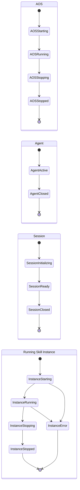
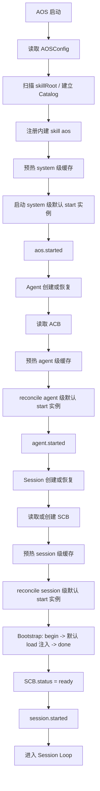
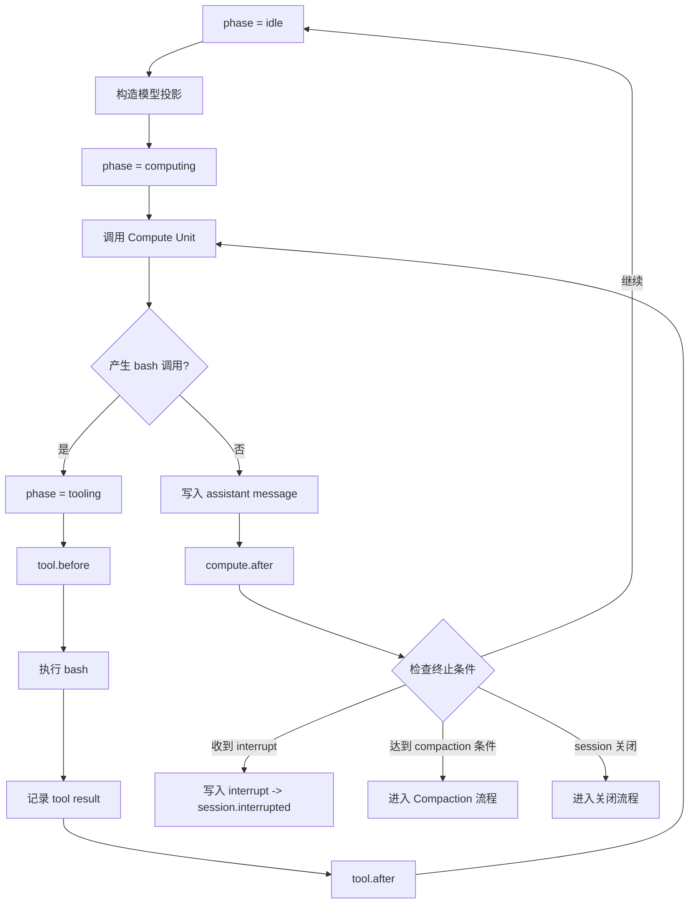

# Agent OS Charter v0.70

## 第一章：总述

### 1.1 核心命题

Agent OS 不是面向硬件资源调度的传统操作系统，而是一个面向认知推进的认知操作系统。它关心的不是 CPU、内存或文件描述符，而是认知主体如何长期存在，会话如何被组织，skill 如何进入模型上下文或作为运行实例持续生效，以及这些过程如何被治理、压缩、恢复与回放。

它的边界也因此很清楚。shell、数据库、文件系统、cron、容器编排、通用进程管理，以及 HTTP、stdio、消息总线、浏览器 UI、移动端面板等 transport，都可以与 AOS 协作，但不属于 AOS 的本体。AOS 负责的范围，只限于把与认知推进直接相关的事实收束进统一的控制面与统一的运行轨迹里。

这份宪章既给出定义，也给出理由。定义用来约束实现，理由用来说明这些约束为什么成立、改动后会牵动什么。对 Agent OS 而言，知道一个结构是什么还不够，还必须知道它为什么这样存在。

### 1.2 五条总原则

后文所有数据结构与运行机制，都由这五条展开。它们不是附录式的口号，而是整套系统的前提。

1. AOS 是认知控制内核；凡系统控制，皆经 AOS Control Plane 完成。
2. 能力统一用 skill 表达；skill 可以被 load 进入上下文，可以被 start 实例化，也可以两者兼有。
3. 系统的默认状态和控制配置存储在 AOSConfig、ACB、SCB 中；会话的运行轨迹存储在 trace 中。
4. 运行实例由生命周期驱动；hooks 是生命周期上的正式介入点。
5. AI 侧的现实交互，默认通过 bash 进入。

## 第二章：四层本体

### 2.1 Compute Unit

Compute Unit 是算元。它可以是 LLM，也可以在未来替换为别的推理单元、规则系统、搜索器或模拟器。它的职责只有一个：读取当前上下文投影，计算下一步动作。它不保存系统状态，也不直接改写控制结构。

在 Agent OS 中，Compute Unit 默认只有一个正式工具：`bash`。

这个选择不是为了极简而极简，而是为了治理收缩。现实世界已经拥有成熟、稳定、极其丰富的 CLI 生态。如果再额外内建一长串原生工具，能力面就会持续膨胀，最终变成一个没有边界的工具集市。把 `bash` 作为唯一正式工具，可以把世界的复杂性留给现有 CLI 生态，把系统控制的复杂性收回到 AOS Control Plane 本身。AI 访问现实世界的入口保持单一，控制面的治理边界也不会被原生工具持续侵蚀。

在 Compute Unit 与宿主之间，信息交换统一收束为字符串；结构化数据也只以 JSON 字符串的形式进入或离开 CU。AOS 的内部结构当然可以强类型化，但面向 CU 的接口保持 string-in / string-out。这一点既是实现约束，也是系统风格的一部分。

### 2.2 Agent

Agent 是长期存在的认知主体。它持有的不是某一次事务的全部正文，而是这个主体在多次事务之间保持稳定的东西：身份、边界、默认配置、权限，以及可跨事务持续生效的能力安排。

同一个 Agent 可以拥有多个 Session。主体与事务由此被明确拆开：Agent 回答的是"是谁在行动、默认如何行动、拥有哪些长期能力"；Session 回答的则是"这一次具体发生了什么"。主体可以长期存在，事务则可以不断开启、关闭、压缩、恢复，而不会把两者混成一个对象。

因此，Agent 不保存任何具体会话的正文历史。跨 Session 的连续性，并不是把旧会话全文塞回 Agent 本体，而是把真正需要跨事务延续的内容沉淀为主体级配置或长期记忆类 skill；原始历史则继续保存在各自 Session 的 `trace` 中，供审计、恢复与必要时的回放使用。

### 2.3 Session

Session 是具体事务单元。一次任务、一条工作线程、一笔业务处理、一次模拟进程，都属于一个 Session。

在 Agent OS 中，真正推进业务的是 Session。某次事务中实际发生的用户输入、模型输出、工具调用、显式 skill load、compaction 与中断，都属于 Session 的责任域，并进入该 Session 的 `trace`。`trace` 保存的是这次事务的完整运行轨迹；它不是主体记忆的替身，而是事务历史本身。

同一个 Agent 之下可以并发存在多个 Session。它们共享同一主体的身份、边界与默认配置，但拥有各自独立的运行轨迹、运行相位与恢复边界。需要跨 Session 取回长期信息时，应通过主体级能力来完成，而不是把多个 Session 重新拼成一个大对话。

### 2.4 Skill

Skill 是唯一能力抽象。

任何可以被 Agent 借来推进事务的东西，在 Agent OS 中都必须表达为 skill。领域知识说明是 skill，工作指南是 skill，可被按需读入的长说明书是 skill，带有运行入口、能够注册 hooks 的运行扩展也是 skill。系统不把 plugin、guide、workflow module、sidecar 拆成多套平行本体。它们都只是 skill 的不同存在方式。

这不是为了语言上的统一癖，而是为了避免能力模型持续碎片化。只要世界里仍同时存在四五种并列的能力概念，读者与实现者就必须不断追问它们的关系、边界与层级。把能力统一收束为 skill，正是为了消除这类不必要的本体噪音。

这四层共同构成 Agent OS 的最小世界模型：能计算的、能存在的、能推进的、能表达能力的。本宪章在这四层之外不引入更多本体。一切看起来需要新对象的场景，都应当首先追问它能否被这四层吸收；如果真的不能，那才是值得修订宪章的时刻。

## 第三章：核心数据结构

本章只讨论应被持久化、应被恢复、应被当作系统依据的结构。运行时缓存、hook 注册表、running skill instance 与 phase 不属于本章，它们将在第五章讨论。

### 3.1 控制块与运行轨迹

Agent OS 的静态结构分成两部分：控制块与运行轨迹。

控制块负责保存默认状态与治理边界。它回答的是"系统、主体或会话现在默认应如何工作"。

运行轨迹负责保存已经发生过的事实。对 Session 来说，这条运行轨迹就是 `trace`。

之所以必须分开，是因为"默认应该怎样"和"实际发生过什么"不是同一件事。某个 Session 中曾显式执行过 `aos skill load memory`，这是历史事实，应进入 `trace`；但它不因此成为该 Agent 的默认配置，更不应该反向写回 `ACB`。反过来，某个 Agent 的默认 skill 配置发生变化，会影响未来的 bootstrap 与实例治理，但不会回改过去已经发生的会话历史。

控制块也不负责描述模型此刻"脑中还剩下什么"。显式 `load` 只是一次会话内的受控文本取回，它写入 `trace`，之后可能被 compaction 压缩，也可能在后续上下文中不再保留；如果模型仍然需要它，应再次 `load`。控制块只回答默认行为，不回答模型当下记住了什么。

### 3.2 Skill 的静态结构

AOS 与 skill 直接相关的静态数据结构只有几项，而且分属两层：一层来自 `skillRoot` 中的 skill 文件，一层来自控制块中的默认配置。为对齐普遍的开源社区实现，AOS 只允许一个 `skillRoot`；系统启动时扫描这个根目录，得到全局的 skill 发现结果。

```typescript
type Scope = 'system' | 'agent' | 'session';

interface SkillManifest {
  name: string; // skill 名；在整个 AOS 实例内唯一
  description: string; // 给 Compute Unit 看的简短说明
  aosPlugin?: string; // 由磁盘上的 metadata.aos-plugin 解析而来
}

interface SkillCatalogEntry {
  name: string;
  description: string;
}

type SkillCatalog = SkillCatalogEntry[];
```

`SkillManifest` 是 AOS 抽取并归一化后的内部结构。AOS 对 skill 的静态语义只读取三项：`name`、`description` 与 `metadata.aos-plugin`。磁盘上可以存在更多 frontmatter，但它们对 AOS 不构成系统语义。

`SkillCatalogEntry` 与 `SkillCatalog` 属于发现视图，只保留 `name` 与 `description`。Compute Unit 并不直接接触这些对象；宿主只把由它们渲染出的 catalog 字符串交给 CU。`name` 在整个 AOS 实例内必须全局唯一。由于只允许一个 `skillRoot`，系统无需处理多 roots 下的重名冲突；`name` 同时必须符合官方 Agent Skills 的命名约束，并与目录名保持一致。保留名 `aos` 不得出现在 `skillRoot` 中，因为 `aos` 是宿主内建 skill，不参与普通发现流程。

这组发现结果来自文件系统扫描，而不是来自控制块。控制块中唯一的 skill 配置字段叫 `defaultSkills`。

```typescript
type DefaultSkillSwitch = 'enable' | 'disable';

interface DefaultSkillEntry {
  name: string;
  load?: DefaultSkillSwitch;
  start?: DefaultSkillSwitch;
}
```

`DefaultSkillEntry` 表示某一层控制块中的默认 skill 条目。它只保存默认行为：当某个作用域启动或重建上下文时，哪些 skill 应默认参与 `load`，哪些 skill 应默认参与 `start`。`load` 与 `start` 都是可选字段；一旦出现，只取 `"enable" | "disable"` 两值。字段缺失不表示第三个布尔值，而表示当前层对这一维度不作声明。会话中临时显式 `load` 过哪些 skill，属于历史事实，只进入 `trace`，不回写控制块。

约束如下：

- `load: "enable"` 表示该 skill 在默认上下文重建时应被注入。
- `start: "enable"` 表示该 skill 在所属作用域生命周期起点应被启动为运行实例。
- `"disable"` 是显式否决；字段缺失表示本层不声明该维度。
- 二者相互独立，不存在隐式联动。
- 同一控制块内，不得出现同名重复条目。

### 3.3 AOSConfig、ACB 与 SCB

系统级控制信息由 `AOSConfig` 表示：

```typescript
type PermissionPolicy = Record<string, unknown>;

interface AOSConfig {
  schemaVersion: 'aos/v0.70';
  name: string;
  skillRoot: string;

  revision: number;
  createdAt: string; // RFC3339 UTC
  updatedAt: string; // RFC3339 UTC

  defaultSkills?: DefaultSkillEntry[];
  permissions?: PermissionPolicy;
}
```

`AOSConfig` 保存 system 级控制信息。`permissions` 的内部语法在本文中有意不被固定。权限模型当然重要，但当前宪章的主轴仍是 skill、trace 与运行时治理。在权限模型尚未经过实现反复验证之前就冻结其内部 grammar，只会让宪章频繁修订。本文只固定三件事：权限字段必须存在固定位置；权限字段参与 system → agent → session 的继承解析；权限判断必须由 AOS Control Plane 负责，而不是由运行中的 skill 自行解释。

主体级控制信息由 `ACB` 表示：

```typescript
interface ACB {
  agentId: string;
  status: 'active' | 'closed';
  displayName?: string;

  revision: number;
  createdBy: string; // "human" | agentId
  createdAt: string;
  updatedAt: string;
  closedAt?: string;

  defaultSkills?: DefaultSkillEntry[];
  permissions?: PermissionPolicy;
}
```

`ACB` 是 Agent 的主体控制块，只保存 Agent 自身的主体控制信息。它不把下属 Session 的 id 集合写回自身，因为 Agent 与 Session 的一对多关系本质上属于 Session 侧事实：Session 被创建、关闭、归档、恢复时，首先变化的是对应 `SCB`，归属也因此由 `SCB.agentId` 单向确定。控制面上的 `session.list({ agentId })` 必须以这条单向归属为基础提供高效查询；无论实现使用数据库索引、分区存储还是派生视图，都不应再把 session id 列表回写进 `ACB` 形成第二份关系表。

会话级控制信息由 `SCB` 表示：

```typescript
interface SCB {
  sessionId: string;
  agentId: string;
  status: 'initializing' | 'ready' | 'closed';
  title?: string;

  revision: number;
  createdBy: string; // "human" | agentId
  createdAt: string;
  updatedAt: string;
  closedAt?: string;

  defaultSkills?: DefaultSkillEntry[];
  permissions?: PermissionPolicy;

  trace: AOSTraceMessage[];
}
```

`SCB` 是 Session 的控制块，同时持有该 Session 的 `trace`。它保存的是这次事务的持久控制信息与完整运行轨迹，因此 `status` 只回答一个问题：这个 Session 在生命周期上是否仍处于建立中、已经可继续推进、或已经结束。于是，`status` 收束为 `initializing | ready | closed`。`initializing` 表示 SCB 已建立但 bootstrap 尚未完成；`ready` 表示 bootstrap 已完成、Session 已进入可继续推进的常态；`closed` 表示 Session 已终止。

这也意味着，`status` 不承担记录所有运行失败的职责。某个 running skill instance 崩溃，首先体现在实例状态；某次计算或工具调用失败，首先体现在该次事务写入的 trace 事实；读取或恢复时发现持久化内容损坏，则应由控制面直接暴露为数据完整性错误，而不是再发明一个混杂了生命周期与故障来源的大枚举。把这些失败都压进 `SCB.status`，只会把生命周期、运行阶段与故障归属混成一个字段。三态状态轴的价值，恰恰在于让恢复逻辑保持清楚：若进程在 bootstrap 过程中崩溃，`SCB` 仍停留在 `initializing`，系统便知道该补完 bootstrap；若它已处于 `ready`，则说明生命周期上已经成立，后续运行中的成功、失败、中断与重试，应由别的层次来表达。

### 3.4 Trace 消息模型

控制块交代完毕，接下来看运行轨迹。

trace 在 Session 层面是运行轨迹，不是 prompt 缓存；Compute Unit 收到的 prompt，正是从这条轨迹投影而来。二者分工清晰：trace 负责历史存储，prompt 负责当次呈现。

v0.70 将 trace 明确对齐到 AI SDK 的 `UIMessage[]` 风格。AI SDK 把 `UIMessage` 定义为应用状态的 source of truth，顶层角色只有 `system | user | assistant`，并允许在 `metadata` 与 `data-*` parts 中承载自定义语义。AOS 的全部扩展，都必须优先通过这两个位置表达，不得随意改写 message 顶层骨架。

```typescript
import type { UIMessage } from 'ai';

type Origin = 'human' | 'assistant' | 'aos';

interface AOSMessageMetadata {
  seq: number; // session 内严格单调递增，从 1 开始
  createdAt: string; // RFC3339 UTC
  origin: Origin; // 真实来源，不等于 UIMessage.role
}

interface AOSDataParts {
  'skill-load': {
    cause: 'bootstrap' | 'reinject';
    scope: Scope;
    name: string;
    text: string;
  };
  compaction: {
    fromSeq: number;
    toSeq: number;
    text: string;
  };
  interrupt: {
    reason: string;
    payload?: unknown;
  };
  bootstrap: {
    phase: 'begin' | 'done';
    reason: 'create' | 'recover';
    plannedNames: string[];
  };
}

interface AOSTools {
  bash: {
    input: {
      command: string;
      cwd?: string;
      timeoutMs?: number;
    };
    output: {
      exitCode: number;
      stdout: string;
      stderr: string;
    };
  };
}

type AOSTraceMessage = UIMessage<AOSMessageMetadata, AOSDataParts, AOSTools>;
```

`UIMessage` 顶层 role 保持 `system | user | assistant`。但真实来源不止三种。为避免系统自身写入的消息与用户输入混淆，AOS 引入 `metadata.origin`。

| 消息类型                                              | `role`        | `origin`      |
| ----------------------------------------------------- | ------------- | ------------- |
| 用户输入                                              | `"user"`      | `"human"`     |
| 模型输出与 bash 工具活动                              | `"assistant"` | `"assistant"` |
| AOS 默认注入、compaction、interrupt、bootstrap marker | `"user"`      | `"aos"`       |

`role` 服务于模型投影，`origin` 标记消息的真实来源。AOS 自身写入的内容对模型而言确实属于应被看到的输入，但必须保留“不是用户说的”这一事实。

## 第四章：Skill 体系及其扩展

### 4.1 Skill 的统一语义

在 Agent OS 中，skill 不是众多能力对象中的一种，而是唯一的能力抽象。任何可以被 Agent 借来推进事务的东西，都必须最终归入 skill 的语义之下。

这样定义的目的，不是把不同事物强行起成同一个名字，而是为系统建立稳定的能力边界。只要 guide、plugin、workflow module、sidecar 之类的概念继续并列存在，读者和实现者就必须不断追问：它们是否可以相互替代，谁依附于谁，谁高于谁，谁才是真正被系统治理的对象。skill 的统一语义，就是为了把这种歧义消掉。

因此，本章讨论的不是某个新本体，而是第二章里 skill 这一层在系统中的展开方式。后文无论提到 instruction text、运行入口、默认 load、默认 start，谈论的都还是同一个 skill，只是时间语义和消费方式不同。

### 4.2 Skill 的三种形态

虽然本体上只有 skill，但 skill 在系统中的存在方式并不只有一种。它至少有三种形态。

**Skill package：** 静态文件夹，包含 `SKILL.md` 以及可能附带的脚本、参考资料、资源文件。

**Skill text：** 当一个 skill 被 load 时，它的 `SKILL.md` 正文进入会话上下文，并以 trace message 的形式落账。

**Running skill instance：** 当一个 skill 被 start 时，系统会根据 `SkillManifest.aosPlugin` 指向的运行入口，创建一个隶属于 system、agent 或 session 的运行实例。

plugin 不是和 skill 并列的新对象，它只是 skill 包中的一个可选部分。没有 `aosPlugin` 的 skill 仍然是完整的 skill，只是它只有 `load` 语义，没有 `start` 语义。

这三种形态不是三个本体，而是同一个 skill 在不同时间语义下的三种存在方式。下表展示了三种典型形态：

| skill       | load  | start | 含义                                                                                    |
| ----------- | ----- | ----- | --------------------------------------------------------------------------------------- |
| `profile`   | true  | false | 只注入 instruction text，提供角色设定与偏好                                             |
| `memory`    | true  | true  | 既注入 instruction text，又把分散在各 Session 中的历史沉淀为可跨 session 检索的长期记忆 |
| `telemetry` | false | true  | 不进 prompt，只作为运行实例订阅 hooks 做监测                                            |

### 4.3 Skill 包结构与 Manifest 归一化

一个最小 skill 包的目录结构如下：

```
<skillRoot>/<name>/
+-- SKILL.md
+-- scripts/
+-- references/
+-- assets/
```

`SKILL.md` 是 skill 的最小入口，也是 Compute Unit 真正会被注入的正文说明书。磁盘上的 frontmatter 可以带有各种字段，但 AOS 解析时只抽取 `name`、`description` 与 `metadata.aos-plugin` 三项语义，并归一化为第三章定义的 `SkillManifest`。其余 frontmatter 字段无论是写给人类读者、别的宿主，还是将来的兼容用途，对 AOS 都没有系统语义。示例：

```yaml
name: memory
description: >-
  为当前 agent 提供长期记忆能力。
  WHEN 需要跨 session 回忆事实、偏好或状态时 USE 本 skill。
metadata:
  aos-plugin: runtime.ts

# Memory Skill

这里写给 Compute Unit 的说明：
- 什么时候应当依赖长期记忆
- bash 下如何查询记忆
- 检索失败时如何降级
```

磁盘格式中的运行入口固定写在 `metadata.aos-plugin`。AOS 解析后把它归一化为 `aosPlugin`。也正是借助这个扩展点，传统 skill 才从纯 instruction package 被扩展为既可 `load` 又可 `start` 的能力单元。对外的唯一能力名词仍然是 skill。

### 4.4 Discover、Load 与 Start

AOS 只承认 skill 的三类核心动作。

**discover：** 系统扫描 `skillRoot`，建立 `SkillManifest` 并从中投影出 `SkillCatalog`。Compute Unit 只看到渲染出的 catalog 字符串，据此判断是否需要加载某个 skill。这一层对应官方 Skills 的 progressive disclosure 模型中 Level 1（metadata always loaded）。

**load：** 把 skill 的 `SKILL.md` 完整正文带入模型上下文。对应 progressive disclosure 的 Level 2（instructions loaded on trigger）。显式 load 通过 bash 调 `aos skill load <name>`；默认 load 由系统在上下文重建时自动注入。无论哪种方式，结果都落入 trace。

**start：** 根据 `aosPlugin` 创建运行中的 skill 实例。该实例可以注册 hooks、响应事件、通过 AOS SDK 与控制面交互。

这三个动词必须被严格区分。discover 只回答“系统里有哪些 skill”；load 只回答“某段 skill 文本是否进入了会话上下文”；start 只回答“某个 skill 是否在某个作用域中拥有运行实例”。

load 与 start 都是 skill 的行为，但它们消费的是两套不同的系统机制。load 进入的是会话上下文，因此它随着上下文的建立、压缩与重建而生效；start 启动的是运行实例，因此它跟随 system、agent、session 各自的生命周期边界生效。前者关心某段 instruction text 何时进入模型可见范围，后者关心某个 skill 是否在某个作用域中持续存活。更具体的触发时机与执行顺序，放到第六章统一展开。

### 4.5 作用域与内建 Skill

明确了 discover、load 与 start 的语义之后，还有两个问题尚待回答：同一个 skill 究竟在哪个作用域中被消费，以及哪些能力不来自普通 `skillRoot`。

Skill 包本身不携带固定作用域。同一个 `memory` skill 可能被 system 级默认 start，也可能被某个 agent 默认 load，还可能在某个 session 中被显式 load。作用域来自它被谁消费，而不来自 skill 包自身。

`aos` 是宿主内建 skill，不来自 `skillRoot`，也不由用户提供。它必须被视为一个永远存在的 system 级默认 load skill。原因很直接：既然 Compute Unit 默认只拥有 bash，它就必须被教会如何通过 bash 使用 AOS Control Plane。`aos` skill 正是这份说明书。因此，每个 session 的 bootstrap 与每次 post-compaction reinjection，都必须重新注入 `aos` skill 的文本。

## 第五章：生命周期与运行时结构

### 5.1 生命周期、阶段与状态轴

从这一章开始，文中正式使用四个术语。

**生命周期（lifecycle）：** 对象沿时间展开的状态轴。回答“它何时开始、何时结束、处于哪种持久状态”。

**事件（event）：** 运行过程中发生的事实。回答“刚才发生了什么”。

**钩子（hook）：** 系统在某个事件点上暴露出的正式扩展插槽。回答“哪里允许运行中的 skill 实例介入”。

**阶段（phase）：** 对象在运行中的瞬时相位。回答“此刻正在干什么”。

这四者的关系是：生命周期是时间主轴，事件是主轴上的事实，钩子是事实发生时允许介入的插槽，阶段是运行中的瞬时局部状态。生命周期不是 hooks；但 hooks 依附于生命周期。

Agent OS 中有四条核心生命周期状态轴。



Session 层面必须继续把生命周期、实时活动与运行失败拆开来看。`status` 回答的是这个 Session 在生命周期上是否已经成立、是否仍可继续推进；`phase` 回答的则是它此刻正在做什么。因此，Session 的实时活动不由 `status` 表达，而由 `phase` 表达。

```typescript
type SessionPhase =
  | 'bootstrapping'
  | 'idle'
  | 'computing'
  | 'tooling'
  | 'compacting'
  | 'interrupted';

interface SessionRuntime {
  sessionId: string;
  phase: SessionPhase;
  lastSeq: number;
}
```

这样，`status` 与 `phase` 构成两个正交维度：前者描述生命周期中的持久状态，后者描述当前的瞬时相位。同一个 Session 可以同时是 `ready` 且正处于 `computing`。

运行失败同样不应被直接塞回 `status`。running skill instance 崩溃，归实例状态轴；某轮 compute、tool 或 compaction 失败，归该轮事务写下的 trace 事实、`session.error` hook 与控制面返回；恢复时发现持久化内容损坏，归数据完整性错误。`ready` 因而只表示这个 Session 已完成 bootstrap 并处于可被继续推进的生命周期中，不表示最近一次运行一定成功，也不表示所有运行实例此刻都健康无故障。

### 5.2 运行时派生结构

时间轴之外，系统还需要一组只存在于运行中的派生结构。它们不写回控制块，却决定着运行时如何被高效取用、如何持续存活，以及如何与控制面发生受约束的交互。

为避免 skill 子系统在高并发下成为瓶颈，AOS 承认三类运行时缓存，并对其使用方式加以约束。

```typescript
interface SkillTextCacheEntry {
  scope: Scope;
  ownerId: string; // "aos" | agentId | sessionId
  name: string;
  text: string;
}

interface SkillRuntimeCacheEntry {
  name: string;
  moduleRef: unknown;
}

interface SkillDiscoveryCache {
  scannedAt: string;
  manifests: Record<string, SkillManifest>;
}
```

- `SkillDiscoveryCache` 必须存在，它保存从 `skillRoot` 扫描并解析出的 `SkillManifest`；`SkillCatalog` 与最终交给 Compute Unit 的 catalog 文本都从这里投影出来。
- 默认 `load: "enable"` 的 skill 至少应按所属 scope 预热到对应文本缓存中。
- 默认 `start: "enable"` 的 skill 至少应预热运行入口缓存。
- 非默认 skill 可按需装入并缓存。
- 实现不得在每次 compute 前全盘扫描文件系统。

这些缓存都是运行态派生结构，不写回控制块。

系统按 scope 分层持有各自的默认 skill 文本缓存。这保证了在上下文中执行默认注入时，系统能按来源作用域就近取出 instruction text，而无需反复拼读底层文件系统。

热重载遵循“只改变未来、不追溯过去”的原则，具体体现在以下几条规则中：

- `SKILL.md` 变化：刷新对应 `SkillManifest`，并失效相关 scope 下的文本缓存条目。
- 文件中的 `metadata.aos-plugin` 解析结果变化：失效对应运行入口缓存条目。
- 既有 trace message 不可被重写。
- 已经运行中的 skill 实例不自动热替换；它们继续使用启动时装入的运行模块，直到作用域结束或显式停止。
- 新的显式 load、未来的 bootstrap reinjection、以及未来的实例启动，才会使用新版本。

这条规则是系统可回放性的前提。如果文件变化一发生就追溯性地改变历史 trace 或偷偷热替换运行实例，那么“过去实际发生过什么”就不再有稳定答案。

真正活着的不是 skill 包，而是实例。skill 包是静态的；实例才有生命周期、hook 注册表与错误状态。

```typescript
type SkillInstanceState =
  | 'starting'
  | 'running'
  | 'stopping'
  | 'stopped'
  | 'error';

interface RunningSkillInstance {
  instanceId: string; // `${scope}:${ownerId}:${name}`
  name: string;
  scope: Scope;
  ownerId: string; // "aos" | agentId | sessionId
  state: SkillInstanceState;
  startedAt: string;
  hooks: HookName[];
  lastError?: string;
}
```

### 5.3 运行入口与受限 AosSDK

实例一旦成立，还需要一个运行入口把它接到控制面上。也正因为如此，运行入口约定不是 skill 包的附录，而是运行时结构的一部分。运行入口遵循 OpenCode 风格的 JS/TS 模块约定：

```typescript
type SkillRuntimeInit = (
  ctx: SkillRuntimeContext,
) => Promise<Partial<SkillHookTable>>;

interface SkillRuntimeContext {
  scope: Scope;
  ownerId: string; // "aos" | agentId | sessionId
  skillName: string;
  agentId?: string; // scope 为 "agent" | "session" 时存在
  sessionId?: string; // scope 为 "session" 时存在
  aos: AosSDK; // 受 scope 约束的 AOS SDK 实例
}

type SkillHookTable = {
  [K in HookName]: (payload: HookPayloadMap[K]) => Promise<void>;
};
```

这里的 `ctx.aos` 在语义上与公共 `AosSDK` 同构，但在实际暴露时必须按 scope 与策略裁剪。运行中的 skill 实例拿到的是同一控制面的受限客户端，而不是无条件拥有全部操作的万能句柄。

与 OpenCode 的关键区别值得说明。OpenCode 向 plugin 交出 `{ project, client, $, directory, worktree }`，包括完整的 SDK 客户端与 Bun Shell 直接执行能力。AOS 刻意收窄为 `{ scope, ownerId, skillName, aos }`。`SkillRuntimeContext` 不暴露 AOSConfig、ACB 或 SCB 原始对象，也不提供直接执行 shell 的能力；运行中的 skill 实例只能通过 `AosSDK` 与控制面交互。收窄的理由是治理统一：如果 skill 实例可以绕过控制面直接修改系统本体，那么“凡系统控制，皆经 AOS Control Plane 完成”就成了空话。

### 5.4 Hook 模型与分发规则

当实例开始存活之后，系统还必须说明它们可以在哪些事件点介入，以及这种介入如何被约束和分发。AOS 采用事件中心命名：只描述“发生了什么”，不描述“谁在听”。为保证实现确定性，hook 的名称与 payload 一起固定如下：

```typescript
type HookName =
  | 'aos.started'
  | 'aos.stopping'
  | 'agent.started'
  | 'agent.closed'
  | 'session.started'
  | 'session.closed'
  | 'session.bootstrap.before'
  | 'session.bootstrap.after'
  | 'session.reinject.before'
  | 'session.reinject.after'
  | 'compute.before'
  | 'compute.after'
  | 'tool.before'
  | 'tool.after'
  | 'session.compaction.before'
  | 'session.compaction.after'
  | 'session.error'
  | 'session.interrupted';

interface HookPayloadMap {
  'aos.started': {
    cause: 'boot' | 'recover';
    timestamp: string;
    catalogSize: number;
  };
  'aos.stopping': {
    reason: 'shutdown' | 'restart';
    timestamp: string;
  };

  'agent.started': {
    agentId: string;
    cause: 'create' | 'recover';
    timestamp: string;
  };
  'agent.closed': {
    agentId: string;
    timestamp: string;
  };

  'session.started': {
    agentId: string;
    sessionId: string;
    cause: 'create' | 'recover';
    timestamp: string;
  };
  'session.closed': {
    agentId: string;
    sessionId: string;
    timestamp: string;
  };

  'session.bootstrap.before': {
    agentId: string;
    sessionId: string;
    reason: 'create' | 'recover';
    timestamp: string;
    plannedNames: string[];
  };
  'session.bootstrap.after': {
    agentId: string;
    sessionId: string;
    reason: 'create' | 'recover';
    timestamp: string;
    injectedSeqRange: { fromSeq: number; toSeq: number } | null;
    injectedNames: string[];
  };

  'session.reinject.before': {
    agentId: string;
    sessionId: string;
    timestamp: string;
    plannedNames: string[];
  };
  'session.reinject.after': {
    agentId: string;
    sessionId: string;
    timestamp: string;
    injectedSeqRange: { fromSeq: number; toSeq: number } | null;
    injectedNames: string[];
  };

  'compute.before': {
    agentId: string;
    sessionId: string;
    timestamp: string;
    lastSeq: number;
  };
  'compute.after': {
    agentId: string;
    sessionId: string;
    timestamp: string;
    appendedMessageCount: number;
  };

  'tool.before': {
    agentId: string;
    sessionId: string;
    timestamp: string;
    toolName: 'bash';
    toolCallId: string;
    args: AOSTools['bash']['input'];
  };
  'tool.after': {
    agentId: string;
    sessionId: string;
    timestamp: string;
    toolName: 'bash';
    toolCallId: string;
    result: AOSTools['bash']['output'];
  };

  'session.compaction.before': {
    agentId: string;
    sessionId: string;
    timestamp: string;
    fromSeq: number;
    toSeq: number;
  };
  'session.compaction.after': {
    agentId: string;
    sessionId: string;
    timestamp: string;
    fromSeq: number;
    toSeq: number;
    compactionSeq: number;
  };

  'session.error': {
    agentId: string;
    sessionId: string;
    timestamp: string;
    source:
      | 'compute'
      | 'tool'
      | 'skill-instance'
      | 'compaction'
      | 'recovery'
      | 'storage';
    recoverable: boolean;
    message: string;
  };

  'session.interrupted': {
    agentId: string;
    sessionId: string;
    timestamp: string;
    reason: string;
  };
}
```

bootstrap 与 reinject 的区别需要明确：`session.bootstrap.*` 只在 Session 创建或恢复时触发一次，紧接着会触发 `session.started`；`session.reinject.*` 只在 compaction 之后的默认 load 重注入时触发，不会触发 `session.started`。前者属于 session 生命周期的起点，后者属于会话维护中的上下文重建。生命周期只开始一次，但上下文可以被重建多次。

在名称与载荷固定之后，还需要固定谁能注册这些 hooks，以及它们按什么顺序分发。作用域不同，允许注册的 hooks 也不同。

| 作用域  | 可注册 hooks                                  |
| ------- | --------------------------------------------- |
| system  | 全部                                          |
| agent   | `agent.*`、`session.*`、`compute.*`、`tool.*` |
| session | `session.*`、`compute.*`、`tool.*`            |

越权注册必须失败。

默认分发顺序由 hook 的语义决定：前置 hooks 承担约束与拦截职责，上层应先于下层发言；后置 hooks 承担消费结果与善后职责，由最近层先处理，再逐层向外扩散。

- `*.before`：system → agent → session
- `*.after`：session → agent → system
- 通知型 hooks（`session.started`、`session.error`、`session.interrupted`、`session.closed`、`agent.started`、`agent.closed`）：近层 → 远层
- `aos.*`：仅 system

## 第六章：启动、运行与恢复

### 6.1 启动链：AOS、Agent 与 Session



上图先给出总链，下面按 system、agent、session 三级把启动链展开。

AOS 启动时必须按固定顺序完成以下六步：

1. 读取 AOSConfig。
2. 扫描 `skillRoot`，建立 `SkillDiscoveryCache`，并从中投影 `SkillCatalog`。
3. 注册保留 skill `aos`。
4. 预热 system 级默认 `load` skill 的文本缓存。
5. 启动 system 级默认 `start` skill 实例。
6. 发出 `aos.started`。

为什么 system 级默认 `load` 在启动时只是预热缓存，而不是立刻注入 trace？因为此时系统还没有 session，trace 也无从谈起。它真正的消费点，是未来某个 session 的 bootstrap 或 post-compaction reinjection；届时注入正文来自 system scope 已经预热好的文本缓存。

Agent 创建或恢复时，启动链依次执行以下步骤：读取或创建 ACB；预热该 Agent 持有的默认 load skill 文本缓存；对该 Agent 中 `start: "enable"` 的条目做一次 reconcile，确保每个 `(scope="agent", ownerId=agentId, name)` 且被声明为默认启动的 skill 恰有一个运行实例；最后发出 `agent.started`。

Session 创建或恢复时，流程要更长一些，因为 bootstrap 本身也是其中的一部分：

1. 创建或读取 SCB；若新建，初始 `status = "initializing"`。
2. 预热该 Session 持有的默认 load skill 文本缓存。
3. 对该 Session 中 `start: "enable"` 的条目做一次 reconcile。
4. 进入 `bootstrapping` phase。
5. 向 trace 追加 `data-bootstrap { phase: "begin", reason }` 消息。
6. 发出 `session.bootstrap.before`。
7. 按默认 load 解析规则，从 system、agent、session 三层文本缓存取出正文，逐个向 trace 追加 `data-skill-load` 消息。
8. 向 trace 追加 `data-bootstrap { phase: "done", reason }` 消息。
9. 发出 `session.bootstrap.after`。
10. 将 `SCB.status` 置为 `ready`。
11. 发出 `session.started`。
12. phase 切换为 `idle`。

`session.bootstrap.before` 与 `session.bootstrap.after` 分别标志默认注入的开始与完成，属于 hook 语义；`data-bootstrap` begin/done marker 的职责则是为恢复协议提供轨迹记录。两者服务于不同目的，不能相互替代。

### 6.2 默认 Skill 的消费规则

启动链要解决的，不只是 system、agent、session 三层按序展开，还包括默认配置如何真正变成上下文注入与运行实例。

默认 `load` 只在两种时机发生：session bootstrap 与 post-compaction reinjection。其解析算法固定如下：

1. 取三层条目：`AOSConfig.defaultSkills`、`ACB.defaultSkills`、`SCB.defaultSkills`。
2. 只看 `load` 条目，忽略 `start`。
3. 按 system → agent → session 顺序解析同名冲突：
   - `load: "enable"` 覆盖当前结果为启用。
   - `load: "disable"` 覆盖当前结果为禁用。
   - `load` 缺失，不改变当前结果。
4. 最终仅保留解析后被判定为启用的 skill。
5. 对最终启用的每个 skill，按其生效来源作用域从 system、agent、session 对应文本缓存中取出正文；若缓存缺失，先补齐缓存，再继续注入。
6. 无论配置中是否写出，`aos` skill 都必须被追加到最终注入集里。
7. 按来源作用域排序注入：system → agent → session。
8. 每个 skill 一条消息，不做多 skill 合包。

这套算法真正重要的不是步骤本身，而是它所体现的区分：默认 `load` 是跨三层解析后、面向 session 上下文消费的；默认 `start` 则不做跨层覆盖，每层独立消费自己的条目。

显式 `load` 与默认 `load` 也必须区分。Compute Unit 通过 bash 调用 `aos skill load <name>` 时，AOS 返回结构化 JSON。这是一次普通 bash 工具调用，天然通过 tool result 落入 trace，因而自带版本化与审计属性。

```typescript
interface SkillLoadResult {
  name: string;
  text: string;
}
```

默认 `load` 则由 AOS 在 session bootstrap 或 post-compaction reinjection 时，直接向 trace 追加一条带有 `data-skill-load` part 的消息。默认 load 不经过 bash，因为它不是会话内的显式行动，而是控制块定义出的默认上下文重建行为。

### 6.3 Session Loop 与显式 Load

Session 进入运行阶段后，驱动事务推进的是 Session loop，而不是 Agent。此时系统面对的是一次次推进、一轮轮工具调用，以及在需要时对 skill 文本做按需取回。



loop 本身不直接改写控制块。一次推进无论成功、失败、中断还是进入 compaction，都会先把相应事务事实写入 trace，并在需要时发出 `session.error` 或 `session.interrupted`；之后它们才成为系统事实。

显式 `load` 属于 session 推进过程中的按需取回。当 Compute Unit 需要取回新指令时，它通过 bash 执行：

```
aos skill load <name>
```

返回值固定为 JSON `SkillLoadResult`。这条操作不修改控制块，其结果通过 tool result 自然进入 trace。正因如此，系统才得以避免“临时查阅的手册”与“未来的默认配置”混成一类状态。

### 6.4 上下文投影、Compaction 与 Reinject

trace 是运行轨迹，不是模型 prompt 本身。AOS 固定如下投影规则：

1. 取最近一条 `data-compaction` 消息；若存在，只保留该条 compaction 及其之后的 trace messages。
2. 将保留下来的 `AOSTraceMessage[]` 通过 `convertToModelMessages(...)` 转为模型侧消息。
3. 为 AOS 自定义 data parts 提供确定性的 `convertDataPart` 映射。

标准文本映射：

**`data-skill-load`：**

```
[[AOS-SKILL name=<name> scope=<scope>]]
<text>
```

**`data-compaction`：**

```
[[AOS-COMPACTION fromSeq=<fromSeq> toSeq=<toSeq>]]
<text>
```

**`data-interrupt`：**

```
[[AOS-INTERRUPT reason=<reason>]]
<canonical-json-payload-if-exists>
```

**`data-bootstrap`：** 不映射为模型可见文本；`convertDataPart` 返回 `undefined`。

运行轨迹保留语义化结构，模型侧只得到必要的文本投影，二者各司其职，不相互侵入。

compaction 是 Session 的内建维护原语，触发后按固定顺序执行：

1. `phase = "compacting"`。
2. 发出 `session.compaction.before`。
3. 计算覆盖区间：从上一条 compaction 的 `toSeq + 1` 开始，到当前最后一条消息结束。
4. 生成一条 `data-compaction` 消息追加到 trace。
5. 发出 `session.compaction.after`。
6. 执行 post-compaction reinject：
   - 发出 `session.reinject.before`。
   - 重新执行默认 load 解析算法，注入 `data-skill-load { cause: "reinject" }` 消息。
   - 发出 `session.reinject.after`。
7. `phase = "idle"`。

compaction 的结果必须以 trace message 落账，并携带 `data-compaction` part，以标记被压缩覆盖的历史区间。

interrupt 不是旁路，任何 interrupt 都必须以 trace message 落账，并携带 `data-interrupt` part。

bootstrap 过程本身也必须在 trace 中留下结构化标记，以支持崩溃恢复。AOS 在 bootstrap 开始前追加一条 `data-bootstrap { phase: "begin" }` 消息，在 bootstrap 完成后追加一条 `data-bootstrap { phase: "done" }` 消息。

compaction 只压缩历史并重注入默认 load skill，绝不重新启动任何 running skill instance。若 compaction 同时被视为“上下文重建”和“作用域重新开始”，system、agent 级 start skill 就会被错误地频繁重启，这与它们本应绑定的生命周期边界相悖。

### 6.5 关闭与崩溃恢复

关闭流程按作用域分三个层次，各自独立执行后再向上收拢。

Session 关闭时，依次停止该 Session 持有的全部运行 skill 实例，将 `SCB.status` 置为 `"closed"` 并写入 `closedAt`，然后发出 `session.closed`。

Agent 关闭时，依次停止该 Agent 持有的全部运行 skill 实例，将 `ACB.status` 置为 `"closed"` 并写入 `closedAt`，然后发出 `agent.closed`。

AOS 停止时，流程稍有不同：先发出 `aos.stopping`，再停止全部 system 级运行 skill 实例，释放运行态注册表与缓存引用，最后进入 `stopped`。

正常关闭描述的是如何有序结束一个在轨的运行过程；崩溃恢复面对的则是进程被意外打断后，系统如何凭借残留信息重新接回去。二者路径不同，但依赖的是同一组静态真相。

恢复只依赖三种静态真相：AOSConfig、ACB / SCB 与 trace。缓存、hook 注册表、运行实例与 phase 都是可重建的运行事实。

恢复的核心难点在于：若进程在 bootstrap 过程中崩溃，SCB 仍停留在 `initializing`，trace 中可能已部分写入。AOS 通过 bootstrap marker 实现幂等恢复。当 `SCB.status === "initializing"` 时，恢复逻辑先校验 trace 与 bootstrap marker 是否结构一致；若发现关键消息缺失、marker 自相矛盾或持久化内容无法解析，恢复必须直接失败，通过 `session.error { source: "recovery", recoverable: false }` 与控制面错误返回暴露出来，并保持 `SCB.status = "initializing"`，不得把一个无法恢复的 Session 伪装成 `ready`。在通过这一步校验之后，再按以下三种情形处理：

1. **没有 `begin` marker：** bootstrap 根本没开始。从头执行完整 bootstrap。
2. **有 `begin` 但没有 `done`：** bootstrap 中途崩溃。读取 `plannedNames`，检查 `begin` 之后已成功写入了哪些 `data-skill-load`，只补齐剩余条目，然后写入 `done` marker，将 status 置为 `ready`。
3. **有 `done` marker：** bootstrap 实际已完成，只是 status 还没来得及更新。直接将 status 置为 `ready`。

这一协议保证：无论崩溃发生在 bootstrap 的哪一步，恢复后 trace 中的默认注入集合都是完整且不重复的。

## 第七章：AOS 控制面

### 7.1 控制面的定位与客户端形态

AOS Control Plane 是 Agent OS 的正式控制接口。它定义统一的操作语义、参数结构与返回契约；CLI、SDK、HTTP/API 与 UI 都只是访问这组契约的不同方式。

这样定义之后，整条控制链就会变得清楚：AI 通过 `bash` 调用 CLI，人类在终端里使用 CLI，运行中的 skill 实例通过 `AosSDK` 访问控制面，前端与远程服务则通过 SDK 或 HTTP/API 接入。入口可以不同，控制语义只有一套。

| 客户端   | 使用方式                             | 典型使用者                   |
| -------- | ------------------------------------ | ---------------------------- |
| CLI      | `aos skill load memory`              | AI（通过 bash）、人类终端    |
| SDK      | `aos.skill.load({ name: "memory" })` | 运行中的 skill 实例、前端 UI |
| HTTP/API | 与 SDK 同构                          | 远程面板、自动化管道         |

三者操作的是同一个 AOS。

### 7.2 控制操作与类型契约

AOS 在规范层定义一组正式操作，并为每个操作固定 args 与 result 类型。

```typescript
interface SessionListArgs {
  agentId?: string;
  cursor?: string; // opaque cursor
  limit?: number;
}

interface SessionListResult {
  items: SCB[];
  nextCursor?: string;
}

interface ControlSchema {
  'skill.list': {
    args: {};
    result: SkillCatalog;
  };
  'skill.show': {
    args: { name: string };
    result: SkillManifest;
  };
  'skill.load': {
    args: { name: string };
    result: SkillLoadResult;
  };

  'skill.default.list': {
    args: { scope: Scope; ownerId?: string };
    result: DefaultSkillEntry[];
  };
  'skill.default.set': {
    args: { scope: Scope; ownerId?: string; entry: DefaultSkillEntry };
    result: { revision: number };
  };
  'skill.default.unset': {
    args: { scope: Scope; ownerId?: string; name: string };
    result: { revision: number };
  };

  'agent.list': {
    args: {};
    result: ACB[];
  };
  'agent.create': {
    args: { displayName?: string };
    result: ACB;
  };
  'agent.get': {
    args: { agentId: string };
    result: ACB;
  };
  'agent.close': {
    args: { agentId: string };
    result: { revision: number };
  };

  'session.list': {
    args: SessionListArgs;
    result: SessionListResult;
  };
  'session.create': {
    args: { agentId: string; title?: string };
    result: SCB;
  };
  'session.get': {
    args: { sessionId: string };
    result: SCB;
  };
  'session.append': {
    args: { sessionId: string; message: AOSTraceMessage };
    result: { revision: number };
  };
  'session.interrupt': {
    args: { sessionId: string; reason: string; payload?: unknown };
    result: { revision: number };
  };
  'session.compact': {
    args: { sessionId: string };
    result: { revision: number; compactionSeq: number };
  };
  'session.close': {
    args: { sessionId: string };
    result: { revision: number };
  };
}

type ControlOperation = keyof ControlSchema;
```

`ControlOperation` 描述的是控制面的语义操作；CLI 命令与 SDK 方法都只是这组操作的具体调用形式。例如 `aos skill load <name>` 与 `aos.skill.load({ name })`，对应的都是同一个 `skill.load`。

### 7.3 查询责任、修订规则与 JSON-only 响应

像 `session.list` 这样的关系查询，由控制面依据 `SCB.agentId` 提供。它的性能责任在查询层，而不在 `ACB` 中额外维护一份 `sessions[]`。因此，控制面必须对 `agentId` 提供可扩展的索引化查询，并以分页形式返回结果；是否通过数据库二级索引、KV 分区还是派生视图实现，是实现问题，不应再回写第二份归属真相。

所有改变控制块的操作都必须写回目标控制块，并同时完成三件事：`revision += 1`、更新 `updatedAt`、返回新的 `revision`。

AOS Control Plane 必须是 JSON-only：`stdout` 只输出一个 JSON 对象，不得混入解释性 prose，错误同样以 JSON 返回，CLI、SDK、HTTP 的语义保持一一对应。这样做不仅便于机器解析，更是为了把所有客户端约束在同一套控制事实之上。

```typescript
interface AosResponse<T> {
  ok: boolean;
  op: ControlOperation;
  revision?: number;
  data?: T;
  error?: {
    code: string;
    message: string;
    details?: unknown;
  };
}
```

### 7.4 SDK、CLI、环境与 live scope 生效时机

前两节固定的是控制操作本身；这一节只讨论这些操作如何被 SDK、CLI 与宿主环境消费，以及配置变更何时真正作用于 live scope。

公共 SDK 必须以具名方法暴露这些操作，并保持与 CLI 命令在语义和参数上的一一对应。

```typescript
interface AosSDK {
  skill: {
    list(): Promise<AosResponse<SkillCatalog>>;
    show(args: { name: string }): Promise<AosResponse<SkillManifest>>;
    load(args: { name: string }): Promise<AosResponse<SkillLoadResult>>;

    default: {
      list(args: {
        scope: Scope;
        ownerId?: string;
      }): Promise<AosResponse<DefaultSkillEntry[]>>;

      set(args: {
        scope: Scope;
        ownerId?: string;
        entry: DefaultSkillEntry;
      }): Promise<AosResponse<{ revision: number }>>;

      unset(args: {
        scope: Scope;
        ownerId?: string;
        name: string;
      }): Promise<AosResponse<{ revision: number }>>;
    };
  };

  agent: {
    list(): Promise<AosResponse<ACB[]>>;
    create(args: { displayName?: string }): Promise<AosResponse<ACB>>;
    get(args: { agentId: string }): Promise<AosResponse<ACB>>;
    close(args: {
      agentId: string;
    }): Promise<AosResponse<{ revision: number }>>;
  };

  session: {
    list(args: SessionListArgs): Promise<AosResponse<SessionListResult>>;
    create(args: {
      agentId: string;
      title?: string;
    }): Promise<AosResponse<SCB>>;
    get(args: { sessionId: string }): Promise<AosResponse<SCB>>;
    append(args: {
      sessionId: string;
      message: AOSTraceMessage;
    }): Promise<AosResponse<{ revision: number }>>;
    interrupt(args: {
      sessionId: string;
      reason: string;
      payload?: unknown;
    }): Promise<AosResponse<{ revision: number }>>;
    compact(args: {
      sessionId: string;
    }): Promise<AosResponse<{ revision: number; compactionSeq: number }>>;
    close(args: {
      sessionId: string;
    }): Promise<AosResponse<{ revision: number }>>;
  };
}
```

上述 SDK 接口定义描述的是完整公共 SDK 形状。运行中的 skill 实例拿到的 `ctx.aos` 必须是它的同构子集：命名、参数与返回结构保持一致，但可见操作会按 scope 与策略裁剪。

统一操作分发原语可以作为 SDK 内部实现或低层传输接口存在。公共 SDK 则应以具名方法暴露控制面；CLI、SDK、UI 在外观上保持各自自然，在底层共享同一套操作语义。

以下示例展示 CLI 命令与 SDK 方法的一一对应关系：

| CLI                                                        | SDK                                                                                    |
| ---------------------------------------------------------- | -------------------------------------------------------------------------------------- |
| `aos skill list`                                           | `aos.skill.list()`                                                                     |
| `aos skill show memory`                                    | `aos.skill.show({ name: "memory" })`                                                   |
| `aos skill load memory`                                    | `aos.skill.load({ name: "memory" })`                                                   |
| `aos skill default set memory --load enable --scope agent` | `aos.skill.default.set({ scope: "agent", entry: { name: "memory", load: "enable" } })` |
| `aos agent create --display-name "Alice"`                  | `aos.agent.create({ displayName: "Alice" })`                                           |
| `aos session compact`                                      | `aos.session.compact({ sessionId })`                                                   |

宿主至少应注入 `AOS_AGENT_ID` 与 `AOS_SESSION_ID` 两个环境变量。它们只表示 CLI 命令的默认目标，不表示权限凭据。当 CLI 缺省 `agentId` 或 `sessionId` 参数时，读取这些环境变量；SDK 调用则必须显式传入。

接口形式定下之后，还有一个问题直接影响运行行为：默认 skill 配置被修改后，究竟何时作用于 live scope，何时只影响未来的启动或重建。

修改 `defaultSkills` 后，`load` 与 `start` 的作用时机并不相同。`load` 的变化不实时影响当前 session 的 prompt，但若修改命中了 live scope，AOS Control Plane 仍必须同步刷新该 scope 持有的默认 skill 文本缓存；这些变化只在未来的 bootstrap 或 post-compaction reinjection 中被消费。`start` 则不同——当 `skill.default.set` 或 `skill.default.unset` 作用于 live scope 且改变了 `start` 维度时，AOS Control Plane 必须在同一请求处理流程中同步触发一次 reconcile：该起的实例起起来，该停的实例停掉。这一责任不得被下放为未指定时序的后台循环。对于 non-live scope，只写控制块，不做 reconcile。

这个不对称不是漏洞，而是设计结果。`load` 对应上下文重建，`start` 对应实例生命周期，两者的消费时机本来就不相同。

## 第八章：系统边界

### 8.1 审计与恢复的边界

AOS 不审计宿主中发生的一切。trace 只记录四类事实：

1. 被模型看见的。
2. 由模型产生的。
3. 会改变未来模型可见上下文的。
4. 为恢复或解释上述事实所必需的系统标记。

因此：

| 事实                               | 是否进入 trace                        |
| ---------------------------------- | ------------------------------------- |
| 用户输入                           | 进入                                  |
| 模型输出                           | 进入                                  |
| bash 工具调用与结果                | 进入                                  |
| 显式 `aos skill load` 的 JSON 输出 | 通过 bash tool result 进入            |
| 默认 skill 注入                    | 进入（`data-skill-load`）             |
| compaction                         | 进入（`data-compaction`）             |
| interrupt                          | 进入（`data-interrupt`）              |
| bootstrap marker                   | 进入（`data-bootstrap`）              |
| 运行中 skill 实例的私有日志        | 不进入                                |
| 实例内部的 HTTP / shell 调用       | 不进入（除非通过 SDK 影响了 session） |
| 宿主层面的缓存命中 / 失效          | 不进入                                |

trace 的职责是记录会话的运行轨迹，不是替代宿主的全部运行日志系统。

恢复依赖的静态真相只有 AOSConfig、ACB / SCB 与 trace；运行态缓存、模块引用、hook 注册表与 session phase 都必须在恢复后重新构造。bootstrap 的幂等恢复协议已在第六章交代，这里不再重复展开。

### 8.2 边界案例与系统定义

有两个常见边界案例值得单独厘清：subagent 是否构成新本体，以及 bash 之外是否允许其他入口。

AOS 不把 subagent 当作第五本体。若一个 Agent 或一个人类通过 `agent.create` 创建了新的 ACB，那么产生的就是一个新的 Agent。它是否短命、是否只为子任务而生、是否由另一个 Agent 发起，都不改变它作为 Agent 的结构事实。创建来源通过 `ACB.createdBy` 记录——若由 Agent A 创建，则 `createdBy` 为 A 的 agentId；同时，创建动作本身也作为 tool-call / tool-result 留存在发起创建的 Session 的 trace 中。绝大多数“临时跑一个子任务”的场景，甚至不需要创建新 Agent；在同一个 Agent 下新建一个 Session 就够了。

这解决的是本体边界。与之并列的，还有系统入口边界。Compute Unit 默认通过 `bash` 与现实世界交互；人类可以通过 UI 面板操作系统，后台服务可以通过 SDK 或 HTTP/API 接入，运行中的 skill 实例则通过 `AosSDK` 访问同一个控制面。`bash` 的单工具约束只作用于 Compute Unit，它保证 AI 侧入口保持最小，同时让系统治理继续收束在统一的控制面上。

Agent OS 是一个管理认知主体、会话运行轨迹、skill 注入与 skill 运行实例的认知操作系统。其本体层由 Compute Unit、Agent、Session、Skill 四层构成，静态控制结构由 AOSConfig、ACB、SCB 承载。会话运行轨迹以 AI SDK 风格的 `UIMessage[]` 记录，`metadata` 与 `data-*` parts 承载 AOS 语义，`convertToModelMessages` 完成模型投影。skill 的两种行为——load 对应上下文注入，start 对应实例化启动——由生命周期驱动，hooks 是实例在事件点上介入的正式机制。整个系统以 AOS Control Plane 作为唯一正式治理面，CLI、SDK 与 UI 均作为其客户端存在。

全文最终收束回第一章提出的五条总原则：AOS 是认知控制内核，所有系统控制都经 AOS Control Plane 完成；能力统一用 skill 表达，可 load 为上下文，可 start 为实例；系统默认状态和控制配置在 AOSConfig、ACB、SCB 中，会话运行轨迹在 trace 中；运行实例由生命周期驱动，hooks 是正式介入点；AI 侧现实交互默认通过 bash 进入。

这五条既是架构边界，也是实现约束。它们不是后文的摘要，而是后文一切数据结构、运行机制与控制语义的前提。
