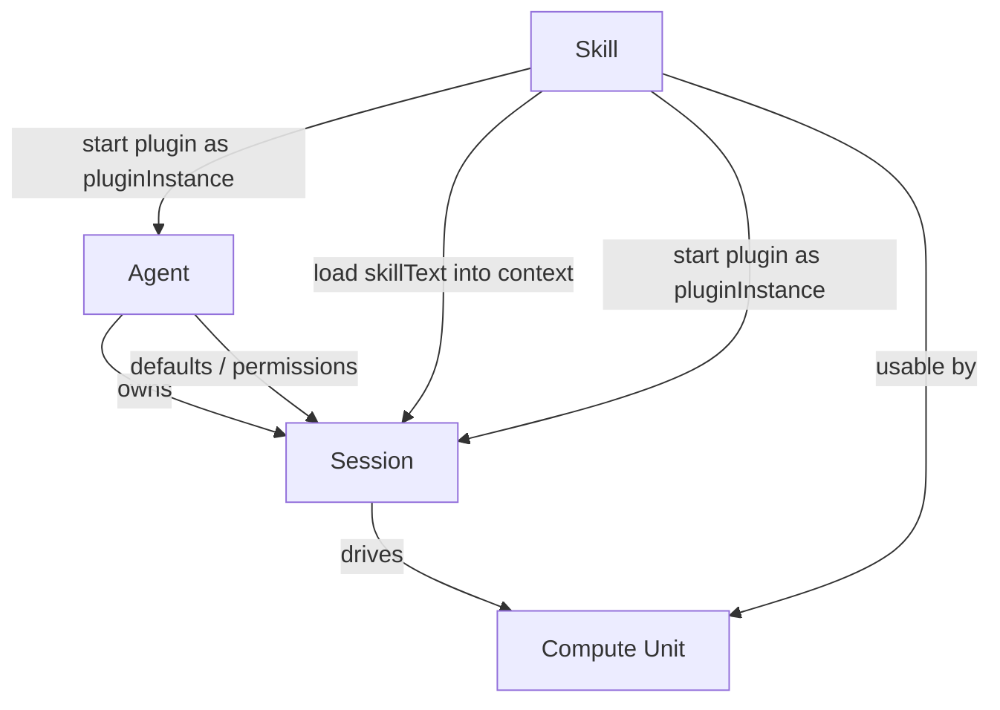
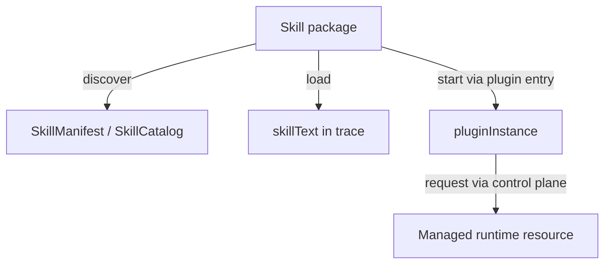
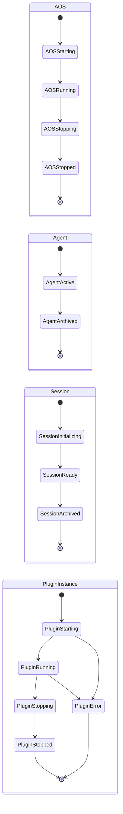
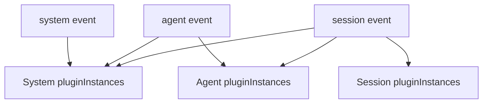
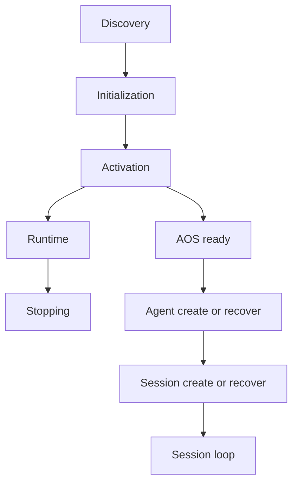
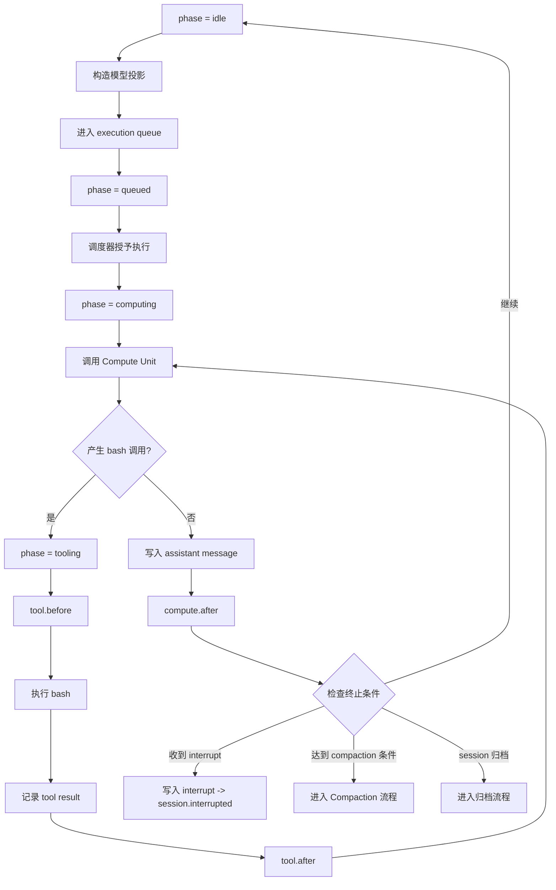

# Agent OS Charter v0.73

## 第一章：总述

### 1.1 核心命题

Agent OS 是一个面向认知推进的认知操作系统。它关心的核心问题有三：认知主体如何长期存在，会话如何被组织，以及 skill 如何进入模型上下文、或以运行实体的形式持续生效。

这套系统的边界因此很清楚。shell、数据库、文件系统、cron、容器编排、通用进程管理，以及 HTTP、stdio、消息总线、浏览器 UI、移动端面板等 transport，都可以与 AOS 协作，但不属于 AOS 的本体。AOS 的职责范围，只限于把与认知推进直接相关的事实收束进统一的控制面与统一的运行轨迹里。

这份宪章既给出定义，也给出理由。定义用来约束实现，理由用来说明这些约束为什么成立、改动后会牵动什么。对 Agent OS 而言，知道一个结构是什么还不够，还必须知道它为什么这样存在。

### 1.2 五条总原则

后文所有数据结构与运行机制，都由这五条展开。它们不是附录式的口号，而是整套系统的前提。

1. AOS 是认知控制内核；凡系统控制，皆经 AOS Control Plane 完成。
2. 能力统一用 skill 表达；skill 的文本面可以被 load 进入上下文，skill 的运行面可以被 start 为 pluginInstance。
3. 系统的默认状态和控制配置存储在 AOSConfig、ACB、SCB 中；会话的运行轨迹存储在 trace 中。
4. pluginInstance 由 owner 的生命周期驱动；hooks 是 pluginInstance 在生命周期上的正式介入点。
5. AI 侧的现实交互，默认通过 bash 进入。

## 第二章：四层本体

### 2.1 Compute Unit

Compute Unit 是算元。它可以是 LLM，也可以在未来替换为别的推理单元、规则系统、搜索器或模拟器。它的职责只有一个：读取当前上下文投影，计算下一步动作。它不保存系统状态，也不直接改写控制结构。

在 Agent OS 中，Compute Unit 默认只有一个正式工具：`bash`。

这个选择不是为了极简而极简，而是为了治理收缩。现实世界已经拥有成熟、稳定、极其丰富的 CLI 生态。把 `bash` 作为唯一正式工具，可以把世界的复杂性留给现有 CLI 生态，把系统控制的复杂性收回到 AOS Control Plane 本身。AI 访问现实世界的入口保持单一，控制面的治理边界也不会被原生工具持续侵蚀。

在 Compute Unit 与宿主之间，信息交换统一收束为字符串；结构化数据也只以 JSON 字符串的形式进入或离开 CU。AOS 的内部结构当然可以强类型化，但面向 CU 的接口保持 string-in / string-out。

### 2.2 Agent

Agent 是长期存在的认知主体。它持有的不是某一次事务的全部正文，而是这个主体在多次事务之间保持稳定的东西：身份、边界、默认配置、权限，以及可跨事务持续生效的能力安排。

同一个 Agent 可以拥有多个 Session。主体与事务由此被明确拆开：Agent 回答的是"是谁在行动、默认如何行动、拥有哪些长期能力"；Session 回答的则是"这一次具体发生了什么"。主体可以长期存在，事务则可以不断开启、归档、压缩、恢复，而不会把两者混成一个对象。

因此，Agent 不保存任何具体会话的正文历史。跨 Session 的连续性，并不是把旧会话全文塞回 Agent 本体，而是把真正需要跨事务延续的内容沉淀为主体级配置或长期记忆类 skill；原始历史则继续保存在各自 Session 的 `trace` 中，供审计、恢复与必要时的回放使用。

### 2.3 Session

Session 是具体事务单元。一次任务、一条工作线程、一笔业务处理、一次模拟进程，都属于一个 Session。

在 Agent OS 中，真正推进业务的是 Session。某次事务中实际发生的用户输入、模型输出、工具调用、显式 skill load、compaction 与中断，都属于 Session 的责任域，并进入该 Session 的 `trace`。`trace` 保存的是这次事务的完整运行轨迹；它不是主体记忆的替身，而是事务历史本身。

同一个 Agent 之下可以并发存在多个 Session。它们共享同一主体的身份、边界与默认配置，但拥有各自独立的运行轨迹、运行相位与恢复边界。需要跨 Session 取回长期信息时，应通过主体级能力来完成，而不是把多个 Session 重新拼成一个大对话。

### 2.4 Skill

Skill 是唯一能力抽象。

任何可以被 Agent 借来推进事务的东西，在 Agent OS 中都统一表达为 skill。领域知识说明是 skill，工作指南是 skill，可被按需读入的长说明书是 skill，带有运行入口、能够注册 hooks 的运行扩展也是 skill。这样，能力的组织方式就能保持高内聚：说明、资源、运行入口与使用边界，都围绕同一个 skill 收束。

每个 skill 至少拥有一个文本面：`SKILL.md` 的正文，即 skillText。skill 还可以拥有一个运行面：在 `SKILL.md` 的 frontmatter 中以 `metadata.aos-plugin` 声明的运行入口，即 plugin。文本面与运行面是同一个 skill 的两种消费方式，而不是两个独立对象。



这四层共同构成 Agent OS 的最小世界模型：能计算的、能存在的、能推进的、能表达能力的。本宪章在这四层之外不引入更多本体。一切看起来需要新对象的场景，都应当首先追问它能否被这四层吸收；如果真的不能，那才是值得修订宪章的时刻。

## 第三章：核心静态契约

本章只讨论应被持久化、应被恢复、应被当作系统依据的结构。运行时缓存、hooks 注册表、pluginInstance、event bus 与 execution queue 都不属于本章，它们将在第五章讨论。

### 3.1 控制块与运行轨迹

Agent OS 的静态结构分成两部分：控制块与运行轨迹。

控制块负责保存默认状态与治理边界。它回答的是"系统、主体或会话现在默认应如何工作"。

运行轨迹负责保存已经发生过的事实。对 Session 来说，这条运行轨迹就是 `trace`。

之所以必须分开，是因为"默认应该怎样"和"实际发生过什么"不是同一件事。某个 Session 中曾显式执行过 `aos skill load memory`，这是历史事实，应进入 `trace`；但它不因此成为该 Agent 的默认配置，更不应该反向写回 `ACB`。反过来，某个 Agent 的默认 skill 配置发生变化，会影响未来的 bootstrap 与 plugin 治理，但不会回改过去已经发生的会话历史。

控制块也不负责描述模型此刻"脑中还剩下什么"。显式 `load` 只是一次会话内的受控文本取回，它写入 `trace`，之后可能被 compaction 压缩，也可能在后续上下文中不再保留；如果模型仍然需要它，应再次 `load`。控制块只回答默认行为，不回答模型当下记住了什么。

### 3.2 Skill 的静态契约

AOS 与 skill 直接相关的静态数据结构只有几项，分属两层：一层来自 `skillRoot` 中的 skill 文件，一层来自控制块中的默认配置。为对齐普遍的开源社区实现，AOS 只允许一个 `skillRoot`；系统启动时扫描这个根目录，得到全局的 skill 发现结果。

#### SkillManifest

用途：AOS 对 skill 静态语义的归一化结果。AOS 只从磁盘上的 `SKILL.md` frontmatter 中读取 `name`、`description` 与 `metadata.aos-plugin`，并将第三项归一化为 `plugin`。

| 字段          | 取值 / 类型 | 必填 | 可变 | 含义                                                        |
| ------------- | ----------- | ---- | ---- | ----------------------------------------------------------- |
| `name`        | string      | 是   | 否   | skill 名；在整个 AOS 实例内唯一                             |
| `description` | string      | 是   | 否   | 给 Compute Unit 看的简短说明                                |
| `plugin`      | string      | 否   | 否   | 由磁盘上的 `metadata.aos-plugin` 解析而来；指向运行入口模块 |

#### SkillCatalogEntry

用途：skill 发现视图中的单条记录。宿主据此渲染 catalog 字符串交给 CU。

| 字段          | 取值 / 类型 | 必填 | 可变 | 含义             |
| ------------- | ----------- | ---- | ---- | ---------------- |
| `name`        | string      | 是   | 否   | skill 名         |
| `description` | string      | 是   | 否   | skill 的简短说明 |

#### DefaultSkillEntry

用途：某一层控制块中的默认 skill 条目。它只保存默认行为：当某个 owner 启动或重建上下文时，哪些 skill 应默认参与 `load`，哪些 skill 的 plugin 应默认 `start`。

| 字段    | 取值 / 类型          | 必填 | 可变 | 含义                                                 |
| ------- | -------------------- | ---- | ---- | ---------------------------------------------------- |
| `name`  | string               | 是   | 是   | skill 名                                             |
| `load`  | `enable` / `disable` | 否   | 是   | 该 skill 是否参与默认上下文注入                      |
| `start` | `enable` / `disable` | 否   | 是   | 该 skill 的 plugin 是否在 owner 生命周期起点默认启动 |

**约束**

- `load` 与 `start` 相互独立，不存在隐式联动。
- 字段缺失表示当前层对该维度不作声明。
- 同一控制块内不得出现同名重复条目。

### 3.3 AOSConfig

用途：system 级控制块，保存整个 AOS 实例的默认配置与治理边界。

| 字段            | 取值 / 类型                  | 必填 | 可变 | 含义                                     |
| --------------- | ---------------------------- | ---- | ---- | ---------------------------------------- |
| `schemaVersion` | string                       | 是   | 否   | 文档与持久化结构版本；当前为 `aos/v0.73` |
| `name`          | string                       | 是   | 是   | 当前 AOS 实例的名称                      |
| `skillRoot`     | string                       | 是   | 是   | skill 根目录                             |
| `revision`      | integer                      | 是   | 是   | system 级修订号                          |
| `createdAt`     | RFC3339 UTC string           | 是   | 否   | 创建时间                                 |
| `updatedAt`     | RFC3339 UTC string           | 是   | 是   | 最近更新时间                             |
| `defaultSkills` | array of `DefaultSkillEntry` | 否   | 是   | system 级默认 skill 条目                 |
| `permissions`   | object                       | 否   | 是   | system 级权限策略                        |

**约束**

- `permissions` 的内部语法在本文中不固定，但字段位置必须固定。
- 权限字段参与 system → agent → session 的继承解析。
- 权限判断必须由 AOS Control Plane 负责。

**最小示例**

```json
{
  "schemaVersion": "aos/v0.73",
  "name": "my-agent-os",
  "skillRoot": "/path/to/skills",
  "revision": 3,
  "createdAt": "2026-03-16T10:00:00Z",
  "updatedAt": "2026-03-16T10:05:00Z"
}
```

### 3.4 ACB

用途：Agent 的主体控制块，只保存 Agent 自身的主体控制信息。

| 字段            | 取值 / 类型                  | 必填 | 可变 | 含义                    |
| --------------- | ---------------------------- | ---- | ---- | ----------------------- |
| `agentId`       | string                       | 是   | 否   | Agent 标识              |
| `status`        | `active` / `archived`        | 是   | 是   | Agent 生命周期状态      |
| `displayName`   | string                       | 否   | 是   | Agent 展示名            |
| `revision`      | integer                      | 是   | 是   | Agent 级修订号          |
| `createdBy`     | `human` 或 agentId           | 是   | 否   | 创建来源                |
| `createdAt`     | RFC3339 UTC string           | 是   | 否   | 创建时间                |
| `updatedAt`     | RFC3339 UTC string           | 是   | 是   | 最近更新时间            |
| `archivedAt`    | RFC3339 UTC string           | 否   | 是   | 归档时间                |
| `defaultSkills` | array of `DefaultSkillEntry` | 否   | 是   | agent 级默认 skill 条目 |
| `permissions`   | object                       | 否   | 是   | agent 级权限策略        |

**约束**

- `ACB` 不维护 `sessions[]` 之类的反向列表。
- Agent 与 Session 的一对多关系由 `SCB.agentId` 单向确定。
- `session.list({ agentId })` 的查询性能责任在控制面查询层，不在 `ACB` 中重复保存关系真相。
- `archivedAt` 只在 `status = archived` 时出现；Agent 处于 `active` 时不得填写该字段。

### 3.5 SCB

用途：Session 的控制块，同时持有该 Session 的 `trace`。

| 字段            | 取值 / 类型                           | 必填 | 可变 | 含义                      |
| --------------- | ------------------------------------- | ---- | ---- | ------------------------- |
| `sessionId`     | string                                | 是   | 否   | Session 标识              |
| `agentId`       | string                                | 是   | 否   | 所属 Agent                |
| `status`        | `initializing` / `ready` / `archived` | 是   | 是   | Session 生命周期状态      |
| `title`         | string                                | 否   | 是   | Session 标题              |
| `revision`      | integer                               | 是   | 是   | Session 级修订号          |
| `createdBy`     | `human` 或 agentId                    | 是   | 否   | 创建来源                  |
| `createdAt`     | RFC3339 UTC string                    | 是   | 否   | 创建时间                  |
| `updatedAt`     | RFC3339 UTC string                    | 是   | 是   | 最近更新时间              |
| `archivedAt`    | RFC3339 UTC string                    | 否   | 是   | 归档时间                  |
| `defaultSkills` | array of `DefaultSkillEntry`          | 否   | 是   | session 级默认 skill 条目 |
| `permissions`   | object                                | 否   | 是   | session 级权限策略        |
| `trace`         | array of trace messages               | 是   | 是   | 该 Session 的完整运行轨迹 |

**约束**

- `SCB.agentId` 是 Session 归属的唯一真相。
- `status` 只表达生命周期，不承担记录所有失败的职责。
- 运行失败分别体现在 pluginInstance 状态、trace 事实、`session.error` hook 与控制面错误返回中。
- `archivedAt` 只在 `status = archived` 时出现；Session 处于 `initializing` 或 `ready` 时不得填写该字段。

**最小示例**

```json
{
  "sessionId": "s_123",
  "agentId": "a_42",
  "status": "ready",
  "revision": 7,
  "createdBy": "human",
  "createdAt": "2026-03-16T10:10:00Z",
  "updatedAt": "2026-03-16T10:12:00Z",
  "trace": []
}
```

### 3.6 Trace 消息契约

trace 在 Session 层面是运行轨迹，不是 prompt 缓存；Compute Unit 收到的 prompt，正是从这条轨迹投影而来。二者分工清晰：trace 负责历史存储，prompt 负责当次呈现。

v0.73 将 trace 明确对齐到 AI SDK 的 `UIMessage[]` 风格。AI SDK 把 `UIMessage` 定义为应用状态的 source of truth，顶层角色只有 `system | user | assistant`，并允许在 `metadata` 与 `data-*` parts 中承载自定义语义。AOS 的全部扩展，都通过这两个位置表达。

#### 顶层结构

| 部分       | 取值 / 类型                     | 说明                                  |
| ---------- | ------------------------------- | ------------------------------------- |
| `role`     | `system` / `user` / `assistant` | 模型投影所见角色                      |
| `metadata` | object                          | AOS 对消息的附加元数据                |
| `parts`    | array                           | 文本与 `data-*` parts 的组合          |
| `tool`     | object                          | 工具调用与结果；当前核心工具为 `bash` |

#### metadata 字段

| 字段        | 取值 / 类型                   | 含义                              |
| ----------- | ----------------------------- | --------------------------------- |
| `seq`       | integer                       | session 内严格单调递增，从 1 开始 |
| `createdAt` | RFC3339 UTC string            | 消息创建时间                      |
| `origin`    | `human` / `assistant` / `aos` | 真实来源，不等于 `role`           |

#### AOS data parts

| part         | 关键字段                          | 用途                                  |
| ------------ | --------------------------------- | ------------------------------------- |
| `skill-load` | `cause`, `scope`, `name`, `text`  | 默认注入或 reinject 的 skillText 内容 |
| `compaction` | `fromSeq`, `toSeq`, `text`        | 历史压缩标记                          |
| `interrupt`  | `reason`, `payload?`              | 中断事实                              |
| `bootstrap`  | `phase`, `reason`, `plannedNames` | bootstrap marker                      |

#### 工具契约

| 工具   | 输入字段                        | 输出字段                       |
| ------ | ------------------------------- | ------------------------------ |
| `bash` | `command`, `cwd?`, `timeoutMs?` | `exitCode`, `stdout`, `stderr` |

#### role 与 origin 的关系

| 消息类型                                              | `role`      | `origin`    |
| ----------------------------------------------------- | ----------- | ----------- |
| 用户输入                                              | `user`      | `human`     |
| 模型输出与 bash 工具活动                              | `assistant` | `assistant` |
| AOS 默认注入、compaction、interrupt、bootstrap marker | `user`      | `aos`       |

`role` 服务于模型投影，`origin` 标记消息的真实来源。AOS 自身写入的内容对模型而言确实属于应被看到的输入，但必须保留"不是用户说的"这一事实。

## 第四章：Skill、Plugin 与 Owner

### 4.1 Skill 的两个面

每个 skill 都有一个文本面。`SKILL.md` 的正文是这个 skill 的 skillText——它是写给 Compute Unit 看的说明书，告诉 CU 什么时候使用这个 skill、怎么使用。当 skill 被 load 时，skillText 进入会话上下文。

skill 还可以拥有一个运行面。在 `SKILL.md` 的 frontmatter 中，通过 `metadata.aos-plugin` 声明一个运行入口模块，这个入口就是 skill 的 plugin。当 skill 被 start 时，AOS 根据这个入口创建一个运行中的实体，即 pluginInstance。

两个面是相互独立的：

| skill       | `load` | `start` | 含义                                                                                         |
| ----------- | ------ | ------- | -------------------------------------------------------------------------------------------- |
| `profile`   | 是     | 否      | 只注入 skillText，提供角色设定与偏好；没有 plugin                                            |
| `memory`    | 是     | 是      | 既注入 skillText 作为 CU 的操作说明，又通过 plugin 构建可跨 session 检索的长期记忆运行服务   |
| `telemetry` | 否     | 是      | 默认不进 prompt，只作为 pluginInstance 订阅 hooks 持续监测；skillText 依然可被显式 load 查阅 |

`load` 与 `start` 独立控制，互不依赖。一个 skill 可以同时被 load 和 start，也可以只做其中之一。

### 4.2 Skill 包结构与 Manifest 归一化

一个最小 skill 包的目录结构如下：

```
<skillRoot>/<name>/
+-- SKILL.md
+-- scripts/
+-- references/
+-- assets/
```

`SKILL.md` 是 skill 的最小入口，也是 Compute Unit 真正会被注入的 skillText 说明书。磁盘上的 frontmatter 可以带有各种字段，但 AOS 解析时只抽取 `name`、`description` 与 `metadata.aos-plugin` 三项语义，并归一化为第三章定义的 `SkillManifest`。示例：

```yaml
name: memory
description: >-
  为当前 agent 提供长期记忆能力。
  WHEN 需要跨 session 回忆事实、偏好或状态时 USE 本 skill。
metadata:
  aos-plugin: runtime.ts

# Memory Skill

这里写给 Compute Unit 的说明：
- 什么时候应当依赖长期记忆
- bash 下如何查询记忆
- 检索失败时如何降级
```

磁盘格式中的运行入口固定写在 `metadata.aos-plugin`，AOS 解析后归一化为 `SkillManifest.plugin`。没有 `metadata.aos-plugin` 的 skill，其 `SkillManifest.plugin` 为空，该 skill 只能被 load，不能被 start。

### 4.3 Discover、Load 与 Start

AOS 只承认 skill 的三类核心动作。

**discover：** 系统扫描 `skillRoot`，建立 `SkillManifest` 并从中投影出 `SkillCatalog`。Compute Unit 只看到渲染出的 catalog 字符串，据此判断是否需要加载某个 skill。这一层对应官方 Agent Skills 的 progressive disclosure 模型中 Level 1，让 CU 在不消耗大量上下文的前提下感知系统内存在哪些能力。

**load：** 把 skill 的 skillText（`SKILL.md` 完整正文）带入模型上下文。显式 load 通过 bash 调 `aos skill load <name>`，系统返回 `SkillLoadResult`；默认 load 由系统在上下文重建时自动注入。无论哪种方式，结果都落入 trace。

**start：** 启动该 skill 的 plugin，产生一个 pluginInstance。pluginInstance 拥有完整的运行生命周期，可以注册控制流 hooks、订阅 bus 事件、通过受限 AosSDK 与控制面交互，并在需要时请求控制面启动受管的 app、service 或 worker。



`load` 消费的是 skill 的文本面；`start` 激活的是 skill 的运行面。二者共同让 skill 成为一个完整的能力包：静态知识与运行服务可以同属一个 skill，也可以单独使用。

### 4.4 Plugin 与 Owner

plugin 是 skill 的可选运行面，必须从属于 skill。它不能独立发现、独立安装、独立配置；它的存在方式，永远依附于携带它的那个 skill。

pluginInstance 是 plugin 启动后的运行实体。每个 pluginInstance 都有一个 owner——它属于某个 `system`、某个 `agent` 或某个 `session`，并与该 owner 共享生命周期。owner 存在，pluginInstance 就可以持续运行；owner 被归档，其拥有的全部 pluginInstance 必须停止。

owner 决定 pluginInstance 的生命周期，但不决定 skill 包本身。同一个 `memory` skill 可以在 system 层被 start 产生一个 system-owned pluginInstance，也可以在某个 agent 或某个 session 下被 start 产生独立的 pluginInstance。不同 owner 下的同名 skill 的 pluginInstance 相互独立，互不干扰。

这套关系从属于两条规则：

- plugin 属于 skill
- pluginInstance 属于 owner

### 4.5 作用域与内建 Skill

Skill 包本身不携带固定 owner。同一个 `memory` skill 可能被 system 级默认 start，也可能被某个 agent 默认 load，还可能在某个 session 中被显式 load 或显式 start。owner 来自它被谁消费，而不来自 skill 包自身。

`aos` 是宿主内建 skill，不来自 `skillRoot`，也不由用户提供。它必须被视为一个永远存在的 system 级默认 load skill。原因很直接：既然 Compute Unit 默认只拥有 bash，它就必须被教会如何通过 bash 使用 AOS Control Plane。`aos` skill 正是这份说明书。因此，每个 session 的 bootstrap 与每次 post-compaction reinjection，都必须重新注入 `aos` skill 的 skillText。

## 第五章：运行时结构

### 5.1 生命周期、阶段与状态轴

从这一章开始，文中正式使用四个术语。

**生命周期（lifecycle）：** 对象沿时间展开的状态轴。回答"它何时开始、何时结束、处于哪种持久状态"。

**事件（event）：** 运行过程中发生的事实。回答"刚才发生了什么"。

**钩子（hook）：** 系统在某个事件点上暴露出的正式扩展插槽。回答"哪里允许 pluginInstance 介入"。

**阶段（phase）：** 对象在运行中的瞬时相位。回答"此刻正在干什么"。

生命周期是时间主轴，事件是主轴上的事实，钩子是事实发生时允许介入的插槽，阶段是运行中的瞬时局部状态。事件与运行轨迹分属两层：被 bus 分发的是运行时事件，被 trace 保存的是会话层面的持久事实。



#### Session 生命周期状态

| 状态           | 含义                         | 可进入于       | 可退出到   |
| -------------- | ---------------------------- | -------------- | ---------- |
| `initializing` | bootstrap 尚未完成           | 创建 / 恢复    | `ready`    |
| `ready`        | 已完成 bootstrap，可继续推进 | bootstrap 完成 | `archived` |
| `archived`     | 已归档，不再参与运行推进     | 归档           | 无         |

#### Session 运行阶段

| phase           | 含义                        |
| --------------- | --------------------------- |
| `bootstrapping` | 正在进行默认注入与启动准备  |
| `idle`          | 已就绪，等待下一轮推进      |
| `queued`        | 已进入执行队列，等待调度    |
| `computing`     | Compute Unit 正在生成下一步 |
| `tooling`       | 正在执行工具调用            |
| `compacting`    | 正在压缩会话历史            |
| `interrupted`   | 当前推进被中断              |

`status` 与 `phase` 构成两个正交维度：前者描述生命周期中的持久状态，后者描述当前的瞬时相位。同一个 Session 可以同时是 `ready` 且正处于 `computing`。

### 5.2 运行时注册表与派生结构

时间轴之外，系统还需要一组只存在于运行中的派生结构。它们不写回控制块，却决定着运行时如何被高效取用、如何持续存活，以及如何与控制面发生受约束的交互。

#### 运行时注册表与缓存

| 运行时结构                | 作用                                              | 是否持久化 |
| ------------------------- | ------------------------------------------------- | ---------- |
| `discovery cache`         | 保存从 `skillRoot` 扫描并解析出的 `SkillManifest` | 否         |
| `skillText cache`         | 保存默认 `load` skill 的 skillText                | 否         |
| `plugin module cache`     | 保存 plugin 运行入口模块引用                      | 否         |
| `pluginInstance registry` | 保存所有运行中的 pluginInstance                   | 否         |
| `resource registry`       | 保存受管 runtime resources                        | 否         |

这些结构都是运行态派生结构，不写回控制块。

#### PluginInstance

用途：已经 `start` 的 skill plugin 在运行时的实体视图。

| 字段         | 取值 / 类型                                               | 含义                                                        |
| ------------ | --------------------------------------------------------- | ----------------------------------------------------------- |
| `instanceId` | string                                                    | 实例标识；由 `ownerType`、`ownerId` 与 `skillName` 组合而成 |
| `skillName`  | string                                                    | 所属 skill 名                                               |
| `ownerType`  | `system` / `agent` / `session`                            | owner 类型                                                  |
| `ownerId`    | string                                                    | owner 标识                                                  |
| `state`      | `starting` / `running` / `stopping` / `stopped` / `error` | 实例状态                                                    |
| `startedAt`  | RFC3339 UTC string                                        | 启动时间                                                    |
| `hooks`      | array                                                     | 已注册的控制流 hooks                                        |
| `lastError`  | string                                                    | 最近错误；可选                                              |

#### Managed runtime resource

用途：由 pluginInstance 通过控制面请求创建的受管资源，例如 app、service、worker。

| 字段              | 取值 / 类型                                               | 含义                        |
| ----------------- | --------------------------------------------------------- | --------------------------- |
| `resourceId`      | string                                                    | 资源标识                    |
| `kind`            | `app` / `service` / `worker`                              | 资源类型                    |
| `ownerType`       | `system` / `agent` / `session`                            | owner 类型                  |
| `ownerId`         | string                                                    | owner 标识                  |
| `ownerInstanceId` | string                                                    | 创建该资源的 pluginInstance |
| `state`           | `starting` / `running` / `stopping` / `stopped` / `error` | 资源状态                    |
| `startedAt`       | RFC3339 UTC string                                        | 启动时间                    |
| `endpoints`       | array of string                                           | 对外端点；可选              |
| `lastError`       | string                                                    | 最近错误；可选              |

#### 热更新规则

- `SKILL.md` 变化：刷新对应 `SkillManifest`，并失效相关 owner 下的 skillText 缓存条目。
- `metadata.aos-plugin` 解析结果变化：失效对应 plugin module cache 条目。
- 既有 trace message 不可被重写。
- 已经运行中的 pluginInstance 继续使用启动时装入的 plugin 模块，直到 owner 生命周期结束或显式停止。
- 新的显式 load、未来的 bootstrap reinjection、以及未来的 plugin 启动，才会使用新版本。

### 5.3 Event 与 Bus

系统在运行时维护一条统一的事件流。事件是运行时事实，bus 是这些事实的分发机制。

#### AOSEvent

| 字段        | 取值 / 类型                    | 含义                                         |
| ----------- | ------------------------------ | -------------------------------------------- |
| `type`      | string                         | 事件名，采用点分形式，例如 `session.started` |
| `ownerType` | `system` / `agent` / `session` | 事件归属 owner 类型                          |
| `timestamp` | RFC3339 UTC string             | 事件发生时间                                 |
| `agentId`   | string                         | 事件所属 Agent；可选                         |
| `sessionId` | string                         | 事件所属 Session；可选                       |
| `payload`   | object                         | 事件载荷                                     |

#### AOSBus

| 方法        | 输入       | 结果               | 含义           |
| ----------- | ---------- | ------------------ | -------------- |
| `publish`   | `AOSEvent` | 无                 | 发布运行时事件 |
| `subscribe` | 订阅说明   | `unsubscribe` 句柄 | 建立事件订阅   |

持久化会话事实由 trace 保存，执行排队由 queue 负责，AOSBus 承担的是运行时事件分发。三者职责严格分离。

### 5.4 监听拓扑与可见性规则

在 AOS 中，真正的 event listener 是 pluginInstance。Compute Unit 只通过 prompt projection 与 `bash` 参与运行；控制块与 trace 是结构，也不订阅 bus。只有已经 `start` 的 pluginInstance，才可能成为事件订阅者。



#### 可见性规则

| 事件归属 ownerType | 可见给谁                                                                               |
| ------------------ | -------------------------------------------------------------------------------------- |
| `system`           | system pluginInstances                                                                 |
| `agent`            | 对应 agent 的 pluginInstances、system pluginInstances                                  |
| `session`          | 对应 session 的 pluginInstances、所属 agent 的 pluginInstances、system pluginInstances |

#### 解释

- system-owned pluginInstance 可以观察全局。
- agent-owned pluginInstance 可以观察本 agent 以及其下属 session 的事件。
- session-owned pluginInstance 只观察自己这个 session 的事件。
- sibling session 之间默认互不可见。

bus 的生产者天然是多对一的：控制面、session runtime、tool runtime、resource manager 与 pluginInstance 都可以向同一条逻辑 bus 发布事件。bus 对 listener 的分发则是一对多：同一个事件可以被多个可见 owner 下的 pluginInstance 同时接收。

默认实现可以是单进程、类型化、非持久的内存 bus；当系统演进到多进程或分布式部署时，底层 transport 可以替换，但本宪章只固定 bus 的逻辑语义，不固定它的底层中间件。

### 5.5 控制流 Hooks

hook 分成两类：

- **控制流 hooks：** 属于主流程，串行执行，可阻塞，可对参数、结果或流程产生正式影响。
- **事件订阅：** 通过 bus 接收运行时事件，默认不进入主控制流，主要承担观察、联动、记录与旁路反应。

本节固定的 hooks 只指控制流 hooks。所有控制流 hooks 都由 pluginInstance 注册，不由其他对象注册。

#### 生命周期 hooks

| hook               | 可注册 owner             | 时机                     | 关键字段                                     |
| ------------------ | ------------------------ | ------------------------ | -------------------------------------------- |
| `aos.started`      | system                   | AOS 启动完成后           | `cause`, `timestamp`, `catalogSize`          |
| `aos.stopping`     | system                   | AOS 停止前               | `reason`, `timestamp`                        |
| `agent.started`    | agent / system           | Agent 创建或恢复后       | `agentId`, `cause`, `timestamp`              |
| `agent.archived`   | agent / system           | Agent 归档后             | `agentId`, `timestamp`                       |
| `session.started`  | session / agent / system | Session bootstrap 完成后 | `agentId`, `sessionId`, `cause`, `timestamp` |
| `session.archived` | session / agent / system | Session 归档后           | `agentId`, `sessionId`, `timestamp`          |

#### Session 维护 hooks

| hook                        | 可注册 owner             | 时机          | 关键字段                                                    |
| --------------------------- | ------------------------ | ------------- | ----------------------------------------------------------- |
| `session.bootstrap.before`  | session / agent / system | 默认注入前    | `agentId`, `sessionId`, `plannedNames`                      |
| `session.bootstrap.after`   | session / agent / system | 默认注入后    | `agentId`, `sessionId`, `injectedNames`                     |
| `session.reinject.before`   | session / agent / system | reinject 前   | `agentId`, `sessionId`, `plannedNames`                      |
| `session.reinject.after`    | session / agent / system | reinject 后   | `agentId`, `sessionId`, `injectedNames`                     |
| `session.compaction.before` | session / agent / system | compaction 前 | `agentId`, `sessionId`, `fromSeq`, `toSeq`                  |
| `session.compaction.after`  | session / agent / system | compaction 后 | `agentId`, `sessionId`, `fromSeq`, `toSeq`, `compactionSeq` |
| `session.error`             | session / agent / system | 运行失败时    | `source`, `recoverable`, `message`                          |
| `session.interrupted`       | session / agent / system | 中断时        | `reason`                                                    |

#### Compute / tool hooks

| hook             | 可注册 owner             | 时机           | 关键字段                                       |
| ---------------- | ------------------------ | -------------- | ---------------------------------------------- |
| `compute.before` | session / agent / system | 调用 CU 前     | `agentId`, `sessionId`, `lastSeq`              |
| `compute.after`  | session / agent / system | 一轮计算结束后 | `agentId`, `sessionId`, `appendedMessageCount` |
| `tool.before`    | session / agent / system | bash 执行前    | `toolCallId`, `args`                           |
| `tool.after`     | session / agent / system | bash 执行后    | `toolCallId`, `result`                         |

#### Resource hooks

| hook                | 可注册 owner | 时机           | 关键字段                           |
| ------------------- | ------------ | -------------- | ---------------------------------- |
| `resource.started`  | owner 向上   | 受管资源启动后 | `resourceId`, `kind`, `endpoints?` |
| `resource.stopping` | owner 向上   | 受管资源停止前 | `resourceId`, `kind`               |
| `resource.error`    | owner 向上   | 受管资源失败时 | `resourceId`, `kind`, `message`    |

#### 注册权限

| ownerType | 可注册控制流 hooks                                          |
| --------- | ----------------------------------------------------------- |
| `system`  | 全部                                                        |
| `agent`   | `agent.*`、`session.*`、`compute.*`、`tool.*`、`resource.*` |
| `session` | `session.*`、`compute.*`、`tool.*`、`resource.*`            |

越权注册必须失败。

#### 默认分发顺序

| hook 类型    | 顺序                     |
| ------------ | ------------------------ |
| `*.before`   | system → agent → session |
| `*.after`    | session → agent → system |
| 通知型 hooks | 近层 → 远层              |
| `aos.*`      | 仅 system                |

### 5.6 PluginContext 与受管资源

pluginInstance 启动时，宿主向 plugin 传入一个 `PluginContext`。这个 context 是 plugin 在整个生命周期内访问控制面的唯一凭据，受 ownerType 与策略约束，只暴露当前 plugin 被允许调用的操作集合。

#### PluginContext

| 字段        | 取值 / 类型                    | 含义                                        |
| ----------- | ------------------------------ | ------------------------------------------- |
| `ownerType` | `system` / `agent` / `session` | 当前 pluginInstance 的 owner 类型           |
| `ownerId`   | string                         | 当前 pluginInstance 的 owner 标识           |
| `skillName` | string                         | 当前 skill 名                               |
| `agentId`   | string                         | 当 ownerType 为 `agent` 或 `session` 时存在 |
| `sessionId` | string                         | 当 ownerType 为 `session` 时存在            |
| `aos`       | AosSDK 子集                    | 受 ownerType 约束的控制面客户端             |

pluginInstance 仍然可以拥有很强的现实能力，但这些能力必须由控制面授予。例如，某个 plugin 可以通过受限 AosSDK 请求控制面启动一个受管的 app、service 或 worker；它不能直接拉起进程，却可以合法地请求系统为自己创建运行资源。这些受管资源属于该 pluginInstance，其生命周期也随 owner 归档而终止。

### 5.7 执行队列、调度与限流

事件传播之外，系统还必须处理另一个完全不同的问题：稀缺执行能力如何被分配。LLM 请求有 TPM / RPM 约束，某些 tool 或资源操作也会消耗有限并发。传播事实的是 bus，协调执行的则是 queue 与 scheduler。

#### ExecutionTicket

| 字段              | 取值 / 类型                                       | 含义                  |
| ----------------- | ------------------------------------------------- | --------------------- |
| `ticketId`        | string                                            | 调度票据标识          |
| `kind`            | `compute` / `tool` / `compaction` / `resource-op` | 执行类别              |
| `ownerType`       | `system` / `agent` / `session`                    | 执行归属 owner 类型   |
| `agentId`         | string                                            | 所属 Agent；可选      |
| `sessionId`       | string                                            | 所属 Session；可选    |
| `priority`        | `high` / `normal` / `low`                         | 调度优先级            |
| `estimatedTokens` | integer                                           | 估计 token 消耗；可选 |

#### 执行规则

1. 同一 `sessionId` 在同一时刻最多只应有一条主执行链。
2. 不同 Session 之间可以并发推进，但要受 provider 预算、主机并发与策略限制。
3. TPM / RPM、provider budget、local concurrency 与 backpressure 都由 scheduler 决定。

`queued` phase 具有明确意义：这并不表示会话已经停止，而只是说明它已经具备运行资格，正在等待调度器授予执行时机。

## 第六章：启动、运行与恢复

### 6.1 启动阶段

第五章讨论的是运行时有哪些活结构；本章转而讨论这些结构按什么时间顺序发生。AOS 的启动与运行，不是一段模糊的"程序开始执行"，而是由若干阶段组成的可解释过程。



| 阶段             | 含义                                                        |
| ---------------- | ----------------------------------------------------------- |
| `Discovery`      | 读取配置、扫描 `skillRoot`、建立发现结果                    |
| `Initialization` | 载入 plugin 模块、预热缓存、建立运行态注册表                |
| `Activation`     | reconcile 默认 `start` plugin、注册事件订阅、发出启动 hooks |
| `Runtime`        | 进入正常的 agent / session 创建、推进、压缩、归档过程       |
| `Stopping`       | 发出停止 hooks、停止 pluginInstance、释放运行态结构         |

### 6.2 AOS、Agent 与 Session 的激活顺序

#### AOS 启动顺序

| 步骤 | 动作                                                          | 结果                      |
| ---- | ------------------------------------------------------------- | ------------------------- |
| 1    | 读取 `AOSConfig`                                              | system 级静态配置就绪     |
| 2    | 扫描 `skillRoot` 并建立 discovery cache                       | `SkillCatalog` 可投影     |
| 3    | 注册保留 skill `aos`                                          | 内建控制说明书可用        |
| 4    | 预热 system 级默认 `load` 的 skillText 缓存                   | 后续 bootstrap 可直接取文 |
| 5    | 启动 system 级默认 `start` 的 plugin 并建立 system 级事件订阅 | system 级运行时就绪       |
| 6    | 发出 `aos.started`                                            | 进入 AOS ready            |

为什么 system 级默认 `load` 在启动时只是预热缓存，而不是立刻注入 trace？因为此时系统还没有 session，trace 也无从谈起。它真正的消费点，是未来某个 session 的 bootstrap 或 post-compaction reinjection；届时注入的 skillText 来自 system 层已经预热好的缓存。

#### Agent 激活顺序

| 步骤 | 动作                                                                  |
| ---- | --------------------------------------------------------------------- |
| 1    | 读取或创建 `ACB`                                                      |
| 2    | 预热该 Agent 的默认 `load` skillText 缓存                             |
| 3    | 对 agent 级 `start` 条目做 reconcile，产生 agent-owned pluginInstance |
| 4    | 建立 agent 级事件订阅                                                 |
| 5    | 发出 `agent.started`                                                  |

#### Session 激活顺序

Session 的激活顺序转入 bootstrap。由于 Session 既是事务单元，也是 trace 与 prompt 重建的入口，它的启动链比 Agent 更长，也更接近用户真正能感知的运行过程。

### 6.3 Session Bootstrap 与默认 Skill 消费

#### Bootstrap 顺序

| 步骤 | 动作                                                                                               | 写入什么                            | 触发什么                   |
| ---- | -------------------------------------------------------------------------------------------------- | ----------------------------------- | -------------------------- |
| 1    | 创建或读取 `SCB`                                                                                   | `SCB.status = initializing`         | 无                         |
| 2    | 预热 session 级默认 `load` 的 skillText 缓存                                                       | 无                                  | 无                         |
| 3    | 对 session 级 `start` 条目做 reconcile，产生 session-owned pluginInstance，建立 session 级事件订阅 | 无                                  | 无                         |
| 4    | 进入 `bootstrapping` phase                                                                         | 无                                  | 无                         |
| 5    | 追加 begin marker                                                                                  | `data-bootstrap { phase: "begin" }` | 无                         |
| 6    | 开始默认注入                                                                                       | 无                                  | `session.bootstrap.before` |
| 7    | 解析默认 `load` 集合并注入 skillText                                                               | `data-skill-load` messages          | 无                         |
| 8    | 追加 done marker                                                                                   | `data-bootstrap { phase: "done" }`  | 无                         |
| 9    | 结束默认注入                                                                                       | 无                                  | `session.bootstrap.after`  |
| 10   | 将 `SCB.status` 置为 `ready`                                                                       | SCB 更新                            | 无                         |
| 11   | 标记 Session ready                                                                                 | 无                                  | `session.started`          |
| 12   | phase 切换为 `idle`                                                                                | 无                                  | 无                         |

`session.bootstrap.before` 与 `session.bootstrap.after` 分别标志默认注入的开始与完成；`data-bootstrap` begin/done marker 则为恢复协议提供轨迹记录。两者服务于不同目的。

#### 默认 `load` 解析规则

1. 取三层条目：`AOSConfig.defaultSkills`、`ACB.defaultSkills`、`SCB.defaultSkills`。
2. 只看 `load` 条目，忽略 `start`。
3. 按 system → agent → session 顺序解析同名冲突：
   - `load: "enable"` 覆盖当前结果为启用。
   - `load: "disable"` 覆盖当前结果为禁用。
   - `load` 缺失，不改变当前结果。
4. 最终仅保留解析后被判定为启用的 skill。
5. 对最终启用的每个 skill，按其生效来源 owner 层从对应 skillText 缓存中取出正文；若缓存缺失，先补齐缓存，再继续注入。
6. 无论配置中是否写出，`aos` skill 都必须被追加到最终注入集里。
7. 按来源 owner 层排序注入：system → agent → session。
8. 每个 skill 一条消息，不做多 skill 合包。

#### 默认 `start` 消费规则

默认 `start` 不做跨层覆盖，而是在各自 owner 生命周期起点独立消费各层控制块中的 `start` 条目，产生与该 owner 绑定的 pluginInstance。system 级在 AOS 启动阶段 reconcile；agent 级在 Agent 创建或恢复时 reconcile；session 级在 Session bootstrap 开始前 reconcile。

### 6.4 上下文投影、Session Loop 与显式 Load

Session 进入正常运行后，驱动事务推进的是 Session loop，而不是 Agent。每一轮推进开始前，系统先从 trace 中构造当前的模型投影；Compute Unit 并不直接读取 trace 对象，而是读取它的文本化、顺序化投影结果。

#### 投影规则

1. 取最近一条 `data-compaction` 消息；若存在，只保留该条 compaction 及其之后的 trace messages。
2. 将保留下来的 trace 通过 `convertToModelMessages(...)` 转为模型侧消息。
3. 为 AOS 自定义 data parts 提供确定性的文本映射。

#### data parts 的文本映射

| part         | 模型侧文本                                                    |
| ------------ | ------------------------------------------------------------- |
| `skill-load` | `[[AOS-SKILL name=<name> owner=<ownerType>]]` 后接 skillText  |
| `compaction` | `[[AOS-COMPACTION fromSeq=<fromSeq> toSeq=<toSeq>]]` 后接摘要 |
| `interrupt`  | `[[AOS-INTERRUPT reason=<reason>]]` 后接 payload 的规范 JSON  |
| `bootstrap`  | 不投影为模型可见文本                                          |

在此基础上，Session loop 的主形态如下：



loop 本身不直接改写控制块。一次推进无论成功、失败、中断还是进入 compaction，都会先把相应事务事实写入 trace，并在需要时发出控制流 hooks 与运行时事件；之后它们才成为系统事实。

#### 显式 `load`

显式 `load` 属于 session 推进过程中的按需取回。当 Compute Unit 需要取回新指令时，它通过 bash 执行：

```text
aos skill load <name>
```

系统返回一个 `SkillLoadResult` JSON 对象：

```json
{
  "name": "memory",
  "skillText": "..."
}
```

这条操作不修改控制块，其结果通过 tool result 自然进入 trace。临时查阅的说明书与未来的默认配置由此始终保持分离。

#### 显式 `start`

显式 `start` 在 session 内触发时，产生一个 session-owned pluginInstance：

```text
aos skill start <name>
```

系统返回该 pluginInstance 的视图。如需在 agent 或 system 层显式 start，需通过 SDK 指定 ownerType 与 ownerId。显式 start 的语义与默认 start 完全等价；区别只在于触发来源。

### 6.5 Compaction 与 Reinject

compaction 是 Session 的内建维护原语。它的目标是在不丢失可恢复性的前提下，压缩模型需要重新看到的历史区间，并为后续上下文恢复重新注入默认 `load` skill 的 skillText。

| 步骤 | 动作                 | 写入什么                                | 触发什么                        |
| ---- | -------------------- | --------------------------------------- | ------------------------------- |
| 1    | `phase = compacting` | 无                                      | 无                              |
| 2    | 开始 compaction      | 无                                      | `session.compaction.before`     |
| 3    | 计算覆盖区间         | 无                                      | 无                              |
| 4    | 追加 compaction 消息 | `data-compaction`                       | 无                              |
| 5    | 完成 compaction      | 无                                      | `session.compaction.after`      |
| 6    | 执行 reinject        | `data-skill-load { cause: "reinject" }` | `session.reinject.before/after` |
| 7    | `phase = idle`       | 无                                      | 无                              |

interrupt 也必须以 trace message 落账，并携带 `data-interrupt` part。bootstrap 过程必须留下 `data-bootstrap` begin/done marker，以支持崩溃恢复。

compaction 只压缩历史并重注入默认 `load` skill 的 skillText，绝不重新启动任何 pluginInstance，也绝不重新创建既有 runtime resource。pluginInstance 的生命周期与上下文重建由此保持清楚分离。

### 6.6 归档与崩溃恢复

#### 归档顺序

| 作用域  | 归档动作                                                                                                | 最终状态                |
| ------- | ------------------------------------------------------------------------------------------------------- | ----------------------- |
| Session | 停止该 Session 的全部 pluginInstance 与其拥有的全部受管资源，写入 `archivedAt`，发出 `session.archived` | `SCB.status = archived` |
| Agent   | 停止该 Agent 的全部 pluginInstance 与其拥有的全部受管资源，写入 `archivedAt`，发出 `agent.archived`     | `ACB.status = archived` |
| AOS     | 发出 `aos.stopping`，停止全部 system 级 pluginInstance 与受管资源，释放运行态注册表、事件订阅与缓存引用 | `stopped`               |

归档表示该 Agent 或 Session 已退出 live runtime，但其控制块与既有 trace 继续保留，供查询、审计、恢复解释与历史回放使用。

#### 恢复依据

恢复只依赖三种静态真相：AOSConfig、ACB / SCB 与 trace。skillText 缓存、plugin module cache、hooks 注册表、事件订阅、执行队列、pluginInstance、runtime resources 与 phase 都是可重建的运行事实。

#### bootstrap 恢复情形

| 观察到的 marker 状态  | 含义                 | 恢复动作                                                           |
| --------------------- | -------------------- | ------------------------------------------------------------------ |
| 无 `begin` marker     | bootstrap 尚未开始   | 从头执行完整 bootstrap                                             |
| 有 `begin`，无 `done` | bootstrap 中途崩溃   | 读取 `plannedNames`，补齐剩余注入，写入 `done`，将状态置为 `ready` |
| 有 `done` marker      | bootstrap 实际已完成 | 直接将状态置为 `ready`                                             |

若 trace 与 bootstrap marker 在结构上不一致，或持久化内容无法解析，恢复必须直接失败，通过 `session.error { source: "recovery", recoverable: false }` 与控制面错误返回暴露出来，并保持 `SCB.status = initializing`。

这一协议保证：无论崩溃发生在 bootstrap 的哪一步，恢复后 trace 中的默认注入集合都是完整且不重复的。

## 第七章：AOS 控制面

### 7.1 控制面的定位与客户端形态

AOS Control Plane 是 Agent OS 的正式控制接口。它定义统一的操作语义、参数结构与返回契约；CLI、SDK、HTTP/API 与 UI 都只是访问这组契约的不同方式。

整条控制链由此变得清楚：AI 通过 `bash` 调用 CLI，人类在终端里使用 CLI，运行中的 pluginInstance 通过受限 AosSDK 访问控制面，前端与远程服务则通过 SDK 或 HTTP/API 接入。入口可以不同，控制语义只有一套。

| 客户端   | 使用方式                             | 典型使用者                |
| -------- | ------------------------------------ | ------------------------- |
| CLI      | `aos skill load memory`              | AI（通过 bash）、人类终端 |
| SDK      | `aos.skill.load({ name: "memory" })` | pluginInstance、前端 UI   |
| HTTP/API | 与 SDK 同构                          | 远程面板、自动化管道      |

三者操作的是同一个 AOS。

### 7.2 控制操作总表

本节定义 AOS Control Plane 必须实现的正式操作。它们是语言无关的契约；CLI、SDK 与 HTTP 只是这些操作的不同呈现方式。

#### Skill 操作

| 操作                  | 输入                             | 返回                         | 改写控制块 | 副作用                                       | 说明                |
| --------------------- | -------------------------------- | ---------------------------- | ---------- | -------------------------------------------- | ------------------- |
| `skill.list`          | 无                               | `SkillCatalog`               | 否         | 无                                           | 返回发现视图        |
| `skill.show`          | `name`                           | `SkillManifest`              | 否         | 无                                           | 返回 skill 静态契约 |
| `skill.load`          | `name`                           | `SkillLoadResult`            | 否         | 通过 tool result 进入 trace                  | 显式 load skillText |
| `skill.start`         | `PluginStartArgs`                | `PluginInstance`             | 否         | 启动 plugin，触发相关 hooks / events         | 显式 start plugin   |
| `skill.stop`          | `instanceId`                     | `instanceId`                 | 否         | 停止 pluginInstance，触发相关 hooks / events | 显式 stop plugin    |
| `skill.default.list`  | `ownerType`, `ownerId?`          | array of `DefaultSkillEntry` | 否         | 无                                           | 查询默认 skill 配置 |
| `skill.default.set`   | `ownerType`, `ownerId?`, `entry` | `revision`                   | 是         | live owner 可能触发缓存刷新或 reconcile      | 设置默认 skill 条目 |
| `skill.default.unset` | `ownerType`, `ownerId?`, `name`  | `revision`                   | 是         | live owner 可能触发缓存刷新或 reconcile      | 删除默认 skill 条目 |

#### Plugin 操作

| 操作          | 输入                     | 返回                      | 改写控制块 | 副作用 | 说明                        |
| ------------- | ------------------------ | ------------------------- | ---------- | ------ | --------------------------- |
| `plugin.list` | `ownerType?`, `ownerId?` | array of `PluginInstance` | 否         | 无     | 列出运行中的 pluginInstance |
| `plugin.get`  | `instanceId`             | `PluginInstance`          | 否         | 无     | 查询指定 pluginInstance     |

#### Agent 操作

| 操作            | 输入           | 返回           | 改写控制块 | 副作用                                | 说明       |
| --------------- | -------------- | -------------- | ---------- | ------------------------------------- | ---------- |
| `agent.list`    | 无             | array of `ACB` | 否         | 无                                    | 列出 Agent |
| `agent.create`  | `displayName?` | `ACB`          | 是         | 新建 Agent，并进入 agent 激活顺序     | 创建主体   |
| `agent.get`     | `agentId`      | `ACB`          | 否         | 无                                    | 读取 Agent |
| `agent.archive` | `agentId`      | `revision`     | 是         | 停止该 Agent 的 pluginInstance 与资源 | 归档 Agent |

#### Session 操作

| 操作                | 输入                              | 返回                        | 改写控制块 | 副作用                                  | 说明             |
| ------------------- | --------------------------------- | --------------------------- | ---------- | --------------------------------------- | ---------------- |
| `session.list`      | `SessionListArgs`                 | `SessionListResult`         | 否         | 无                                      | 分页列出 Session |
| `session.create`    | `agentId`, `title?`               | `SCB`                       | 是         | 新建 Session，并进入 bootstrap          | 创建事务         |
| `session.get`       | `sessionId`                       | `SCB`                       | 否         | 无                                      | 读取 Session     |
| `session.append`    | `sessionId`, `message`            | `revision`                  | 是         | 追加 trace message                      | 写入会话事实     |
| `session.interrupt` | `sessionId`, `reason`, `payload?` | `revision`                  | 是         | 写入 interrupt 事实                     | 中断会话         |
| `session.compact`   | `sessionId`                       | `revision`, `compactionSeq` | 是         | 触发 compaction 与 reinject             | 压缩会话         |
| `session.archive`   | `sessionId`                       | `revision`                  | 是         | 停止该 Session 的 pluginInstance 与资源 | 归档 Session     |

#### Resource 操作

| 操作             | 输入                            | 返回                              | 改写控制块 | 副作用                                     | 说明         |
| ---------------- | ------------------------------- | --------------------------------- | ---------- | ------------------------------------------ | ------------ |
| `resource.list`  | `ownerType?`, `ownerId?`        | array of `ManagedRuntimeResource` | 否         | 无                                         | 列出受管资源 |
| `resource.start` | `ownerType`, `ownerId?`, `spec` | `ManagedRuntimeResource`          | 否         | 启动受管资源，触发 resource hooks / events | 创建运行资源 |
| `resource.get`   | `resourceId`                    | `ManagedRuntimeResource`          | 否         | 无                                         | 查询资源     |
| `resource.stop`  | `resourceId`                    | `resourceId`                      | 否         | 停止受管资源，触发 resource hooks / events | 停止资源     |

### 7.3 共享输入 / 输出契约

#### SkillLoadResult

| 字段        | 取值 / 类型 | 必填 | 含义                |
| ----------- | ----------- | ---- | ------------------- |
| `name`      | string      | 是   | skill 名            |
| `skillText` | string      | 是   | `SKILL.md` 完整正文 |

#### PluginStartArgs

| 字段        | 取值 / 类型                    | 必填 | 含义                                     |
| ----------- | ------------------------------ | ---- | ---------------------------------------- |
| `skillName` | string                         | 是   | 要启动的 skill 名                        |
| `ownerType` | `system` / `agent` / `session` | 是   | 产生的 pluginInstance 归属的 owner 类型  |
| `ownerId`   | string                         | 否   | ownerType 为 `agent` 或 `session` 时必填 |

#### SessionListArgs

| 字段      | 取值 / 类型 | 必填 | 含义           |
| --------- | ----------- | ---- | -------------- |
| `agentId` | string      | 否   | 按 Agent 过滤  |
| `cursor`  | string      | 否   | 不透明分页游标 |
| `limit`   | integer     | 否   | 单页返回条数   |

#### SessionListResult

| 字段         | 取值 / 类型    | 必填 | 含义           |
| ------------ | -------------- | ---- | -------------- |
| `items`      | array of `SCB` | 是   | 当前页 Session |
| `nextCursor` | string         | 否   | 下一页游标     |

#### RuntimeResourceSpec

| 字段    | 取值 / 类型                  | 必填 | 含义     |
| ------- | ---------------------------- | ---- | -------- |
| `kind`  | `app` / `service` / `worker` | 是   | 资源类型 |
| `entry` | string                       | 否   | 启动入口 |
| `cwd`   | string                       | 否   | 工作目录 |
| `args`  | array of string              | 否   | 启动参数 |
| `env`   | object                       | 否   | 环境变量 |

#### AosResponse

| 字段            | 取值 / 类型 | 必填 | 含义                   |
| --------------- | ----------- | ---- | ---------------------- |
| `ok`            | boolean     | 是   | 操作是否成功           |
| `op`            | string      | 是   | 操作名                 |
| `revision`      | integer     | 否   | 本次操作返回的新修订号 |
| `data`          | object      | 否   | 成功结果               |
| `error.code`    | string      | 否   | 错误码                 |
| `error.message` | string      | 否   | 错误信息               |
| `error.details` | object      | 否   | 额外错误上下文         |

**示例**

```json
{
  "ok": true,
  "op": "skill.load",
  "data": {
    "name": "memory",
    "skillText": "..."
  }
}
```

### 7.4 查询、修订与 JSON-only 规则

#### 控制面规则

| 主题     | 规则                                                              |
| -------- | ----------------------------------------------------------------- |
| 关系查询 | `session.list` 依据 `SCB.agentId` 提供，不在 `ACB` 中维护反向列表 |
| 修订     | 所有改写控制块的操作都必须执行 `revision += 1` 并更新 `updatedAt` |
| 输出     | 控制面响应必须 JSON-only；`stdout` 不得混入解释性 prose           |
| 错误     | 错误也必须按统一响应结构返回                                      |

#### 客户端关系

公共 SDK 与 Control Plane 操作语义一一对应；pluginInstance 拿到的是受 ownerType 约束的同构子集。CLI、SDK、HTTP 在底层共享同一套操作语义。

宿主至少应注入 `AOS_AGENT_ID` 与 `AOS_SESSION_ID` 两个环境变量。它们只表示 CLI 命令的默认目标，不表示权限凭据。当 CLI 缺省 `agentId` 或 `sessionId` 参数时，读取这些环境变量；SDK 调用则必须显式传入。

### 7.5 live owner 生效规则

默认 skill 配置被修改后，`load` 与 `start` 的作用时机并不相同。

| 维度    | 修改命中 live owner 时             | 是否立即影响当前实例 / 上下文 | 未来何时消费                            |
| ------- | ---------------------------------- | ----------------------------- | --------------------------------------- |
| `load`  | 刷新该 owner 的默认 skillText 缓存 | 否                            | bootstrap / post-compaction reinjection |
| `start` | 立即触发 reconcile                 | 是                            | 同一请求处理流程内生效                  |

对于 non-live owner，只写控制块，不做 reconcile。

## 第八章：系统边界

### 8.1 审计与恢复的边界

AOS 不审计宿主中发生的一切。trace 只记录四类事实：

1. 被模型看见的。
2. 由模型产生的。
3. 会改变未来模型可见上下文的。
4. 为恢复或解释上述事实所必需的系统标记。

| 事实                               | 是否进入 trace                                |
| ---------------------------------- | --------------------------------------------- |
| 用户输入                           | 进入                                          |
| 模型输出                           | 进入                                          |
| bash 工具调用与结果                | 进入                                          |
| 显式 `aos skill load` 的 JSON 输出 | 通过 bash tool result 进入                    |
| 默认 skill 注入                    | 进入（`data-skill-load`）                     |
| compaction                         | 进入（`data-compaction`）                     |
| interrupt                          | 进入（`data-interrupt`）                      |
| bootstrap marker                   | 进入（`data-bootstrap`）                      |
| pluginInstance 的私有日志          | 不进入                                        |
| 运行时 bus 事件                    | 仅当它们形成会话事实并被写入 trace 时才持久化 |
| plugin 内部的 HTTP / shell 调用    | 仅当它们通过控制面影响 session 时才进入 trace |
| 宿主层面的缓存命中 / 失效          | 不进入                                        |

trace 的职责是记录会话的运行轨迹，不是替代宿主的全部运行日志系统。

恢复依赖的静态真相只有 AOSConfig、ACB / SCB 与 trace；运行态缓存、plugin 模块引用、hooks 注册表、事件订阅、执行队列与 session phase 都必须在恢复后重新构造。bootstrap 的幂等恢复协议已在第六章交代，这里不再重复展开。

### 8.2 能力与运行资源的边界

memory、channel、notion、飞书、模拟社交平台，都属于 skill。某个 memory 能力可以被替换为另一种 memory skill，某个 channel integration 也可以被另一种 channel skill 取代；AOS 提供的是统一的生命周期、控制面、trace、bus 与运行资源托管。

skill 的文本面与运行面使能力包保持完整：skillText 告诉 CU 如何使用这个能力，plugin 让这个能力可以持续运行、监听事件、管理服务。

app、service 与 worker 属于受管 runtime resources。它们由 pluginInstance 通过控制面请求创建，存在于运行时，受 ownerType 与 owner 约束，可被启动与停止。

### 8.3 主体与入口的边界

subagent 场景通过 Agent 与 Session 两层表达。若一个 Agent 或一个人类通过 `agent.create` 创建了新的 ACB，那么产生的就是一个新的 Agent。若只是需要在同一主体下开启新的事务，则在同一个 Agent 下创建 Session 即可。

Compute Unit 默认通过 `bash` 与现实世界交互；人类可以通过 UI 面板操作系统，后台服务可以通过 SDK 或 HTTP/API 接入，pluginInstance 则通过受限 AosSDK 访问同一个控制面。`bash` 的单工具约束只作用于 Compute Unit，它保证 AI 侧入口保持单一，同时让系统治理继续收束在统一的控制面上。

Agent OS 是一个管理认知主体、会话运行轨迹、skill 文本注入与 plugin 运行实例的认知操作系统。其本体层由 Compute Unit、Agent、Session、Skill 四层构成，静态控制结构由 AOSConfig、ACB、SCB 承载。会话运行轨迹以 `UIMessage[]` 风格记录，`metadata` 与 `data-*` parts 承载 AOS 语义，模型投影由 trace 转换而来。skill 的两个面——文本面对应 load，运行面对应 plugin start——由 owner 生命周期驱动，hooks 是 pluginInstance 在事件点上介入的正式机制，event bus 负责传播运行时事实。整个系统以 AOS Control Plane 作为唯一正式治理面，CLI、SDK 与 UI 均作为其客户端存在。

全文最终收束回第一章提出的五条总原则：AOS 是认知控制内核，所有系统控制都经 AOS Control Plane 完成；能力统一用 skill 表达，文本面可 load 为上下文，运行面可 start 为 pluginInstance；系统默认状态和控制配置在 AOSConfig、ACB、SCB 中，会话运行轨迹在 trace 中；pluginInstance 由 owner 生命周期驱动，hooks 是正式介入点；AI 侧现实交互默认通过 bash 进入。

这五条既是架构边界，也是实现约束。它们不是后文的摘要，而是后文一切数据结构、运行机制与控制语义的前提。
