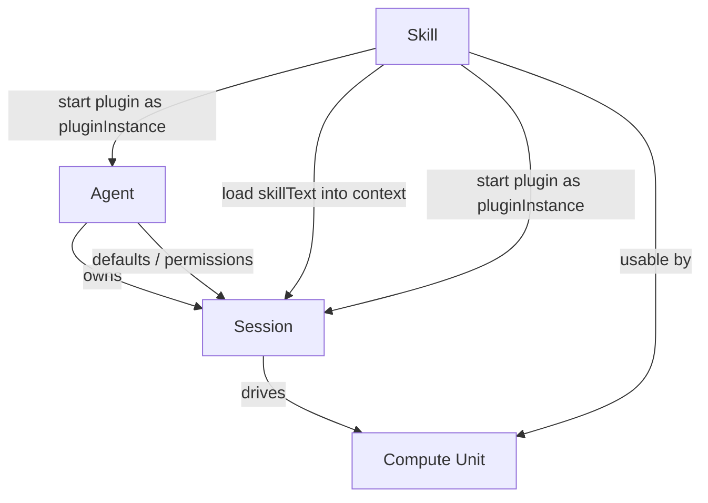
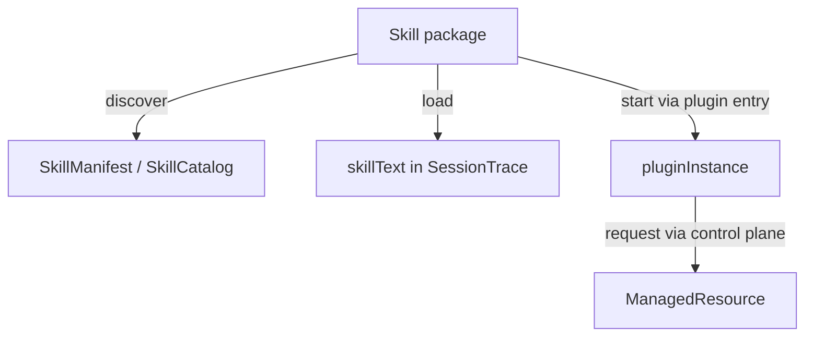
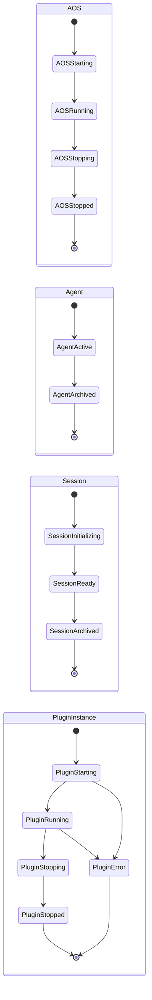
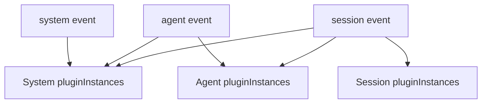
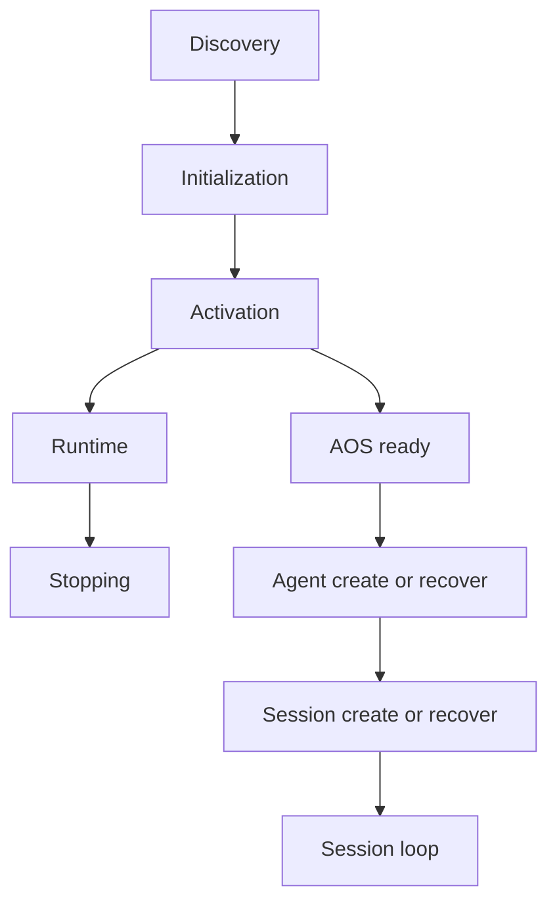
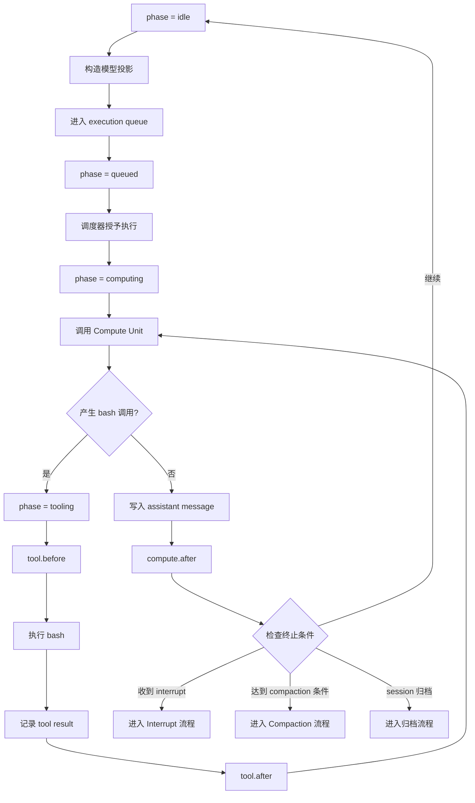

# Agent OS Charter v0.74

## 第一章 总述

### 1.1 核心命题

Agent OS 是一个面向认知推进的认知控制内核。认知本体由外部的 Compute Unit 提供——正如传统操作系统不亲自执行电路级运算，而是治理 CPU、内存与 I/O；Agent OS 也不亲自推理，而是治理认知过程的组织、持续化、注入、恢复与控制。

它关心的核心问题有三：认知主体如何长期存在，会话如何被组织，以及 skill 如何进入模型上下文、或以插件实体的形式持续生效。

这套系统的边界因此很清楚。shell、数据库、文件系统、cron、容器编排、通用进程管理，以及 HTTP、stdio、消息总线、浏览器 UI、移动端面板等 transport，都可以与 AOS 协作，但不属于 AOS 的本体。AOS 的职责范围，只限于把与认知推进直接相关的事实收束进统一的控制面与统一的运行轨迹里。

这份宪章既给出定义，也给出理由。定义用来约束实现，理由用来说明这些约束为什么成立、改动后会牵动什么。

### 1.2 设计原则

后文所有数据结构与运行机制，都由以下原则展开。

1. AOS 是认知控制内核；凡系统控制，皆经 AOS Control Plane 完成。
2. 能力统一用 skill 表达；skill 的上下文面可以被 load 进入上下文，skill 的插件面可以被 start 为 pluginInstance。
3. 系统的默认状态和控制配置存储在 AOSCB、ACB、SCB 这三类 ControlBlock 中；会话的运行轨迹存储在 SessionTrace 中。
4. pluginInstance 由 owner 的生命周期驱动；hooks 是 pluginInstance 在生命周期上的正式介入点。
5. AI 侧的现实交互，默认通过 bash 进入。

这五条之下，还有几条贯穿全文的设计立场：

- **Agent 是主体壳，不是历史仓库。** Agent 保存的是身份、边界、默认配置与权限，不保存具体会话的正文历史。跨事务的连续性靠 skill 能力来延续，不靠把旧会话全文回灌到主体中。
- **Skill 是唯一能力抽象。** 不引入 daemon、service、provider 等平行概念。有的 skill 偏重上下文面（如纯文本角色设定），有的 skill 偏重插件面（如后台遥测），但它们共享的是统一的分发、发现与治理单元。
- **Bash 是 CU 的统一正式世界接口。** 现实世界拥有成熟的 CLI 生态；bash 作为 CU 的唯一正式工具，让 AI 入口保持单一，让控制面治理边界不被原生工具持续侵蚀。这不是权宜之计，而是架构原则。
- **Plugin 之间不直接通信。** 每个 skill 是完备、独立的能力包。能力的组合不发生在 plugin 之间的互相调用里，而发生在 CU 在 bash 中的管道与逻辑编排里。
- **控制面响应 JSON-only。** 控制面是机器契约，不是人类聊天窗口。JSON-only 让 CU 可以用 jq 与管道完成高阶操作，让协议保持纯净和可组合。
- **SessionTrace 与 AI SDK `UIMessage[]` 同构兼容。** 这不是被动耦合，而是主动选择：借力主流前端生态，降低开发门槛，为自身生态奠基。

### 1.3 版本边界

v0.74 的目标是一个可运行的最小原型。以下领域不属于本版的优化目标：

- 强审计。当前 SessionTrace 记录会话事实，但 hook 对投影的改写不做完整追踪。
- 强安全与企业级隔离。权限字段已占位，但权限 DSL 与强制执行点尚未细化。
- 完备的 in-flight 崩溃恢复。Bootstrap 阶段有幂等恢复协议；Session Loop 中途宕机的恢复策略尚未封口。
- Hook 的超时、沙箱与资源配额。当前依赖 plugin 自律与错误中断机制。

这些不是"不存在的需求"，而是"已识别、已推迟"的需求。它们将在后续版本中根据实际运行反馈逐步填补。

## 第二章 四层本体

### 2.1 Compute Unit

Compute Unit 是算元。它可以是 LLM，也可以在未来替换为别的推理单元、规则系统、搜索器或模拟器。它的职责只有一个：读取当前上下文投影，计算下一步动作。它不保存系统状态，也不直接改写控制结构。

在 Agent OS 中，Compute Unit 默认只有一个正式工具：`bash`。这个选择不是为了极简而极简，而是为了治理收缩。现实世界已经拥有极其丰富的 CLI 生态——文件操作、网络请求、多媒体处理、服务管理，全都可以通过 CLI 完成。把 `bash` 作为唯一正式工具，可以把世界的复杂性留给现有 CLI 生态，把系统控制的复杂性收回到 AOS Control Plane 本身。

在 Compute Unit 与宿主之间，信息交换统一收束为字符串；结构化数据也只以 JSON 字符串的形式进入或离开 CU。AOS 的内部结构当然可以强类型化，但面向 CU 的接口保持 string-in / string-out。

### 2.2 Agent

Agent 是长期存在的认知主体壳。它持有的不是某一次事务的全部正文，而是这个主体在多次事务之间保持稳定的东西：身份、边界、默认配置、权限，以及可跨事务持续生效的能力安排。

同一个 Agent 可以拥有多个 Session。主体与事务由此被明确拆开：Agent 回答的是"是谁在行动、默认如何行动、拥有哪些长期能力"；Session 回答的则是"这一次具体发生了什么"。

Agent 不保存任何具体会话的正文历史。跨 Session 的连续性，并不是把旧会话全文塞回 Agent 本体，而是把真正需要跨事务延续的内容沉淀为主体级配置或长期记忆类 skill；原始历史则继续保存在各自 Session 的 SessionTrace 中。

### 2.3 Session

Session 是具体事务单元。一次任务、一条工作线程、一笔业务处理、一次模拟进程，都属于一个 Session。

在 Agent OS 中，真正推进业务的是 Session。某次事务中实际发生的用户输入、模型输出、工具调用、显式 skill load、compaction 与中断，都属于 Session 的责任域，并进入该 Session 的 SessionTrace。

同一个 Agent 之下可以并发存在多个 Session。它们共享同一主体的身份、边界与默认配置，但拥有各自独立的运行轨迹、运行相位与恢复边界。

### 2.4 Skill

Skill 是唯一能力抽象。

任何可以被 Agent 借来推进事务的东西，在 Agent OS 中都统一表达为 skill。领域知识说明是 skill，工作指南是 skill，可被按需读入的长说明书是 skill，带有运行入口、能够注册 hooks 的运行扩展也是 skill。

每个 skill 至少拥有一个上下文面：`SKILL.md` 的正文，即 skillText——它是写给 Compute Unit 看的说明书，可以包含知识、规则、工作流、人格设定与操作说明。skill 还可以拥有一个插件面：在 `SKILL.md` 的 frontmatter 中以 `metadata.aos-plugin` 声明的运行入口，即 plugin。上下文面与插件面是同一个 skill 的两种消费方式，而不是两个独立对象。



这四层共同构成 Agent OS 的最小世界模型：能计算的、能存在的、能推进的、能表达能力的。本宪章在这四层之外不引入更多本体。一切看起来需要新对象的场景，都应当首先追问它能否被这四层吸收；如果真的不能，那才是值得修订宪章的时刻。

## 第三章 能力模型

### 3.1 Skill 的两个面

每个 skill 都有一个上下文面。`SKILL.md` 的正文是这个 skill 的 skillText——它是写给 Compute Unit 看的说明书，主要提供该 skill 的操作指令、使用约束与必要背景。至于这个 skill 何时应被使用，则主要由 frontmatter 中的 `description` 字段与 skillText 共同提示。当 skill 被 load 时，skillText 进入会话上下文。

skill 还可以拥有一个插件面。在 `SKILL.md` 的 frontmatter 中，通过 `metadata.aos-plugin` 声明一个运行入口模块，这个入口就是 skill 的 plugin。plugin 会插入 AOS 内核内部——注册 hooks、订阅事件、通过受限 AosSDK 与控制面交互。这不是单纯的"能跑代码"，而是"能干涉 AOS 的控制流"。

两个面相互独立：

| skill       | `load` | `start` | 含义                                                                                       |
| ----------- | ------ | ------- | ------------------------------------------------------------------------------------------ |
| `profile`   | 是     | 否      | 只注入 skillText，提供角色设定与偏好；没有插件面                                           |
| `memory`    | 是     | 是      | 既注入 skillText 作为 CU 的操作说明，又通过 plugin 构建可跨 session 检索的长期记忆运行服务 |
| `telemetry` | 否     | 是      | 默认不进 prompt，只作为 pluginInstance 订阅 hooks 持续监测；skillText 依然可被显式 load    |

`load` 与 `start` 独立控制，互不依赖。一个 skill 可以同时被 load 和 start，也可以只做其中之一。

### 3.2 Plugin

plugin 是 skill 的可选插件面，必须从属于 skill。它不能独立发现、独立安装、独立配置；它的存在方式，永远依附于携带它的那个 skill。

plugin 以异步工厂函数实现：接收 PluginContext 作为初始化入参，返回该 pluginInstance 注册的全部 hooks。

```ts
type Plugin = (ctx: PluginContext) => Promise<Hooks>;
```

AOS 执行 start 时，会加载 SkillManifest.plugin 指向的模块，并对模块中每个满足 Plugin 签名的导出函数分别执行一次工厂调用；普通 helper 导出不参与初始化。一个模块可以导出多个 plugin 工厂函数，每个函数返回的 hooks 会分别进入 hook 链；但它们仍属于同一个 pluginInstance，owner 也相同。

工厂函数只在 pluginInstance 启动时执行一次。plugin 只能通过 PluginContext.aos（受限 AosSDK）向控制面请求改写持久化真相，不能直接写入 AOSCB、ACB、SCB 或既有 SessionTrace 消息。真正负责校验、执行与记录的是 Control Plane；plugin 只能提出请求。

### 3.3 PluginInstance

pluginInstance 是 plugin 启动后的运行实体。它拥有完整的运行生命周期，可以注册控制流 hooks、订阅 RuntimeEventBus 事件、通过受限 AosSDK 与控制面交互，并在需要时请求控制面启动 ManagedResource。

每个 pluginInstance 都有一个 owner——它属于某个 system、某个 agent 或某个 session。不同 owner 下的同名 skill 的 pluginInstance 相互独立，互不干扰。

### 3.4 Owner

owner 决定 pluginInstance 的生命周期，但不决定 skill 包本身。同一个 memory skill 可以在 system 层被 start 产生一个 system-owned pluginInstance，也可以在某个 agent 或某个 session 下被 start 产生独立的 pluginInstance。

owner 存在，pluginInstance 就可以持续运行；owner 被归档，其拥有的全部 pluginInstance 必须停止。

这套关系从属于两条规则：

- plugin 属于 skill
- pluginInstance 属于 owner

Skill 包本身不携带固定 owner。owner 来自它被谁消费，而不来自 skill 包自身。

### 3.5 Discover、Load 与 Start

AOS 只承认 skill 的三类核心动作。

**discover：** 系统扫描 skillRoot，解析每个 skill 的 `SKILL.md` frontmatter，建立该 skill 的 SkillManifest。再从每个 SkillManifest 投影出一条 SkillCatalogItem（只保留 `name` 与 `description`，去掉 `plugin`），汇总为 SkillCatalog。SkillCatalog 是结构化数据；宿主将其序列化为文本注入 CU 上下文，CU 据此判断是否需要 load 某个 skill。

**load：** 把 skill 的 skillText 带入模型上下文。显式 load 通过 bash 调 `aos skill load <name>`，系统返回 SkillLoadResult；默认 load 由系统在上下文重建时自动注入。无论哪种方式，结果都落入 SessionTrace。

**start：** 启动该 skill 的 plugin，产生一个 pluginInstance。pluginInstance 可以注册控制流 hooks、订阅 RuntimeEventBus 事件、通过受限 AosSDK 与控制面交互，并在需要时请求控制面启动 ManagedResource。



load 消费的是 skill 的上下文面；start 激活的是 skill 的插件面。二者共同让 skill 成为一个完整的能力包：静态知识与运行服务可以同属一个 skill，也可以单独使用。

`aos` 是宿主内建 skill，不来自 skillRoot，也不由用户提供。它必须被视为一个永远存在的 system 级默认 load skill。原因很直接：既然 Compute Unit 默认只拥有 bash，它就必须被教会如何通过 bash 使用 AOS Control Plane。`aos` skill 正是这份说明书。因此，每个 session 的 bootstrap 与每次 post-compaction reinjection，都必须重新注入 `aos` skill 的 skillText。

## 第四章 静态契约

本章只讨论应被持久化、应被恢复、应被当作系统依据的结构。运行时缓存、hooks 注册表、pluginInstance、RuntimeEventBus 与 execution queue 都不属于本章，它们将在第五章讨论。

### 4.1 ControlBlock 与 SessionTrace

Agent OS 的静态结构分成两部分：ControlBlock 与 SessionTrace。AOS 中共有三类 ControlBlock：AOSCB、ACB 与 SCB。

ControlBlock 负责保存默认状态与治理边界。它回答的是"系统、主体或会话现在默认应如何工作"。SessionTrace 负责保存已经发生过的事实。它回答的是"这次事务中实际发生了什么"。

之所以必须分开，是因为"默认应该怎样"和"实际发生过什么"不是同一件事。某个 Session 中曾显式执行过 `aos skill load memory`，这是历史事实，应进入 SessionTrace；但它不因此成为该 Agent 的默认配置，更不应该反向写回 ACB。反过来，某个 Agent 的默认 skill 配置发生变化，会影响未来的 bootstrap 与 plugin 治理，但不会回改过去已经发生的会话历史。

ControlBlock 也不负责描述模型此刻"脑中还剩下什么"。显式 load 只是一次会话内的受控文本取回，它写入 SessionTrace，之后可能被 compaction 压缩，也可能在后续上下文中不再保留；如果模型仍然需要它，应再次 load。

### 4.2 SkillManifest

用途：AOS 对 skill 静态语义的归一化结果。AOS 只从磁盘上的 `SKILL.md` frontmatter 中读取 `name`、`description` 与 `metadata.aos-plugin`，并将第三项归一化为 `plugin`。

| 字段          | 类型   | 必填 | 可变 | 含义                                                        |
| ------------- | ------ | ---- | ---- | ----------------------------------------------------------- |
| `name`        | string | 是   | 否   | skill 名；在整个 AOS 实例内唯一                             |
| `description` | string | 是   | 否   | 给 Compute Unit 看的简短说明                                |
| `plugin`      | string | 否   | 否   | 由磁盘上的 `metadata.aos-plugin` 解析而来；指向运行入口模块 |

Skill 包的最小目录结构如下：

```
<skillRoot>/<name>/
+-- SKILL.md
+-- scripts/
+-- references/
+-- assets/
```

`SKILL.md` frontmatter 示例：

```yaml
name: memory
description: >-
  为当前 agent 提供长期记忆能力。
  WHEN 需要跨 session 回忆事实、偏好或状态时 USE 本 skill。
metadata:
  aos-plugin: runtime.ts
```

磁盘格式中的运行入口固定写在 `metadata.aos-plugin`，AOS 解析后归一化为 SkillManifest.plugin。没有 `metadata.aos-plugin` 的 skill，其 SkillManifest.plugin 为空，该 skill 只能被 load，不能被 start。

### 4.3 SkillCatalog 与 SkillCatalogItem

SkillCatalog 是 AOS discover 阶段的发现结果，类型为 `SkillCatalogItem[]`。它由所有已解析的 SkillManifest 投影而来：每个 SkillManifest 去掉 `plugin` 字段，得到一条 SkillCatalogItem。

`plugin` 字段不进入 SkillCatalogItem，是因为 CU 不需要知道插件入口——那是 AOS 内部的运行时细节。CU 只需要知道有哪些 skill、各自能做什么，以便决定是否 load。

SkillCatalog 是结构化数据对象；宿主负责将其序列化为文本（通常是条目列表）注入 CU 上下文，这段文本才是 CU 实际看到的形态。`skill.list` 操作返回的即是 SkillCatalog。

**SkillCatalogItem 字段**

| 字段          | 类型   | 必填 | 可变 | 含义                                             |
| ------------- | ------ | ---- | ---- | ------------------------------------------------ |
| `name`        | string | 是   | 否   | skill 名                                         |
| `description` | string | 是   | 否   | skill 的简短说明；来自 SkillManifest.description |

### 4.4 SkillDefaultRule

用途：某一层 ControlBlock 中的默认 skill 条目。它只保存默认行为：当某个 owner 启动或重建上下文时，哪些 skill 应默认参与 load，哪些 skill 的 plugin 应默认 start。

| 字段    | 类型                 | 必填 | 可变 | 含义                                                 |
| ------- | -------------------- | ---- | ---- | ---------------------------------------------------- |
| `name`  | string               | 是   | 是   | skill 名                                             |
| `load`  | `enable` / `disable` | 否   | 是   | 该 skill 是否参与默认上下文注入                      |
| `start` | `enable` / `disable` | 否   | 是   | 该 skill 的 plugin 是否在 owner 生命周期起点默认启动 |

**约束**

- `load` 与 `start` 相互独立，不存在隐式联动。
- 字段缺失表示当前层对该维度不作声明。
- 同一 ControlBlock 内不得出现同名重复条目。

### 4.5 AOSCB

用途：system 级 ControlBlock，保存整个 AOS 实例的默认配置与治理边界。

| 字段            | 类型                      | 必填 | 可变 | 含义                                     |
| --------------- | ------------------------- | ---- | ---- | ---------------------------------------- |
| `schemaVersion` | string                    | 是   | 否   | 文档与持久化结构版本；当前为 `aos/v0.74` |
| `name`          | string                    | 是   | 是   | 当前 AOS 实例的名称                      |
| `skillRoot`     | string                    | 是   | 是   | skill 根目录                             |
| `revision`      | integer                   | 是   | 是   | system 级修订号                          |
| `createdAt`     | RFC3339 UTC string        | 是   | 否   | 创建时间                                 |
| `updatedAt`     | RFC3339 UTC string        | 是   | 是   | 最近更新时间                             |
| `defaultSkills` | array of SkillDefaultRule | 否   | 是   | system 级默认 skill 条目                 |
| `permissions`   | object                    | 否   | 是   | system 级权限策略                        |

**约束**

- `permissions` 的内部语法在本版中不固定，但字段位置必须固定。
- 权限字段参与 system → agent → session 的继承解析。
- 权限判断必须由 AOS Control Plane 负责。
- AOS 只允许一个 skillRoot；系统启动时扫描这个根目录，得到全局的 skill 发现结果。

**最小示例**

```json
{
  "schemaVersion": "aos/v0.74",
  "name": "my-agent-os",
  "skillRoot": "/path/to/skills",
  "revision": 3,
  "createdAt": "2026-03-17T10:00:00Z",
  "updatedAt": "2026-03-17T10:05:00Z"
}
```

### 4.6 ACB

用途：Agent 的主体 ControlBlock，只保存 Agent 自身的主体控制信息。

| 字段            | 类型                      | 必填 | 可变 | 含义                    |
| --------------- | ------------------------- | ---- | ---- | ----------------------- |
| `agentId`       | string                    | 是   | 否   | Agent 标识              |
| `status`        | `active` / `archived`     | 是   | 是   | Agent 生命周期状态      |
| `displayName`   | string                    | 否   | 是   | Agent 展示名            |
| `revision`      | integer                   | 是   | 是   | Agent 级修订号          |
| `createdBy`     | `human` 或 agentId        | 是   | 否   | 创建来源                |
| `createdAt`     | RFC3339 UTC string        | 是   | 否   | 创建时间                |
| `updatedAt`     | RFC3339 UTC string        | 是   | 是   | 最近更新时间            |
| `archivedAt`    | RFC3339 UTC string        | 否   | 是   | 归档时间                |
| `defaultSkills` | array of SkillDefaultRule | 否   | 是   | agent 级默认 skill 条目 |
| `permissions`   | object                    | 否   | 是   | agent 级权限策略        |

**约束**

- ACB 不维护 `sessions[]` 之类的反向列表。Agent 与 Session 的一对多关系由 SCB.agentId 单向确定。
- `archivedAt` 只在 `status = archived` 时出现；Agent 处于 active 时不得填写该字段。

### 4.7 SCB

用途：Session 的 ControlBlock，同时持有该 Session 的 SessionTrace。

| 字段            | 类型                                  | 必填 | 可变 | 含义                      |
| --------------- | ------------------------------------- | ---- | ---- | ------------------------- |
| `sessionId`     | string                                | 是   | 否   | Session 标识              |
| `agentId`       | string                                | 是   | 否   | 所属 Agent                |
| `status`        | `initializing` / `ready` / `archived` | 是   | 是   | Session 生命周期状态      |
| `title`         | string                                | 否   | 是   | Session 标题              |
| `revision`      | integer                               | 是   | 是   | Session 级修订号          |
| `createdBy`     | `human` 或 agentId                    | 是   | 否   | 创建来源                  |
| `createdAt`     | RFC3339 UTC string                    | 是   | 否   | 创建时间                  |
| `updatedAt`     | RFC3339 UTC string                    | 是   | 是   | 最近更新时间              |
| `archivedAt`    | RFC3339 UTC string                    | 否   | 是   | 归档时间                  |
| `defaultSkills` | array of SkillDefaultRule             | 否   | 是   | session 级默认 skill 条目 |
| `permissions`   | object                                | 否   | 是   | session 级权限策略        |
| `sessionTrace`  | array of SessionTraceMessage          | 是   | 是   | 该 Session 的完整运行轨迹 |

**约束**

- SCB.agentId 是 Session 归属的唯一真相。
- `status` 只表达生命周期，不承担记录所有失败的职责。运行失败分别体现在 pluginInstance 状态、SessionTrace 事实、`session.error` hook 与控制面错误返回中。
- `archivedAt` 只在 `status = archived` 时出现。

**最小示例**

```json
{
  "sessionId": "s_123",
  "agentId": "a_42",
  "status": "ready",
  "revision": 7,
  "createdBy": "human",
  "createdAt": "2026-03-17T10:10:00Z",
  "updatedAt": "2026-03-17T10:12:00Z",
  "sessionTrace": []
}
```

### 4.8 SessionTrace 消息契约

SessionTrace 在 Session 层面是运行轨迹，不是 prompt 缓存；Compute Unit 收到的 prompt，正是从这条轨迹投影而来。二者分工清晰：SessionTrace 负责历史存储，prompt 负责当次呈现。

v0.74 的 SessionTrace 与 AI SDK 的 `UIMessage[]` 结构同构兼容。这一选择不是被动适配，而是主动借力：以主流前端生态的消息结构为基础，降低开发门槛并为自身生态奠基。顶层只保留 `id`、`role`、`metadata` 与 `parts`；工具调用使用标准 `tool-*` parts，AOS 自定义系统语义使用 `data-*` parts。

#### SessionTraceMessage 顶层结构

| 字段       | 类型                            | 说明                                            |
| ---------- | ------------------------------- | ----------------------------------------------- |
| `id`       | string                          | 消息唯一标识；SessionTrace 中不可重复           |
| `role`     | `system` / `user` / `assistant` | 模型投影所见角色                                |
| `metadata` | object                          | AOS 对消息的附加元数据                          |
| `parts`    | array                           | 文本、标准 `tool-*` parts 与 AOS `data-*` parts |

#### metadata 字段

| 字段        | 类型                          | 含义                              |
| ----------- | ----------------------------- | --------------------------------- |
| `seq`       | integer                       | session 内严格单调递增，从 1 开始 |
| `createdAt` | RFC3339 UTC string            | 消息创建时间                      |
| `origin`    | `human` / `assistant` / `aos` | 真实来源，不等于 role             |

#### parts 类型

| part 类型         | 说明                                              |
| ----------------- | ------------------------------------------------- |
| `text`            | 普通文本内容                                      |
| `tool-bash`       | bash 调用与结果；使用 AI SDK 标准 ToolUIPart 结构 |
| `data-skill-load` | AOS 的 skillText 注入事实                         |
| `data-compaction` | AOS 的 compaction 事实                            |
| `data-interrupt`  | AOS 的中断事实                                    |
| `data-bootstrap`  | AOS 的 bootstrap marker                           |

AOS 核心只依赖以上几类 parts；前端若引入 AI SDK 的其他标准 parts（如 `reasoning`、`file`、`step-start`），可以共存，但不属于 AOS 本身的核心契约。

#### AOS data parts

| part              | 标准壳层                            | `data` 内部字段                                       | 用途                                         |
| ----------------- | ----------------------------------- | ----------------------------------------------------- | -------------------------------------------- |
| `data-skill-load` | `type`, `id?`, `data`               | `cause`, `ownerType`, `ownerId?`, `name`, `skillText` | 默认注入、显式 load 或 reinject 的 skillText |
| `data-compaction` | `type`, `id?`, `data`               | `fromSeq`, `toSeq`, `summaryText`                     | 历史压缩标记                                 |
| `data-interrupt`  | `type`, `id?`, `data`               | `reason`, `payload?`                                  | 中断事实                                     |
| `data-bootstrap`  | `type`, `id?`, `data`, `transient?` | `phase`, `reason`, `plannedNames`                     | bootstrap marker                             |

`data-bootstrap` 允许带 `transient: true`。当系统只需要把 marker 用于流式界面提示而不需要持久化时，可以使用 transient；凡参与恢复协议的 bootstrap marker，必须持久化进入 SessionTrace。

#### ToolUIPart 约定

| part        | 必需字段                               | 说明                                 |
| ----------- | -------------------------------------- | ------------------------------------ |
| `tool-bash` | `type`, `toolCallId`, `state`, `input` | bash 调用的标准 tool part            |
| `tool-bash` | `output`                               | 当 `state = output-available` 时必填 |
| `tool-bash` | `errorText`                            | 当 `state = output-error` 时必填     |

`tool-bash.input` 使用以下字段：`command`、`cwd?`、`timeoutMs?`。`tool-bash.output` 使用以下字段：`exitCode`、`stdout`、`stderr`。工具状态应遵循 AI SDK 标准四态：`input-streaming`、`input-available`、`output-available`、`output-error`。

#### role 与 origin 的关系

| 消息类型                                              | `role`      | `origin`    |
| ----------------------------------------------------- | ----------- | ----------- |
| 用户输入                                              | `user`      | `human`     |
| 模型输出与 bash 工具活动                              | `assistant` | `assistant` |
| AOS 默认注入、compaction、interrupt、bootstrap marker | `user`      | `aos`       |

`role` 服务于模型投影，`origin` 标记消息的真实来源。AOS 自身写入的内容对模型而言确实属于应被看到的输入，但必须保留"不是用户说的"这一事实。真正的控制语义只存在于 SessionTrace 的结构化 `data-*` part 中，不从纯文本反向解析；即使模型输出中出现形似控制标记的字符串，它也只是普通 `text` part，不会污染控制面真相。

## 第五章 运行时机制

### 5.1 生命周期与 Phase

从这一章开始，文中正式使用四个术语。

**生命周期（lifecycle）：** 对象沿时间展开的状态轴。回答"它何时开始、何时结束、处于哪种持久状态"。

**事件（event）：** 运行过程中发生的事实。回答"刚才发生了什么"。

**钩子（hook）：** 系统在某个事件点上暴露出的正式扩展插槽。回答"哪里允许 pluginInstance 介入"。

**阶段（phase）：** 对象在运行中的瞬时相位。回答"此刻正在干什么"。

生命周期是时间主轴，事件是主轴上的事实，钩子是事实发生时允许介入的插槽，阶段是运行中的瞬时局部状态。事件与运行轨迹分属两层：被 RuntimeEventBus 分发的是运行时事件，被 SessionTrace 保存的是会话层面的持久事实。



#### Session 生命周期状态

| 状态           | 含义                         | 可进入于       | 可退出到   |
| -------------- | ---------------------------- | -------------- | ---------- |
| `initializing` | bootstrap 尚未完成           | 创建 / 恢复    | `ready`    |
| `ready`        | 已完成 bootstrap，可继续推进 | bootstrap 完成 | `archived` |
| `archived`     | 已归档，不再参与运行推进     | 归档           | 无         |

#### Session 运行阶段

| phase           | 含义                        |
| --------------- | --------------------------- |
| `bootstrapping` | 正在进行默认注入与启动准备  |
| `idle`          | 已就绪，等待下一轮推进      |
| `queued`        | 已进入执行队列，等待调度    |
| `computing`     | Compute Unit 正在生成下一步 |
| `tooling`       | 正在执行工具调用            |
| `compacting`    | 正在压缩会话历史            |
| `interrupted`   | 当前推进被中断              |

`status` 与 `phase` 构成两个正交维度：前者描述生命周期中的持久状态，后者描述当前的瞬时相位。同一个 Session 可以同时是 `ready` 且正处于 `computing`。

### 5.2 Hook 模型

hook 是 pluginInstance 介入系统主流程的正式入口。AOS 的 hook 分为两大类，执行语义清楚分开：

**控制流 hook（含 transform hook）：** 属于主流程，串行、阻塞、可修改 output。所有控制流 hook 都只能由 pluginInstance 注册。

**事件订阅：** 通过 RuntimeEventBus 分发，非阻塞，纯观察，不参与主流程。事件订阅的语义已在 5.5 定义，本节不重复。

控制流 hook 还可以再分成两类，区别在于它们改写的对象不同：

| 类别           | 修改对象           | 典型用途                                           |
| -------------- | ------------------ | -------------------------------------------------- |
| 维护型 hook    | 执行参数、流程控制 | 生命周期通知、bootstrap 干预、工具前后处理         |
| Transform hook | 送给 CU 的内容     | system 注入、消息投影、compaction 上下文、LLM 参数 |

两类共享同一套执行规则，只是语义目的不同。

#### 执行规则

- **串行：** 同一 hook 点上的所有注册实例，严格按注册顺序依次执行。
- **共享可变 output：** 宿主先构造初始 output，所有 hook 函数共享同一引用，并可就地修改其字段。
- **最后态生效：** 主流程使用所有 hook 执行完成后的最终 output；前序 hook 的修改可以被后续 hook 覆盖。
- **阻塞主流程：** 宿主等待当前 hook 点全部实例执行完毕后才继续推进。
- **错误中断：** hook 抛出未捕获异常时，当前操作立即失败；同一 hook 点上的后续实例不再执行。若当前操作属于 session 流程，则进入 `session.error` 路径；若属于 agent 或 aos 级流程，则通过对应 owner 的控制面错误返回与运行时事件暴露，不伪造 session 级错误。

#### 注册权限

| ownerType | 可注册的 hook                                               |
| --------- | ----------------------------------------------------------- |
| `system`  | 全部                                                        |
| `agent`   | `agent.*`、`session.*`、`compute.*`、`tool.*`、`resource.*` |
| `session` | `session.*`、`compute.*`、`tool.*`、`resource.*`            |

越权注册必须在注册时立即失败，不得静默忽略。

#### 分发顺序

| hook 类型                                  | 顺序                     |
| ------------------------------------------ | ------------------------ |
| `*.before`、`*.beforeWrite`、`*.transform` | system → agent → session |
| `*.after`、生命周期通知型 hook             | session → agent → system |
| `aos.*`                                    | 仅 system                |

hook 名与 RuntimeEvent.type 可以共享同名标签，例如 `session.started`。但二者不是同一机制：hook 是控制流插槽，RuntimeEvent 是 RuntimeEventBus 上的运行时事实。默认顺序固定为：前置 hook / transform hook → 实际动作 → SessionTrace 写入 → 后置 hook 或生命周期 hook → 对应 RuntimeEvent 发布。

### 5.3 Hook 清单

本节列出所有正式 hook 点。`input` 为只读；`output` 为同一 hook 点各实例共享的可变对象；`—` 表示该维度无特殊字段。

#### 生命周期 hooks

| hook               | 可注册 owner             | 时机                     | input                                        | output |
| ------------------ | ------------------------ | ------------------------ | -------------------------------------------- | ------ |
| `aos.started`      | system                   | AOS 启动完成后           | `cause`, `timestamp`, `catalogSize`          | —      |
| `aos.stopping`     | system                   | AOS 停止前               | `reason`, `timestamp`                        | —      |
| `agent.started`    | agent / system           | Agent 创建或恢复后       | `agentId`, `cause`, `timestamp`              | —      |
| `agent.archived`   | agent / system           | Agent 归档后             | `agentId`, `timestamp`                       | —      |
| `session.started`  | session / agent / system | Session bootstrap 完成后 | `agentId`, `sessionId`, `cause`, `timestamp` | —      |
| `session.archived` | session / agent / system | Session 归档后           | `agentId`, `sessionId`, `timestamp`          | —      |

#### Session 维护 hooks

| hook                        | 可注册 owner             | 时机          | input                                                       | output |
| --------------------------- | ------------------------ | ------------- | ----------------------------------------------------------- | ------ |
| `session.bootstrap.before`  | session / agent / system | 默认注入前    | `agentId`, `sessionId`, `plannedNames`                      | —      |
| `session.bootstrap.after`   | session / agent / system | 默认注入后    | `agentId`, `sessionId`, `injectedNames`                     | —      |
| `session.reinject.before`   | session / agent / system | reinject 前   | `agentId`, `sessionId`, `plannedNames`                      | —      |
| `session.reinject.after`    | session / agent / system | reinject 后   | `agentId`, `sessionId`, `injectedNames`                     | —      |
| `session.compaction.before` | session / agent / system | compaction 前 | `agentId`, `sessionId`, `fromSeq`, `toSeq`                  | —      |
| `session.compaction.after`  | session / agent / system | compaction 后 | `agentId`, `sessionId`, `fromSeq`, `toSeq`, `compactionSeq` | —      |
| `session.error`             | session / agent / system | 运行失败时    | `source`, `recoverable`, `message`                          | —      |
| `session.interrupted`       | session / agent / system | 中断时        | `reason`                                                    | —      |

#### Compute 与 Tool hooks

| hook                          | 可注册 owner             | 时机           | input                                          | output                          |
| ----------------------------- | ------------------------ | -------------- | ---------------------------------------------- | ------------------------------- |
| `session.message.beforeWrite` | session / agent / system | 消息写入前     | `agentId`, `sessionId`, `message`              | `message`（可替换消息内容）     |
| `compute.before`              | session / agent / system | 调用 CU 前     | `agentId`, `sessionId`, `lastSeq`              | —                               |
| `compute.after`               | session / agent / system | 一轮计算结束后 | `agentId`, `sessionId`, `appendedMessageCount` | —                               |
| `tool.before`                 | session / agent / system | bash 执行前    | `toolCallId`, `args`                           | `args`（可改写命令参数）        |
| `tool.after`                  | session / agent / system | bash 执行后    | `toolCallId`, `rawResult`                      | `result`（可改写会话可见结果）  |
| `tool.env`                    | session / agent / system | bash 执行前    | `toolCallId`, `args`                           | `env`（与进程环境合并的键值对） |

`tool.before` 改写的是执行前参数。`tool.after` 读取 rawResult，返回的 result 只影响后续控制流与会话可见结果，不覆盖原始 subprocess 事实；`tool-bash` part 固定持久化 rawResult 作为审计依据。

#### Transform hooks

transform hook 专门用于改写送给 CU 的内容。它们在 CU 调用前或 compaction 构造阶段触发，遵循 5.2 的执行规则；修改结果会直接决定模型这一轮看到什么。

| hook                           | 可注册 owner             | 触发时机                          | input                                      | output                                                                |
| ------------------------------ | ------------------------ | --------------------------------- | ------------------------------------------ | --------------------------------------------------------------------- |
| `session.system.transform`     | session / agent / system | CU 调用前，构造 system 注入时     | `agentId`, `sessionId`, `userMessage?`     | `system`（覆盖默认 system 注入文本）                                  |
| `session.messages.transform`   | session / agent / system | CU 调用前，投影完成后             | `agentId`, `sessionId`, `messages`         | `messages`（最终送给 CU 的消息数组）                                  |
| `session.compaction.transform` | session / agent / system | compaction 开始后，摘要 prompt 前 | `agentId`, `sessionId`, `fromSeq`, `toSeq` | `contextParts`（追加到 compaction prompt 的文本片段），`summaryHint?` |
| `compute.params.transform`     | session / agent / system | CU 调用前，参数构造完成后         | `agentId`, `sessionId`, `params`           | `params`（最终传给 LLM 的参数对象）                                   |

**Transform hook 约束**

- transform hook 的 output 只影响本次 CU 调用或本次 compaction；不写入 SessionTrace，不修改 ControlBlock。
- `session.messages.transform` 的 messages 输入是 compaction 截断和 data part 投影之后的结果；plugin 无法通过它取回已截断的历史。
- `session.compaction.transform` 追加的 contextParts 仅参与 compaction prompt 构造，不进入 SessionTrace 正文。
- `compute.params.transform` 修改 provider 参数，不修改消息内容。

#### Resource hooks

| hook                | 可注册 owner | 时机                   | input                              | output |
| ------------------- | ------------ | ---------------------- | ---------------------------------- | ------ |
| `resource.started`  | owner 向上   | ManagedResource 启动后 | `resourceId`, `kind`, `endpoints?` | —      |
| `resource.stopping` | owner 向上   | ManagedResource 停止前 | `resourceId`, `kind`               | —      |
| `resource.error`    | owner 向上   | ManagedResource 失败时 | `resourceId`, `kind`, `message`    | —      |

其中"owner 向上"指：session-owned 资源可被 session / agent / system 注册的 hooks 接收；agent-owned 资源可被 agent / system 接收；system-owned 资源仅 system 接收。

### 5.4 PluginContext

pluginInstance 启动时，宿主会向 plugin 工厂函数传入一个 PluginContext。这个 context 贯穿 pluginInstance 的整个生命周期，是 plugin 访问控制面的唯一凭据。

| 字段        | 类型                           | 含义                                    |
| ----------- | ------------------------------ | --------------------------------------- |
| `ownerType` | `system` / `agent` / `session` | 当前 pluginInstance 的 owner 类型       |
| `ownerId`   | string                         | 当前 pluginInstance 的 owner 标识       |
| `skillName` | string                         | 当前 skill 名                           |
| `agentId`   | string                         | 当 ownerType 为 agent 或 session 时存在 |
| `sessionId` | string                         | 当 ownerType 为 session 时存在          |
| `aos`       | AosSDK 子集                    | 受 ownerType 约束的控制面客户端         |

pluginInstance 可以拥有很强的现实能力，但这些能力必须由控制面授予。例如，某个 plugin 可以通过受限 AosSDK 请求控制面启动一个 ManagedResource；它不能直接拉起进程，却可以合法地请求系统为自己创建运行资源。

### 5.5 RuntimeEvent 与 RuntimeEventBus

系统在运行时维护一条统一的事件流。RuntimeEvent 是运行时事实，RuntimeEventBus 是这些事实的分发机制。

#### RuntimeEvent

| 字段        | 类型                           | 含义                                         |
| ----------- | ------------------------------ | -------------------------------------------- |
| `type`      | string                         | 事件名，采用点分形式，例如 `session.started` |
| `ownerType` | `system` / `agent` / `session` | 事件归属 owner 类型                          |
| `timestamp` | RFC3339 UTC string             | 事件发生时间                                 |
| `agentId`   | string                         | 事件所属 Agent；可选                         |
| `sessionId` | string                         | 事件所属 Session；可选                       |
| `payload`   | object                         | 事件载荷                                     |

#### RuntimeEventBus

| 方法        | 输入           | 结果               | 含义           |
| ----------- | -------------- | ------------------ | -------------- |
| `publish`   | `RuntimeEvent` | 无                 | 发布运行时事件 |
| `subscribe` | 订阅说明       | `unsubscribe` 句柄 | 建立事件订阅   |

持久化会话事实由 SessionTrace 保存，执行排队由 queue 负责，RuntimeEventBus 承担的是运行时事件分发。三者职责严格分离。

#### 事件可见性规则

在 AOS 中，真正的 event listener 是 pluginInstance。Compute Unit 只通过 prompt projection 与 bash 参与运行；ControlBlock 与 SessionTrace 是结构，也不订阅 bus。只有已经 start 的 pluginInstance，才可能成为事件订阅者。



| 事件归属 ownerType | 可见给谁                                                                               |
| ------------------ | -------------------------------------------------------------------------------------- |
| `system`           | system pluginInstances                                                                 |
| `agent`            | 对应 agent 的 pluginInstances、system pluginInstances                                  |
| `session`          | 对应 session 的 pluginInstances、所属 agent 的 pluginInstances、system pluginInstances |

事件订阅是非阻塞的 fire-and-forget 语义：pluginInstance 收到事件后的处理不阻塞主流程，异常也不影响主流程推进。这与控制流 hook 的阻塞语义形成清楚对比。

RuntimeEventBus 的默认实现可以是单进程、类型化、非持久的内存 bus；当系统演进到多进程或分布式部署时，底层 transport 可以替换，但本宪章只固定 bus 的逻辑语义，不固定它的底层中间件。

### 5.6 运行时注册表

时间轴之外，系统还需要一组只存在于运行中的派生结构。它们不写回 ControlBlock，却决定着运行时如何被高效取用。

| 运行时结构                | 作用                                          | 是否持久化 |
| ------------------------- | --------------------------------------------- | ---------- |
| `discovery cache`         | 保存从 skillRoot 扫描并解析出的 SkillManifest | 否         |
| `skillText cache`         | 保存默认 load skill 的 skillText              | 否         |
| `plugin module cache`     | 保存 plugin 运行入口模块引用                  | 否         |
| `pluginInstance registry` | 保存所有运行中的 pluginInstance               | 否         |
| `resource registry`       | 保存 ManagedResource                          | 否         |

#### PluginInstance 运行时视图

| 字段         | 类型                                                      | 含义                                                  |
| ------------ | --------------------------------------------------------- | ----------------------------------------------------- |
| `instanceId` | string                                                    | 实例标识；由 ownerType、ownerId 与 skillName 组合而成 |
| `skillName`  | string                                                    | 所属 skill 名                                         |
| `ownerType`  | `system` / `agent` / `session`                            | owner 类型                                            |
| `ownerId`    | string                                                    | owner 标识                                            |
| `state`      | `starting` / `running` / `stopping` / `stopped` / `error` | 实例状态                                              |
| `startedAt`  | RFC3339 UTC string                                        | 启动时间                                              |
| `hooks`      | array                                                     | 已注册的控制流 hooks                                  |
| `lastError`  | string                                                    | 最近错误；可选                                        |

#### 热更新规则

- `SKILL.md` 变化：刷新对应 SkillManifest，并失效相关 owner 下的 skillText 缓存条目。
- `metadata.aos-plugin` 解析结果变化：失效对应 plugin module cache 条目。
- 既有 SessionTraceMessage 不可被重写。
- 已经运行中的 pluginInstance 继续使用启动时装入的 plugin 模块，直到 owner 生命周期结束或显式停止。
- 新的显式 load、未来的 bootstrap reinjection、以及未来的 plugin 启动，才会使用新版本。

### 5.7 ManagedResource

ManagedResource 是由 pluginInstance 通过 AOS Control Plane 申请创建、并由 AOS 托管其生命周期的运行资源实例。

| 字段              | 类型                                                      | 含义                        |
| ----------------- | --------------------------------------------------------- | --------------------------- |
| `resourceId`      | string                                                    | 资源标识                    |
| `kind`            | `app` / `service` / `worker`                              | 资源类型                    |
| `ownerType`       | `system` / `agent` / `session`                            | owner 类型                  |
| `ownerId`         | string                                                    | owner 标识                  |
| `ownerInstanceId` | string                                                    | 创建该资源的 pluginInstance |
| `state`           | `starting` / `running` / `stopping` / `stopped` / `error` | 资源状态                    |
| `startedAt`       | RFC3339 UTC string                                        | 启动时间                    |
| `endpoints`       | array of string                                           | 对外端点；可选              |
| `lastError`       | string                                                    | 最近错误；可选              |

ManagedResource 的生命周期随 owner 归档而终止。它不是 plugin 私自拉起的野进程，而是受控制面登记、启动、停止和状态追踪的托管对象。

### 5.8 通信模型

Agent OS 不提供 plugin 之间的直接调用式通信。系统中只存在几种分工明确的受治理通信通道，每种只干一件事。

| 通信类型        | 同步/异步 | 持久化 | 有返回值 | 典型用途                       |
| --------------- | --------- | ------ | -------- | ------------------------------ |
| Control Plane   | 同步      | 否     | 是       | 正式操作、查询、变更           |
| RuntimeEventBus | 异步      | 否     | 否       | 运行时广播                     |
| SessionTrace    | 异步      | 是     | 否       | 跨时间事实传递、恢复、认知投影 |
| Hook            | 同步      | 否     | 改output | 介入宿主主流程                 |
| ManagedResource | 视协议    | 否     | 视协议   | 高吞吐、结构化、流式数据       |
| Bash            | 同步      | 视调用 | 是       | CU 访问世界的统一入口          |

如果某个 pluginInstance 需要与另一个 pluginInstance 的能力协作，正确的路径不是互相调用内部方法，而是：

- 需要正式能力：走 Control Plane
- 需要广播事实：走 RuntimeEventBus
- 需要留给未来轮次：写 SessionTrace
- 需要参与当前主流程：用 Hook
- 需要传大数据或流：走 ManagedResource endpoint 或文件路径

能力的组合不发生在 plugin 之间的运行时耦合里，而发生在 CU 在 bash 中的管道与逻辑编排里。正如 Unix 中 `grep` 和 `awk` 互相不知道对方的存在，是 shell 脚本把它们组合起来的——在 Agent OS 里，CU 就是那个编排者。

### 5.9 调度与限流

事件传播之外，系统还必须处理另一个完全不同的问题：稀缺执行能力如何被分配。LLM 请求有 TPM / RPM 约束，某些 tool 或资源操作也会消耗有限并发。传播事实的是 RuntimeEventBus，协调执行的则是 queue 与 scheduler。

#### ExecutionTicket

| 字段              | 类型                                              | 含义                  |
| ----------------- | ------------------------------------------------- | --------------------- |
| `ticketId`        | string                                            | 调度票据标识          |
| `kind`            | `compute` / `tool` / `compaction` / `resource-op` | 执行类别              |
| `ownerType`       | `system` / `agent` / `session`                    | 执行归属 owner 类型   |
| `agentId`         | string                                            | 所属 Agent；可选      |
| `sessionId`       | string                                            | 所属 Session；可选    |
| `priority`        | `high` / `normal` / `low`                         | 调度优先级            |
| `estimatedTokens` | integer                                           | 估计 token 消耗；可选 |

#### 执行规则

1. 同一 sessionId 在同一时刻最多只应有一条主执行链。
2. 不同 Session 之间可以并发推进，但要受 provider 预算、主机并发与策略限制。
3. TPM / RPM、provider budget、local concurrency 与 backpressure 都由 scheduler 决定。

`queued` phase 具有明确意义：这并不表示会话已经停止，而只是说明它已经具备运行资格，正在等待调度器授予执行时机。

## 第六章 控制面

### 6.1 定位

AOS Control Plane 是 Agent OS 的正式控制接口。它定义统一的操作语义、参数结构与返回契约；CLI、SDK、HTTP/API 与 UI 都只是访问这组契约的不同方式。

整条控制链由此变得清楚：AI 通过 bash 调用 CLI，人类在终端里使用 CLI，运行中的 pluginInstance 通过受限 AosSDK 访问控制面，前端与远程服务则通过 SDK 或 HTTP/API 接入。入口可以不同，控制语义只有一套。

### 6.2 客户端

| 客户端   | 使用方式                             | 典型使用者                |
| -------- | ------------------------------------ | ------------------------- |
| CLI      | `aos skill load memory`              | AI（通过 bash）、人类终端 |
| SDK      | `aos.skill.load({ name: "memory" })` | pluginInstance、前端 UI   |
| HTTP/API | 与 SDK 同构                          | 远程面板、自动化管道      |

三者操作的是同一个 AOS。宿主至少应注入 `AOS_AGENT_ID` 与 `AOS_SESSION_ID` 两个环境变量。它们只表示 CLI 命令的默认目标，不表示权限凭据。当 CLI 缺省 agentId 或 sessionId 参数时，读取这些环境变量；SDK 调用则必须显式传入。

### 6.3 操作总表

本节定义 AOS Control Plane 必须实现的正式操作。

#### Skill 操作

| 操作                  | 输入                             | 返回                      | 改写 ControlBlock | 副作用                                                                                        |
| --------------------- | -------------------------------- | ------------------------- | ----------------- | --------------------------------------------------------------------------------------------- |
| `skill.list`          | 无                               | `SkillCatalog`            | 否                | 无                                                                                            |
| `skill.show`          | `name`                           | `SkillManifest`           | 否                | 无                                                                                            |
| `skill.load`          | `name`                           | `SkillLoadResult`         | 否                | 统一语义事实写入 `data-skill-load`；若经 bash transport 调用，再额外写入 `tool-bash` 审计事实 |
| `skill.start`         | `PluginStartArgs`                | `PluginInstance`          | 否                | 启动 plugin，触发相关 hooks / events                                                          |
| `skill.stop`          | `instanceId`                     | `instanceId`              | 否                | 停止 pluginInstance，触发相关 hooks / events                                                  |
| `skill.default.list`  | `ownerType`, `ownerId?`          | array of SkillDefaultRule | 否                | 无                                                                                            |
| `skill.default.set`   | `ownerType`, `ownerId?`, `entry` | `revision`                | 是                | 运行中 owner 可能触发缓存刷新或 reconcile                                                     |
| `skill.default.unset` | `ownerType`, `ownerId?`, `name`  | `revision`                | 是                | 运行中 owner 可能触发缓存刷新或 reconcile                                                     |

#### Plugin 操作

| 操作          | 输入                     | 返回                    | 改写 ControlBlock | 副作用 |
| ------------- | ------------------------ | ----------------------- | ----------------- | ------ |
| `plugin.list` | `ownerType?`, `ownerId?` | array of PluginInstance | 否                | 无     |
| `plugin.get`  | `instanceId`             | `PluginInstance`        | 否                | 无     |

#### Agent 操作

| 操作            | 输入           | 返回         | 改写 ControlBlock | 副作用                                |
| --------------- | -------------- | ------------ | ----------------- | ------------------------------------- |
| `agent.list`    | 无             | array of ACB | 否                | 无                                    |
| `agent.create`  | `displayName?` | ACB          | 是                | 新建 Agent，并进入 agent 激活顺序     |
| `agent.get`     | `agentId`      | ACB          | 否                | 无                                    |
| `agent.archive` | `agentId`      | `revision`   | 是                | 停止该 Agent 的 pluginInstance 与资源 |

#### Session 操作

| 操作                | 输入                              | 返回                        | 改写 ControlBlock | 副作用                                  |
| ------------------- | --------------------------------- | --------------------------- | ----------------- | --------------------------------------- |
| `session.list`      | `SessionListArgs`                 | `SessionListResult`         | 否                | 无                                      |
| `session.create`    | `agentId`, `title?`               | SCB                         | 是                | 新建 Session，并进入 bootstrap          |
| `session.get`       | `sessionId`                       | SCB                         | 否                | 无                                      |
| `session.append`    | `sessionId`, `message`            | `revision`                  | 是                | 追加 SessionTraceMessage                |
| `session.interrupt` | `sessionId`, `reason`, `payload?` | `revision`                  | 是                | 写入 interrupt 事实                     |
| `session.compact`   | `sessionId`                       | `revision`, `compactionSeq` | 是                | 触发 compaction 与 reinject             |
| `session.archive`   | `sessionId`                       | `revision`                  | 是                | 停止该 Session 的 pluginInstance 与资源 |

#### Resource 操作

| 操作             | 输入                            | 返回                     | 改写 ControlBlock | 副作用                                     |
| ---------------- | ------------------------------- | ------------------------ | ----------------- | ------------------------------------------ |
| `resource.list`  | `ownerType?`, `ownerId?`        | array of ManagedResource | 否                | 无                                         |
| `resource.start` | `ownerType`, `ownerId?`, `spec` | ManagedResource          | 否                | 启动受管资源，触发 resource hooks / events |
| `resource.get`   | `resourceId`                    | ManagedResource          | 否                | 无                                         |
| `resource.stop`  | `resourceId`                    | `resourceId`             | 否                | 停止受管资源，触发 resource hooks / events |

### 6.4 共享契约

#### SkillLoadResult

| 字段        | 类型   | 必填 | 含义                |
| ----------- | ------ | ---- | ------------------- |
| `name`      | string | 是   | skill 名            |
| `skillText` | string | 是   | `SKILL.md` 完整正文 |

#### PluginStartArgs

| 字段        | 类型                           | 必填 | 含义                                    |
| ----------- | ------------------------------ | ---- | --------------------------------------- |
| `skillName` | string                         | 是   | 要启动的 skill 名                       |
| `ownerType` | `system` / `agent` / `session` | 是   | 产生的 pluginInstance 归属的 owner 类型 |
| `ownerId`   | string                         | 否   | ownerType 为 agent 或 session 时必填    |

#### SessionListArgs

| 字段      | 类型    | 必填 | 含义           |
| --------- | ------- | ---- | -------------- |
| `agentId` | string  | 否   | 按 Agent 过滤  |
| `cursor`  | string  | 否   | 不透明分页游标 |
| `limit`   | integer | 否   | 单页返回条数   |

#### SessionListResult

| 字段         | 类型         | 必填 | 含义           |
| ------------ | ------------ | ---- | -------------- |
| `items`      | array of SCB | 是   | 当前页 Session |
| `nextCursor` | string       | 否   | 下一页游标     |

#### RuntimeResourceSpec

| 字段    | 类型                         | 必填 | 含义     |
| ------- | ---------------------------- | ---- | -------- |
| `kind`  | `app` / `service` / `worker` | 是   | 资源类型 |
| `entry` | string                       | 否   | 启动入口 |
| `cwd`   | string                       | 否   | 工作目录 |
| `args`  | array of string              | 否   | 启动参数 |
| `env`   | object                       | 否   | 环境变量 |

#### AosResponse

| 字段            | 类型    | 必填 | 含义                   |
| --------------- | ------- | ---- | ---------------------- |
| `ok`            | boolean | 是   | 操作是否成功           |
| `op`            | string  | 是   | 操作名                 |
| `revision`      | integer | 否   | 本次操作返回的新修订号 |
| `data`          | object  | 否   | 成功结果               |
| `error.code`    | string  | 否   | 错误码                 |
| `error.message` | string  | 否   | 错误信息               |
| `error.details` | object  | 否   | 额外错误上下文         |

**示例**

```json
{
  "ok": true,
  "op": "skill.load",
  "data": {
    "name": "memory",
    "skillText": "..."
  }
}
```

### 6.5 JSON-only

控制面响应必须 JSON-only。stdout 不得混入解释性 prose，错误也必须按统一 AosResponse 结构返回。

这不是交互体验上的妥协，而是设计原则：控制面是机器契约。CU 收到 JSON 后，可以用 `jq` 提取字段，用管道传给下一个命令，用条件分支做自动化决策。如果控制面返回含有自然语言解释的混合输出，这些高阶组合就不再可靠。CLI 没有额外的 pretty view 或 prose mode；它的唯一输出就是 JSON。

### 6.6 运行中 owner 的生效规则

默认 skill 配置被修改后，load 与 start 的作用时机并不相同。

| 维度    | 修改命中运行中 owner 时            | 是否立即影响当前实例 / 上下文 | 未来何时消费                            |
| ------- | ---------------------------------- | ----------------------------- | --------------------------------------- |
| `load`  | 刷新该 owner 的默认 skillText 缓存 | 否                            | bootstrap / post-compaction reinjection |
| `start` | 立即触发 reconcile                 | 是                            | 同一请求处理流程内生效                  |

对于非运行中 owner，只写 ControlBlock，不做 reconcile。

### 6.7 权限位置

AOSCB、ACB、SCB 都保留了 permissions 字段，权限字段参与 system → agent → session 的继承解析。但 v0.74 不固定权限的内部 DSL，也不固定 enforcement point 的完整清单。

权限判断必须由 AOS Control Plane 负责，不可由 plugin 自行决定。未来版本将根据实际运行反馈定义权限作用域与强制执行点。

## 第七章 执行流程

本章讨论的是系统按什么时间顺序发生。前面几章定义了"是什么"和"长什么样"；本章只回答"先发生什么，后发生什么"。

### 7.1 AOS 启动



| 阶段             | 含义                                                      |
| ---------------- | --------------------------------------------------------- |
| `Discovery`      | 读取配置、扫描 skillRoot、建立发现结果                    |
| `Initialization` | 载入 plugin 模块、预热缓存、建立运行态注册表              |
| `Activation`     | reconcile 默认 start plugin、注册事件订阅、发出启动 hooks |
| `Runtime`        | 进入正常的 agent / session 创建、推进、压缩、归档过程     |
| `Stopping`       | 发出停止 hooks、停止 pluginInstance、释放运行态结构       |

#### AOS 启动顺序

| 步骤 | 动作                                                        | 结果                      |
| ---- | ----------------------------------------------------------- | ------------------------- |
| 1    | 读取 AOSCB                                                  | system 级静态配置就绪     |
| 2    | 扫描 skillRoot 并建立 discovery cache                       | SkillCatalog 可投影       |
| 3    | 注册保留 skill `aos`                                        | 内建控制说明书可用        |
| 4    | 预热 system 级默认 load 的 skillText 缓存                   | 后续 bootstrap 可直接取文 |
| 5    | 启动 system 级默认 start 的 plugin 并建立 system 级事件订阅 | system 级运行时就绪       |
| 6    | 发出 `aos.started`                                          | 进入 AOS ready            |

为什么 system 级默认 load 在启动时只是预热缓存，而不是立刻注入 SessionTrace？因为此时系统还没有 session，SessionTrace 也无从谈起。它真正的消费点，是未来某个 session 的 bootstrap 或 post-compaction reinjection。

### 7.2 Agent 激活

| 步骤 | 动作                                                                |
| ---- | ------------------------------------------------------------------- |
| 1    | 读取或创建 ACB                                                      |
| 2    | 预热该 Agent 的默认 load skillText 缓存                             |
| 3    | 对 agent 级 start 条目做 reconcile，产生 agent-owned pluginInstance |
| 4    | 建立 agent 级事件订阅                                               |
| 5    | 发出 `agent.started`                                                |

### 7.3 Session Bootstrap

Session 的激活顺序转入 bootstrap。由于 Session 既是事务单元，也是 SessionTrace 与 prompt 重建的入口，它的启动链比 Agent 更长。

#### Bootstrap 顺序

| 步骤 | 动作                                                                                             | 写入什么                            | 触发什么                   |
| ---- | ------------------------------------------------------------------------------------------------ | ----------------------------------- | -------------------------- |
| 1    | 创建或读取 SCB                                                                                   | `SCB.status = initializing`         | 无                         |
| 2    | 预热 session 级默认 load 的 skillText 缓存                                                       | 无                                  | 无                         |
| 3    | 对 session 级 start 条目做 reconcile，产生 session-owned pluginInstance，建立 session 级事件订阅 | 无                                  | 无                         |
| 4    | 进入 bootstrapping phase                                                                         | 无                                  | 无                         |
| 5    | 追加 begin marker                                                                                | `data-bootstrap { phase: "begin" }` | 无                         |
| 6    | 开始默认注入                                                                                     | 无                                  | `session.bootstrap.before` |
| 7    | 解析默认 load 集合并注入 skillText                                                               | `data-skill-load` messages          | 无                         |
| 8    | 追加 done marker                                                                                 | `data-bootstrap { phase: "done" }`  | 无                         |
| 9    | 结束默认注入                                                                                     | 无                                  | `session.bootstrap.after`  |
| 10   | 将 SCB.status 置为 ready                                                                         | SCB 更新                            | 无                         |
| 11   | 标记 Session ready                                                                               | 无                                  | `session.started`          |
| 12   | phase 切换为 idle                                                                                | 无                                  | 无                         |

#### 默认 load 解析规则

1. 取三层条目：AOSCB.defaultSkills、ACB.defaultSkills、SCB.defaultSkills。
2. 只看 load 条目，忽略 start。
3. 按 system → agent → session 顺序解析同名冲突：
   - `load: "enable"` 覆盖当前结果为启用。
   - `load: "disable"` 覆盖当前结果为禁用。
   - load 缺失，不改变当前结果。
4. 最终仅保留解析后被判定为启用的 skill。
5. 对最终启用的每个 skill，从对应 skillText 缓存中取出正文；若缓存缺失，先补齐缓存，再继续注入。
6. 无论配置中是否写出，`aos` skill 都必须被追加到最终注入集里。
7. 按来源 owner 层排序注入：system → agent → session。
8. 每个 skill 一条消息，不做多 skill 合包。

#### 默认 start 消费规则

默认 start 不做跨层覆盖，而是在各自 owner 生命周期起点独立消费各层 ControlBlock 中的 start 条目，产生与该 owner 绑定的 pluginInstance。system 级在 AOS 启动阶段 reconcile；agent 级在 Agent 创建或恢复时 reconcile；session 级在 Session bootstrap 开始前 reconcile。

### 7.4 Session Loop

Session 进入正常运行后，真正驱动事务推进的是 Session loop。每一轮开始前，系统先从 SessionTrace 构造当前的模型投影；Compute Unit 并不直接读取 SessionTrace 对象，而是读取它的文本化、顺序化结果。

#### 投影规则

1. 取最近一条 `data-compaction` part 所在的消息；若存在，只保留该条 compaction 消息及其之后的 SessionTraceMessage。
2. 将保留下来的 SessionTrace 通过 `convertToModelMessages(...)` 转为模型侧消息。
3. 在 `convertToModelMessages(..., { convertDataPart })` 中，为 AOS 自定义 data parts 提供确定性的文本映射。
4. 对于已被 AOS 语义化为 `data-skill-load` 的显式 load，模型投影应以该 data part 为准，不重复投影对应 `tool-bash.output.stdout` 中的 skillText。
5. 投影完成后，依次触发三个 transform hook：`session.system.transform` 构造本轮 system 注入，`session.messages.transform` 对消息数组做最终改写，`compute.params.transform` 调整 LLM 调用参数。三者都遵循 5.2 的执行规则；结果分别覆盖 system 注入、消息数组与调用参数，但不写入 SessionTrace。

#### data parts 的文本映射

| part              | 模型侧文本                                                            |
| ----------------- | --------------------------------------------------------------------- |
| `data-skill-load` | `[[AOS-SKILL name=<name> owner=<ownerType>]]` 后接 skillText          |
| `data-compaction` | `[[AOS-COMPACTION fromSeq=<fromSeq> toSeq=<toSeq>]]` 后接 summaryText |
| `data-interrupt`  | `[[AOS-INTERRUPT reason=<reason>]]` 后接 payload 的规范 JSON          |
| `data-bootstrap`  | 不投影为模型可见文本                                                  |

#### Session Loop 主形态



loop 本身不直接改写 ControlBlock。一次推进的默认顺序是：前置 hook / transform hook → 实际动作 → SessionTrace 写入 → 后置 hook 或生命周期 hook → RuntimeEvent 发布。

#### 显式 load

显式 load 属于 session 推进过程中的按需取回。当 Compute Unit 需要取回新指令时，它通过 bash 执行：

```text
aos skill load <name>
```

系统返回一个 SkillLoadResult JSON 对象。成功的显式 load 会在 SessionTrace 中留下两类事实：一类是 `tool-bash` part，用来审计这次 bash 调用本身；另一类是 AOS 追加的 `data-skill-load { data: { cause: "explicit", ... } }`，用来记录 skillText 注入这一系统语义。前者回答"执行了什么命令"，后者回答"哪段 skillText 进入了未来上下文"。

#### 显式 start

显式 start 在 session 内触发时，产生一个 session-owned pluginInstance：

```text
aos skill start <name>
```

系统返回该 pluginInstance 的视图。如需在 agent 或 system 层显式 start，需通过 SDK 指定 ownerType 与 ownerId。

### 7.5 Interrupt

中断是 Agent OS 对"请停止当前推进"这一请求的正式响应机制。

中断不要求瞬间强杀 in-flight 的 provider 调用或 tool 执行。它的语义是：控制面接受中断请求、将中断事实落入 SessionTrace、并通知当前推进在最近的安全点终止。具体来说：

1. 外部调用 `session.interrupt` 或用户在 UI/CLI 中触发中断。
2. 控制面在 SessionTrace 中写入 `data-interrupt { reason, payload? }`。
3. 如果当前有 in-flight compute 或 tool，系统在下一个检查点（通常是 compute 返回后或 tool 执行完毕后）观察到中断标志，并停止继续推进。如果 provider 支持 cancel，可以提前取消；否则让当前动作自然完成，但丢弃后续推进。
4. 触发 `session.interrupted` hook。
5. phase 切换为 `interrupted`。

中断的设计哲学是：它首先是一个被记录下来的系统事实，其次才是一个运行时动作。只要中断事实已经进入 SessionTrace，未来的恢复与审计就可以解释"这里发生过中断"。

### 7.6 Compaction 与 Reinject

compaction 是 Session 的内建维护原语。它的目标是在不丢失可恢复性的前提下，压缩模型需要重新看到的历史区间，并在后续上下文恢复时重新注入默认 load skill 的 skillText。

| 步骤 | 动作                       | 写入什么                                                    | 触发什么                        |
| ---- | -------------------------- | ----------------------------------------------------------- | ------------------------------- |
| 1    | phase = compacting         | 无                                                          | 无                              |
| 2    | 开始 compaction            | 无                                                          | `session.compaction.before`     |
| 3    | 计算覆盖区间               | 无                                                          | 无                              |
| 4    | 触发 compaction transform  | 无（contextParts 只进 prompt，不进 SessionTrace）           | `session.compaction.transform`  |
| 5    | 构造摘要 prompt 并生成摘要 | 无                                                          | 无                              |
| 6    | 追加 compaction 消息       | `data-compaction { data: { fromSeq, toSeq, summaryText } }` | 无                              |
| 7    | 完成 compaction            | 无                                                          | `session.compaction.after`      |
| 8    | 执行 reinject              | `data-skill-load { data: { cause: "reinject", ... } }`      | `session.reinject.before/after` |
| 9    | phase = idle               | 无                                                          | 无                              |

compaction 只压缩历史并重注入默认 load skill 的 skillText，绝不重新启动任何 pluginInstance，也绝不重新创建既有 ManagedResource。pluginInstance 的生命周期与上下文重建保持清楚分离。

### 7.7 Archive 与 Recovery

#### 归档顺序

| 作用域  | 归档动作                                                                                                        | 最终状态                |
| ------- | --------------------------------------------------------------------------------------------------------------- | ----------------------- |
| Session | 停止该 Session 的全部 pluginInstance 与其拥有的全部 ManagedResource，写入 archivedAt，发出 `session.archived`   | `SCB.status = archived` |
| Agent   | 停止该 Agent 的全部 pluginInstance 与其拥有的全部 ManagedResource，写入 archivedAt，发出 `agent.archived`       | `ACB.status = archived` |
| AOS     | 发出 `aos.stopping`，停止全部 system 级 pluginInstance 与 ManagedResource，释放运行态注册表、事件订阅与缓存引用 | `stopped`               |

归档表示该 Agent 或 Session 已退出 live runtime，但其 ControlBlock 与既有 SessionTrace 继续保留，供查询、审计与历史回放使用。

#### 恢复依据

恢复只依赖三种静态真相：AOSCB、ACB / SCB 与 SessionTrace。skillText 缓存、plugin module cache、hooks 注册表、事件订阅、执行队列、pluginInstance、ManagedResource 与 phase 都是可重建的运行事实。

#### Bootstrap 恢复情形

| 观察到的 marker 状态 | 含义                 | 恢复动作                                                     |
| -------------------- | -------------------- | ------------------------------------------------------------ |
| 无 begin marker      | bootstrap 尚未开始   | 从头执行完整 bootstrap                                       |
| 有 begin，无 done    | bootstrap 中途崩溃   | 读取 plannedNames，补齐剩余注入，写入 done，将状态置为 ready |
| 有 done marker       | bootstrap 实际已完成 | 直接将状态置为 ready                                         |

若 SessionTrace 与 bootstrap marker 在结构上不一致，或持久化内容无法解析，恢复必须直接失败，通过 `session.error { source: "recovery", recoverable: false }` 与控制面错误返回暴露出来，并保持 SCB.status = initializing。

这一协议保证：无论崩溃发生在 bootstrap 的哪一步，恢复后 SessionTrace 中的默认注入集合都是完整且不重复的。

## 第八章 系统边界

### 8.1 审计边界

AOS 不审计宿主中发生的一切。SessionTrace 只记录四类事实：

1. 被模型看见的。
2. 由模型产生的。
3. 会改变未来模型可见上下文的。
4. 为恢复或解释上述事实所必需的系统标记。

| 事实                            | 是否进入 SessionTrace                                              |
| ------------------------------- | ------------------------------------------------------------------ |
| 用户输入                        | 进入                                                               |
| 模型输出                        | 进入                                                               |
| bash 工具调用与结果             | 进入（以 `tool-bash` part 形式，记录 rawResult）                   |
| 成功的显式 `aos skill load`     | 进入两次：审计事实进入 `tool-bash`，语义事实进入 `data-skill-load` |
| 默认 skill 注入                 | 进入（`data-skill-load`）                                          |
| compaction                      | 进入（`data-compaction`）                                          |
| interrupt                       | 进入（`data-interrupt`）                                           |
| bootstrap marker                | 进入（`data-bootstrap`；是否 transient 取决于是否参与恢复协议）    |
| pluginInstance 的私有日志       | 不进入                                                             |
| 运行时 RuntimeEvent             | 仅当它们形成会话事实并被写入 SessionTrace 时才持久化               |
| plugin 内部的 HTTP / shell 调用 | 仅当它们通过控制面影响 session 时才进入 SessionTrace               |
| 宿主层面的缓存命中 / 失效       | 不进入                                                             |

SessionTrace 的职责是记录会话的运行轨迹，不是替代宿主的全部运行日志系统。

### 8.2 能力边界

memory、channel、notion、飞书、模拟社交平台，都属于 skill。某个 memory 能力可以被另一种 memory skill 替换，某个 channel integration 也可以被另一种 channel skill 取代；AOS 提供的是统一的生命周期、控制面、SessionTrace、RuntimeEventBus 与运行资源托管。

skill 的两个面使能力包保持完整：上下文面告诉 CU 如何使用这个能力，插件面让这个能力可以持续运行、监听事件、管理服务。

plugin 可以拥有很强的系统能力，但这些能力只有一条合法路径：PluginContext.aos（受限 AosSDK）→ AOS Control Plane。plugin 负责提出请求，Control Plane 负责校验、授权、修订号递增、事件分发与最终写入。plugin 不能绕过 Control Plane 直接改写 AOSCB、ACB、SCB 或既有 SessionTraceMessage。持久化真相的唯一写入者始终是 Control Plane，这条边界在任何运行场景下都不例外。

### 8.3 组合边界

Agent OS 不提供 plugin 之间的直接调用式通信。每个 skill 是完备、独立的能力包；plugin 之间不互相调用方法、不共享内部状态、不构成服务网格。

能力的组合发生在两个地方：

- CU 在 bash 中的管道与逻辑编排。正如 Unix 中 `grep` 和 `awk` 互相不知道对方的存在，是 shell 脚本把它们组合起来——在 Agent OS 里，CU 就是那个编排者。
- Control Plane 提供的统一操作。pluginInstance 可以通过受限 AosSDK 请求控制面执行操作，但这走的是正式治理路径，不是 plugin 间的私有 RPC。

### 8.4 原型边界

v0.74 是一个实验室级原型。以下限制是已识别、已推迟、而非未察觉的：

- hook 对 prompt 投影的改写（transform hook）当前不做完整审计追踪。
- Session Loop 中途宕机的 in-flight compute / tool 恢复没有完整协议；未落账的动作视为丢失。
- 权限 DSL 与 enforcement point 未细化。
- hook 执行没有超时、沙箱与资源配额机制。
- compaction prompt 中 plugin 补充的 contextParts 不进入 SessionTrace，导致该次 compaction 不可严格重放。

这些限制将在后续版本中根据实际运行反馈逐步填补。在此之前，v0.74 优先保证：核心流程可运行、SessionTrace 可恢复、控制面契约可信赖。

---

Agent OS 是一个管理认知主体、会话运行轨迹、skill 上下文注入与 plugin 运行实例的认知控制内核。其本体层由 Compute Unit、Agent、Session、Skill 四层构成，静态控制结构由 AOSCB、ACB、SCB 这三类 ControlBlock 承载。会话运行轨迹以 SessionTrace 记录，与 `UIMessage[]` 同构兼容，`metadata` 与 `data-*` parts 承载 AOS 语义，模型投影由 SessionTrace 转换而来。skill 的两个面——上下文面对应 load，插件面对应 plugin start——由 owner 生命周期驱动，hooks 是 pluginInstance 在事件点上介入的正式机制，RuntimeEventBus 负责传播运行时事实。整个系统以 AOS Control Plane 作为唯一正式治理面，CLI、SDK 与 UI 均作为其客户端存在。

全文最终收束回第一章提出的设计原则：AOS 是认知控制内核，所有系统控制都经 AOS Control Plane 完成；能力统一用 skill 表达，上下文面可 load 为上下文，插件面可 start 为 pluginInstance；系统默认状态在 ControlBlock 中，会话运行轨迹在 SessionTrace 中；pluginInstance 由 owner 生命周期驱动，hooks 是正式介入点；AI 侧现实交互默认通过 bash 进入。plugin 之间不通信，能力组合由 CU 在 bash 中编排。

这些原则既是架构边界，也是实现约束。它们不是后文的摘要，而是后文一切数据结构、运行机制与控制语义的前提。
