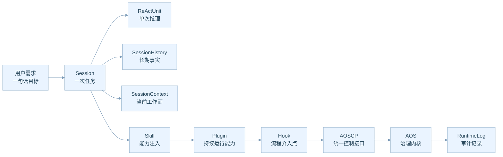
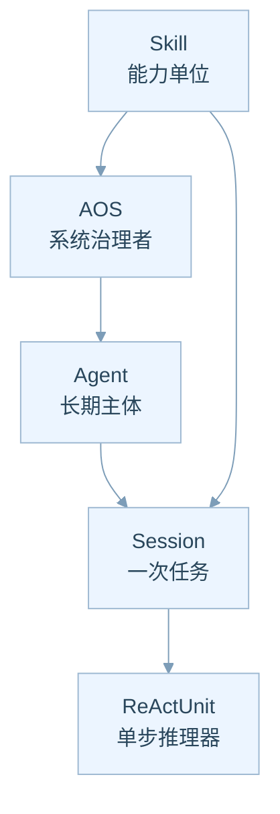
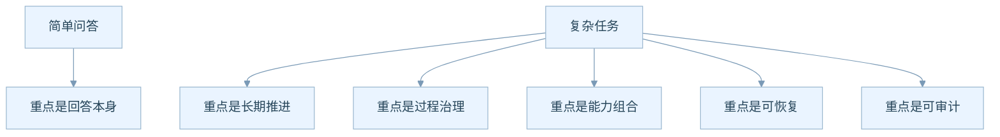
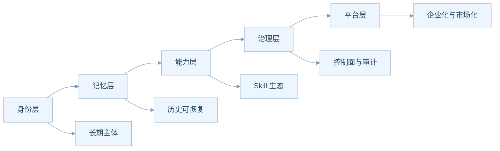
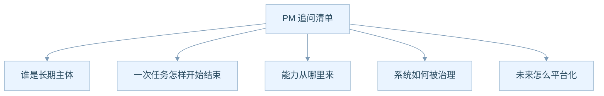

# AgentOS 产品全景说明

## 一句话先讲清楚

如果把大模型看成一个会说话、会调用工具、但本身没有长期组织能力的智能零件，那么 AgentOS 做的事情，就是把这个零件变成一个可治理、可恢复、可扩展、可审计的业务系统。

换句话说，AgentOS 不是在替代大模型思考，而是在管理大模型如何长期工作。

这背后最重要的产品价值有三层：

1. 把一次性对话，变成长期可运行的任务系统
2. 把零散能力，变成统一可管理的能力市场
3. 把不可控的智能行为，变成有边界的治理对象

## AgentOS 到底在卖什么

从产品视角看，AgentOS 卖的不是一个聊天框，而是一套“AI 工作操作系统”。

- 对用户，它提供的是稳定工作的智能执行体
- 对团队，它提供的是任务组织和能力编排
- 对企业，它提供的是审计、恢复、权限、治理
- 对生态伙伴，它提供的是技能和插件接入平台

## 最核心的业务画面

上图可以帮助你抓住一条主线：

- 用户不是直接跟大模型打交道
- 用户先创建一个任务，也就是 Session
- Session 再去驱动大模型推理
- 这个过程中，能力通过 Skill 注入，流程通过 Hook 被插件改造，所有状态通过 AOSCP 统一控制
- 最后，整个系统的长期业务价值落在“可持续运作”而不是“一次答得好”

## 五个最重要的业务对象

很多技术系统难懂，是因为它们把所有概念混在一起。AgentOS 的好处，是把五个关键对象分得很清楚。

你可以这样理解：

- `AOS` 像城市管理者，负责规则、秩序、记录、资源
- `Agent` 像长期雇员，负责身份、责任、默认风格
- `Session` 像一张工单，负责把某一次任务真正推进到底
- `Skill` 像工具箱或岗位技能卡，负责提供可借用的能力
- `ReActUnit` 像一个会思考的执行器，负责当前这一步到底怎么做

这个拆分非常重要，因为它直接决定了产品未来能不能做大：

- 没有 Agent，就没有长期用户画像和多任务连续性
- 没有 Session，就没有任务级管理与恢复
- 没有 Skill，就没有能力生态
- 没有 AOSCP，就没有治理和平台能力

## 它解决的是哪一类业务问题

AgentOS 最适合解决的，不是“问一个问题，答一句话”这种即时问答，而是下面这类有过程、有状态、有治理要求的任务。

例如：

- 连续几天推进一份研究任务
- 带工具调用和外部资源的复杂自动化
- 多角色多任务并行的 AI 助手系统
- 有明确审计和回放要求的企业智能体平台

## 为什么这套结构天然适合产品化

如果一个系统只是把模型调用包起来，它通常只能做“助手功能”。

AgentOS 的不同点在于，它把产品可以持续成长的几个基础设施一次性铺开了。

这意味着它的产品空间不只是一条聊天产品线，而可以继续向下扩展为：

- 智能体工作台
- 企业 AI 中台
- Skill 市场
- 第三方插件平台
- 智能任务运营后台

## AgentOS 的边界为什么重要

一个成熟产品必须明确“自己负责什么，不负责什么”。

AgentOS 的边界很清楚：

- 它负责认知流程的治理
- 它不负责重造数据库、文件系统、容器平台、消息总线
- 它也不负责重造整个工具世界
- 它把外部执行交给 bash，把模型接入交给 LiteLLM

这个边界带来的产品收益非常大：

1. 系统定位更清楚，不会无限膨胀
2. 可以快速接入既有生态，减少自建成本
3. 更容易向企业解释自己的角色，不和基础设施产品冲突

## 从 PM 角度最值得追问的五个问题

如果你把这五个问题问清楚，这个产品大框架就已经基本抓住了。

## 这里面最值得继续挖掘的点

- **主体层机会**：一个用户是否需要多个 Agent，不同 Agent 是否代表不同职责
- **任务层机会**：哪些业务值得被拆成 Session，哪些不值得
- **能力层机会**：哪些 Skill 会成为高频刚需，哪些会成为生态位
- **治理层机会**：企业最看重权限、审计、回放、恢复里的哪一项
- **平台层机会**：先做自营能力库，还是先做第三方生态

## 这篇文档想让你带走什么

如果你只记住一句话，请记住这句：

**AgentOS 的核心价值，不是让模型更会说，而是让智能体更会长期工作。**
