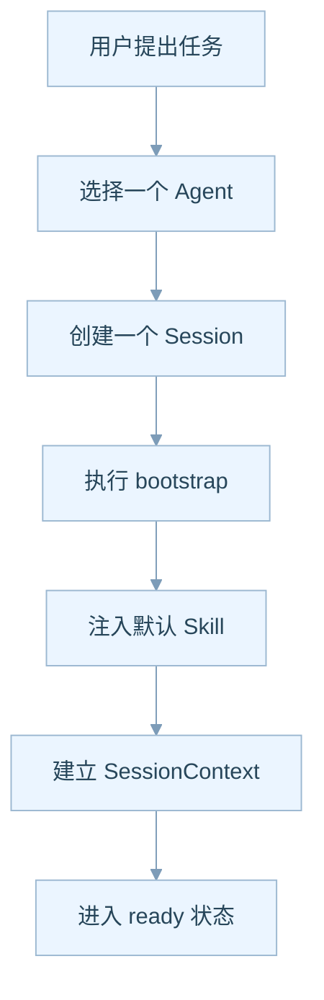
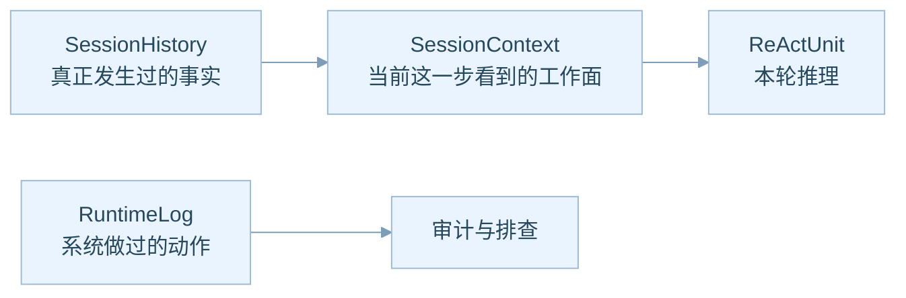
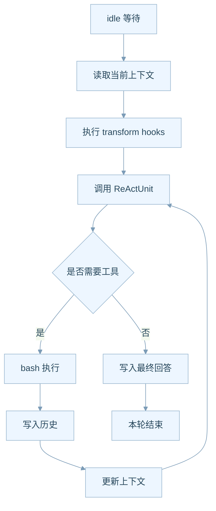
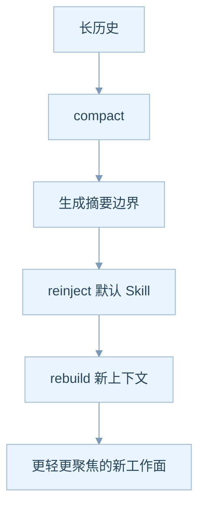
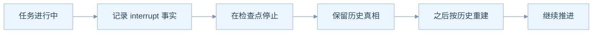
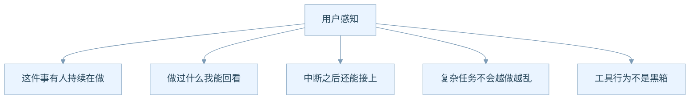

# Session 与记忆流转说明

## 为什么要单独讲 Session

对非技术角色来说，理解 AgentOS 最关键的一步，就是理解 `Session`。

因为对用户真正有感知的，不是底层模型，也不是控制面，而是“这一件事到底有没有被持续推进”。

Session 就是这件事的载体。它像一张会自己生长的工单，又像一条持续推进的任务线程。

## 一次任务到底怎么开始

从业务语言看，这个启动过程相当于：

1. 先明确“谁来做”，也就是哪个 Agent 来接手
2. 再创建“这次做什么”，也就是一个 Session
3. 系统自动把这次任务需要的默认能力装进去
4. 然后才进入真正开始干活的阶段

这一步的产品意义是：

- 用户不需要每次从零重新配置环境
- 系统可以保证每次任务启动都有稳定的基本盘
- 后续做模板化任务、标准化岗位、批量化任务都会更容易

## Session 为什么要分成三层状态

很多产品会把“聊天记录”“当前上下文”“系统日志”混在一起，结果就是难恢复、难排查、难解释。

AgentOS 把它拆成了三层。

你可以这样理解：

- `SessionHistory` 像正式病历，记录真正被确认发生过的事
- `SessionContext` 像医生桌上此刻翻开的页，只保留当前诊断最需要看的内容
- `RuntimeLog` 像医院监控和后台操作日志，记录系统层动作，但不等于业务事实本身

这个拆法的产品价值非常直接：

- 面向用户的回看体验更清晰
- 面向系统的恢复能力更可靠
- 面向企业的审计能力更可信

## 一轮任务推进是怎么跑的

从业务上看，这一轮循环的本质是：

- 系统先看“当前最重要的信息是什么”
- 再决定“是现在就能回答，还是要去执行一个动作”
- 如果需要动作，就用 bash 去操作真实世界
- 然后把动作结果重新写回任务历史，再继续下一步

所以 Session 不是一次“回复”，而是一条完整的任务推进链。

## 为什么 SessionContext 不是越大越好

很多人会直觉认为，把历史全塞进上下文就好了。

但产品上这会带来三个问题：

1. 成本会越来越高
2. 模型会越来越慢
3. 重点会越来越不清楚

于是 AgentOS 设计了 `compact` 和 `rebuild`。

业务上可以把这理解成：

- 不删除历史
- 但把旧阶段收束成一个可继续理解的摘要边界
- 再把当前必须知道的能力说明重新注入回来
- 让任务能继续推进，而不是越做越重

## 中断和恢复为什么是业务刚需

真实业务里，任务一定会被打断。

- 用户临时插入新问题
- 模型调用中断
- 机器重启
- 工具执行失败
- 成本或权限触发暂停

如果系统无法优雅恢复，用户就会觉得“AI 每次都得从头来”。

这个设计的业务意义是：

- 中断不是“丢失”
- 中断首先是一条业务事实
- 恢复不是猜测，而是基于已经写下来的真相重建

## 从用户体验角度，Session 最终提供什么感受

这其实是产品体验上的巨大分水岭。

普通聊天产品给人的感觉是：

- 我说一句，它答一句
- 一旦上下文长了，就容易漂
- 中断后难以续上

而 Session 体系想给人的感觉是：

- 我交代一件事，系统会持续推进
- 我随时能回看阶段性成果
- 我知道为什么中断、为什么恢复、为什么压缩上下文

## 作为产品经理最值得挖掘的点

- **任务模板化**：哪些 Session 可以抽成标准任务模板
- **阶段可视化**：用户是否需要看到 idle、tooling、compacting 这些阶段
- **压缩策略体验**：用户是否需要显式看到历史被压缩成摘要边界
- **恢复体验**：崩溃恢复后要不要显示“系统已从某个检查点继续”
- **任务 KPI**：是否要统计每个 Session 的完成率、平均轮次、工具调用密度

## 这篇文档想让你带走什么

**Session 不是聊天记录容器，而是 AgentOS 里的任务发动机。**

只要你抓住这一点，后面的记忆、工具、恢复、治理逻辑都会顺很多。
