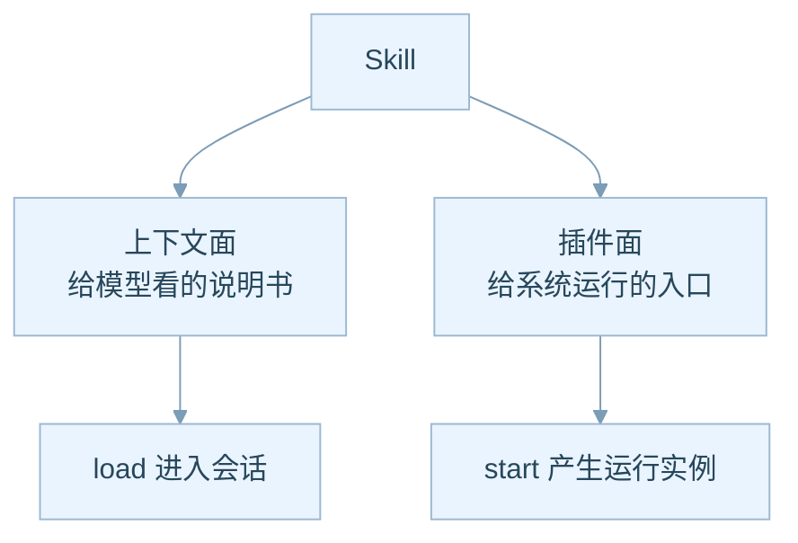
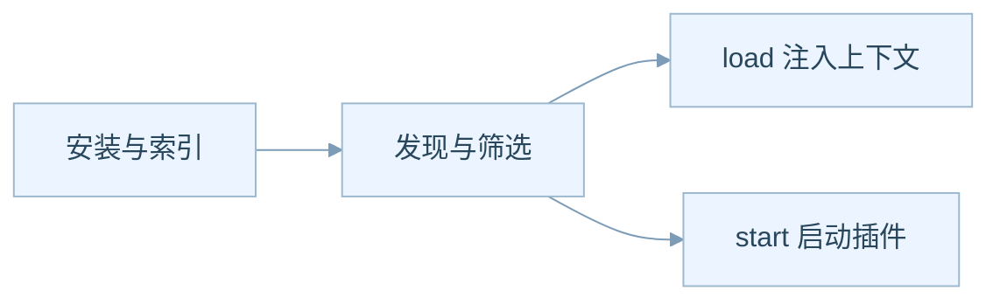
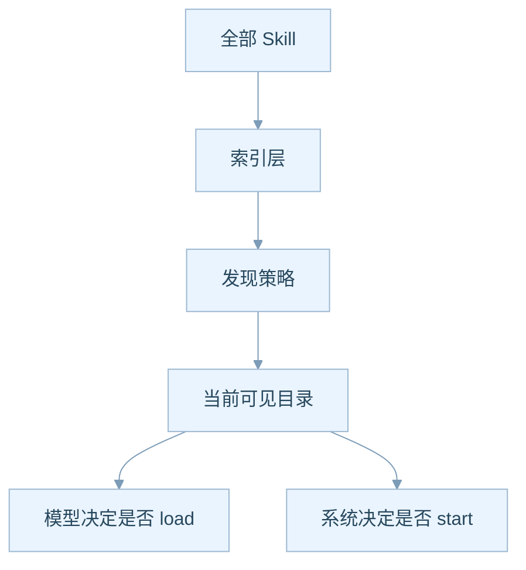
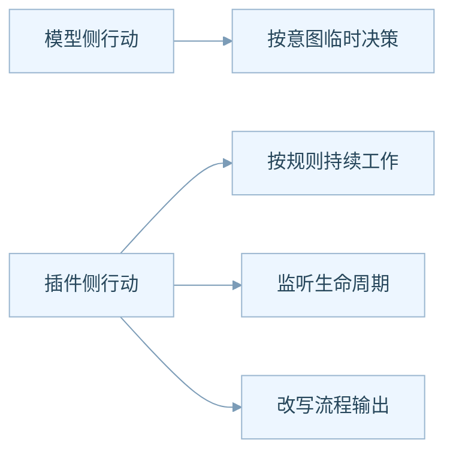
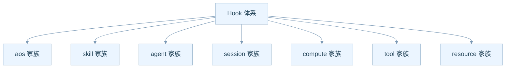
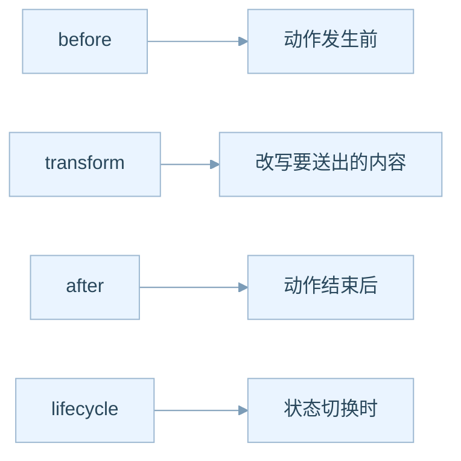
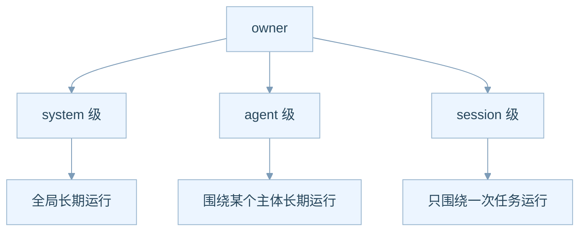
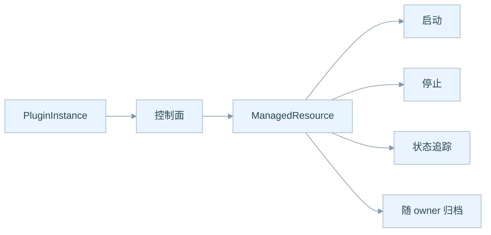

# Skill Plugin Hook 生态说明

## 为什么这部分最像平台业务

如果说 Session 解决的是“任务怎么跑”，那么 Skill、Plugin、Hook 解决的就是“能力怎么长出来”。

从产品角度看，这一部分决定 AgentOS 将来是一个单体产品，还是一个可以持续吸纳生态能力的平台。

## Skill 为什么是统一能力单位

AgentOS 很克制，它没有发明很多平行概念，而是把所有能力都尽量收束到 `Skill` 这一层。

- 知识说明，可以是 Skill
- 工作 SOP，可以是 Skill
- 某个领域策略，可以是 Skill
- 可运行插件，也还是 Skill

这样做的产品收益很大：

1. 用户更容易理解能力体系
2. 团队更容易管理能力目录
3. 生态更容易形成统一市场

上图的重点是：同一个 Skill 可以有两个面。

- **上下文面**：给大模型看的说明书
- **插件面**：给系统持续运行的能力入口

这意味着一个 Skill 可以只是“让模型知道怎么做”，也可以进一步升级成“系统里真的有个长期运行的能力模块”。

## Skill 的三层生命周期为什么重要

从产品角度，Skill 不是“装上就能用”这么简单。它至少经历三个阶段。

这三层分别回答三件事：

- **系统里有什么能力**
- **当前应该向谁暴露哪些能力**
- **当前实际用了哪些能力**

这对产品设计很关键，因为它天然支持三类产品能力：

1. **能力仓库**，解决“有什么”
2. **推荐系统**，解决“该给谁看什么”
3. **运行编排**，解决“现在真正用了什么”

## 为什么 discovery 会成为未来的产品杠杆

在早期，系统可能只有十几个 Skill，全部展示问题不大。

但一旦 Skill 数量变成几百、几千、几万，真正的关键问题就不是“有没有能力”，而是“能不能快速给出最合适的能力”。

从业务上看，discovery 很像电商里的推荐和搜索：

- 仓库里可以有海量商品
- 但用户一次只能看到一个被筛过的橱窗

这意味着未来可以挖掘的方向非常多：

- 标签推荐
- 场景化推荐
- 基于历史任务的推荐
- 基于用户角色的推荐
- 基于低成本模型的预筛选

## Plugin 为什么不是普通工具

很多人会把 Plugin 理解成“另一个工具”。

但在 AgentOS 里，Plugin 更像“持续工作的规则型执行体”。

所以二者分工是：

- 大模型负责当前这一步“想做什么”
- Plugin 负责在稳定规则下“什么时候自动介入”

这会产生非常强的平台能力：

- 安全插件
- 审计插件
- 行业规则插件
- 自动整理插件
- 资源管理插件

## Hook 为什么是平台的接口面

如果 Skill 是能力单位，那么 Hook 就是能力插座。

这七个家族其实是在说：

- 平台允许能力围绕哪些对象介入

而 Hook 的四种语义则是在说：

- 能在什么时候介入

从 PM 角度，这里其实是在定义平台化产品的稳定边界：

- 第三方能力可以在哪些时机出现
- 能做多大程度的改写
- 哪些对象是允许被围绕着扩展的

## Owner 机制为什么会影响商业模式

Plugin 不是无主之物，它一定隶属于某个 owner。

这对产品包装非常重要，因为它自然对应三种售卖方式：

- **系统级能力**：平台基础能力，适合做高级版或企业版
- **主体级能力**：岗位能力包，适合做角色化套餐
- **任务级能力**：单次增强能力，适合做按次计费或按场景计费

## ManagedResource 为什么是隐藏的大机会

Plugin 还可以通过控制面创建 `ManagedResource`，也就是被系统托管的资源。

业务上，这等于给平台打开了一扇门：

- 可以托管临时服务
- 可以托管工作进程
- 可以托管辅助应用
- 可以围绕某个 Agent 或 Session 自动起停资源

这会让 AgentOS 从“智能编排层”进一步走向“智能执行平台”。

## 这里面最值得挖掘的产品点

- **Skill 市场**：能力目录是否要做评分、收藏、热度排序
- **推荐系统**：何时向 Agent 推荐合适 Skill
- **插件平台**：第三方怎样开发、发布、调试、审核插件
- **订阅模式**：system 级、agent 级、session 级能力是否分级收费
- **托管资源**：哪些资源值得纳入平台托管，哪些应该保持外部化

## 这篇文档想让你带走什么

**Skill 解决的是能力供给，Plugin 解决的是持续运行，Hook 解决的是可扩展介入。**

三者放在一起，AgentOS 才真正具备平台属性。
