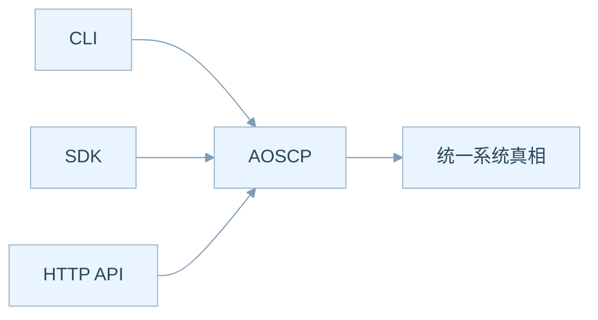
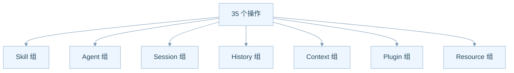
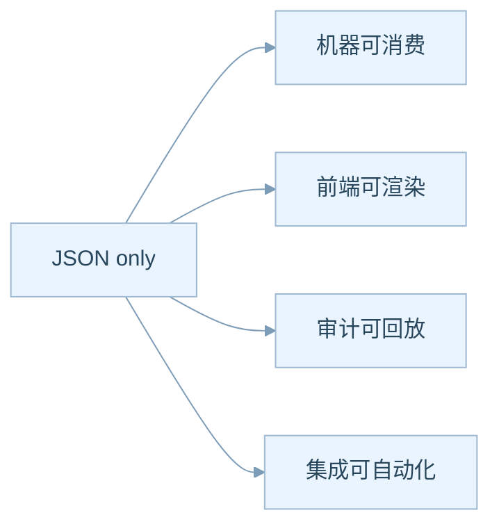
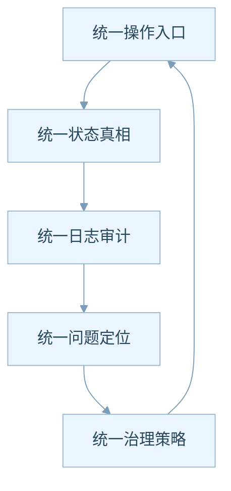
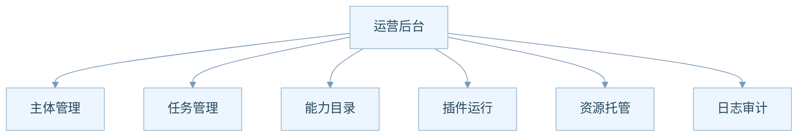
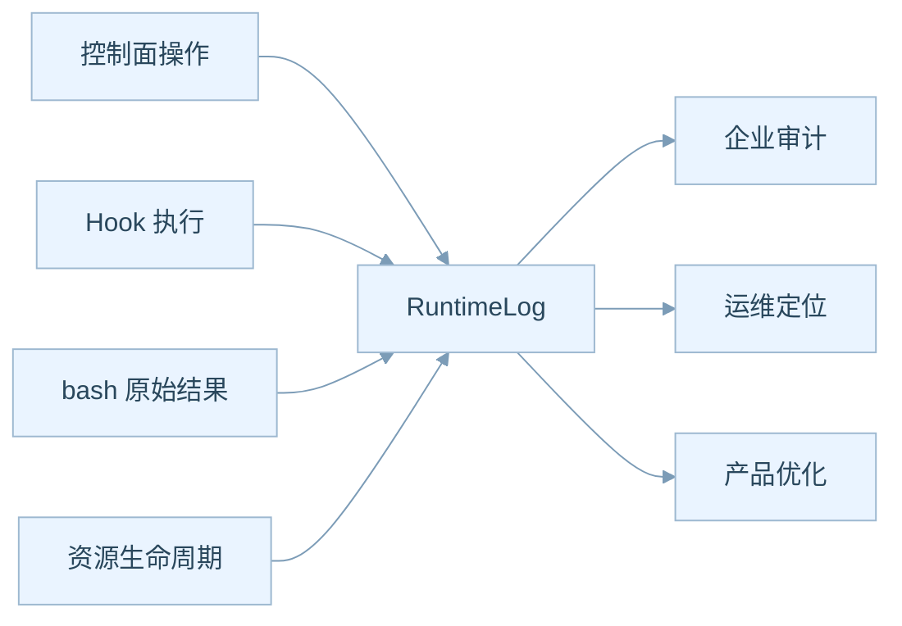
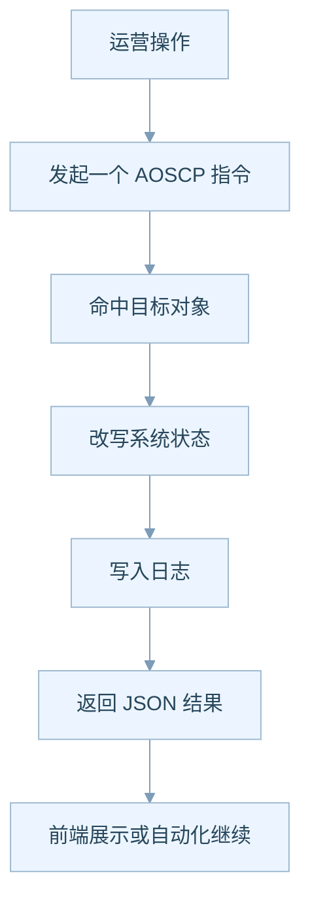

# 控制面与运营模型说明

## 为什么控制面是产品级能力

很多技术系统把控制逻辑分散在多个入口里，结果就是：

- 一部分动作只能在前端做
- 一部分动作只能在命令行做
- 一部分动作只能靠内部脚本做

AgentOS 则试图把所有改写系统状态的动作，都收束到一个统一控制面，也就是 `AOSCP`。

从 PM 角度，这意味着你将来可以基于同一套能力，衍生出不同形态的产品外壳。

## 三种入口，其实是一套能力

这张图表达的是一个很强的产品逻辑：

- 人可以从终端操作系统
- 前端可以从 SDK 驱动系统
- 外部平台可以通过 HTTP 集成系统
- 但背后改写的是同一套状态真相

所以从产品经营角度，AOSCP 不是一个技术接口集合，而是未来所有控制台、面板、集成能力的共同内核。

## 35 个操作可以分成七组业务动作

这七组从业务上分别回答：

- **Skill 组**：系统里有什么能力，如何开关和发现
- **Agent 组**：系统里有哪些长期主体
- **Session 组**：有哪些任务，它们如何开始、中断、结束
- **History 组**：这次任务到底发生过什么
- **Context 组**：当前要给模型看的工作面是什么
- **Plugin 组**：有哪些持续运行的规则能力
- **Resource 组**：有哪些被平台托管的运行资源

从产品设计角度，这基本已经是一个控制台导航结构。

## 为什么 JSON only 很重要

在业务讨论里，很多人会把 JSON only 误解成技术实现偏好。

其实它对产品意味着三件事：

1. 机器更容易自动调用
2. 前端更容易稳定接入
3. 未来更容易做审计与回放

对 PM 来说，这意味着：同一套能力既能服务用户界面，也能服务自动化流程，还能服务企业集成。

## 控制面背后的治理飞轮

这其实是企业产品里最值钱的一层。

因为一旦所有动作都经过控制面：

- 谁干了什么就能看清
- 哪一步失败就能追到
- 哪些高风险动作要限制就能落规则
- 哪些操作最常见就能做产品化优化

## 控制面如何支持运营后台

未来如果你要做一个 AgentOS 控制台，最自然的页面结构会是下面这样。

也就是说，AOSCP 其实已经天然定义出一套“平台运营后台”的导航骨架。

## 为什么 RuntimeLog 会变成企业卖点

对于企业客户来说，很多时候他们不是先问“模型聪不聪明”，而是先问：

- 我怎么知道它做了什么
- 出错时我怎么查
- 是否能审计
- 是否可归责

从产品上，这意味着 RuntimeLog 不只是排障工具，它还是：

- 风险管理工具
- 合规证明材料
- 用户教育材料
- 后续智能运维分析的数据源

## 一个典型运营动作是如何走完的

这条链路非常适合做产品指标：

- 哪类操作最常用
- 哪类操作失败最多
- 哪些资源最常被创建和停止
- 哪些 Skill 最常被加载和启动

## 这里面最值得继续挖掘的点

- **控制台产品化**：把 35 个操作抽成怎样的后台界面最清晰
- **权限产品化**：未来不同角色是否需要不同的 AOSCP 操作权限
- **审计产品化**：日志是否需要做成独立的审计工作台
- **自动化产品化**：用户是否需要低代码方式来编排 AOSCP 调用
- **运营指标产品化**：哪些控制面数据适合变成管理仪表盘

## 这篇文档想让你带走什么

**AOSCP 不只是 API，它是整个 AgentOS 产品的经营中枢。**

谁掌握了控制面，谁就掌握了平台的可运营性、可治理性和可扩展性。
