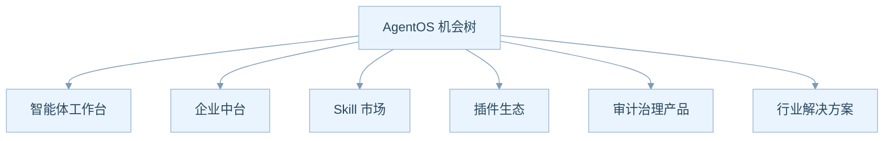
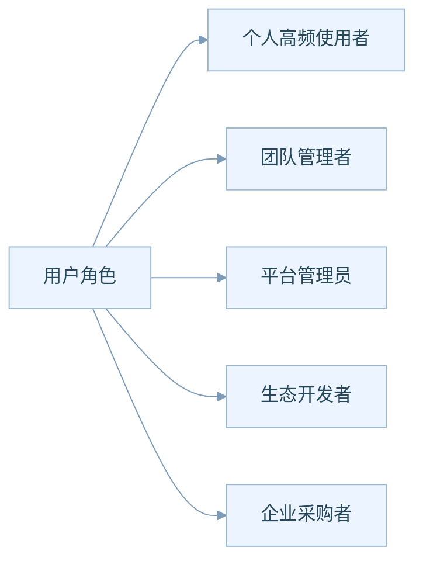
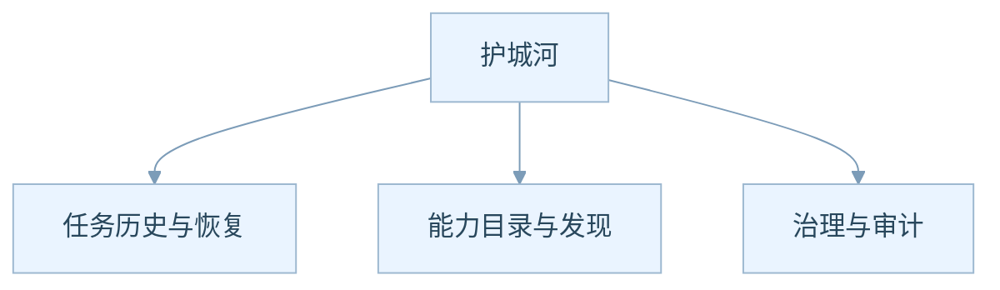
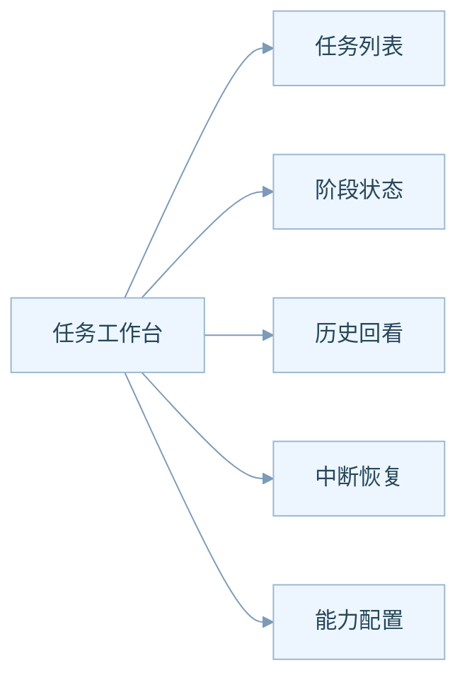
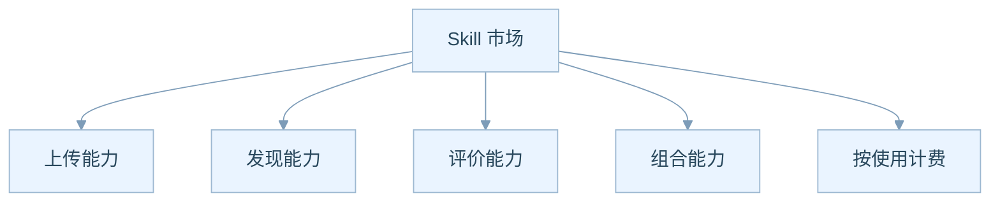
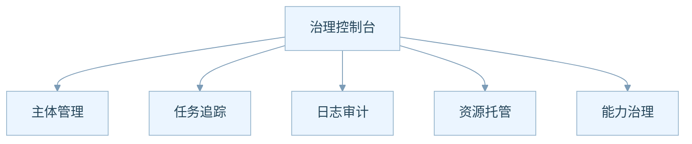
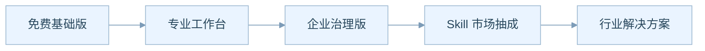
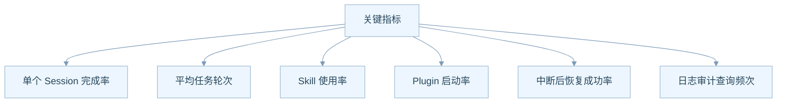
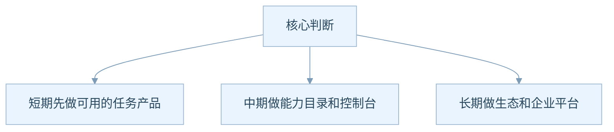

# AgentOS 产品机会地图

## 为什么这一篇最适合 PM

前面四篇更偏“看清结构”。

这一篇更偏“看清机会”。

也就是说，我们不再只问系统是什么，而要问：

- 它可以服务哪些人
- 它可以长成哪些产品线
- 它可以往哪里商业化
- 它有哪些值得优先深挖的产品抓手

## 先看总机会树

这六条并不是互斥的，而是可能依次展开：

- 先做工作台，建立可用性
- 再做中台，建立企业粘性
- 再做市场和生态，建立网络效应
- 最后做行业解决方案，建立高客单价能力

## 用户角色可以怎么拆

不同角色关心的点完全不一样：

- **个人使用者** 关心任务效率、连续性、易用性
- **团队管理者** 关心任务分工、模板、标准化
- **平台管理员** 关心控制面、日志、治理、权限
- **生态开发者** 关心 Skill 和 Plugin 的接入价值
- **企业采购者** 关心安全、恢复、审计、集成能力

这意味着你不能用一个产品故事打所有人。

## 最容易形成护城河的三层

原因分别是：

- **任务历史与恢复**：一旦用户依赖长期任务沉淀，迁移成本就会上升
- **能力目录与发现**：一旦 Skill 数量多起来，推荐质量会形成优势
- **治理与审计**：一旦进入企业场景，这部分会成为重要门槛

所以 AgentOS 的长期竞争力，未必来自模型本身，而更可能来自“围绕模型的系统资产”。

## 最值得优先做成产品功能的抓手

### 抓手一，任务工作台

这是最直接的入口产品。

如果做得好，它会成为用户对 AgentOS 的第一感知层。

### 抓手二，Skill 市场

这是最像平台增长引擎的部分。

一旦 Skill 市场成立，增长模式会从“卖单一产品”转向“经营供给和需求两边”。

### 抓手三，治理控制台

这部分最适合切入企业版。

企业不是只要能用，还要能管。

## 商业化路径可以怎么排

可以理解成四步：

1. 先用基础能力把用户留住
2. 再用效率工具提高付费意愿
3. 再用治理能力打企业采购
4. 最后用生态和行业方案拉高天花板

## 哪些指标最值得尽快定义

这些指标分别对应：

- 产品是否真正帮助完成任务
- 系统是否高效推进任务
- 能力市场是否被用起来
- 平台扩展机制是否形成价值
- 恢复能力是否真的解决了业务痛点
- 企业治理能力是否有人在用

## 当前最值得继续深挖的点

### 方向一，任务产品化

- 用户到底是按聊天使用，还是按任务使用
- 什么类型的任务最适合 Session 模式
- 是否需要任务模板、阶段看板、恢复提示

### 方向二，能力市场化

- Skill 是否要有评级体系
- 是否允许第三方发布和售卖
- discovery 是否要做推荐系统和排序系统

### 方向三，企业治理化

- 哪些客户最需要 RuntimeLog 和控制面
- 是否需要审计报表和操作回放
- 是否要把控制面做成单独的管理员产品

## 你现在最该带走的判断

所以最重要的结论不是“AgentOS 能做很多事”，而是：

**AgentOS 同时具备任务产品、平台产品、企业产品三种演化路径。**

这意味着它最值得挖掘的，不只是单点功能，而是“哪一条产品路线最先形成飞轮”。
