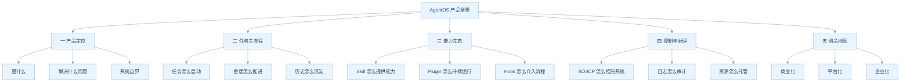

# AgentOS 业务说明导航

这组文档面向不懂技术的产品经理，目标不是解释代码细节，而是把 AgentOS 这套系统背后的业务逻辑、角色关系、流程走向、能力供给方式、治理方式和产品机会讲清楚。

建议阅读顺序：

1. `docs/explain/01-aos-business-overview.md`
2. `docs/explain/02-session-and-memory-flow.md`
3. `docs/explain/03-skill-plugin-and-hook-ecosystem.md`
4. `docs/explain/04-control-plane-and-operating-model.md`
5. `docs/explain/05-product-opportunity-map.md`

## 这组文档各自回答什么问题

| 文档                                      | 重点问题                   | 适合什么场景                 |
| ----------------------------------------- | -------------------------- | ---------------------------- |
| `01-aos-business-overview.md`             | AgentOS 到底是什么产品     | 新人入门，统一口径           |
| `02-session-and-memory-flow.md`           | 一个任务从开始到结束怎么走 | 梳理用户旅程，做主流程设计   |
| `03-skill-plugin-and-hook-ecosystem.md`   | 能力如何接入系统并持续运行 | 梳理生态，设计平台策略       |
| `04-control-plane-and-operating-model.md` | 系统如何被控制，如何治理   | 设计控制台，权限，运营流程   |
| `05-product-opportunity-map.md`           | 哪些点最值得继续挖掘       | 做 roadmap，商业化，增长规划 |

## 一张图看完全文档结构

## 阅读提示

- 文中会反复出现五个词：AOS，Agent，Session，Skill，ReActUnit
- 你可以把它们理解成五个业务对象，而不是五段代码
- 所有 Mermaid 图都尽量用浅色科研配色，目的是让业务流向一眼能看明白
- 图里如果出现换行，一律使用 ` ` 以保证兼容性

## 推荐先抓住的三个总问题

1. 为什么 AgentOS 不是一个普通聊天机器人外壳
2. 为什么它要把任务，会话，能力，控制分开治理
3. 为什么它天然适合走平台化和企业化路线
